- [远程调用协议](#远程调用协议)
  - [RMI](#rmi)
  - [Web Service](#web-service)
  - [Http](#http)
  - [Hession](#hession)
- [分布式架构的解决方案](#分布式架构的解决方案)
  - [基于反向代理的集中式的分布式架构](#基于反向代理的集中式的分布式架构)
  - [基于嵌入式的去中心化架构](#基于嵌入式的去中心化架构)
  - [基于独立进程代理的架构](#基于独立进程代理的架构)
  - [三种架构的比较](#三种架构的比较)
- [Bubbo设计](#bubbo设计)
  - [整体流程](#整体流程)
  - [设计意义](#设计意义)
  - [整体设计](#整体设计)
- [Dubbo的常用配置](#dubbo的常用配置)
  - [配置的就近原则](#配置的就近原则)
- [注册中心](#注册中心)
  - [注册中心的条件](#注册中心的条件)
  - [Dubbo支持的注册中心](#dubbo支持的注册中心)
  - [Zookeeper注册中心](#zookeeper注册中心)
  - [调用模块](#调用模块)
  - [透明代理](#透明代理)
  - [负载均衡](#负载均衡)
  - [容错](#容错)
  - [异步调用](#异步调用)
- [Dubbo调用的其他应用场景](#dubbo调用的其他应用场景)
  - [泛化引用与提供](#泛化引用与提供)
  - [隐式传参](#隐式传参)
  - [令牌验证](#令牌验证)
  - [过滤器](#过滤器)
  - [Dubbo的调用过程](#dubbo的调用过程)
- [Rpc协议](#rpc协议)
  - [Rpc协议的基本组成](#rpc协议的基本组成)
  - [Dubbo中所支持的Rpc协议](#dubbo中所支持的rpc协议)
  - [Dubbo中的序列化](#dubbo中的序列化)
  - [Rpc传输实现](#rpc传输实现)
  - [Dubbo中的报文编解码](#dubbo中的报文编解码)

### 远程调用协议
#### RMI
JAVA远程方法调用，使用原生二进制方式进行序列化。简单易用，sdk支持，提高开发效率，但是不支持跨语言。

#### Web Service
比较早期系统的调用解决方案，跨语言，基于WSDL生成SOAP进行消息传递，有点事SDK支持，跨语言，缺点是实现较重，发布繁琐。

#### Http
Http是基于Http+json来实现的，优点是跨语言、实现简单、轻量，缺点是不支持SDK。

#### Hession
采用Http+Hession序列化实现，简单、轻量、sdk支持、但是不能跨语言。

### 分布式架构的解决方案

#### 基于反向代理的集中式的分布式架构
在客户端和服务端通过nginx或者f5进行负载均衡。

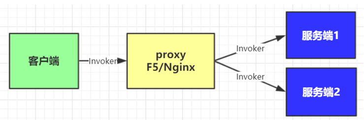

#### 基于嵌入式的去中心化架构
服务发现和负载均衡以客户端库的形式嵌入到应用程序中，需要独立的服务注册中心组件配合，服务启动时自动注册到注册中心并定期心跳，客户端进行负载均衡。dubbo和spring cloud eureka ribbon都是这种方式。

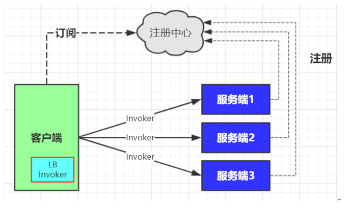  

#### 基于独立进程代理的架构
代理作为独立的进程部署在每条服务器主机上，一个主机的多个消费者可以共用这个调离，实现服务发现和负载均衡。

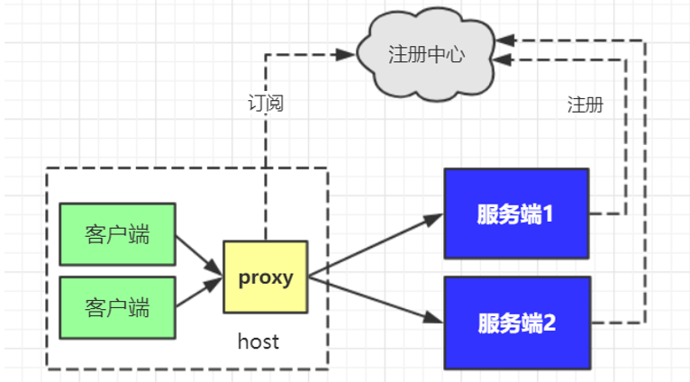  

#### 三种架构的比较
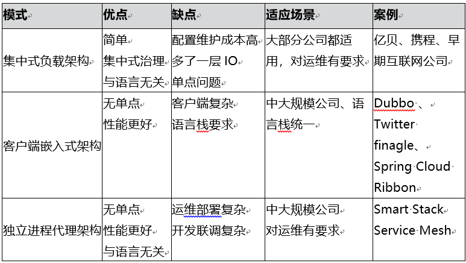  

### Bubbo设计
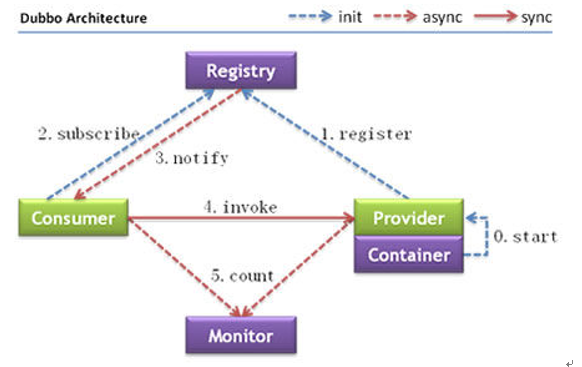  

#### 整体流程
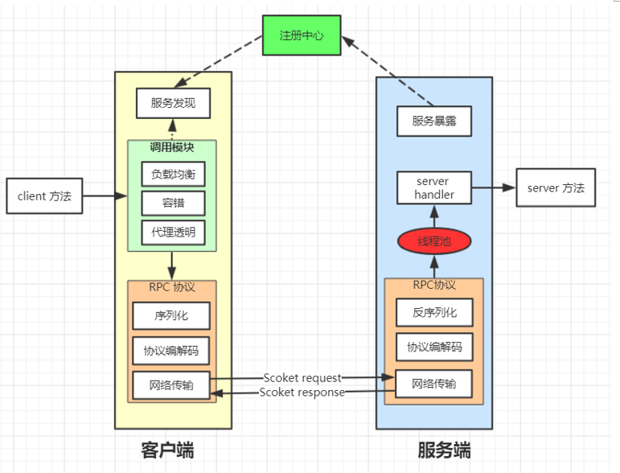  


1. 提供者绑定指定端口并启动服务。
2. 提供者连接注册中心，并发本机ip、端口、应用信息提供服务信息发送至注册中心。
3. 消费者连接注册中心，并发送应用信息，以及相应的服务信息至注册中心。
4. 注册中心根据消费组所求服务的信息匹配到对应的提供者列表发送至消费者应用缓存。
5. 消费者在发起远程调用时基于缓存的消费者列表选择其一发起调用。
6. 提供者状态变更会实时通知注册中心，再由注册中心实时推送至消费者。

#### 设计意义
- 生产者和消费者解耦
- 注册中心可以使集群结构，防止一台挂掉不能提供服务，保证高可用。
- 去中心化，生产者和消费者都不直接依赖注册中心，及时注册中心全部挂掉短时间内不会影响服务的调用。
- 服务端任何一台服务挂掉，不影响使用。

#### 整体设计
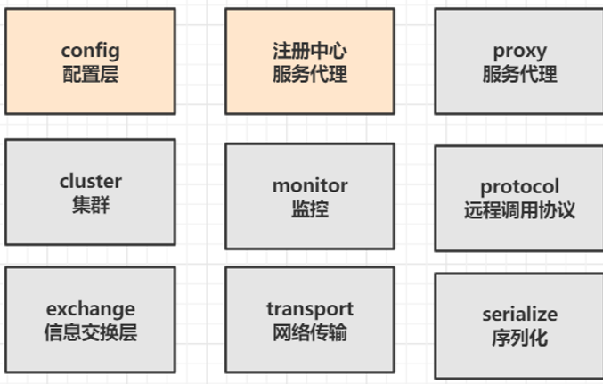  

- config 配置层：对外配置接口，以 ServiceConfig, ReferenceConfig 为中心，可以直接初始化配置类，也可以通过 spring 解析配置生成配置类
- proxy 服务代理层：服务接口透明代理，生成动态代理 扩展接口为 ProxyFactory
- registry 注册中心层：封装服务地址的注册与发现，以服务 URL 为中心，扩展接口为 RegistryFactory, Registry, RegistryService
- cluster 路由层：封装多个提供者的路由及负载均衡，并桥接注册中心，以 Invoker 为中心，扩展接口为 Cluster, Directory, Router, LoadBalance
- monitor 监控层：RPC 调用次数和调用时间监控，以 Statistics 为中心，扩展接口为 MonitorFactory, Monitor, MonitorService
- protocol 远程调用层：封装 RPC 调用，以 Invocation, Result 为中心，扩展接口为 Protocol, Invoker, Exporter
- exchange 信息交换层：封装请求响应模式，同步转异步，以 Request, Response 为中心，扩展接口为 Exchanger, ExchangeChannel, ExchangeClient, ExchangeServer
- transport 网络传输层：抽象 mina 和 netty 为统一接口，以 Message 为中心，扩展接口为 Channel, Transporter, Client, Server, Codec
- serialize 数据序列化层：可复用的一些工具，扩展接口为 Serialization, ObjectInput, ObjectOutput, ThreadPool

### Dubbo的常用配置
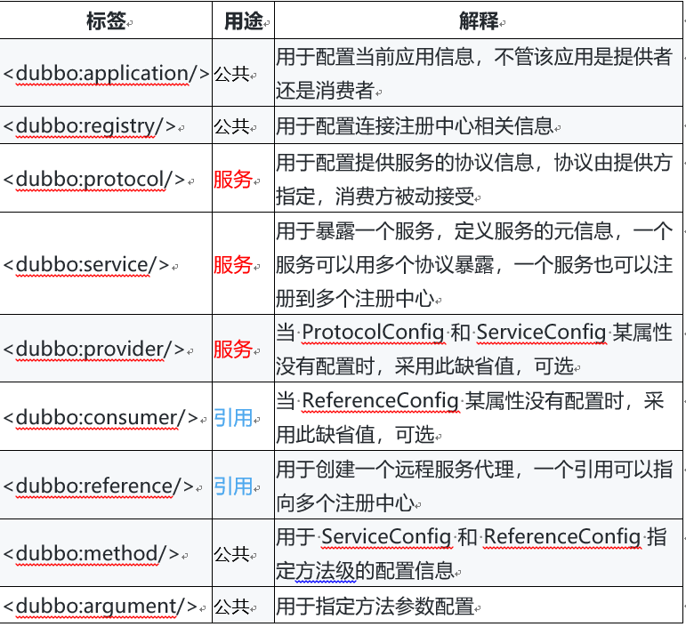  

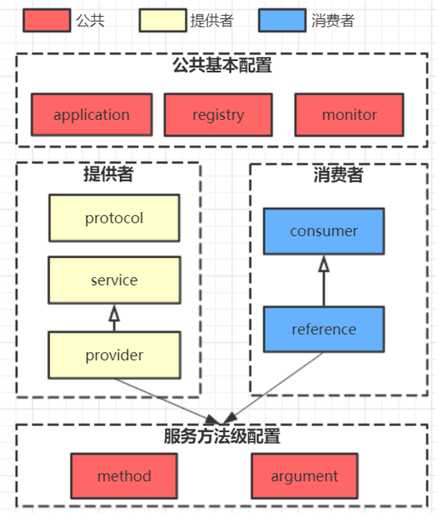 

#### 配置的就近原则
以timeout参数为例，有好多地方都可以配置，但最终只有一个地方的配置值会生效，它们的优先级顺序如下：
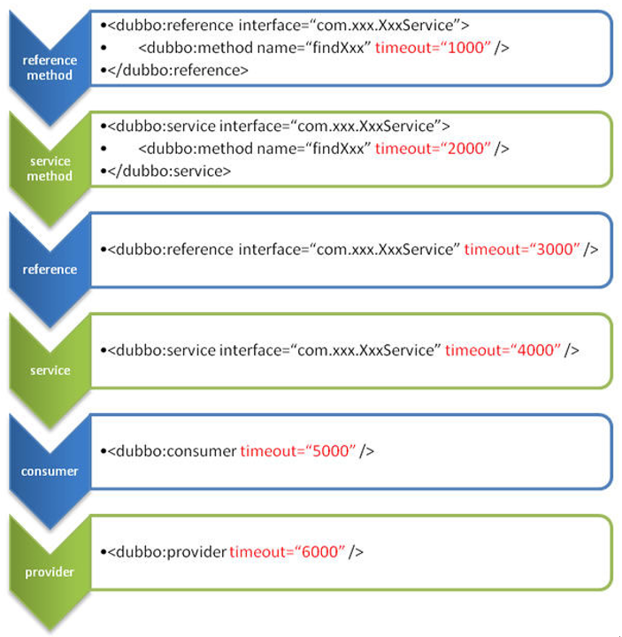  


### 注册中心

#### 注册中心的条件
1. 接收服务端的注册于客户端的引用并支持多对多
2. 当服务非正常关闭是将其清除并通知消费方
3. 当服务重启时，能恢复注册数据以及订阅请求
4. 必须保证高可用，即使集群结构。

#### Dubbo支持的注册中心
- Multicast注册中心：基于组网广播技术，只能在局域网内，一般用于简单测试。
- Zookeeper注册中心：官方推荐使用
- Redis注册中心：基于发布订阅模式，基于Hash类型数据结构。
- Simple注册中心：基于本身的Dubbo服务实现（SimpleRegistrySerivce），不支持集群，不适用于生产。

#### Zookeeper注册中心
Zookeper是一个树型的目录服务，本身支持变更推送相比redis的实现Publish/Subscribe功能更稳定。

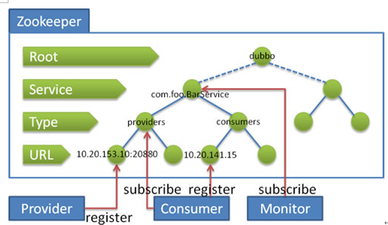  


#### 调用模块
调用模块是通过发起一个远程调用，并获取返回结果。
- 负载均衡：从多个提供者中，根据某种算法选择其中一个进行调用。
- 容错机制：当调用失败时采用什么策略。
- 透明代理：通过动态代理技术，屏蔽远程调用的细节，使远程调用就像调用本地方法一样。
- 调用方式：支持同步调用和异步调用。

#### 透明代理

```java
com.alibaba.dubbo.config.ReferenceConfig#createProxy
com.alibaba.dubbo.common.bytecode.ClassGenerator
com.alibaba.dubbo.rpc.proxy.javassist.JavassistProxyFactory
```

#### 负载均衡
- 随机（random）：默认的负载均衡算法，按照权重设置随机概率。
- 轮询（roundrobin）：按照公约后的权重设置轮询算法。
- 最少活跃数（leastactive）：最少调用次数的优先调用，相同活跃数的随机，活跃数是指前后调用的技术差。
- 一致性Hash(consistenthash)：相同参数总是请求相同的服务提供者。

优先级顺序，由小到大：
```xml
<!-- 服务端级别-->
<dubbo:service interface="..." loadbalance="roundrobin" />
<!-- 客户端级别-->
<dubbo:reference interface="..." loadbalance="roundrobin" />
<!-- 服务端方法级别-->
<dubbo:service interface="...">
    <dubbo:method name="..." loadbalance="roundrobin"/>
</dubbo:service>
<!-- 客户端方法级别-->
<dubbo:reference interface="...">
    <dubbo:method name="..." loadbalance="roundrobin"/>
</dubbo:reference>
```

一致性Hash算法
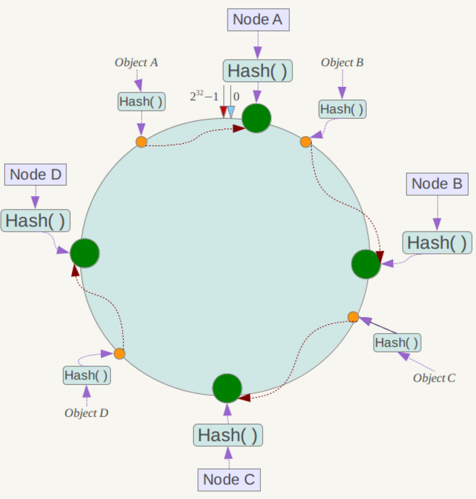  

#### 容错
- 失败快速切换：调用失败后基于```retries = 值```参数自动切换至其他提供者。
- 快速失败：调用失败后，立即报错，只发起一次调用。
- 忽略失败：失败后忽略此次调用，不抛出异常也不提示客户端。
- 失败重试：调用失败后，记录失败调用信息，定时重发请求，常见于消息通知。
- 并行调用：根据参数```forks=值```并行调用指定的机器数量，只要有一个成功就返回给客户端。
- 广播调用：广播调用所有的服务提供者，只要有一个报错，则整体调用失败。

容错的优先级

```xml
<!-- 
Failover 失败自动切换 retries="1" 切换次数
Failfast 快速失败
Failsafe 勿略失败
Failback 失败重试，5秒后仅重试一次
Forking 并行调用  forks="2" 最大并行数
Broadcast 广播调用
-->
<dubbo:service interface="..." cluster="broadcast" />
<dubbo:reference interface="..." cluster="broadcast"/ >
```

#### 异步调用
异步调用和同步调用是指发起远程调用之后获取返回结果的方式。
- 同步等待结果返回，默认方式。
- 异步等待结果返回。
- 不需要返回结果。

异步调用的流程如下：

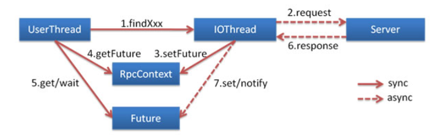  

异步调用配置(进行异步调用时，容错机制不能设置为forking 或者 broadcast)

```xml
<dubbo:reference id="asyncDemoService"
                 interface="com.tuling.teach.service.async.AsyncDemoService">
                 <!-- 异步调async：true 异步调用 false 同步调用-->
    <dubbo:method name="sayHello1" async="false"/>
    <dubbo:method name="sayHello2" async="false"/>
     <dubbo:method name="notReturn" return="false"/>
</dubbo:reference>

```

样例Demo

```java
demoService.sayHello1("han");
Future<Object> future1 = RpcContext.getContext().getFuture();
demoService.sayHello2("han2");
Future<Object> future2 = RpcContext.getContext().getFuture();
Object r1 = null, r2 = null;
// wait 直到拿到结果 获超时
r1 = future1.get();
// wait 直到拿到结果 获超时
r2 = future2.get();
```

### Dubbo调用的其他应用场景

#### 泛化引用与提供
- 泛化提供：指不通过接口方式直接将服务暴露出去，通常用于Mock框架或服务降级框架的实现。
- 泛化引用：是指不通过常规接口方式去引用服务，通常用于测试框架。

#### 隐式传参
指的是通过非正常方法传递参数，类似于Http调用中的Cookie值，通常用于分布式追踪框架的实现。

```java
//客户端隐示设置值
RpcContext.getContext().setAttachment("index", "1"); // 隐式传参，后面的远程调用都会包含这个隐式参数

//服务端隐示获取值
String index = RpcContext.getContext().getAttachment("index"); 

```

#### 令牌验证
通过令牌验证在注册中心控制权限，以决定要不要下发令牌给消费者，可以防止消费者绕过注册中心直接访问服务提供者。而且注册中心可以灵活改变授权方式，而不需要修改或升级提供者。

```xml
<!--随机token令牌，使用UUID生成-->
<dubbo:provider interface="com.foo.BarService" token="true" />
```

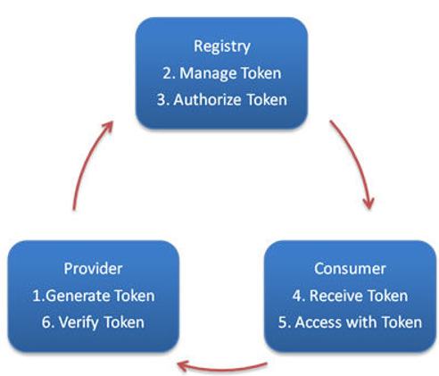 

#### 过滤器
Dubbo的Filter功能用于拦截远程方法调用，支持自定义过滤器与官方过滤器。例如给服务提供者田间日志记录过滤器，将所有的访问日志都打印在dubbo.log文件中。
``` xml 
<dubbo:provider  filter="accesslog" accesslog="logs/dubbo.log"/>
```

#### Dubbo的调用过程
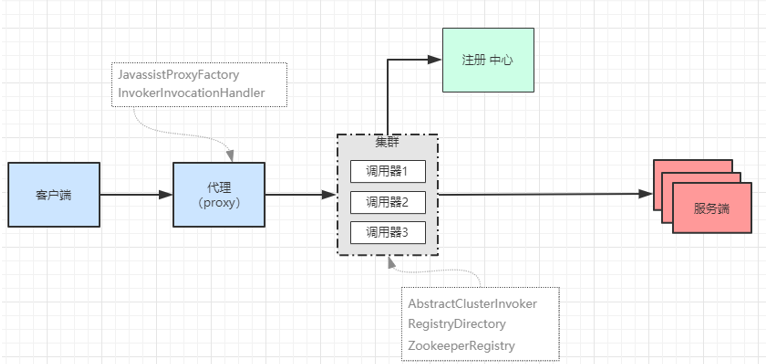  

1. 客户端调用
2. 透明代理
3. 负载均衡
4. 容错
5. 异步转同步
6. 获取结果
7. 服务端响应

### Rpc协议

#### Rpc协议的基本组成
 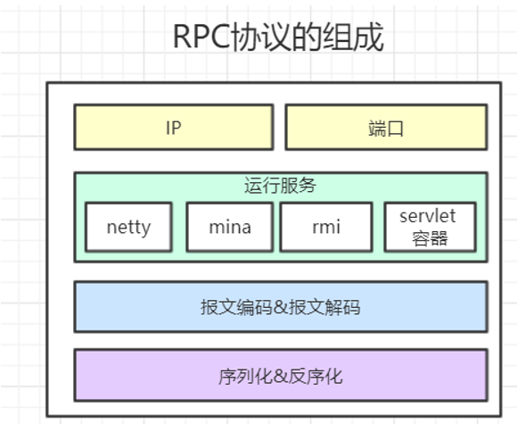  

- 地址：服务提供者的地址
- 端口：协议指定的开放的端口
- 报文编码：协议报文编码，分为请求头和请求体两个部分。
- 序列化方式：将请求体部分序列化成对象
  - Hession2Serialization
  - DubboSerialzation
  - JavaSerailzation
  - JsonSerialzation
- 运行服务
  - netty
  - mina
  - RMI服务
  - servlet容器（jetty tomcat jboos）

#### Dubbo中所支持的Rpc协议
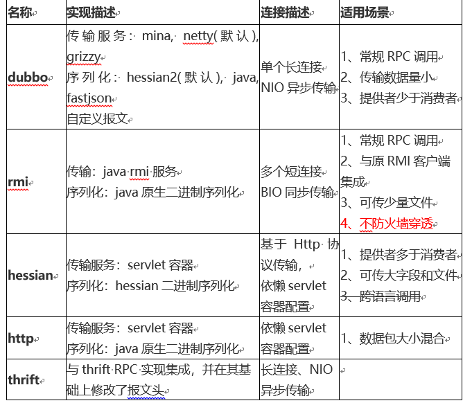  

```xml
 <!--
   name: 协议名称 dubbo|rmi|hessian|http|
   host:本机IP可不填，则系统自动获取
   port：端口、填-1表示系统自动选择
   server：运行服务  mina|netty|grizzy|servlet|jetty
   serialization：序列化方式 hessian2|java|compactedjava|fastjson
   详细配置参见dubbo 官网 dubbo.io
 -->
 <dubbo:protocol name="dubbo" host="192.168.0.11" port="20880" server="netty" 
  serialization=“hessian2” charset=“UTF-8” />
```

#### Dubbo中的序列化
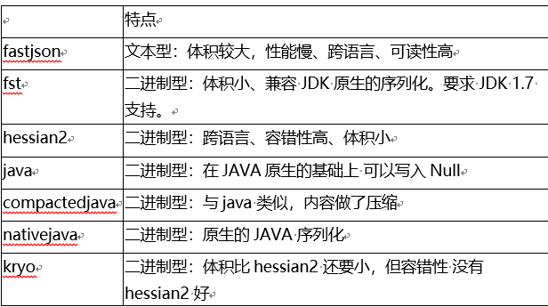  


#### Rpc传输实现
Rpc协议的传输是基于tcp/ip作为基础使用的socket或者netty等网络编程组件实现，但是tcp是面向字节流的无边界协议，只管负责数据传输并不会区分每次请求所对应的消息，这样就会出现tcp传输协议中的粘包和拆包问题。

我们知道tcp是以流动的方式传输数据，传输的最小单位为一个报文段（segment）。tcp Header中有个Options标识位，常见的标识为mss(Maximum Segment Size)指的是，连接层每次传输的数据有个最大限制MTU(Maximum Transmission Unit)，一般是1500比特，超过这个量要分成多个报文段，mss则是这个最大限制减去TCP的header，光是要传输的数据的大小，一般为1460比特。换算成字节，也就是180多字节。

tcp为提高性能，发送端会将需要发送的数据发送到缓冲区，等待缓冲区满了之后，再将缓冲中的数据发送到接收方。同理，接收方也有缓冲区这样的机制，来接收数据。这时就会出现以下情况：
1.	应用程序写入的数据大于MSS大小，这将会发生拆包。
2.	应用程序写入数据小于MSS大小，这将会发生粘包。
3.	接收方法不及时读取套接字缓冲区数据，这将发生粘包。

拆包与粘包解决办法：
1.	设置定长消息，服务端每次读取既定长度的内容作为一条完整消息。
2.	 {"type":"message","content":"hello"}\n
3.	使用带消息头的协议、消息头存储消息开始标识及消息长度信息，服务端获取消息头的时候解析出消息长度，然后向后读取该长度的内容。：Http协议 heade 中的 Content-Length 就表示消息体的大小。

#### Dubbo中的报文编解码
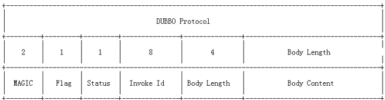  

- magic：类似java字节码文件里的魔数，用来判断是不是dubbo协议的数据包。魔数是常量0xdabb,用于判断报文的开始。
- flag：标志位, 一共8个地址位。低四位用来表示消息体数据用的序列化工具的类型（默认hessian），高四位中，第一位为1表示是request请求，第二位为1表示双向传输（即有返回response），第三位为1表示是心跳ping事件。
- status：状态位, 设置请求响应状态，dubbo定义了一些响应的类型。具体类型见 com.alibaba.dubbo.remoting.exchange.Response
- invoke id：消息id, long 类型。每一个请求的唯一识别id（由于采用异步通讯的方式，用来把请求request和返回的response对应上）
- body length：消息体 body 长度, int 类型，即记录Body Content有多少个字节。

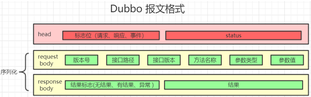  


