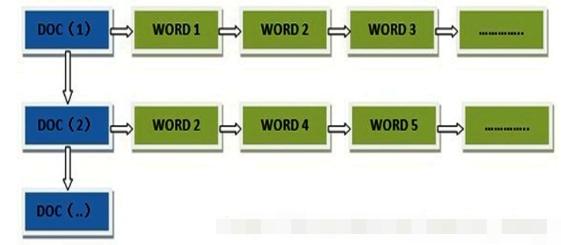
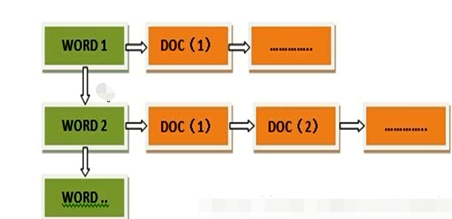
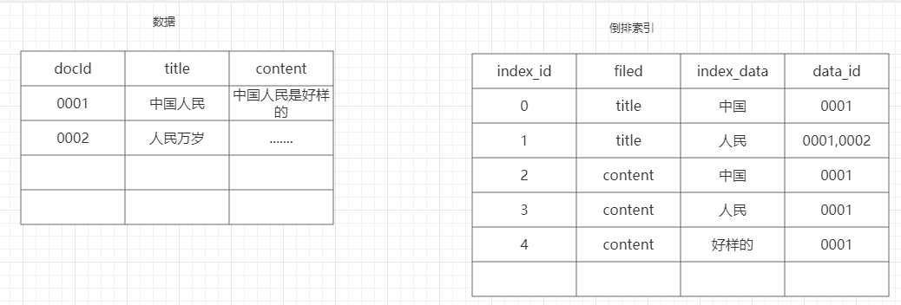
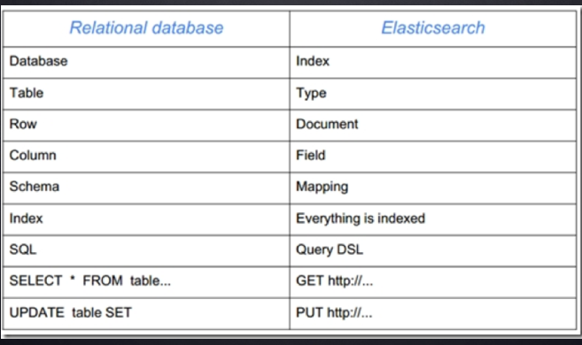
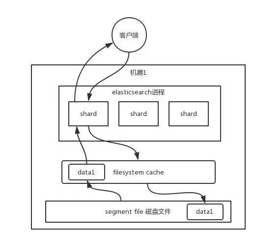
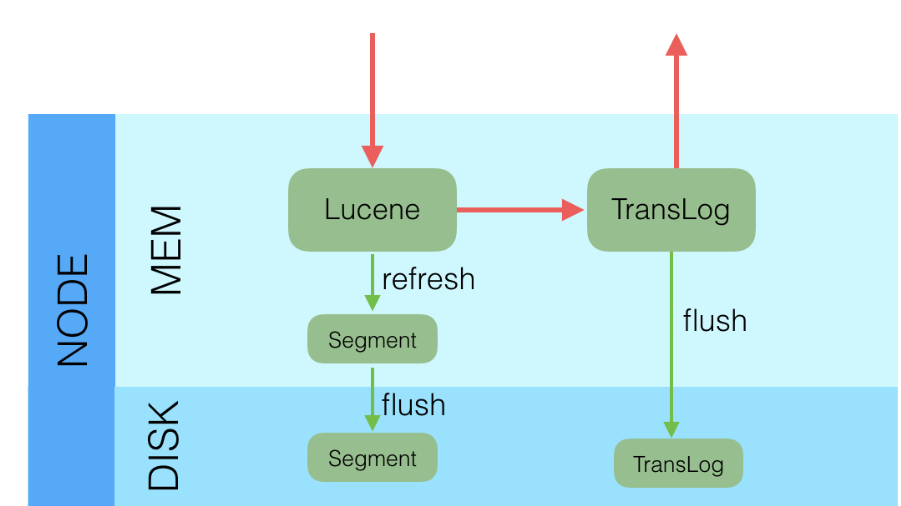
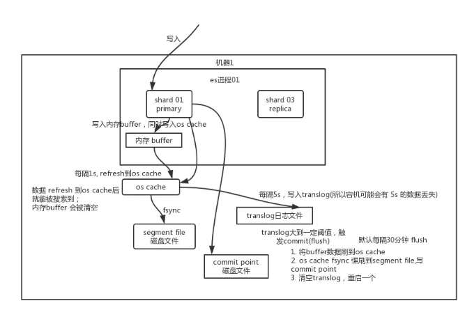
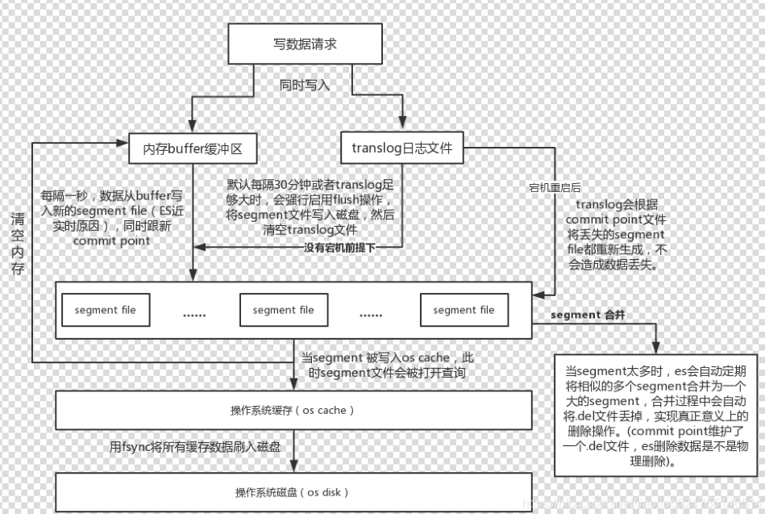
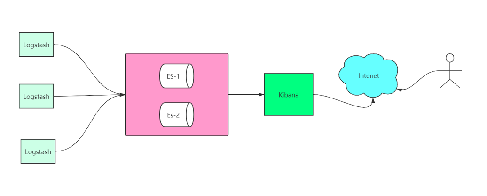

- [倒排索引](#倒排索引)
  - [正向索引](#正向索引)
  - [倒排索引](#倒排索引-1)
- [ES简介](#es简介)
- [节点类型与分片](#节点类型与分片)
  - [集群:](#集群)
  - [节点:](#节点)
  - [分片:](#分片)
- [ES索引](#es索引)
- [写入原理](#写入原理)
- [数据安全保障](#数据安全保障)
- [Segment的合并](#segment的合并)
- [ES基础语法](#es基础语法)
  - [中文分词的接入](#中文分词的接入)
  - [ES的基础命令](#es的基础命令)
- [分词器](#分词器)
- [索引更新](#索引更新)
  - [全量更新](#全量更新)
  - [增量更新](#增量更新)
- [ES脑裂](#es脑裂)
  - [什么是脑裂](#什么是脑裂)
  - [脑裂产生的原因](#脑裂产生的原因)
  - [解决方案](#解决方案)
- [数据预热](#数据预热)
- [冷热分离](#冷热分离)
- [ELK](#elk)
  - [背景](#背景)
  - [ELK](#elk-1)
  - [ELK的变种](#elk的变种)
- [参考资料](#参考资料)
### 倒排索引
#### 正向索引
文档1的ID > 单词1：出现次数，出现位置列表；单词2：出现次数，出现位置列表；

文档2的ID > 此文档出现的关键词列表。
  

一般是通过Key来查询Value，例如，当用户搜索关键字```华为手机```的时候，使用正向索引，那么就需要扫描整个索引库中的所有文档，找出包含关键字的文档，再根据打分模型进行打分，排序后呈现给用户，因为现实生活中文档的数量是巨大的，这样的索引结构根本无法满足实时返回排名结果的要求。所以要设计一个倒排索引，根据关键字来查找相关的文档。

#### 倒排索引
关键词1：文档1的ID，文档2的ID
关键词2：带有此关键词的文档ID列表。

  
  

### ES简介
ES是ElasticSearch的简称，是一个分布式的索引库，对外提供检索服务，通过Http的Restful形式对外提供服务，也可以通过Trasport对外提供服务，是一个非关系数据库Nosql。

ES中的索引等于数据库，可以有很多个，它的类型type可以理解为一张表，只存在es6.x中，es7.x中没有type这个含义了。文档Docment类似于行数据；Filed是行数据的属性列。

ES的是非关系型的，没有办法作连接查询，也就是没有办法作跨索引查询。它和关系型数据库的类比如下：

  

你往 ES 里写的数据，实际上都写到磁盘文件里去了，查询的时候，操作系统会将磁盘文件里的数据自动缓存到 Filesystem Cache 里面去。ES 的搜索引擎严重依赖于底层的 Filesystem Cache，你如果给 Filesystem Cache 更多的内存，尽量让内存可以容纳所有的 IDX Segment File 索引数据文件，那么你搜索的时候就基本都是走内存的，性能会非常高。如果走磁盘一般肯定上秒，搜索性能绝对是秒级别的，1 秒、5 秒、10 秒。但如果是走 Filesystem Cache，是走纯内存的，那么一般来说性能比走磁盘要高一个数量级，基本上就是毫秒级的，从几毫秒到几百毫秒不等。

  

### 节点类型与分片
#### 集群: 
- ES节点：运行的ES实例 
- ES集群由若干节点组成，这些节点在同一个网络内，cluster-name相同 
#### 节点: 
- master节点：集群中的一个节点会被选为master节点，它将负责管理集群范畴的变更，例如创建或删除索引，添加节点到集群或从集群删除节点。master节点无需参与文档层面的变更和搜索，这意味着仅有一个master节点并不会因流量增长而成为瓶颈。任意一个节点都可以成为 master节点 
- data节点：持有数据和倒排索引。默认情况下，每个节点都可以通过设定配置文件elasticsearch.yml中的node.data属性为true(默认)成为数据节点。如果需要一个专门的主节点，应将其node.data属性设置为false
- Client节点：如果将node.master属性和node.data属性都设置为false，那么该节点就是一个客户端节点，扮演一个负载均衡 的角色，将到来的请求路由到集群中的各个节点
#### 分片:
- 单个节点由于物理机硬件限制，存储的文档是有限的，如果一个索引包含海量文档，则不能在单个节点存储。ES提供分片机制，同一个索引可以存储在不同分片（数据容器）中，这些分片又可以存储在集群中不同节点上
- 分片分为 主分片(primary shard) 以及 从分片(replica shard) 
- 主分片与从分片关系：从分片只是主分片的一个副本，它用于提供数据的冗余副本 
- 从分片应用：在硬件故障时提供数据保护，同时服务于搜索和检索这种只读请求 
- 是否可变：索引中的主分片的数量在索引创建后就固定下来了，但是从分片的数量可以随时改变 
- 索引默认创建的分片：默认设置5个主分片和一组从分片（即每个主分片有一个从分片对应），但是从分片没有被启用（主从分片在同一个节点上没有意义），因此集群健康值显示为黄色(yellow)

### ES索引
1. 分片：通过mapping的参数```number_of_shards```来设置分片数量，一经定义不可修改，主要响应写操作，也可响应读操作。
2. 副本：可以通过参数```number_of_replicas```用于备份分片数据，数据基本和分片保持一致，主要响应读操作，也就意味着副本数越多，响应读的速度越快。
3. 分片数据调整：分片数量一经确定不可修改，如果要修改需要全量重建索引，假如我们有4篇文档，有2个分片，ES是通过取模算法来进行分派的，也就是1，3,会分配到第一个分片上；2，4，会分配到第二个分片上。如果我们修改分片的数量，查询历史数据就好出现问题，因此不能修改分片数量。创建分片的时候一定要实现预估数量的大小，一般8+16的机器上一个分片的大小不能超过300G。索引会根据分片的配置来均衡的响应用户的请求。

5. 写操作在ES集群上的流程
   1. 假如我们有2个分片，每个分片有2个副本，分别存放在3台机器上。
   2. 客户端向集群中的某个节点发送写请求，该节点就作为本次请求的协调节点。
   3. 协调节点使用文档ID来确定文档属于某个分片，再通过集群状态中的内容路由表信息获知该分片的主分片位置，将请求转发到主分片所在节点。
   4. 主分片节点上的主分片执行写操作。如果写入成功，则它将请求并行转发到副分片所在的节点，等待副分片写入成功。所有副本都写入成功后，主分片节点向协调节点报告成功，协调节点向客户端报告成功。


6. 读单个文档操作在ES集群上的流程
   1. 客户端向集群中的某个节点发送读取请求，该节点就作为本次请求的协调节点；
   2. 协调节点使用文档ID来确定文档属于某个分片，再通过集群状态中的内容路由表信息获知该分片的副本信息，此时它可以把请求转发到所有分片的任意节点读取数据。
   3. 收到读请求的节点将文档返回给协调节点，协调节点将文档返回给客户端。
   4. 在文档检索的时候，可能数据以及处于主分片上，但是还没有被同步到副本分片，这种情况会导致两次返回的结果不一致。

7. Search流程
    Search操作分为两个阶段，query阶段和fetch阶段，需要两个阶段完成搜索的原因是，在查询时不知道文档位于哪个分片，因此索引的所有分片都要参与搜索，然后协调节点将结果进行合并；Query阶段知道获取了那些信息，但是没有具体的数据，Fetch阶段需要去拉取具体的数据，再根据文档的ID获取内容，返回给客户端。
    1. Query查询阶段
       1. 客户端向集群中的某个节点发送Search请求，该节点作为本次请求的协调节点。
       2. 协调节点将查询请求转发到每个主分片或者副本分片上。
       3. 每个分片在本地执行查询，并使用本地的Term/Document Frequency对信息进行打分，将结果添加到大小为from+size的本地有序优先队列中。
       4. 每个分片返回各自优先队列中所有文档的ID和值给协调节点，协调节点将这些值进行合并在自己的优先级队列中，产生一个全局的排序结果有序列表。
    2. Fetch阶段
       1. 协调节点向相关的节点发送GET请求
       2. 接收到请求的节点向协调节点返回数据
       3. 协调节点等待所有相关节点返回数据，然后返回给客户端。
### 写入原理
  
  


1. 和数据库不同，数据库是先写CommitLog，然后再写内存，而Elasticsearch是先写内存，最后才写TransLog，一种可能的原因是Lucene的内存写入会有很复杂的逻辑，很容易失败，比如分词，字段长度超过限制等，比较重，为了避免TransLog中有大量无效记录，减少recover的复杂度和提高速度，所以就把写Lucene放在了最前面。
2. 写Lucene内存后，并不是可被搜索的，需要通过Refresh把内存的对象转成完整的Segment后，然后再次reopen后才能被搜索，一般这个时间设置为1秒钟，导致写入Elasticsearch的文档，最快要1秒钟才可被从搜索到，所以Elasticsearch在搜索方面是NRT（Near Real Time）近实时的系统。
3. 当Elasticsearch作为NoSQL数据库时，查询方式是GetById，这种查询可以直接从TransLog中查询，这时候就成了RT（Real Time）实时系统。
4. 每隔一段比较长的时间，比如30分钟后，Lucene会把内存中生成的新Segment刷新到磁盘上，刷新后索引文件已经持久化了，历史的TransLog就没用了，会清空掉旧的TransLog。
5. translog 其实也是先写入 os cache 的，默认每隔 5 秒刷一次到磁盘中去，所以默认情况下，可能有 5 秒的数据会仅仅停留在 buffer 或者 translog 文件的 os cache 中，如果此时机器挂了，会丢失 5 秒钟的数据。但是这样性能比较好，最多丢 5 秒的数据。也可以将 translog 设置成每次写操作必须是直接 fsync 到磁盘，但是性能会差很多。

  

- segment file: 存储逆向索引的文件，每个segment本质上就是一个逆向索引，每秒都会生成一个segment文件，当文件过多时es会自动进行segment merge（合并文件），合并时会同时将已经标注删除的文档物理删除
- commit point（重点理解）: 记录当前所有可用的segment，每个commit point都会维护一个.del文件（es删除数据本质是不属于物理删除），当es做删改操作时首先会在.del文件中声明某个document已经被删除，文件内记录了在某个segment内某个文档已经被删除，当查询请求过来时在segment中被删除的文件是能够查出来的，但是当返回结果时会根据commit point维护的那个.del文件把已经删除的文档过滤掉
- translog日志文件: 为了防止elasticsearch宕机造成数据丢失保证可靠存储，es会将每次写入数据同时写到translog日志中。


### 数据安全保障
Elasticsearch通过TransLog和副本来保障segment的安全性。Lucene缓存中的数据默认1秒之后才生成segment文件，即使是生成了segment文件，这个segment是写到页面缓存中的，并不是实时的写到磁盘，只有达到一定时间或者达到一定的量才会强制flush磁盘。如果这期间机器宕掉，内存中的数据就丢了。如果发生这种情况，内存中的数据是可以从TransLog中进行恢复的，TransLog默认是每5秒都会刷新一次磁盘。但这依然不能保证数据安全，因为仍然有可能最多丢失TransLog中5秒的数据。这里可以通过配置增加TransLog刷磁盘的频率来增加数据可靠性，最小可配置100ms，但不建议这么做，因为这会对性能有非常大的影响。一般情况下，Elasticsearch是通过副本机制来解决这一问题的。即使主分片所在节点宕机，丢失了5秒数据，依然是可以通过副本来进行恢复的。


### Segment的合并
es会定期的将收到的文档写入新的segment中，这样经过一段时间之后，就会出现很多segment。但是每个segment都会占用独立的文件句柄/内存/消耗cpu资源，而且，在查询的时候，需要在每个segment上都执行一次查询，这样是很消耗性能的。为了解决这个问题，es会自动定期的将多个小segment合并为一个大的segment。前面讲到删除文档的时候，并没有真正从segment中将文档删除，而是维护了一个.del文件，但是当segment合并的过程中，就会自动将.del中的文档丢掉，从而实现真正意义上的删除操作。当新合并后的segment完全写入磁盘之后，es就会自动删除掉那些零碎的segment，之后的查询都在新合并的segment上执行。Segment的合并会消耗大量的IO和cpu资源，这会影响查询性能。在es中，可以使用optimize接口，来控制segment的合并。如：```POST/logstash-2014-10/_optimize?max_num_segments=1```这样，es就会将logstash-2014-10中的segment合并为1个。但是对于那些更新比较频繁的索引，不建议使用optimize去执行分片合并，交给后台的es自己处理就好了。

### ES基础语法
#### 中文分词的接入
https://github.com/medcl/elasticsearch-analysis-ik在这个网址下载，或者基于```./bin/elasticsearch-plugin install https://github.com/medcl/elasticsearch-analysis-ik/releases/download/v6.6.0/elasticsearch-analysis-ik-6.6.0.zip```注意ik的安装版本要和es的安装版本对于，安装成功后需要重启ES集群。

#### ES的基础命令
1. 创建索引

    ```json
    PUT /test
    {
        "setting":{
            "number_of_shards":1,
            "number_of_replicas":1
        }
    }
    ```

2. 更新副本个数

    ```json
    PUT /test/_settings
    {
        "number_ofr_replicas":0
    }
    ```

3. 指定id的方式创建文档
    ```json
    PUT /test/_doc/1
    {
        "name":"小张",
        "age":20
    }
    ```

4. 更新指定文档全量字段

    ```json
    PUT /test/_doc/1
    {
        "name":"小王（age字段会消失）"
    }
    ```

5. 根据id更新部分字段

    ```json
    POST /test/_doc/1/_update
    {
        "doc":{
            "name":"小小"
        }
    }
    ```

6. 通过create创建文档，如果存在就报错

    ```json
    POST /test/_doc/2/_create
    {
        "name":"小夏",
        "age":22
    }
    ```
7. 创建新文档，不指定id，会自动生成一个

    ```json
    POST /test/_doc/
    {
        "name":"小郑",
        "age":20
    }
    ```

8. 删除指定文档

    ```json
    delete /test/_doc/1
    ```
9.  删除索引

    ```json
    delete /test
    ````

10. 结构化创建索引

建议：
- 不要使用es默认的mapping，虽然省事但是不合理
- 字段类型尽可能的精简，因为只要我们建了索引的字段es都会建立倒排，检索时会加载到内存。如果不合理会导致内存爆炸。
- 有些不要检索的字段不要设置 index:true,es默认时true，其实更推荐大家使用es+mysql(or hbase)等形式，将不需要es存储的字段放在其他的存储介质中，通过唯一标识和es建立映射。


    ```json
    PUT /test
    {
        "settings":{
            "number_of_sharding":3,
            "number_of_repalicas":1
        },
        "mappings":{
            "_doc":{
                "properties":{
                    "name":{
                        "type":"test",
                        "analyzer":"ik_max_word",
                        "search_analyzer":"ik_smart"
                    },
                    "sname":{
                        "type":"text",
                        "analyzer":"ik_smart"
                    },
                    "enname":{
                        "type":"text",
                        "analyzer":"english"
                    },
                    "age":{
                        "type":"interger"
                    }
                }
            }
        }
    }

    ```


11. 搜索全部

    ```json
    GET /test/_search

    ```
    或者

    ```json
    GET /test/_search
    {
        "query":{
            "match_all":{}
        }
    }
    ```

12. 查询指定id的文档

    ```json
    GET /test/_doc/1
    ```

13. 分页查询
    ```json
    GET /test/_searche
    {
        "query":{
            "match_all":{}
        },
        "from":1,
        "size":10
    }
    ```

14. 带条件复杂查询
    ```json
    --- match查询
    GET /test/_searche
    {
        "query":{
            "match":{
                "name":"张三"
            }
        }
    }

    GET /book/_search
    {
    "query": {
        "match": {
        "name": {
            "query": "张三"
        }
        }
    }
    }


    --- Match对分词进行or 或者 and查询
    GET /book/_search
    {
    "query": {
        "match": {
        "bookName": {
            "query": "大自然的声音",
            "operator": "and"
        }
        }
    }
    }

    ---Term查询：
    GET /book/_search
    {
    "query": {
        "term": {
        "bookName": {
            "value": "童话故事大全"
        }
        }
    }
    }

    ---多字段查询：
    GET /book/_search
    {
    "query": {
        "multi_match": {
        "query": "大自然的旅行故事",
        "fields": ["bookName","discription"]
        }
    }
    }

    ---多字段添加权重：
    GET /book/_search
    {
    "explain": true, 
    "query": {
        "multi_match": {
        "query": "大自然的旅行故事",
        "fields": ["bookName^10","discription"]
        }
    }
    }
    ```

15. 带排序复杂查询
    ```json
    GET /test/_searche
    {
        "query":{
            "match":{
                "name":"张三"
            }
        },
        "sort":[
            {
                "age":{
                    "order":"desc"
                }
            }
        ]
    }
    ```

16. 带聚合复杂查询
    ```json
    GET /test/_searche
    {
        "query":{
            "match":{
                "name":"张三"
            }
        },
        "sort":[
            {
                "age":{
                    "order":"desc"
                }
            }
        ],
        "aggs":{
            "group_by_age":{
                "terms":{
                    "filed":"age"
                }
            }
        }
    ```

17. 查询分词结果

    ```json
    GET /test/_analyzer
    {
        "filed":"name",
        "text":"I like eating apples and runing"
    }

    GET /test/_analyzer
    {
        "filed":"sname",
        "text":"广州市长隆公园"
    }
    ```

18. queryString查询

    ```json
    GET /book/_search
    {
    "query": {
        "query_string": {
        "fields": ["bookName"],
        "query": "大自然 AND 旅行"
        }
    }
    }
    ```
19. Should查询(在其条件中只要有一个为ture即可，但是true越多的排在越前面)

    ```json
    GET /book/_search
    {
    "query": {
        "bool": {
        "should": [
            {
            "match": {
                "bookName": "安徒生"
            }
            },
            {
            "match": {
                "discription": "丑小鸭"
            }
            }
        ]
        }
    }
    }
    ```


### 分词器
- Stander:es自带的默认中文分词器，这个是一个字一个字分开的，会非常的占用空间，倒排索引会很大，搜索结果回出现很多不想关的东西，优点就是搜索的多。可以用在托底。
- English分词器：会提取词干和去掉停用词。
- IK中文分词器：它有两种模式，一种是ik_smart模式，一种是ik_max_word模式，搜索的是用ik_smart，创建的时候用ik_max_word模式

### 索引更新
#### 全量更新
1. 一般分情况：如果是文本类的检索，因为其数据量庞大不会轻易的全量更新索引，一般以月为单位重建索引。如果是电商类更新较为频繁又要求实时检索的系统 一般以天为单位进行重建索引。迁移 copy服务器。Shard更改，第一次建数据，增减es字段，分词修改了这些情况需要全量更新索引。

2. 数据量庞大的系统：采取大数据处理平台进行离线索引的重建一般会部署两套检索系统，一套用来备份。当要进行全量更新时就更新这个备份索引，更新完成后将和正在使用的索引进行切换。数据量较小的系统：使用常规多线程处理就可以了。但也要建立一个备份的索引，只是不用在部署一套es集群，一般就在一个集群里面建两个索引，当全量更新完后也对之进行切换，这个就是我例子所使用的方案。

3. 以上方案的好处就是不管我重建索引有多慢或者失败了 都不会影响用户的使用，对之来说是无感的。


#### 增量更新
1. 单系统中：一般比较简单，插入数据时直接更新es数据
2. 分布式系统：搜索中心作为单独部署的，大部分情况应该就是这种
    1. 利用成熟的消息中间件：Mq，Kafka等。通常的做法就是业务系统有数据变更的时候发出消息，搜索中心监听到后进行数据的变更。这种方案的缺点就是比较依赖其他业务系统。
    2. 通过数据库层面的更新：此种方式也有两种，通过sql查询语句定时扫描数据库（updatetime，只适合第一次的全量），此种方式不灵活很难把握这个更新的间隔度。
    3. 采用阿里巴巴推出的canal中间件，推荐使用。

### ES脑裂
#### 什么是脑裂
一个集群中通常只有一个主节点，负责管理整个集群，集群中的所有节点都会选择同一个节点作为主节点。脑裂的问题是因为从节点在选举主节点上出现分歧，导致一个集群中出现了多个主节点，使集群脑裂并处于异常状态。总的来说就是同一集群中不同节点对集群的状态，有了不一样的认识。

#### 脑裂产生的原因
- 网络原因：内网一般不会出现这个问题，可以监控内网流量状态，外网出现网络问题的可能性较大。
- 节点负载：主节点的角色即为Master，也为data，访问量较大是可能会出现ES停止响应造成大面积延迟，此时其他节点认为主节点挂掉了，会重新选举主节点。
- 内存回收：data节点上的ES进程占用内存较大，引发JVM进行大规模内存回收STW，会造成ES进程失去响应。

#### 解决方案
1. 减少误判：discovery.zen.ping_timeout节点状态的响应时间，默认为3s，可以适当调大，如果master在该响应时间的范围内没有做出响应应答，判断该节点已经挂掉了。调大参数（如6s，discovery.zen.ping_timeout:6），可适当减少误判。
2. 选举触发：discovery.zen.minimum_master_nodes:1，该参数是用于控制选举行为发生的最小集群主节点数量。当备选主节点的个数大于等于该参数的值，且备选主节点中有该参数个节点认为主节点挂了，进行选举。官方建议为（n/2）+1，n为主节点个数（即有资格成为主节点的节点个数）增大该参数，当该值为2时，我们可以设置master的数量为3，这样，挂掉一台，其他两台都认为主节点挂掉了，才进行主节点选举。
3. 角色分离：即master节点与data节点分离，限制角色。主节点配置为：node.master: true node.data: false 从节点配置为：node.master: false node.data: true


### 数据预热
比如说你写入一台机器 60G 数据，结果 Filesystem Cache 就 30G，还是有 30G 数据留在了磁盘上。其实可以做数据预热。举个例子，拿微博来说，你可以把一些大 V，平时看的人很多的数据，提前在后台搞个系统。每隔一会儿，自己的后台系统去搜索一下热数据，刷到 Filesystem Cache 里去，后面用户实际上来看这个热数据的时候，他们就是直接从内存里搜索了，很快。或者是电商，你可以将平时查看最多的一些商品，比如说 iPhone 8，热数据提前后台搞个程序，每隔 1 分钟自己主动访问一次，刷到 Filesystem Cache 里去。对于那些你觉得比较热的、经常会有人访问的数据，最好做一个专门的缓存预热子系统。就是对热数据每隔一段时间，就提前访问一下，让数据进入 Filesystem Cache 里面去。这样下次别人访问的时候，性能一定会好很多。

### 冷热分离
ES 可以做类似于 MySQL 的水平拆分，就是说将大量的访问很少、频率很低的数据，单独写一个索引，然后将访问很频繁的热数据单独写一个索引。最好是将冷数据写入一个索引中，然后热数据写入另外一个索引中，这样可以确保热数据在被预热之后，尽量都让他们留在 Filesystem OS Cache 里，别让冷数据给冲刷掉。你看，假设你有 6 台机器，2 个索引，一个放冷数据，一个放热数据，每个索引 3 个 Shard。3 台机器放热数据 Index，另外 3 台机器放冷数据 Index。这样的话，你大量的时间是在访问热数据 Index，热数据可能就占总数据量的 10%，此时数据量很少，几乎全都保留在 Filesystem Cache 里面了，就可以确保热数据的访问性能是很高的。但是对于冷数据而言，是在别的 Index 里的，跟热数据 Index 不在相同的机器上，大家互相之间都没什么联系了。如果有人访问冷数据，可能大量数据是在磁盘上的，此时性能差点，就 10% 的人去访问冷数据，90% 的人在访问热数据，也无所谓了。


### ELK
#### 背景
在项目初期的时候，大家都是赶着上线，一般来说对日志没有过多的考虑，当然日志量也不大，所以用log4j就够了，随着应用的越来越多，日志散落在各个服务器的logs文件夹下，确实有点不大方便。分布式系统：某个用户登陆异常当我们需要日志分析的时候你大概会这么做：直接在日志文件中 grep、awk就可以获得自己想要的信息。

1. 日志量太大如何归档、文本搜索太慢怎么办、如何多维度查询
2. 应用太多，面临数十上百台应用时你该怎么办
3. 随意登录服务器查询log对系统的稳定性及安全性肯定有影响
4. 如果使用人员对Linux不太熟练那面对庞大的日志简直要命。

#### ELK
- E：ElasticSearch，索引库 存储日志
- L：Logstash 收集日志(有很多种替代的方案)
- K：Kibana 展示
  

#### ELK的变种
因为其Logstash部署一般比较吃内存，在机器资源不够的情况一般可以采取以下方法：
1. 放弃logstash 直接引入filebeat。变成 filebeat+es+kibana(EFK)：此种架构非常适合中小型简单的日志收集系统。因为logstash里面提供了一些丰富的过滤功能，其实一般很多系统都用不上，所以就可以直接采用filebeat进行日志的收集。
2. ELK
3. FELK：filebeat+logstash+es+kibana。此种设计适合需要丰富采集日志信息的系统，可部署一台Logstash用于接收filebeat收集到的日志进行集中的过滤后再传给es。当然你要是机器足够的话 Logstash也可以部署集群减轻压力。
4. 个性化框架：（采集到的日志需要进行加工或者多方需要的情况）引入kafka或者redis。一般也会采用Filebeat+（消息中间件）+logstash(也可以不要，直接通过消息中间件入es)+es+kibana。

一般来说其实第一种和第二种用的更多，但是我相信绝大部分公司使用第一种就可以满足。本期的课上我给大家现场部署的也就是第一种


### 参考资料

https://www.elastic.co/guide/cn/elasticsearch/guide/cn/index.html这个是中文版的，虽然这个是es2.x版本的，但是大家可以发现其核心的技术点并没有太多的变化。

https://www.elastic.co/guide/en/elasticsearch/reference/6.0/search-aggregations-metrics-avg-aggregation.html6.x英文版api资料
