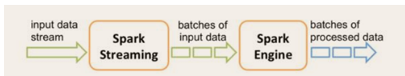

- [Flink简介](#flink简介)
- [Flink的特点](#flink的特点)
- [Yarn模式](#yarn模式)
  - [Session-Cluster模式](#session-cluster模式)
  - [Pre-Job-Cluster模式](#pre-job-cluster模式)
- [Flink的运行架构](#flink的运行架构)
  - [作业管理器](#作业管理器)
  - [任务管理器](#任务管理器)
  - [资源管理器](#资源管理器)
  - [分发器](#分发器)
- [程序与数据流](#程序与数据流)
- [执行图](#执行图)
- [任务链](#任务链)
- [Window](#window)
  - [窗口的类型](#窗口的类型)
  - [滚动窗口（Tumbling Windows）](#滚动窗口tumbling-windows)
  - [滑动窗口（Sliding Windows）](#滑动窗口sliding-windows)
  - [会话窗口（Session Windows）](#会话窗口session-windows)
  - [Window API](#window-api)
  - [创建不同的时间窗口API](#创建不同的时间窗口api)
  - [创建不同的计数窗口API](#创建不同的计数窗口api)
  - [窗口函数](#窗口函数)
- [时间语义](#时间语义)
  - [使用哪种时间语义](#使用哪种时间语义)
  - [设置时间语义](#设置时间语义)
- [水位线](#水位线)
  - [数据乱序](#数据乱序)
  - [水位线](#水位线-1)
  - [水位线的特点](#水位线的特点)
- [Flink中的状态](#flink中的状态)
  - [算子状态（Operator State）](#算子状态operator-state)
  - [键控状态（Keyed State）](#键控状态keyed-state)
  - [状态后端（State Backends）](#状态后端state-backends)
- [Flink的容错机制](#flink的容错机制)
  - [一致性检查点](#一致性检查点)
  - [检查点的恢复](#检查点的恢复)
  - [检查点的实现算法](#检查点的实现算法)
  - [检查点算法举例](#检查点算法举例)
- [保存点](#保存点)
- [Flink的状态一致性](#flink的状态一致性)
  - [什么是状态一致性](#什么是状态一致性)
  - [状态一致性的分类](#状态一致性的分类)
  - [一致性检查点](#一致性检查点-1)
  - [端到端的一致性](#端到端的一致性)
  - [端到端精准一次](#端到端精准一次)
  - [幂等写入](#幂等写入)
  - [事务写入](#事务写入)
  - [预写日志（Write-Ahead-Log，WAL）](#预写日志write-ahead-logwal)
  - [两阶段提交](#两阶段提交)
  - [两阶段提交2PC对外部Sink系统的要求](#两阶段提交2pc对外部sink系统的要求)
  - [Flink+Kafka端到端状态一致性的保证](#flinkkafka端到端状态一致性的保证)
  - [Exactly-once 两阶段提交](#exactly-once-两阶段提交)
  - [Exactly-once 两阶段提交步骤](#exactly-once-两阶段提交步骤)
- [面试题](#面试题)
  - [公司怎么提交的实时任务，有多少 Job Manager、Task Manager？](#公司怎么提交的实时任务有多少-job-managertask-manager)
  - [压测和监控](#压测和监控)
  - [为什么用Flink](#为什么用flink)
  - [Flink 的 checkpoint 存在哪里？](#flink-的-checkpoint-存在哪里)
  - [如果下级存储不支持事务，Flink 怎么保证 exactly-once？](#如果下级存储不支持事务flink-怎么保证-exactly-once)
  - [说一下 Flink 状态机制？](#说一下-flink-状态机制)
  - [怎么去重？考虑一个实时场景：双十一场景，滑动窗口长度为 1 小时，滑动距离为 10 秒钟，亿级用户，怎样计算 UV？](#怎么去重考虑一个实时场景双十一场景滑动窗口长度为-1-小时滑动距离为-10-秒钟亿级用户怎样计算-uv)
  - [Flink 的 checkpoint 机制对比 spark 有什么不同和优势？](#flink-的-checkpoint-机制对比-spark-有什么不同和优势)
  - [请详细解释一下Flink的Watermark机制。](#请详细解释一下flink的watermark机制)
  - [exactly-once如何实现](#exactly-once如何实现)
  - [Flink 三种时间语义是什么，分别说出应用场景？](#flink-三种时间语义是什么分别说出应用场景)
  - [Flink CEP 编程中当状态没有到达的时候会将数据保存在哪里？](#flink-cep-编程中当状态没有到达的时候会将数据保存在哪里)
  - [Flink程序在面对数据高峰期时如何处理？](#flink程序在面对数据高峰期时如何处理)

### Flink简介
Flink是为分布式、高性能，随时可用以及准确的流处理应用打造的开源流处理框架。是一个框架和分布式的流处理引擎，对于有界和无界的数据流进行状态计算。


### Flink的特点
- 事件驱动型

    事件驱动型是一类具有状态的应用，它从一个或多个事件流程中提取数据，并根据事件触发计算、状态更新或其他外部动作。比较典型的就是以Kafka为代表的消息队列几乎都是事件驱动型应用。与之不同的就是SparkStreaming微批次，如下图所示。
     

    事件驱动型

      

 - 流与批的世界观

    批处理的特点就是有界、持久、大量，非常适合访问全套记录才能完成计算工作，一般用于离线计算。

    流处理的特点是无界、实时无需针对整个数据集执行操作，而是对通过系统传输的每个数据项执行操作，一般用于实时计算。

    在Spark的世界观中，一切都是有批次组成的，离线数据就是一个大批次，而实时数据是由一个个无线的小批次组成的。

    在Flink的世界观中，一切都是由流组成的，离线数据是有界的流，而实时数据是一个没有界限的流，这就是所谓的有界流和无界流。

- 分层API

    Flink提供的最高层级的抽象是 SQL 。这一层抽象在语法与表达能力上与 Table API 类似，但是是以SQL查询表达式的形式表现程序。SQL抽象与Table API交互密切，同时SQL查询可以直接在Table API定义的表上执行。

      


- 支持事件时间（event-time）和处理时间（processing-time）语义
- 精确一次（exactly-once）的状态一致性保证
- 低延迟，每秒处理数百万个事件，毫秒级延迟
- 与众多常用存储系统的连接
- 高可用，动态扩展，实现7*24小时全天候运行


### Yarn模式
Flink提供了两种在yarn上运行的模式，分别为Session-Cluster模式和Pre-Job-Cluster模式


#### Session-Cluster模式
Sesssion-Cluster模式需要先启动集群，然后再提交作业，接着会向yarn申请一块空间后，资源永远保持不变，如果资源满了，下一个作业就无法提交，只能等到yarn中的其中一个作业执行完成后，释放资源，下个作业才会正常提交。所有作业共享Dispatcher和ResourceManager。共享资源，适合小规模执行时间短的作业。在yarn中初始化一个flink集群，开辟指定的资源，以后提交任务都向这里提交。这个flink集群会常驻在yarn集群中，除非手工停止。

  


#### Pre-Job-Cluster模式
一个Job会对应一个集群，每提交一个作业会根据自身的情况，都会单独向yarn申请资源，直到作业执行完成，一个作业的失败与否并不会影响下一个作业的正常提交和运行。独享Dispatcher和ResourceManager，按需接受资源申请；适合规模大长时间运行的作业。每次提交都会创建一个新的flink集群，任务之间互相独立，互不影响，方便管理。任务执行完成之后创建的集群也会消失。
  


### Flink的运行架构


任务提交的流程

  

当 Flink 集群启动后，首先会启动一个 JobManger 和一个或多个的 TaskManager。由 Client 提交任务给 JobManager，JobManager 再调度任务到各个 TaskManager 去执行，然后 TaskManager 将心跳和统计信息汇报给 JobManager。TaskManager 之间以流的形式进行数据的传输。上述三者均为独立的 JVM 进程。

Client 为提交 Job 的客户端，可以是运行在任何机器上（与 JobManager 环境连通即可）。提交 Job 后，Client 可以结束进程（Streaming的任务），也可以不结束并等待结果返回。

JobManager 主要负责调度 Job 并协调 Task 做 checkpoint，职责上很像 Storm 的 Nimbus。从 Client 处接收到 Job 和 JAR 包等资源后，会生成优化后的执行计划，并以 Task 的单元调度到各个 TaskManager 去执行。

TaskManager 在启动的时候就设置好了槽位数（Slot），每个 slot 能启动一个 Task，Task 为线程。从 JobManager 处接收需要部署的 Task，部署启动后，与自己的上游建立 Netty 连接，接收数据并处理。


#### 作业管理器
- 控制一个应用程序执行的主进程，也就是说，每个应用程序都会被一个不同的JobManger所控制。
- JobManager会先接受到要执行的应用程序，这个应用程序包含：作业图（JobGraph）、逻辑数据流图（logic dataflow graph）和打包了所有的类库以及其他的资源的jar包。
- JobManager会把JobGraph转成一个物理层面的数据流图，这个图叫做：执行图（ExecutionGraph），包含了所有可以并发执行的任务。
- JobManager会向资源管理器ResourceManger申请执行任务必要的资源，也就是任务管理器TaskManager上的插槽slot，一旦它获取到足够的资源，就会将执行图分发到真正运行它们的TaskManager上，在运行过程中，JobManager会负责所有需要的重要协调工作，比如检查点checkPoints的协调。


#### 任务管理器
- Flink中的所有工作进行，都在Flink中会有多个TaskManger运行，每一个TaskManger都会包含一定数量的插槽slots。插槽的数量限制了TaskManger能够执行的任务数量。
- 启动之后TaskManager会向资源管理注册它的插槽，收到资源管理器的指令后，TaskManager会将一个或者多个插槽提供给JobManager调用。JobManager就好像插槽分配任务执行。
- 在执行过程中，一个任务管理器可以跟其他运行在同一个应用程序的TaskManager交换数据。

#### 资源管理器
- 主要负责管理任务管理器的插槽资源。
- 当JobManage申请插槽资源时，资源管理器将有空闲的插槽分配给ResourceManager，如果没有足够的插槽来满足JobManager的请求，它会向资源提供平台发起会话，以提供启动TaskManager进程的容器。

#### 分发器
- 可以跨作业运行，它为应用提供了Rest接口。
- 当一个应用被提交执行时，分发器就会启动并将应用移交给一个JobManager。
- Dispatcher也会启动一个Web UI，用来方便地展示和监控作业执行的信息。
- Dispatcher在架构中可能并不是必需的，这取决于应用提交运行的方式。

### 程序与数据流

  

- 所有的Flink程序都是由三部分组成的：  Source 、Transformation 和 Sink。
- Source 负责读取数据源，Transformation 利用各种算子进行处理加工，Sink 负责输出
- 在运行时，Flink上运行的程序会被映射成“逻辑数据流”（dataflows），它包含了这三部分。每一个dataflow以一个或多个sources开始以一个或多个sinks结束。dataflow类似于任意的有向无环图（DAG）。

### 执行图
  


Flink 中的执行图可以分成四层：StreamGraph -> JobGraph -> ExecutionGraph -> 物理执行图

- StreamGraph：是根据用户通过 Stream API 编写的代码生成的最初的图。用来表示程序的拓扑结构。
- JobGraph：StreamGraph经过优化后生成了 JobGraph，提交给 JobManager 的数据结构。主要的优化为，将多个符合条件的节点 chain 在一起作为一个节点
- ExecutionGraph：JobManager 根据 JobGraph 生成ExecutionGraph。ExecutionGraph是JobGraph的并行化版本，是调度层最核心的数据结构。
- 物理执行图：JobManager 根据 ExecutionGraph 对 Job 进行调度后，在各个TaskManager 上部署 Task 后形成的“图”，并不是一个具体的数据结构。

### 任务链
  


Flink 采用了一种称为任务链的优化技术，可以在特定条件下减少本地通信的开销。为了满足任务链的要求，必须将两个或多个算子设为相同的并行度，并通过本地转发（local forward）的方式进行连接。

相同并行度的 one-to-one 操作，Flink 这样相连的算子链接在一起形成一个 task，原来的算子成为里面的 subtask。

并行度相同、并且是 one-to-one 操作，两个条件缺一不可。


### Window
  

一般真是的流都是无界的，可以把无界的数据流进行切分，得到有限的数据集进行处理，也就是得到有界流。窗口将无界的流切分为有限的流，将流数据分发到有限大小的桶bucket进行分析。

#### 窗口的类型
- 时间窗口（time window）
  - 滚动时间窗口
  - 滑动时间窗口
  - 会话窗口

- 计数窗口（count window）
  - 滚动计数窗口
  - 滑动计数窗口

#### 滚动窗口（Tumbling Windows）
  


- 将数据依据固定的窗口长度对数据进行切分
- 时间对齐，窗口长度固定，没有重叠。

#### 滑动窗口（Sliding Windows）
  

- 滑动窗口是固定窗口的更广义的一种形式，滑动窗口由固定的窗口长度和滑动间隔组成
- 窗口长度固定，可以有重叠。

#### 会话窗口（Session Windows）
  

- 由一系列事件组合一个指定时间长度的 timeout 间隙组成，也就是一段时间没有接收到新数据就会生成新的窗口。
- 时间无对齐

#### Window API

- 我们可以用 .window() 来定义一个窗口，然后基于这个 window 去做一些聚合或者其它处理操作。注意 window () 方法必须在 keyBy 之后才能用。
- Flink 提供了更加简单的 .timeWindow 和 .countWindow 方法，用于定义时间窗口和计数窗口。


#### 创建不同的时间窗口API
- 滚动时间窗口（tumbling time window）

    ```JAVA
    .timeWindow(Time.seconds(15))
    ```

- 滑动时间窗口（sliding time window）

    ```java
    .timeWindow(Time.seconds(15),Time.seconds(5))
    ```

- 会话窗口

    ```java
    .window(WventTimeSessionWindows.withGap(Time.minutes(10)))
    ```

#### 创建不同的计数窗口API    

- 滚动计数窗口（tumbling count window）

    ```JAVA
    .countWindow(5)
    ```

- 滑动计数窗口（sliding count window）

    ```java
    .countWindow(10,2)
    ```

#### 窗口函数
window function 定义了要对窗口中收集的数据做的计算操作，可以分为下面两类：
- 增量聚合函数（incremental aggregation functions）
  - 每条数据到来就进行计算，保持一个简单的状态
  - ReduceFunction, AggregateFunction
- 全窗口函数（full window functions）
  - 先把窗口所有数据收集起来，等到计算的时候会遍历所有数据
  - ProcessWindowFunction


### 时间语义
  

- Event Time：事件创建的时间,通常记录在数据中。
- Ingestion Time：数据进入Flink的时间
- Processing Time：执行操作算子的本地系统时间，与机器相关

#### 使用哪种时间语义

  

- 不同的时间语义有不同的应用场合
- 我们往往更关心事件时间（Event Time）

#### 设置时间语义
我们可以直接在代码中，对执行环境调用 setStreamTimeCharacteristic 方法，设置流的时间特性具体的时间，还需要从数据中提取时间戳（timestamp）
  


### 水位线

#### 数据乱序
  

- 当 Flink 以 Event Time 模式处理数据流时，它会根据数据里的时间戳来处理基于时间的算子
- 由于网络、分布式等原因，会导致乱序数据的产生
- 乱序数据会让窗口计算不准确

#### 水位线
怎样避免乱序数据带来计算不正确？

- 遇到一个时间戳达到了窗口关闭时间，不应该立刻触发窗口计算，而是等待一段时间，等迟到的数据来了再关闭窗口
- Watermark 是一种衡量 Event Time 进展的机制，可以设定延迟触发
- Watermark 是用于处理乱序事件的，而正确的处理乱序事件，通常用Watermark 机制结合 window 来实现；
- 数据流中的 Watermark 用于表示 timestamp 小于 Watermark 的数据，都已经到达了，因此，window 的执行也是由 Watermark 触发的。
- watermark 用来让程序自己平衡延迟和结果正确性

#### 水位线的特点
- watermark 是一条特殊的数据记录
- watermark 必须单调递增，以确保任务的事件时间时钟在向前推进，而不是在后退
- watermark 与数据的时间戳相关


### Flink中的状态
  

- 由一个任务维护，并且用来计算某个结果的所有数据，都属于这个任务的状态
- 可以认为状态就是一个本地变量，可以被任务的业务逻辑访问
- Flink 会进行状态管理，包括状态一致性、故障处理以及高效存储和访问，以便开发人员可以专注于应用程序的逻辑

总的说来，有两种类型的状态：算子状态和键控状态。


#### 算子状态（Operator State）
 

算子状态的作用范围限定为算子任务，由同一并行任务所处理的所有数据都可以访问到相同的状态，状态对于同一子任务而言是共享的，算子状态不能由相同或不同算子的另一个子任务访问。

算子状态的数据结构
- 列表状态（List state）将状态表示为一组数据的列表
- 联合列表状态（Union list state）也将状态表示为数据的列表。它与常规列表状态的区别在于，在发生故障时，或者从保存点（savepoint）启动应用程序时如何恢复
- 广播状态（Broadcast state）如果一个算子有多项任务，而它的每项任务状态又都相同，那么这种特殊情况最适合应用广播状态。


#### 键控状态（Keyed State）
  

根据输入数据流中定义的键（key）来维护和访问，Flink 为每个 key 维护一个状态实例，并将具有相同键的所有数据，都分区到同一个算子任务中，这个任务会维护和处理这个 key 对应的状态，当任务处理一条数据时，它会自动将状态的访问范围限定为当前数据的 key。

键控状态的数据结构
- 值状态（Value state）将状态表示为单个的值
- 列表状态（List state）将状态表示为一组数据的列表
- 映射状态（Map state） 将状态表示为一组 Key-Value 对
- 聚合状态（Reducing state & Aggregating State）将状态表示为一个用于聚合操作的列表

#### 状态后端（State Backends）
- 每传入一条数据，有状态的算子任务都会读取和更新状态
- 由于有效的状态访问对于处理数据的低延迟至关重要，因此每个并行任务都会在本地维护其状态，以确保快速的状态访问
- 状态的存储、访问以及维护，由一个可插入的组件决定，这个组件就叫做状态后端（state backend）
- 状态后端主要负责两件事：本地的状态管理，以及将检查点（checkpoint）状态写入远程存储

状态后端的类型：
1. MemoryStateBackend

    内存级的状态后端，会将键控状态作为内存中的对象进行管理，将它们存储在 TaskManager 的 JVM 堆上，而将 checkpoint 存储在 JobManager 的内存中特点：快速、低延迟，但不稳定
2. FsStateBackend
    
    将 checkpoint 存到远程的持久化文件系统（FileSystem）上，而对于本地状态，跟 MemoryStateBackend 一样，也会存在 TaskManager 的 JVM 堆上同时拥有内存级的本地访问速度，和更好的容错保证

3. RocksDBStateBackend

    将所有状态序列化后，存入本地的 RocksDB 中存储。


### Flink的容错机制

#### 一致性检查点
Flink故障的核心恢复机制就是应用状态的一致性检查点。有状态流应用的一致性检查点，其实就是所有任务的状态，在某个时间点的一份快照，在这个时间点，应该是所有任务都恰好处理完一个相同的输入数据。

 

在执行流应用程序期间，Flink会定期的保存状态的一致性检查点，如果发生故障，Flink将会使用最近的检查点一致恢复应用程序的状态，并重新启动处理流程。

  

#### 检查点的恢复
遇到故障之后，

- 第一步就是重启应用。
  
  

- 第二步就是从checkpoint中读取状态，将状态重置，从检查点重新启动应用程序后，其内部状态与检查点完成是的状态完全相同。

    

- 第三步从开始消费并处理检查点到发生故障之间的所有数据，这种检查点的保存和恢复机制可以为应用程序状态提供精确一次（exactly-once）的一致性，因为所有算子都会保存检查点并恢复其所有状态，这样一来所有的输入流就都会被重置到检查点完成时的位置。

    

#### 检查点的实现算法
检查点是基于Chandy-Lamport算法的分布式快照，将检查的保存和数据处理分开，不会暂停整个应用。

检查点分界线（Checkpoint Barrier）
- 检查点算法使用到了一种分界线的特殊数据形式，用来把一条流上的数据按照不同的检查点分开。
- 分界线之前来到的数据导致的状态更改，都会被包含在当前分界线所属的检查点中；而分界线之后的数据导致的所有更改，就会被包含在之后的检查点中。

#### 检查点算法举例
例如现在是一个有两个输入流的应用程序，用并行的两个Source任务来读取。

  

JobManager会向每个Source任务发送一条带有新检查点ID的消息，通过这种方式来启动检查点。


数据源将它们的状态写入检查点，并发出一个检查点Barrier，状态后端在状态存入检查点之后，会返回通知给Source任务，source任务就会向JobManager确认检查点完成。

  


分界线对齐，barrier向下游传递，sum任务会等待所有输入分区的barrier到达，对于barrier已经到达的分区，继续到达的数据会被缓存，而barrier尚未到达的分区，数据会被正常处理。

  

当收到所有输入分区的 barrier 时，任务就将其状态保存到状态后端的检查点中，然后将 barrier 继续向下游转发。

  

向下游转发检查点barrier后，任务会进行正常的数据处理。

  

Sink任务向JobManager确认状态保存到checkpoint完毕，当所有任务都确认已成功将状态保存到检查点时，检查点就真正的完成了。

  


### 保存点
- Flink 还提供了可以自定义的镜像保存功能，就是保存点（savepoints）
- 原则上，创建保存点使用的算法与检查点完全相同，因此保存点可以认为就是具有一些额外元数据的检查点
- Flink不会自动创建保存点，因此用户（或者外部调度程序）必须明确地触发创建操作 
- 保存点是一个强大的功能。除了故障恢复外，保存点可以用于：有计划的手动备份，更新应用程序，版本迁移，暂停和重启应用，等等

### Flink的状态一致性

#### 什么是状态一致性
有状态的流处理，内部每个算子任务都可以有自己的状态对于流处理器内部来说，所谓的状态一致性，其实就是我们所说的计算结果要保证准确。一条数据不应该丢失，也不应该重复计算在遇到故障时可以恢复状态，恢复以后的重新计算，结果应该也是完全正确的。

  


#### 状态一致性的分类
- AT-MOST-ONCE（最多一次）
  
  当任务故障时，最简单的做法是什么都不干，既不恢复丢失的状态，也不重播丢失的数据。At-most-once 语义的含义是最多处理一次事件。

- AT-LEAST-ONCE（至少一次）
  
  在大多数的真实应用场景，我们希望不丢失事件。这种类型的保障称为 at-least-once，意思是所有的事件都得到了处理，而一些事件还可能被处理多次。

- EXACTLY-ONCE（精确一次）

  恰好处理一次是最严格的保证，也是最难实现的。恰好处理一次语义不仅仅意味着没有事件丢失，还意味着针对每一个数据，内部状态仅仅更新一次。

#### 一致性检查点
- Flink 使用了一种轻量级快照机制 —— 检查点（checkpoint）来保证 exactly-once 语义
- 有状态流应用的一致检查点，其实就是：所有任务的状态，在某个时间点的一份拷贝（一份快照）。而这个时间点，应该是所有任务都恰好处理完一个相同的输入数据的时候。
- 应用状态的一致检查点，是 Flink 故障恢复机制的核心。

  


#### 端到端的一致性
- 目前我们看到的一致性保证都是由流处理器实现的，也就是说都是在 Flink 流处理器内部保证的；而在真实应用中，流处理应用除了流处理器以外还包含了数据源（例如 Kafka）和输出到持久化系统
- 端到端的一致性保证，意味着结果的正确性贯穿了整个流处理应用的始终；每一个组件都保证了它自己的一致性
- 整个端到端的一致性级别取决于所有组件中一致性最弱的组件

#### 端到端精准一次
- 内部保证 —— checkpoint
- source 端 —— 可重设数据的读取位置
- sink 端 —— 从故障恢复时，数据不会重复写入外部系统
  - 幂等写入
  - 事务写入

#### 幂等写入
所谓幂等操作，是说一个操作，可以重复执行很多次，但只导致一次结果更改，也就是说，后面再重复执行就不起作用了

#### 事务写入
- 事务（Transaction）
  - 应用程序中一系列严密的操作，所有操作必须成功完成，否则在每个操作中所作的所有更改都会被撤消
  - 具有原子性：一个事务中的一系列的操作要么全部成功，要么一个都不做
- 实现思想：构建的事务对应着 checkpoint，等到 checkpoint 真正完成的时候，才把所有对应的结果写入 sink 系统中
- 实现方式
  - 预写日志
  - 两阶段提交

#### 预写日志（Write-Ahead-Log，WAL）
- 把结果数据先当成状态保存，然后在收到 checkpoint 完成的通知时，一次性写入 sink 系统
- 简单易于实现，由于数据提前在状态后端中做了缓存，所以无论什么 sink 系统，都能用这种方式一批搞定
- DataStream API 提供了一个模板类：GenericWriteAheadSink，来实现这种事务性 sink

#### 两阶段提交

- 对于每个 checkpoint，sink 任务会启动一个事务，并将接下来所有接收的数据添加到事务里
- 然后将这些数据写入外部 sink 系统，但不提交它们 —— 这时只是“预提交”
- 当它收到 checkpoint 完成的通知时，它才正式提交事务，实现结果的真正写入
- 这种方式真正实现了 exactly-once，它需要一个提供事务支持的外部 sink 系统。Flink 提供了 TwoPhaseCommitSinkFunction 接口。

#### 两阶段提交2PC对外部Sink系统的要求
- 外部 sink 系统必须提供事务支持，或者 sink 任务必须能够模拟外部系统上的事务
- 在 checkpoint 的间隔期间里，必须能够开启一个事务并接受数据写入
- 在收到 checkpoint 完成的通知之前，事务必须是“等待提交”的状态。在故障恢复的情况下，这可能需要一些时间。如果这个时候sink系统关闭事务（例如超时了），那么未提交的数据就会丢失
- sink 任务必须能够在进程失败后恢复事务
- 提交事务必须是幂等操作

#### Flink+Kafka端到端状态一致性的保证
- 内部 —— 利用 checkpoint 机制，把状态存盘，发生故障的时候可以恢复，保证内部的状态一致性
- source —— kafka consumer 作为 source，可以将偏移量保存下来，如果后续任务出现了故障，恢复的时候可以由连接器重置偏移量，重新消费数据，保证一致性
- sink —— kafka producer 作为sink，采用两阶段提交 sink，需要实现一个 TwoPhaseCommitSinkFunction

#### Exactly-once 两阶段提交
JobManager 协调各个 TaskManager 进行 checkpoint 存储checkpoint保存在 StateBackend中，默认StateBackend是内存级的，也可以改为文件级的进行持久化保存

  

当 checkpoint 启动时，JobManager 会将检查点分界线（barrier）注入数据流，barrier会在算子间传递下去

 

每个算子会对当前的状态做个快照，保存到状态后端checkpoint 机制可以保证内部的状态一致性

  
 
每个内部的 transform 任务遇到 barrier 时，都会把状态存到 checkpoint 里；sink 任务首先把数据写入外部 kafka，这些数据都属于预提交的事务；遇到 barrier 时，把状态保存到状态后端，并开启新的预提交事务

  

当所有算子任务的快照完成，也就是这次的 checkpoint 完成时，JobManager 会向所有任务发通知，确认这次 checkpoint 完成。sink 任务收到确认通知，正式提交之前的事务，kafka 中未确认数据改为"已确认"。

 

#### Exactly-once 两阶段提交步骤
- 第一条数据来了之后，开启一个 kafka 的事务（transaction），正常写入 kafka 分区日志但标记为未提交，这就是“预提交”
- jobmanager 触发 checkpoint 操作，barrier 从 source 开始向下传递，遇到 barrier 的算子将状态存入状态后端，并通知 jobmanager
- sink 连接器收到 barrier，保存当前状态，存入 checkpoint，通知 jobmanager，并开启下一阶段的事务，用于提交下个检查点的数据
- jobmanager 收到所有任务的通知，发出确认信息，表示 checkpoint 完成
- sink 任务收到 jobmanager 的确认信息，正式提交这段时间的数据
- 外部kafka关闭事务，提交的数据可以正常消费了。

### 面试题

#### 公司怎么提交的实时任务，有多少 Job Manager、Task Manager？

#### 压测和监控
我们一般碰到的压力来自以下几个方面： 
- 产生数据流的速度如果过快，而下游的算子消费不过来的话，会产生背压。背压的监控可以使用 Flink Web UI(localhost:8081) 来可视化监控Metrics，一旦报警就能知道。一般情况下背压问题的产生可能是由于 sink 这个 操作符没有优化好，做一下优化就可以了。比如如果是写入 ElasticSearch， 那么可以改成批量写入，可以调大 ElasticSearch 队列的大小等等策略。
- 设置watermark的最大延迟时间这个参数，如果设置的过大，可能会造成内存的压力。可以设置最大延迟时间小一些，然后把迟到元素发送到侧输出流中去。晚一点更新结果。或者使用类似于 RocksDB 这样的状态后端， RocksDB 会开辟堆外存储空间，但 IO 速度会变慢，需要权衡。 
- 还有就是滑动窗口的长度如果过长，而滑动距离很短的话，Flink 的性能会下降的很厉害。我们主要通过时间分片的方法，将每个元素只存入一个“重叠窗口”，这样就可以减少窗口处理中状态的写入。参见链接：https://www.infoq.cn/article/sIhs_qY6HCpMQNblTI9M 
- 状态后端使用 RocksDB，还没有碰到被撑爆的问题。

#### 为什么用Flink
主要考虑的是flink的低延迟、高吞吐量和对流式数据应用场景更好的支持；另外，flink可以很好地处理乱序数据，而且可以保证exactly-once的状态一致性。

#### Flink 的 checkpoint 存在哪里？
可以是内存，文件系统，或者 RocksDB。

#### 如果下级存储不支持事务，Flink 怎么保证 exactly-once？
端到端的exactly-once对sink要求比较高，具体实现主要有幂等写入和事务性写入两种方式。幂等写入的场景依赖于业务逻辑，更常见的是用事务性写入。而事务性写入又有预写日志（WAL）和两阶段提交（2PC）两种方式。
如果外部系统不支持事务，那么可以用预写日志的方式，把结果数据先当成状态保存，然后在收到 checkpoint 完成的通知时，一次性写入 sink 系统。

#### 说一下 Flink 状态机制？
Flink内置的很多算子，包括源source，数据存储sink都是有状态的。在Flink中，状态始终与特定算子相关联。Flink会以checkpoint的形式对各个任务的状态进行快照，用于保证故障恢复时的状态一致性。Flink通过状态后端来管理状态和checkpoint的存储，状态后端可以有不同的配置选择。

#### 怎么去重？考虑一个实时场景：双十一场景，滑动窗口长度为 1 小时，滑动距离为 10 秒钟，亿级用户，怎样计算 UV？ 

使用类似于 scala 的 set 数据结构或者 redis 的 set 显然是不行的，因为可能有上亿个 Key，内存放不下。所以可以考虑使用布隆过滤器（Bloom Filter）来去重。

#### Flink 的 checkpoint 机制对比 spark 有什么不同和优势？
spark streaming 的 checkpoint 仅仅是针对 driver 的故障恢复做了数据和元数据的 checkpoint。而 flink 的 checkpoint 机制 要复杂了很多，它采用的是轻量级的分布式快照，实现了每个算子的快照，及流动中的数据的快照。


#### 请详细解释一下Flink的Watermark机制。
Watermark本质是Flink中衡量EventTime进展的一个机制，主要用来处理乱序数据。

#### exactly-once如何实现
Flink依靠checkpoint机制来实现exactly-once语义，如果要实现端到端的exactly-once，还需要外部source和sink满足一定的条件。状态的存储通过状态后端来管理，Flink中可以配置不同的状态后端。

#### Flink 三种时间语义是什么，分别说出应用场景？
1. Event Time：这是实际应用最常见的时间语义。
2. Processing Time：没有事件时间的情况下，或者对实时性要求超高的情况下。 
3. Ingestion Time：存在多个Source Operator的情况下，每个Source Operator可以使用自己本地系统时钟指派 Ingestion Time。后续基于时间相关的各种操作，都会使用数据记录中的 Ingestion Time。

#### Flink CEP 编程中当状态没有到达的时候会将数据保存在哪里？
在流式处理中，CEP 当然是要支持 EventTime 的，那么相对应的也要支持数据的迟到现象，也就是watermark的处理逻辑。CEP对未匹配成功的事件序列的处理，和迟到数据是类似的。在 Flink CEP的处理逻辑中，状态没有满足的和迟到的数据，都会存储在一个Map数据结构中，也就是说，如果我们限定判断事件序列的时长为5分钟，那么内存中就会存储5分钟的数据。

#### Flink程序在面对数据高峰期时如何处理？
使用大容量的 Kafka 把数据先放到消息队列里面作为数据源，再使用 Flink 进行消费，不过这样会影响到一点实时性。


