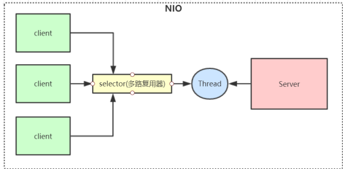
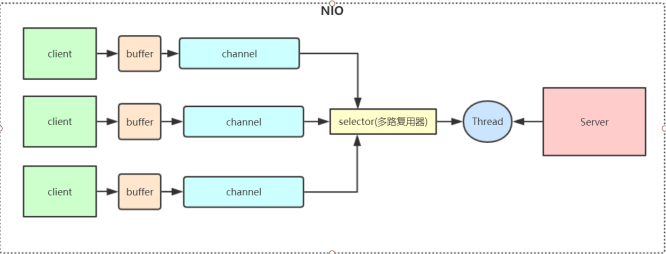

- [BIO（Bloing IO）](#biobloing-io)
  - [缺点](#缺点)
  - [优点](#优点)
  - [应用场景](#应用场景)
  - [代码实现](#代码实现)
- [NIO（Non Blocking IO）](#nionon-blocking-io)
  - [应用场景](#应用场景-1)
  - [代码实现](#代码实现-1)
- [AIO](#aio)
  - [应用场景](#应用场景-2)
  - [代码实现](#代码实现-2)
- [BIO NIO AIO对比](#bio-nio-aio对比)
  - [形象案例分析](#形象案例分析)

### BIO（Bloing IO）
BIO是一个同步阻塞IO，没一个连接都需要新增一个线程进行处理，即一个客户端连接对应一个处理线程。

#### 缺点
- IO线程里面的read线程会阻塞操作，如果客户端没有数据操作，则线程会一直阻塞，浪费资源。
- 连接过多会创建大量的线程，消耗服务器资源，给服务器造成很大压力。
  


#### 优点
- 程序简单易于理解。

#### 应用场景
- 连接较少且固定的架构。
- 服务器资充足。

#### 代码实现
```java
//服务端示例
public class SocketServer {
    public static void main(String[] args) throws IOException {
        ServerSocket serverSocket = new ServerSocket(9000);
        while (true) {
            System.out.println("等待连接。。");
            Socket socket = serverSocket.accept(); //阻塞方法
            System.out.println("有客户端连接了。。");
            new Thread(new Runnable() {
                @Override
                public void run() {
                    try {
                        handler(socket);
                    } catch (IOException e) {
                        e.printStackTrace();
                    }
                }
            }).start();
        }
    }

    private static void handler(Socket socket) throws IOException {
        System.out.println("thread id = " + Thread.currentThread().getId());
        byte[] bytes = new byte[1024];

        System.out.println("准备read。。");
        //接收客户端的数据，阻塞方法，没有数据可读时就阻塞
        int read = socket.getInputStream().read(bytes);
        System.out.println("read完毕。。");
        if (read != ‐1){
            System.out.println("接收到客户端的数据：" + new String(bytes, 0, read));
            32 System.out.println("thread id = " + Thread.currentThread().getId());

        }
        socket.getOutputStream().write("HelloClient".getBytes());
        socket.getOutputStream().flush();
    }
}

//客户端代码
public class SocketClient {
    public static void main(String[] args) throws IOException {
        Socket localhost = new Socket("localhost", 9000);
        Socket socket = localhost;
//向服务端发送数据
        socket.getOutputStream().write("HelloServer".getBytes());
        socket.getOutputStream().flush();
        System.out.println("向服务端发送数据结束");
        byte[] bytes = new byte[1024];
        //接收服务端回传的数据
        socket.getInputStream().read(bytes);
        System.out.println("接收到服务端的数据：" + new String(bytes));
        socket.close();
    }
}
```

### NIO（Non Blocking IO）
NIO是一种同步非阻塞IO，可以用个一个或多个线程处理大量客户端的请求，客户端发送的连接都会注册到多路复用器selector上，由多路复用器轮询连接事件进行处理。

  

NIO有三个核心组件，通道（channel）、缓冲区（buffer）、selector（多路复用器）。

 
- channel：类似于流，每个 channel对应一个buffer缓冲区，buffer的底层就是数组。
- channel会注册到selector上，由selector根据事件类型把它交给空闲的线程。
- selector可以对应一个或多个线程。
- NIO的channel和buffer既可以读也可以写。


IO多路复用底层是基于linux的底层api实现的，它们的区别如下：

  


#### 应用场景
适合连接多且连接较短的架构，比如聊天系统、弹幕系统、通信系统等。编程相对复杂。

#### 代码实现

```java

//服务端代码
public class NIOServer {

    //public static ExecutorService pool = Executors.newFixedThreadPool(10);
        
    public static void main(String[] args) throws IOException {
    // 创建一个在本地端口进行监听的服务Socket通道.并设置为非阻塞方式
        ServerSocketChannel ssc = ServerSocketChannel.open();
        //必须配置为非阻塞才能往selector上注册，否则会报错，selector模式本身就是非阻塞模式
        ssc.configureBlocking(false);
        ssc.socket().bind(new InetSocketAddress(9000));
        // 创建一个选择器selector
        Selector selector = Selector.open();
        // 把ServerSocketChannel注册到selector上，并selector对客户端accept连接操作感兴趣
        ssc.register(selector, SelectionKey.OP_ACCEPT);

        while (true) {
            System.out.println("等待事件发生。。");
            // 轮询监听channel里的key，select是阻塞的，accept()也是阻塞的
            int select = selector.select();

            System.out.println("有事件发生了。。");
            // 有客户端请求，被轮询监听到
            Iterator<SelectionKey> it = selector.selectedKeys().iterator();
            while (it.hasNext()) {
                SelectionKey key = it.next();
                //删除本次已处理的key，防止下次select重复处理
                it.remove();
                handle(key);
            }
        }
    }

    private static void handle(SelectionKey key) throws IOException {
        if (key.isAcceptable()) {
            System.out.println("有客户端连接事件发生了。。");
            ServerSocketChannel ssc = (ServerSocketChannel) key.channel();
            //NIO非阻塞体现：此处accept方法是阻塞的，但是这里因为是发生了连接事件，所以这个方法会马上执行完，不会阻塞39 
            //处理完连接请求不会继续等待客户端的数据发送
            SocketChannel sc = ssc.accept();
            sc.configureBlocking(false);
            //通过Selector监听Channel时对读事件感兴趣
            sc.register(key.selector(), SelectionKey.OP_READ);
        } else if (key.isReadable()) {
            System.out.println("有客户端数据可读事件发生了。。");
            SocketChannel sc = (SocketChannel) key.channel();
            ByteBuffer buffer = ByteBuffer.allocate(1024);
            //NIO非阻塞体现:首先read方法不会阻塞，其次这种事件响应模型，当调用到read方法时肯定是发生了客户端发送数据的事件
            int len = sc.read(buffer);
            if (len != ‐1){
                System.out.println("读取到客户端发送的数据：" + new String(buffer.array(), 0, len));
            }
            ByteBuffer bufferToWrite = ByteBuffer.wrap("HelloClient".getBytes());
            sc.write(bufferToWrite);
            key.interestOps(SelectionKey.OP_READ | SelectionKey.OP_WRITE);
        } else if (key.isWritable()) {
            SocketChannel sc = (SocketChannel) key.channel();
            System.out.println("write事件");
            // NIO事件触发是水平触发
            // 使用Java的NIO编程的时候，在没有数据可以往外写的时候要取消写事件，
            // 在有数据往外写的时候再注册写事件
            key.interestOps(SelectionKey.OP_READ);
            sc.close();
        }
    }
}
```
1. 服务端代码解析

    1. 创建一个 ServerSocketChannel 和 Selector ，并将 ServerSocketChannel 注册到 Selector上
    2. selector 通过 select() 方法监听 channel 事件，当客户端连接时，selector 监听到连接事件， 获取到ServerSocketChannel 注册时绑定的 selectionKey
    3. selectionKey 通过 channel() 方法可以获取绑定的 ServerSocketChannel
    4. ServerSocketChannel 通过 accept() 方法得到 SocketChannel
    5. 将 SocketChannel 注册到 Selector 上，关心 read 事件
    6. 注册后返回一个 SelectionKey, 会和该 SocketChannel 关联
    7. selector 继续通过 select() 方法监听事件，当客户端发送数据给服务端，selector 监听到read事件，获取到 SocketChannel 注册时绑定的 selectionKey
    8. selectionKey 通过 channel() 方法可以获取绑定的 socketChannel
    9. 将 socketChannel 里的数据读取出来
    10. 用 socketChannel 将服务端数据写回客户端

NIO模型的selector 就像一个大总管，负责监听各种IO事件，然后转交给后端线程去处理NIO相对于BIO非阻塞的体现就在，BIO的后端线程需要阻塞等待客户端写数据(比如read方法)，如果客户端不写数据线程就要阻塞，NIO把等待客户端操作的事情交给了大总管 selector，selector 负责轮询所有已注册的客户端，发现有事件发生了才转交给后端线程处理，后端线程不需要做任何阻塞等待，直接处理客户端事件的数据即可，处理完马上结束，或返回线程池供其他客户端事件继续使用。还有就是 channel 的读写是非阻塞的。Redis就是典型的NIO线程模型，selector收集所有连接的事件并且转交给后端线程，线程连续执行所有事件命令并将结果写回客户端。

 

```java
//客户端代码
public class NioClient {
    //通道管理器
    private Selector selector;

        *
        * 启动客户端测试
        *
        * @throws IOException
        */
    public static void main(String[] args) throws IOException {
        NioClient client = new NioClient();
        client.initClient("127.0.0.1", 9000);
        client.connect();
    }

    /**
     * 获得一个Socket通道，并对该通道做一些初始化的工作
     *
     * @param ip 连接的服务器的ip
     * @param port 连接的服务器的端口号
     * @throws IOException
     */
    public void initClient(String ip, int port) throws IOException {
        // 获得一个Socket通道
        SocketChannel channel = SocketChannel.open();
        // 设置通道为非阻塞
        channel.configureBlocking(false);
        // 获得一个通道管理器
        this.selector = Selector.open();

        // 客户端连接服务器,其实方法执行并没有实现连接，需要在listen（）方法中调
        //用channel.finishConnect();才能完成连接
        channel.connect(new InetSocketAddress(ip, port));
        //将通道管理器和该通道绑定，并为该通道注册SelectionKey.OP_CONNECT事件。
        channel.register(selector, SelectionKey.OP_CONNECT);
    }

    /**
     * 采用轮询的方式监听selector上是否有需要处理的事件，如果有，则进行处理
     *
     * @throws IOException
     */
    public void connect() throws IOException {45 // 轮询访问selector
        while (true) {
            selector.select();
            // 获得selector中选中的项的迭代器
            Iterator<SelectionKey> it = this.selector.selectedKeys().iterator();
            while (it.hasNext()) {
                SelectionKey key = (SelectionKey) it.next();
                // 删除已选的key,以防重复处理
                it.remove();
                // 连接事件发生
                if (key.isConnectable()) {
                    SocketChannel channel = (SocketChannel) key.channel();
                    // 如果正在连接，则完成连接
                    if (channel.isConnectionPending()) {
                        channel.finishConnect();
                    }
                    // 设置成非阻塞
                    channel.configureBlocking(false);
                    //在这里可以给服务端发送信息哦
                    ByteBuffer buffer = ByteBuffer.wrap("HelloServer".getBytes());
                    channel.write(buffer);
                    channel.register(this.selector, SelectionKey.OP_READ); // 获得了可读的事件
                } else if (key.isReadable()) {
                    read(key);
                }
            }
        }
    }

    /**
     * 处理读取服务端发来的信息 的事件
     *
     * @param key
     * @throws IOException
     */
    public void read(SelectionKey key) throws IOException {
        //和服务端的read方法一样
        // 服务器可读取消息:得到事件发生的Socket通道
        SocketChannel channel = (SocketChannel) key.channel();
        // 创建读取的缓冲区
        ByteBuffer buffer = ByteBuffer.allocate(512);
        int len = channel.read(buffer);
        if (len != ‐1) {
            System.out.println("客户端收到信息：" + new String(buffer.array(), 0, len));
        }
    }
}
```

### AIO
异步非阻塞IO，由操作系统完成后回调通知服务器端启动线程去处理，一般适用于连接较多且处理时间较长的场景。

#### 应用场景
AIO方式适用于连接数目多且连接比较长（重操作） 的架构，JDK7 开始支持

#### 代码实现

```java
//服务端代码
public class AIOServer {
    public static void main(String[] args) throws Exception {
        final AsynchronousServerSocketChannel serverChannel =
                AsynchronousServerSocketChannel.open().bind(new InetSocketAddress(9000));6 7
        rverChannel.accept(null, new CompletionHandler<AsynchronousSocketChannel, Object>() {
            @Override
            public void completed(AsynchronousSocketChannel socketChannel, Object attachment) {
                try {
                    // 再此接收客户端连接，如果不写这行代码后面的客户端连接连不上服务端
                    serverChannel.accept(attachment, this);
                    System.out.println(socketChannel.getRemoteAddress());
                    ByteBuffer buffer = ByteBuffer.allocate(1024);
                    socketChannel.read(buffer, buffer, new CompletionHandler<Integer, ByteBuffer>() {
                        @Override
                        public void completed(Integer result, ByteBuffer buffer) {
                            buffer.flip();
                            System.out.println(new String(buffer.array(), 0, result));
                            socketChannel.write(ByteBuffer.wrap("HelloClient".getBytes()));
                        }

                        @Override
                        public void failed(Throwable exc, ByteBuffer buffer) {
                            exc.printStackTrace();
                        }
                    });
                } catch (IOException e) {
                    e.printStackTrace();
                }
            }

            @Override
            public void failed(Throwable exc, Object attachment) {
                exc.printStackTrace();
            }
        });

        Thread.sleep(Integer.MAX_VALUE);
    }
}
//客户端代码
public class AIOClient {

    public static void main(String... args) throws Exception {
        AsynchronousSocketChannel socketChannel = AsynchronousSocketChannel.open();
        socketChannel.connect(new InetSocketAddress("127.0.0.1", 9000)).get();
        socketChannel.write(ByteBuffer.wrap("HelloServer".getBytes()));
        ByteBuffer buffer = ByteBuffer.allocate(512);
        Integer len = socketChannel.read(buffer).get();
        if (len != ‐1) {
            System.out.println("客户端收到信息：" + new String(buffer.array(), 0, len));
        }
    }
}
```

### BIO NIO AIO对比
  

#### 形象案例分析
老张爱喝茶，废话不说，煮开水。出场人物：老张，水壶两把（普通水壶，简称水壶；会响的水壶，简称响水壶）。

- 老张把水壶放到火上，立等水开。（同步阻塞）老张觉得自己有点傻
- 老张把水壶放到火上，去客厅看电视，时不时去厨房看看水开没有。（同步非阻塞）老张还是觉得自己有点傻，于是变高端了，买了把会响笛的那种水壶。水开之后，能大声发出嘀~~~~的噪音。
- 老张把响水壶放到火上，立等水开。（异步阻塞）老张觉得这样傻等意义不大
- 老张把响水壶放到火上，去客厅看电视，水壶响之前不再去看它了，响了再去拿壶。（异步非阻塞）老张觉得自己聪明了。

所谓同步异步，只是对于水壶而言。普通水壶，同步；响水壶，异步。虽然都能干活，但响水壶可以在自己完工之后，提示老张水开了。这是普通水壶所不能及的。同步只能让调用者去轮询自己（情况2中），造成老张效率的低下。所谓阻塞非阻塞，仅仅对于老张而言。立等的老张，阻塞；看电视的老张，非阻塞。


