- [JVM的整体结构及内存模型](#jvm的整体结构及内存模型)
- [JVM 内存参数设置](#jvm-内存参数设置)
- [逃逸分析](#逃逸分析)
  - [JVM的三种运行模式](#jvm的三种运行模式)
  - [对象逃逸分析](#对象逃逸分析)
- [JVM的内存分配与回收](#jvm的内存分配与回收)
  - [1.对象优先分配在Eden区](#1对象优先分配在eden区)
  - [2.大对象会直接进入老年代](#2大对象会直接进入老年代)
  - [3.长期存放的对象进入老年代](#3长期存放的对象进入老年代)
  - [4.对象的动态年龄判断](#4对象的动态年龄判断)
  - [5.Minor GC后存活的对象Survivor区放不下](#5minor-gc后存活的对象survivor区放不下)
  - [6.老年代空间担保机制](#6老年代空间担保机制)
  - [7.Eden区与Survivor区的默认比例:8:1:1](#7eden区与survivor区的默认比例811)
- [如何判断对象可以被回收](#如何判断对象可以被回收)
  - [引用计数器](#引用计数器)
  - [可达性分析](#可达性分析)
- [常见的引用类型](#常见的引用类型)
- [finalize()方法](#finalize方法)
- [判断一个类是否是无用类](#判断一个类是否是无用类)
- [垃圾回收算法](#垃圾回收算法)
  - [1.标记-清除算法](#1标记-清除算法)
  - [2.复制算法](#2复制算法)
  - [3.标记整理算法](#3标记整理算法)
  - [4.分代收集算法](#4分代收集算法)
- [垃圾收集器](#垃圾收集器)
  - [1. Serial收集器（-XX:+UseSerialGC -XX:UseSerialOldGC）](#1-serial收集器-xxuseserialgc--xxuseserialoldgc)
  - [2.ParNew收集器（-XX:UseParNewGC）](#2parnew收集器-xxuseparnewgc)
  - [3.Parallel Scavenge收集器（-XX:UseParallGC(年轻代)，-XX:UseParallOldGC(老年代)）](#3parallel-scavenge收集器-xxuseparallgc年轻代-xxuseparalloldgc老年代)
  - [4.CMS收集器（-XX:UseConcMarkSweepGC(年轻代默认使用Serial，老念代使用CMS)）](#4cms收集器-xxuseconcmarksweepgc年轻代默认使用serial老念代使用cms)
  - [CMS相关参数设置](#cms相关参数设置)
- [G1垃圾收集器（-XX:UseG1GC）](#g1垃圾收集器-xxuseg1gc)
  - [G1垃圾回收器的Region与分代](#g1垃圾回收器的region与分代)
  - [G1回收器的回收过程](#g1回收器的回收过程)
  - [G1收集器的特点](#g1收集器的特点)
  - [G1收集器的参数设置](#g1收集器的参数设置)
  - [G1垃圾收集器分类](#g1垃圾收集器分类)
- [如何选择垃圾收集器](#如何选择垃圾收集器)
- [JVM调优工具](#jvm调优工具)
  - [JPS](#jps)
  - [Jinfo](#jinfo)
  - [Jstat](#jstat)
- [内存泄露是什么](#内存泄露是什么)
- [Class 常量池](#class-常量池)
  - [字面量](#字面量)
  - [符号引用](#符号引用)
- [字符串常量池](#字符串常量池)
  - [Strig.intern()](#strigintern)
  - [八种基本类型的包装类和对象池](#八种基本类型的包装类和对象池)
- [安全区域和安全点](#安全区域和安全点)
  - [安全点](#安全点)
  - [安全区域](#安全区域)
### JVM的整体结构及内存模型
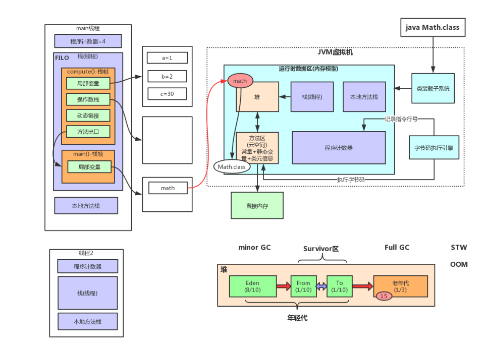  

### JVM 内存参数设置
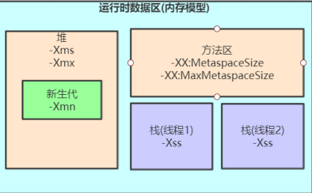  
```-Xss```设置越小count值越小，说明一个线程栈里能分配的栈帧就越少，但是对JVM整体来说能开启的线程数会更多。

### 逃逸分析
#### JVM的三种运行模式
1. 解释模式（Interpreted Mode）:只使用解释器，执行一行JVM字节码就编译一行机器码。解释模式执行较快，对于只需要执行部分代码，并且只需要执行一次的情况比较合适。
2. 编译模式（Conpiled Mode）：只使用编译器，先将所有JVM字节码一次编译为机器码，然后一次性执行所有机器码。编译模式启动慢，但是后期执行速度快，而且占用内存多，适合代码可能被反复执行的场景。
3. 混合模式（Mixed Mode）：依然使用解释模式执行代码，但对于一些热点代码采用编译模式执行，JVM一般采用混合模式执行代码。混合模式时默认的模式，一开始采用解释执行，但对于```热点```代码会使用编译模式，这些热点机器码会被缓存起来，下次再使用是无需编译，这就是我们常见的JIT(Just In Time Compiler)即时编译技术。

#### 对象逃逸分析
即分析对象动态作用域，如下代码：
````
1 public User test1() {
2 User user = new User();
3 user.setId(1);
4 user.setName("zhuge");
5 //TODO 保存到数据库
6 return user;
7 }
8 9
public void test2() {
10 User user = new User();
11 user.setId(1);
12 user.setName("zhuge");
13 //TODO 保存到数据库
14 }
````
很显然test1方法中的user对象被返回了，这个对象的作用域范围不确定，test2方法中的user对象我们可以确定当方法结束这个对象就可以认为是无效对象了，对于这样的对象我们其实可以将其分配的栈内存里，让其在方法结束时跟随栈内存一起被回收掉。JVM对于这种情况可以通过开启逃逸分析参数(```-XX:+DoEscapeAnalysis```)来优化对象内存分配位置，JDK7之后默认开启逃逸分析，如果要关闭使用参数(```-XX:-DoEscapeAnalysis```)。


### JVM的内存分配与回收
#### 1.对象优先分配在Eden区
通常对象在新生代中Eden区分配内存，当Eden区没有足够的空间进行分配时，JVM将发起Minor GC。
- Minor GC/Young GC：回收新生代的垃圾对象，一般比较频繁，回收速度快，STW的时间很短。
- Major GC/Full GC：回收年轻带、老年代、方法区的垃圾对象，一般回收比较慢，比Minor GC慢10倍以上，STW的时间会比较长。

#### 2.大对象会直接进入老年代
为了避免大对象分配内存时的复制操作而降低效率，大小大于   ```-XX:PretenureSizeThreshold``` 的对象直接进入老年代，这个设置只对```Serial, ParNew``` 两个收集器有效。

#### 3.长期存放的对象进入老年代
对象每经过一次Minor GC，它的年龄就+1，当年龄增加到一定程度（默认是15），就会晋升到老年代，晋升的阈值可以通过参数``` -XX:MaxTenuringThreshold``` 来设置。

#### 4.对象的动态年龄判断
当前Survivor中的存活对象的区域（from或者to），如果一批对象的总大小大于这块区域内存的50%，那么大于等于这批对象的最大值的对象，就可以直接进入老年代。例如：年龄1+年龄2+年龄n的多个年龄对象总和超过了Survivor区域的50%，此时就会把年龄n以上的对象都放入老年代。这个规则其实是希望那些可能是长期存活
的对象，尽早进入老年代。对象动态年龄判断机制一般是在minor gc之后触发。

#### 5.Minor GC后存活的对象Survivor区放不下
这种情况放会把部分对象移动到老年代，部分对象还在Survivor区。

#### 6.老年代空间担保机制
每次Minor GC之前都会计算下老年代剩余可用空间，如果剩余空间小于年轻代所有对象的大小之和（包含垃圾对象），就会看```-XX:-HandlePromotionFailure```是否设置了， jdk 1.8默认开启，如果开启就会看老年代的剩余大小，是否大于每次Minor GC后进入老年代对象的平均大小，如果小于或者此参数没有设置就好触发Full GC，如果回收完还是不够放，就会发生OOM；如果大于就触发Minor GC，如果Minor GC后老年代的对象大小还是小于需要挪动的对象大小，也会触发Full GC，Full GC后还是放不下，也会发生OOM。
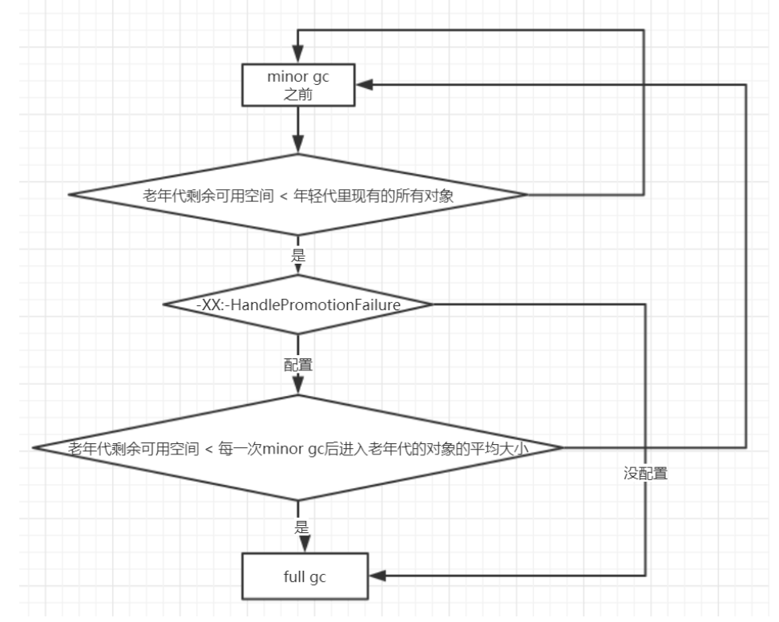  

#### 7.Eden区与Survivor区的默认比例:8:1:1
因为新生代的对象都是朝生夕死的，存活时间很短，所以JVM默认的8:1:1的比例是很合适，让eden区尽量的大，survivor区够用即可，JVM默认有这个参数```-XX:+UseAdaptiveSizePolicy```，可以调整比例。

### 如何判断对象可以被回收
如果判断一个对象是否是垃圾对象，有以下两种方式：
#### 引用计数器
给对象添加一个引用计数器，每当被引用时，计数器的值就加1，当为0时，就表示不再被使用，可以回收了。此方法简单，效率高，但是不能解决对象间相互循环引用的问题。因此JVM并不采用这种方法。

#### 可达性分析
通过一系列的```GC Roots```的对象作为起点开始搜索，找到的对象都是非垃圾对象，找不到的对象则为垃圾对象。```GC Roots```的根节点有：线程栈的局部变量、静态变量、本地方法栈的变量等。
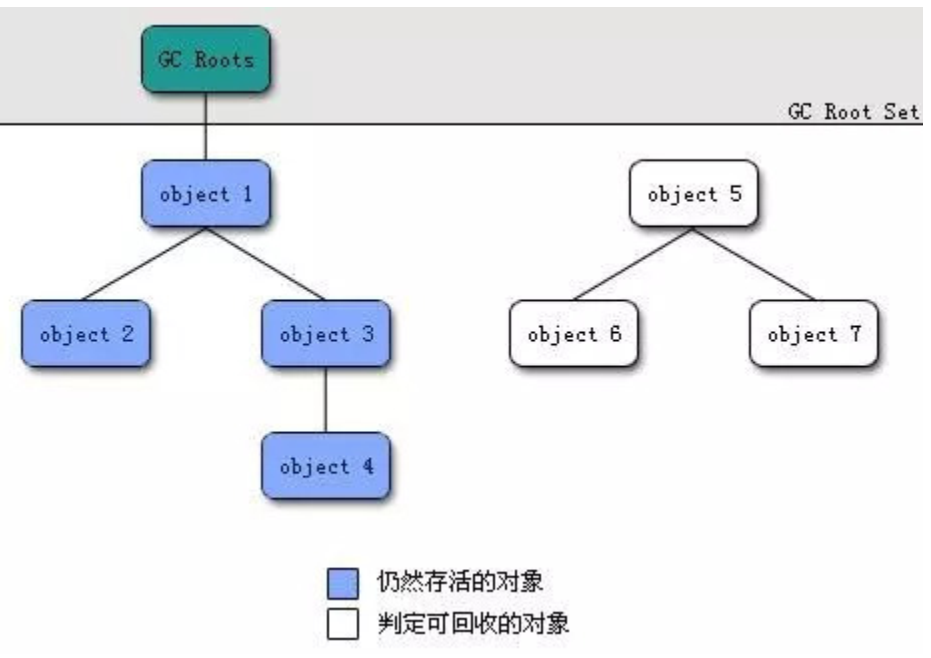  


### 常见的引用类型
Java的引用类型分为四类：强引用、软引用、弱引用、虚引用。
- 强引用：普通变量的引用，```Test t = new Test()```。
- 软引用：将对象用SoftReference软引用类型的对象包裹，正常情况不会被回收，但是GC做完后发现释放不出空间存放新的对象，则会把这些软引用的对象回收掉。软引用可用来实现内存敏感的高速缓存。
    ```
    public static SoftReference<User> user = new SoftReference<User>(new User());
    ```
- 弱引用：弱引用跟没引用差不多，GC会直接回收掉，很少用。
- 虚引用：虚引用也称为幽灵引用或者幻影引用，它是最弱的一种引用关系，几乎不用。
  
  
### finalize()方法
即使在可达性分析不可达的对象，也并不一定是一定会被回收，这时候它们暂时处于“缓刑”阶段，要真正宣告一个对象死亡，至少要经历再次标记过程。标记的前提是对象在进行可达性分析后发现没有与GC Roots相连接的引用链。
- 第一次标记并筛选

    筛选的条件是此对象是否有必要执行finalize()方法。当对象没有覆盖finalize方法，就没必要进行二次标记，肯定会被回收。
- 第二次标记

    如果这个对象覆盖了finalize方法，finalize方法是对象脱逃死亡命运的最后一次机会，如果对象要在finalize()中成功拯救自己，只要重新与引用链上的任何的一个对象建立关联即可，譬如把自己赋值给某个类变量或对象的成员变量，那在第二次标记时它将移除出“即将回收”的```F-Queue```队列中，如果这个对象还没有逃脱，基本上就被直接回收了。

### 判断一个类是否是无用类
一个类必须同时满足下面三个条件，才能判定为是无用类：
- 该类的所有实例对象均被回收。
- 加载该类的类加载器已经被回收。
- 没有任何地方通过反射访问该类，该类的java.lang.Class对象没有任何地方被用。  

### 垃圾回收算法
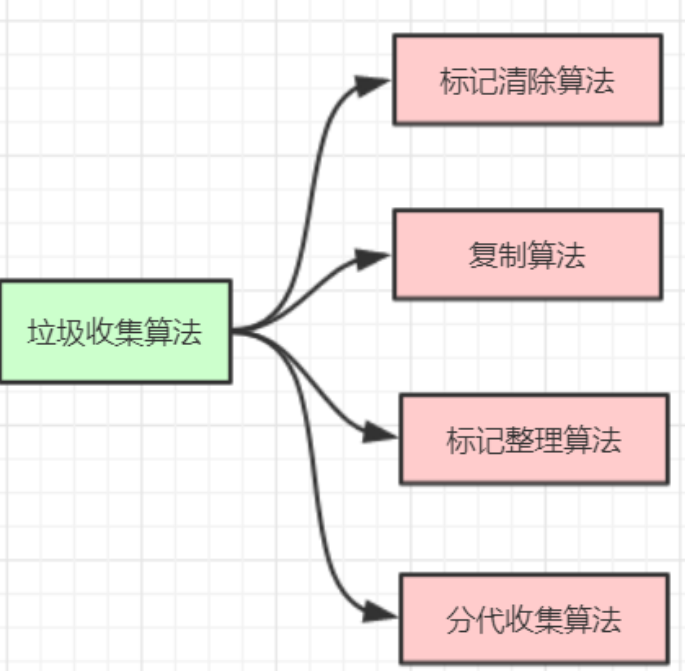  

#### 1.标记-清除算法
分为标记和清除连个阶段，标记是找到垃圾对象，清除是对垃圾对象进行回收，存在以下问题：
- 两个阶段的效率都不高。
- 产生大量的空间碎片，在分配大对象时会因没有连续的空间而不得不提前触发一下垃圾回收。
  
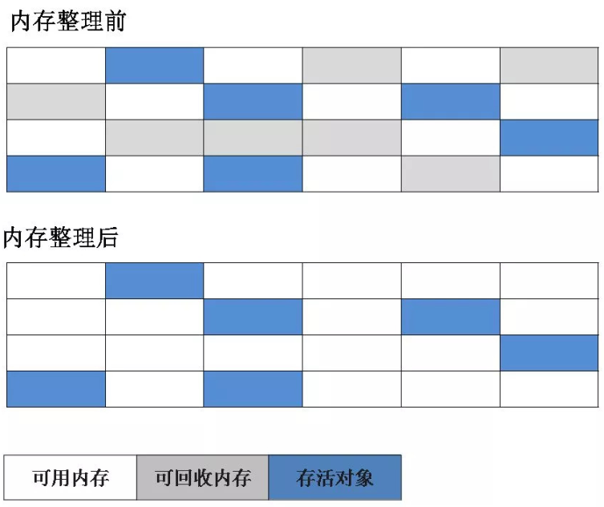  

#### 2.复制算法
复制算法将内存分为大小相同的两块，每次使用其中一块，一块使用完之后，将存活的对象移动到另一块，对使用的空间进行全部清除，每次只对其中使用的一块进行垃圾回收。
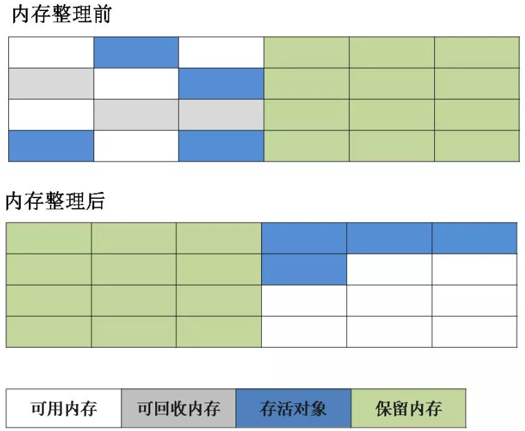 

#### 3.标记整理算法
根据老年代的特点提出的一种算法，过程和标记-清除算法一样，但是不是会可回收的对象直接回收，而是把存活的对象向一端移动，然后清除掉边界以外的内存空间。
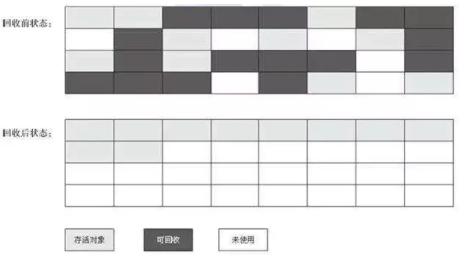  

#### 4.分代收集算法
JVM根据对象存活的周期将内存分为几块，根据各代的特点选择合适的算法,在新生代选择复制算法，因为大量的对象都是朝生夕死的，只需要少量的复制成本就可以完成垃圾收集；而老年代的对象存活几率很高，所以使用标记-整理或标-记清除算法，没有额外的空间进行担保，但是这两中算法通常比复制算法慢10倍以上。

### 垃圾收集器
垃圾收集器就是对各种垃圾回收算法的实现，到现在为止还没有一个完美的垃圾收集器，要根据不同的应用场景，选择合适的垃圾收集器。
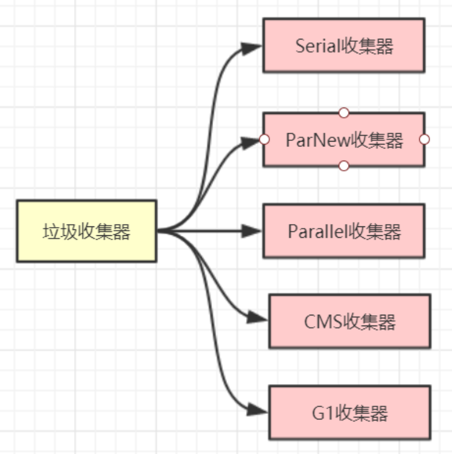  

#### 1. Serial收集器（-XX:+UseSerialGC -XX:UseSerialOldGC）
Serial叫作串行收集器，它是一个单线程收集器，收集的时候需要STW，停止用户程序运行直到收集结束。因为没有线程交互的开销，具有较高的单线程收集效率。它有一个老年代版本SerialOld，通常作为CMS老年代收集器的后备选择。新生代使用复制算法，老年代使用标记-整理算法。
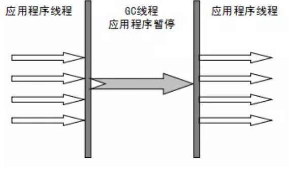 

#### 2.ParNew收集器（-XX:UseParNewGC）
ParNew收集器是Serail收集器的多线程版本，其余行为，回收策略等和Serial收集器完全一样，线程数默认为CPU的核数，新生代采用复制算法。除了Serial收集器外，只有它能与CMS收集器配合工作。
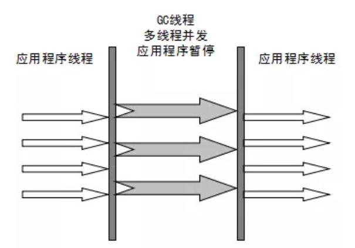  

#### 3.Parallel Scavenge收集器（-XX:UseParallGC(年轻代)，-XX:UseParallOldGC(老年代)）
Parallel收集器关注的是吞吐量（CPU中用户代码的运行时间/CPU的总运行时间），高效的利用CPU，CMS等收集器的关注点是更少用户线程停顿时间，提高体验，在关注系统吞吐量以及CPU资源的场合可以优先考虑此收集器。新生代采用复制算法，老年代采用标记-整理算法。
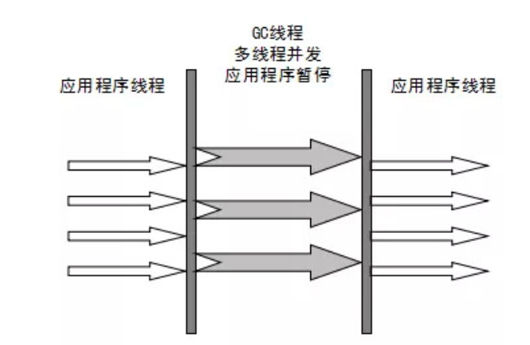

#### 4.CMS收集器（-XX:UseConcMarkSweepGC(年轻代默认使用Serial，老念代使用CMS)）
CMS收集器关注的是更少的用户线程停顿时间，注重用户的体验，基本上实现了垃圾收集线程和用户线程同时工作。CMS使用的是标记-清除算法，分为以下四个步骤：
- 初始标记：停止用户线程，查找那些直接与```GC Roots```根相连的对象，速度较快。
- 并发标记：和用户线程并行执行，用一个闭包结果记录可达对象，因为用户线程一直在执行，所以这个闭包结构并不一定能保证包含所有的可达对象。
- 重新标记：为了修正并发标记过程中因用户程序继续运行而导致标记变动的记录，这个阶段消耗的时间一般比初始标记的长，但是远低于并发标记消耗的时间。
- 并发清除：开启用户线程，同时垃圾回收器对未标记的区域进行回收。
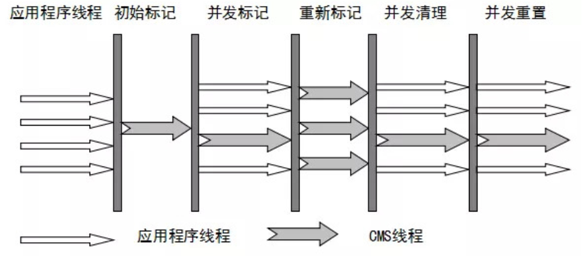 

CMS是一款优秀的垃圾收集器，主要特点是：```并发收集，低停顿```。但是它存在以下的缺点：
- 对CPU资源敏感，会和服务抢资源。
- 因为采用的是标记-清除算法，所以会产生大量的空间碎片，可以通过参数```-XX:UseCMSCompactAtFullCollection```来设置在执行完成清理后再做压缩。
- 会产生浮动垃圾，在并发清理阶段又会产生垃圾，这种浮动垃圾只能等待下一次GC再进行清除。
- 执行过程中的不确定性，会存在上次还没回收完，垃圾回收又被触发的情况，特别是在并发标记和并发清除阶段，边回收，系统边运行，也许还没回收完，又触发了Full GC，就会出现```Concurrent mode failure```,此时会出现STW，然后用SerialOld来进行垃圾回收。

#### CMS相关参数设置
1. ```-XX:+UseConcMarkSweepGC```：启用CMS，同时年轻代默认使用Serial垃圾收集器。
2. ```-XX:ConcGCThreads```：并发的GC线程数。
3. ```-XX:+UseCMSCompactAtFullCollection```：FullGC之后做压缩整理（减少碎片）。
4. ```-XX:CMSFullGCsBeforeCompaction```：多少次FullGC之后压缩一次，默认是0，代表每次FullGC后都会压缩一次。
5. ```-XX:CMSInitiatingOccupancyFraction```: 当老年代使用达到该比例时会触发FullGC（默认是92，这是百分比）。
6. ```-XX:+UseCMSInitiatingOccupancyOnly```：只使用设定的回收阈值(```-XX:CMSInitiatingOccupancyFraction```设定的值)，如果不指定，JVM仅在第一次使用设定值，后续则会自动调整。
7. ```-XX:+CMSScavengeBeforeRemark```：在CMS GC前启动一次minor gc，目的在于减少老年代对年轻代的引用，降低CMS GC的标记阶段时的开销，一般CMS的GC耗时 80%都在标记阶段。


### G1垃圾收集器（-XX:UseG1GC）
#### G1垃圾回收器的Region与分代
G1(Garbage-First)是一款面向服务器的垃圾收集器，主要针对多处理器以及大内存的机器，在满足GC停顿时间的同时，还具备高吞吐量的特征。
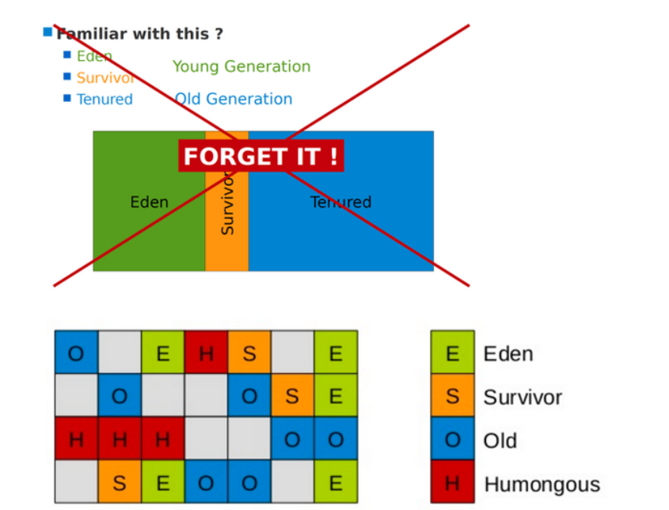 
1、G1垃圾收集器将Java内存区域分为大小相等的独立区域（Region）,但是最多可以为2048个Region。每个Region的大小为堆内存的总大小/Region的个数来计算，也可以使用参数```-XX:G1HeapRegionSize```来手动指定Region的大小，每个Region可能之前是年轻代，垃圾回收之后可能变成老年代，也就是说是动态变化的。

2、G1保留了年轻代和老年代的概念，年轻代和老年代不再是物理隔阂的，可以使不连续的Region的集合。年轻代默认的初始化大小为5%，可以通过参数```-XX:G1NewSizePercent```来调整，最大不能超过年轻代的60%，可以通过参数```-XX:G1MaxNewSizePercent```来调整。年轻代的Eden和Survivor区的比例仍然默认是8:1:1。

3、G1垃圾收集器对于由年轻代进入老年代的原则是一样的，只是对于大对象，G1增加了大对象的Region```Humongous```区，不再让大对象进入老年代，这样可以节约老年代的内存空间，避免进行Full GC。在G1只要一个对象的大小超过了一个Region的50%，就认为是大对象，就会被放入```Humongous```区，如果对象很大可能需要跨多个Region。

4、在进行Full GC的时候会回收年轻代、老年代和```Humongous```区。

#### G1回收器的回收过程
G1垃圾收集器不管是年轻代还是老年代都是使用的复制算法，但是从整体上来看使用的是标记-整理算法。
- 初始标记：和CMS的过程一样，停止用户线程，记录```GC Roots```的引用对象，速度很快。
- 并发标记：过程和CMS的并发标记一致。
- 最终标记：同CMS的重新标记。
- 筛选回收：首先对各个Region的回收价值和成本进行排序，根据用户所期望的停顿时间（参数```-XX:MaxGCPauseMillis```调整）来制定回收计划。假如老年代有1000个Region都满了，但是根据用户指定的停顿时间200ms，只能回收其中的800个，则就回收其中的800个，尽量把回收时间控制在用户指定的时间范围内。使用复制算法几乎不会产生太多的内存锁片。
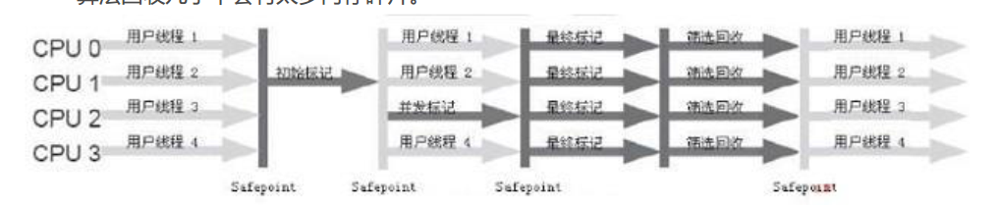 

G1收集器维护了一个优先级列表，根据用户指定的停顿时间，首先选择回收价值最大的Region，这也是Garbage-First的由来，比如一个Region需要花费20ms回收10M的垃圾，另一个Region需要花费50ms回收10M的垃圾，G1会优先选择前面这个Region进行回收，保证在有限的时间范围内尽可能提高收集效率。

#### G1收集器的特点
- 并发与并行：可以在多核环境下，充分利用CPU缩短STW的时间，可以和用户程序并行执行。
- 分代收集：保留了分代的概念，无需其他收集器的配合，可以独自完成整个堆的垃圾收集。
- 空间整合：不再物理隔离不同代，整体采用标记-整理算法，局部采用复制算法。
- 可预测的停顿时间：追求低停顿，建立可以预测的停顿时间模型，可以在指定的时间内完成垃圾收集。


#### G1收集器的参数设置
- -XX:+UseG1GC:使用G1收集器
- -XX:ParallelGCThreads:指定GC工作的线程数量
- XX:G1HeapRegionSize:指定分区大小(1MB~32MB，且必须是2的幂)，默认将整堆划分为2048个分区
- -XX:MaxGCPauseMillis:目标暂停时间(默认200ms)
- -XX:G1NewSizePercent:新生代内存初始空间(默认整堆5%)
- -XX:G1MaxNewSizePercent:新生代内存最大空间
- -XX:TargetSurvivorRatio:Survivor区的填充容量(默认50%)，Survivor区域里的一批对象(年龄1+年龄2+年龄n的多个年龄对象)总和超过了Survivor区域的50%，此时就会把年龄n(含)以上的对象都放入老年代
- -XX:MaxTenuringThreshold:最大年龄阈值(默认15)
- -XX:InitiatingHeapOccupancyPercent:老年代占用空间达到整堆内存阈值(默认45%)，则执行新生代和老年代的混合收集(MixedGC)，比如堆默认有2048个region，如果有接近1000个region都是老年代的region，则可能就要触发MixedGC了
- -XX:G1HeapWastePercent(默认5%): gc过程中空出来的region是否充足阈值，在混合回收的时候，对Region回收都是基于复制算法进行的，都是把要回收的Region里的存活对象放入其他Region，然后这个Region中的垃圾对象全部清理掉，这样的话在回收过程就会不断空出来新的Region，一旦空闲出来的Region数量达到了堆内存的5%，此时就会立即停止混合回收，意味着本次混合回收就结束了。
- -XX:G1MixedGCLiveThresholdPercent(默认85%) region中的存活对象低于这个值时才会回收该region，如果超过这个值，存活对象过多，回收的的意义不大。
- -XX:G1MixedGCCountTarget:在一次回收过程中指定做几次筛选回收(默认8次)，在一个筛选回收阶段可以回收一会，然后暂停回收，恢复系统运行，一会再开始回收，这样可以让系统不至于单次停顿时间过长。

#### G1垃圾收集器分类
1、Young GC：并不是年轻代放满才进行回收，而是根据回收时间是否接近用户指定的停顿时间，如果远小于则不断的增加年轻代的Region数量，当回收时间接近参数```-XX:MaxGCPauseMills``` 设定的值，那么就会触发Young GC。

2、MixedGC：不是FullGC，老年代的堆占有率达到参(-XX:InitiatingHeapOccupancyPercen)设定的值则触发，回收所有的Young和部分Old(根据期望的GC停顿时间确定old区垃圾收集的优先顺序)以及大对象区，正常情况G1的垃圾收集是先做MixedGC，主要使用复制算法，需要把各个region中存活的对象拷贝到别的region里去，拷贝过程中如果发现没有足够的空region能够承载拷贝对象就会触发一次Full GC。

3、Full GC：停止系统程序，然后采用单线程进行标记、清理和压缩整理，好空闲出来一批Region来供下一次MixedGC使用，这个过程是非常耗时的。

### 如何选择垃圾收集器
1. 优先调整堆的大小让服务器自己来选择
2. 如果内存小于100M，使用串行收集器
3. 如果是单核，并且没有停顿时间的要求，串行或JVM自己选择
4. 如果允许停顿时间超过1秒，选择并行或者JVM自己选
5. 如果响应时间最重要，并且不能超过1秒，使用并发收集器

下图有连线的可以搭配使用，官方推荐使用G1，因为性能高
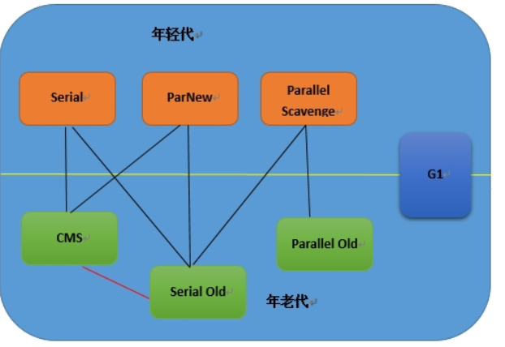 

### JVM调优工具
#### JPS
通过```jps```命令可以查询正在运行的线程。

#### Jinfo
可以查看正在运行的java应用程序的扩展参数
- 查看jvm参数 ```jinfo -flags 进程id```
  
  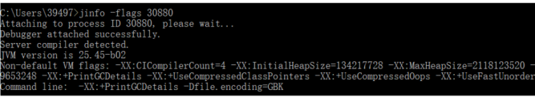  

- 查看java系统参数 ```jinfo -sysprops 进程id```
  
  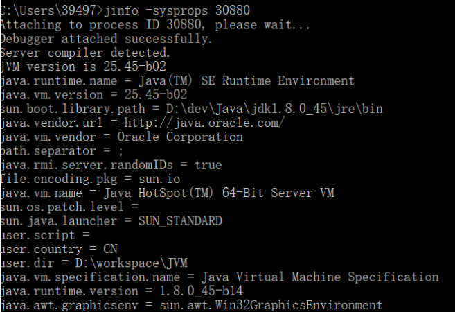 

#### Jstat
垃圾回收统计

```jstat -gc pid```

```jstat -gcutil pid```
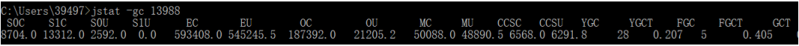  
  - S0C：第一个幸存区的大小
  - S1C：第二个幸存区的大小
  - S0U：第一个幸存区的使用大小
  - S1U：第二个幸存区的使用大小
  - EC：伊甸园区的大小
  - EU：伊甸园区的使用大小
  - OC：老年代大小
  - OU：老年代使用大小
  - MC：方法区大小(元空间)
  - MU：方法区使用大小
  - CCSC:压缩类空间大小
  - CCSU:压缩类空间使用大小
  - YGC：年轻代垃圾回收次数
  - YGCT：年轻代垃圾回收消耗时间，单位s
  - FGC：老年代垃圾回收次数
  - FGCT：老年代垃圾回收消耗时间，单位s
  - GCT：垃圾回收消耗总时间，单位s

堆内存统计
```
jsata -gccapacity pid
```

新生代垃圾回收统计
```
jstat -gcnew pid
```
新生代内存统计
```
jstat -gcnewcapacity pid
```

老年代垃圾回收统计
```
jstat -gcold pid
```

老年代内存统计
```
jstat -gcoldcapacity pid
```

元空间内存统计
```
jstat -gcmetacapacity pid
```
### 内存泄露是什么
一般的电商架构可能存在多级缓存架构，基本上是redis机上JVM级别的缓存（本地缓存），大多数人为了图方便对于JVM级别的缓存就简单使用一个HashMap，不断的往里面放缓存数据，很少考虑HashMap的容量，导致HashMap越来越大，可能频繁触发full gc，这就是一种内存泄露，还有可能导致OOM，因此在使用本地缓存的时候，一般基于成熟的框架，如Guava、ehcache等自带LRU数据淘汰算法。


### Class 常量池
Class常量池可以理解为Class文件中的资源仓库。Class文件中除了包含类的版本、方法、接口等描述信息外，还有一项信息就是常量池，常量池用于存放编译器生成的各种字面量和符号引用。常量池中主要放两大类常量：字面量和符号引用。

#### 字面量
字面量就是由字母、数字等构成的字符串或者数值常量。字面量只能是右值出现，如：int a = 1，这里的a为左值，1为右值。这个1就是一个字面量。

#### 符号引用
符号引用是编译原理中的概念，是相对于直接引用来说的，主要包含以下三类常量：
- 类和接口的全限定名
- 方法的名称和描述符
- 字段的名称的描述符

如 int a = 1，其中a就是字段的名称，就是一个符号引用，这些现在都是静态信息，只有运行时被加载到内存中，这些符号引用才能变成直接引用，也就是动态链接，常量池也变成了运行时常量池。

JDK1.6之前有永久代，常量池在永久代中，JDK1.7，有永久代，但是已经去永久代化，常量池在堆里面，JDK1.8及之后，没有永久代，常量池在元空间。

### 字符串常量池
设计思想就是在创建String时，和创建其他类型的对象一样，都需要耗费时间和空间，频繁的进行创建会影响性能，为此，在内存中开辟了一块叫字符串常量池的地方去，类似缓冲区，在创建字符串的时候，现在字符串常量池中查看是否存在，存在返回引用实例，不存在则创建，创建之后放入到字符串常量池中。
```
1 String str1 = "abc";
2 String str2 = "abc";
3 String str3 = "abc";
4 String str4 = new String("abc");
5 String str5 = new String("abc");
6 String str5 = new String("abc");
```
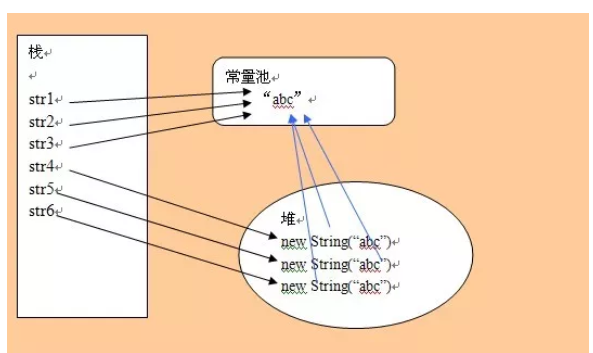  

String str4 = new String(“abc”) 创建多少个对象？
1. 在常量池中查找是否有“abc”对象有则返回对应的引用实例没有则在常量池中创建对应的实例对象
2. 在堆中 new 一个 String("abc") 对象
3. 将对象地址赋值给str4，创建一个引用所以，常量池中没有“abc”字面量则创建两个对象，否则创建一个对象，以及创建一个引用

String str1 = new String("A"+"B") ; 会创建多少个对象?

- 字符串常量池："A","B","AB" : 3个
- 堆：new String("AB") ：1个
- 引用： str1 ：1个

总共 ： 5个

String str2 = new String("ABC") + "ABC" ; 会创建多少个对象?
- 字符串常量池："ABC" : 1个
- 堆：new String("ABC") ：1个
- 引用： str2 ：1个

总共 ： 3个


#### Strig.intern()

通过new操作符创建的字符串对象不指向字符串常量池中的任何对象，但是可以通过使用字符串的intern()方法来指向其中的某一个。java.lang.String.intern()返回一个常量池里面的字符串，就是一个在字符串常量池中有了一个入口。如果以前没有在字符串常量池中，那么它就会被添加到里面。
```
1 String s1 = "Hello";
2 String s2 = new String("Hello");
3 String s3 = s2.intern();
4 5
System.out.println("s1 == s2? " + (s1 == s2)); // false
6 System.out.println("s1 == s3? " + (s1 == s3)); // true
```

#### 八种基本类型的包装类和对象池
java中基本类型的包装类的大部分都实现了常量池技术，这些类是Byte,Short,Integer,Long,Character,Boolean,另外两种浮点数类型的包装类则没有实现。另外Byte,Short,Integer,Long,Character这5种整型的包装类也只是在对应值小于等 于127时才可使用对象池，也即对象不负责创建和管理大于127的这些类的对象。


### 安全区域和安全点

#### 安全点
安全点是指代码中一些特定的位置，当jvm运行到这写位置时它的状态是确定的，这样M可以安全的就行一系列的操作，比如GC，所以垃圾回收并不是什么时候做都可以的，只有运行到安全点才能触发。安全点有以下几种：
- 方法返回之前
- 代用某个方法之后
- 抛出异常的位置
- 循环的末尾

#### 安全区域
安全点是对于正在运行的线程而言的，如果一个线程是sleep状态，它不能影响gc，也不能运行到安全点，因此jvm中引入了安全区域，安全区域是指在一块代码中，引用关系不会发生变化，区域内的任意点发生gc都可以，sleep线程进入安全区域之后，进行标记，被唤醒后首先要看下gc是否完成，如果完成了可以离开，否则必须等到收到安全离开的信号为止。


