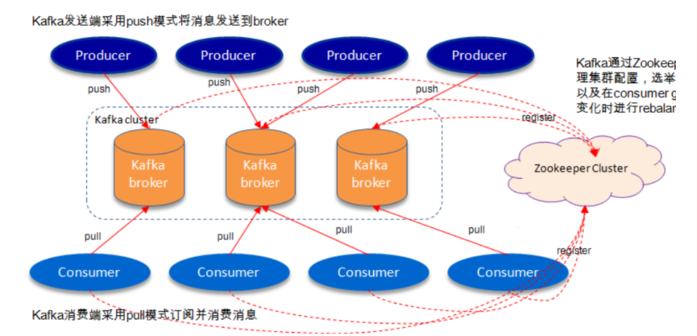
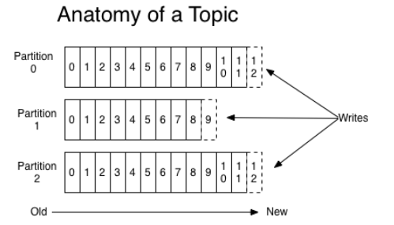
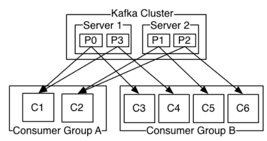
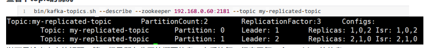
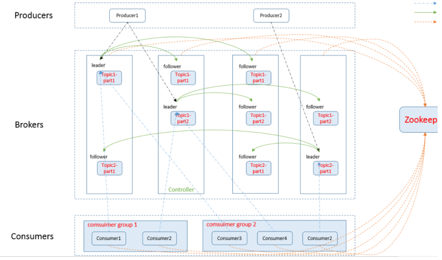
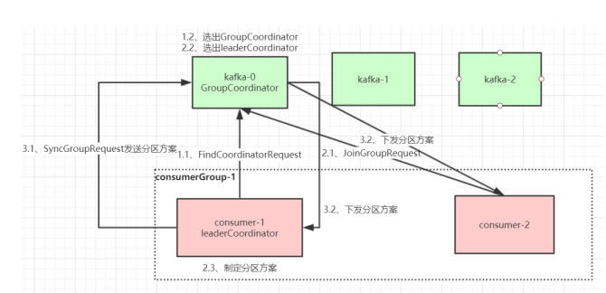
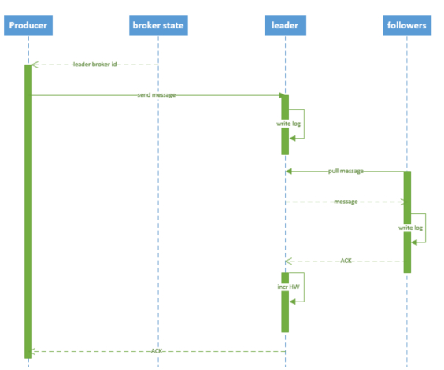
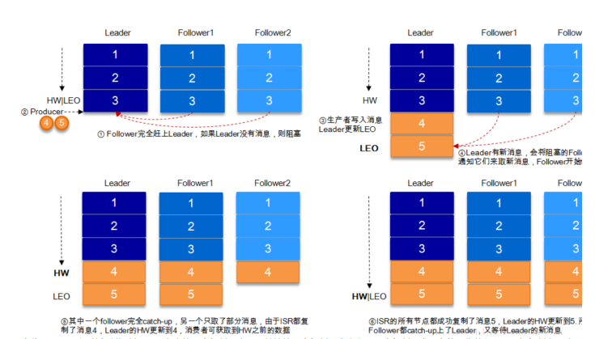
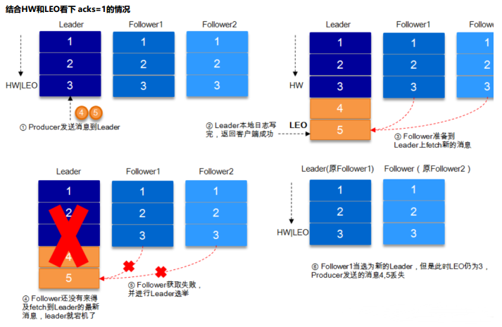
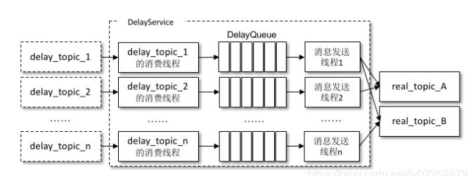

- [Kafka](#kafka)
- [Kafka的基本概念](#kafka的基本概念)
- [Kafka主题和消息日志](#kafka主题和消息日志)
- [Kafka集群](#kafka集群)
  - [Producer生产者](#producer生产者)
  - [Consumer消费者](#consumer消费者)
  - [消费顺序](#消费顺序)
  - [Topic信息说明](#topic信息说明)
- [Java客户端重要参数设置](#java客户端重要参数设置)
  - [消息发送端](#消息发送端)
  - [消息消费端](#消息消费端)
- [Kafka的拓扑结构](#kafka的拓扑结构)
- [Kafka核心总控制器Controller](#kafka核心总控制器controller)
- [Kafka总控制器的选举机制](#kafka总控制器的选举机制)
- [分区副本选举leader机制](#分区副本选举leader机制)
- [消费组消费消息offset记录机制](#消费组消费消息offset记录机制)
- [消费者Rebalance机制](#消费者rebalance机制)
  - [Rebalance过程](#rebalance过程)
  - [Relabance策略](#relabance策略)
- [Producer发送消息](#producer发送消息)
  - [写入方式](#写入方式)
  - [消息路由](#消息路由)
  - [写入commit log流程](#写入commit-log流程)
  - [HW和LEO](#hw和leo)
- [日志分段存储](#日志分段存储)
- [问题优化](#问题优化)
  - [消息丢失](#消息丢失)
  - [重复消费](#重复消费)
  - [延时队列](#延时队列)
  - [消息积压](#消息积压)
  - [消息乱序](#消息乱序)
  - [消息回溯](#消息回溯)
  - [分区数量越多吞吐量越高](#分区数量越多吞吐量越高)

### Kafka
Kafka是基于Scala语言编写的，分布式的，支持分区的，和多福本的，基于zookeeper协调的分布式消息系统。它最大的特性就是可以实时处理大量数据已满足各种需求场景，比如日志收集、消息系统、低延迟实时系统，web/nginx日志等场景。

### Kafka的基本概念
Kafka是一个分布式的，分区消息服务，kafak借鉴了JMS的规范思想，但并没有完全遵循这个思想。
- Broker：消息的处理节点，一个kafka实例就是一个broker，多个broker节点可以组成kafka集群，可以把broker理解为一个kafka服务。broker基于tcp协议和producer和consumer进行通信。
- topic：kafak根据主题对消息进行分类，生产者发布消息到kafka需要指定主题。
- partition：分区，一个主题可以有多个分区，一个分区可以有多个副本，同时一个分区里面的消息是 有序的，但是一个主题里面的消息整体看是无序的。
- producer：消息生产者，通过指定主题向broker发送消息。
- consumer：消息消费者，从broker读取消息。
- consumerGroup：每个消费者都有一个组，一个组中只能有一个消费者消费同一主题下的一个分区，也就是一条消息只能被同组的一个消费者消费，可以被不同的消费者组消费。

 


### Kafka主题和消息日志
kafak依据主题对消息进行归类，同一类消息发送到相同主题上，一个主题可以有多个分区，每个分区都维护着自己的日志文件```commit log```，同一分区里面的消息是有序的，按顺序添加，每个分区中的消息都有一个唯一编号，称之为offset，用来唯一标识分区中的消息，同一分区中的offset是唯一的，不同分区中的offset可能会相同。
  

假如一个订单消息，量很大，达到几百G甚至上T，如果不分区，全部消息都放到一个主题上，都放到一台机器上肯定会有一定的容量现限制，因此可以对主题划分分区，不同分区可以放在不同的机器上，每一个机器都对应一个broker进程。理论上分区之后，一个消费者可以存储任意数量的数据；而且提高了并行度。

kafka的性能不受消息日志保留时长的限制，每个消费者基于commit log中的消费进度offset进行消费，每个消费者维护自己的消费offset，消费者可以指定offset来重复消息消息。

### Kafka集群
每个分区都有一个leader，在某一个broker上，有0或多个broker作为followers，leader分区处理所有对分区的读写，而followers则只需被动复制leader的结果，如果leader宕机，就选择其中的一个follwer作为leader。

#### Producer生产者
每个生产者通过push来推送消息，把消息推送到指定的分区，可以通过round-robin轮询的方式做简单负载均衡，可以根据某一个关键字来进行区分。、

#### Consumer消费者
通常有两种传递消息的方式，队列（queue）和发布订阅模式（publish-subscribe）
- 队列：多个消费者从broker中读取消息，每个消息只能被一个消费者消费。
- 发布订阅模式：消息会被广播到所有消费者。

Kafka基于这两种模式，提出了一个抽象的概念：消费者组（consumer group）,同一消费者组中的消费者消费指定分区的消息，当消费者小于分区数时，一个消费者需要消费多个分区的数据，当消费者数大于分区数时，多余的消费者处于空闲状态，一个消息只能在相同消费者组的某一个消费者消费。不同的消费者组可以消费相同的消息。不同的消费者组都是逻辑上的订阅者，消费者组中的消费者相当于消费队里中的消息。
  

#### 消费顺序
kafka比传统的消息系统有着更强的顺序保证，一个分区中的消息在同一时刻在一个消费者组中只能被一个消费者消费。Kafka只能保证在分区范围内的消息的顺序性，不能保证消息的整体消费顺序。如果需要保证整体的消费顺序的话可以一个主题只创建一个分区。

Kafka保证发送到topic中的message会按照发送的顺序添加到commit log中，同一个生产者发送消息1和消息2，,早于消息2，那么在commit log中1的offset必定小于2的offset。

Kafka保证如果一个主题的备份因子为N，kafka保证如果N-1个备份宕机，而存储在commit log中的消息不会丢失。

#### Topic信息说明
  
第一行是所有分区的概要信息，之后的每一行表示每一个分区的信息。
- leader：复制给的分区的所有读写请求。
- replicas：备份副本，列出所有的备份副本，包含leader以及挂掉的节点也会列出。
- isr：表示存活且一同的节点，它是replicas的一个子集。


### Java客户端重要参数设置

#### 消息发送端
```java
public class MsgProducer {
    public static void main(String[] args) throws InterruptedException, ExecutionException {
        Properties props = new Properties();
        props.put(ProducerConfig.BOOTSTRAP_SERVERS_CONFIG, "192.168.0.60:9092,192.168.0.60:9093,192.168.0.60:9094");
        /*
        发出消息持久化机制参数
        （1）acks=0： 表示producer不需要等待任何broker确认收到消息的回复，就可以继续发送下一条消息。性能最高，但是最容易丢消息。
        （2）acks=1： 至少要等待leader已经成功将数据写入本地log，但是不需要等待所有follower是否成功写入。就可以继续发送下一条消息。
        这种情况下，如果follower没有成功备份数据，而此时leader
        又挂掉，则消息会丢失。
        （3）acks=‐1或all： 这意味着leader需要等待所有备份(min.insync.replicas配置的备份个数)都成功写入日志，这种策略会保证只要有
        一个备份存活就不会丢失数据。
        这是最强的数据保证。一般除非是金融级别，或跟钱打交道的场景才会使用这种配置。
        */
        props.put(ProducerConfig.ACKS_CONFIG, "1");
        //发送失败会重试，默认重试间隔100ms，重试能保证消息发送的可靠性，但是也可能造成消息重复发送，比如网络抖动，所以需要在接收者那边做好消息接收的幂等性处理
        props.put(ProducerConfig.RETRIES_CONFIG, 3);
        //重试间隔设置
        props.put(ProducerConfig.RETRY_BACKOFF_MS_CONFIG, 300);
        //设置发送消息的本地缓冲区，如果设置了该缓冲区，消息会先发送到本地缓冲区，可以提高消息发送性能，默认值是33554432，即32MB
        props.put(ProducerConfig.BUFFER_MEMORY_CONFIG, 33554432);
        //kafka本地线程会从缓冲区取数据，批量发送到broker，
        //设置批量发送消息的大小，默认值是16384，即16kb，就是说一个batch满了16kb就发送出去22 props.put(ProducerConfig.BATCH_SIZE_CONFIG, 16384);
        //默认值是0，意思就是消息必须立即被发送，但这样会影响性能
        //一般设置100毫秒左右，就是说这个消息发送完后会进入本地的一个batch，如果100毫秒内，这个batch满了16kb就会随batch一起被发送出去 
        //如果100毫秒内，batch没满，那么也必须把消息发送出去，不能让消息的发送延迟时间太长
        props.put(ProducerConfig.LINGER_MS_CONFIG, 100);
        //把发送的key从字符串序列化为字节数组
        props.put(ProducerConfig.KEY_SERIALIZER_CLASS_CONFIG, StringSerializer.class.getName());
        //把发送消息value从字符串序列化为字节数组
        props.put(ProducerConfig.VALUE_SERIALIZER_CLASS_CONFIG, StringSerializer.class.getName());

        Producer<String, String> producer = new KafkaProducer<>(props);

        int msgNum = 5;
        CountDownLatch countDownLatch = new CountDownLatch(msgNum);
        for (int i = 1; i <= msgNum; i++) {
            Order order = new Order(i, 100 + i, 1, 1000.00);
            //指定发送分区
            ProducerRecord<String, String> producerRecord = new ProducerRecord<String, String>("order‐topic"
                    , 0, order.getOrderId().toString(), JSON.toJSONString(order));
            //未指定发送分区，具体发送的分区计算公式：hash(key)%partitionNum
            /*ProducerRecord<String, String> producerRecord = new ProducerRecord<String, String>("my‐replicated‐topic"
            , order.getOrderId().toString(), JSON.toJSONString(order));*/

            //等待消息发送成功的同步阻塞方法
            /*RecordMetadata metadata = producer.send(producerRecord).get();
            System.out.println("同步方式发送消息结果：" + "topic‐" + metadata.topic() + "|partition‐"
            + metadata.partition() + "|offset‐" + metadata.offset());*/

            //异步方式发送消息
            producer.send(producerRecord, new Callback() {
                @Override
                public void onCompletion(RecordMetadata metadata, Exception exception) {
                    if (exception != null) {
                        System.err.println("发送消息失败：" + exception.getStackTrace());

                    }
                    if (metadata != null) {
                        System.out.println("异步方式发送消息结果：" + "topic‐" + metadata.topic() + "|partition‐"
                                + metadata.partition() + "|offset‐" + metadata.offset());
                    }
                    countDownLatch.countDown();
                }
            });

            //送积分 TODO

        }

        countDownLatch.await(5, TimeUnit.SECONDS);
        producer.close();
    }
}
```

#### 消息消费端
```java
public class MsgConsumer {
    public static void main(String[] args) {
        Properties props = new Properties();
        props.put(ConsumerConfig.BOOTSTRAP_SERVERS_CONFIG, "192.168.0.60:9092");
        // 消费分组名
        props.put(ConsumerConfig.GROUP_ID_CONFIG, "testGroup");
        // 是否自动提交offset8 /*props.put(ConsumerConfig.ENABLE_AUTO_COMMIT_CONFIG, "true");
        // 自动提交offset的间隔时间
        props.put(ConsumerConfig.AUTO_COMMIT_INTERVAL_MS_CONFIG, "1000");*/
        props.put(ConsumerConfig.ENABLE_AUTO_COMMIT_CONFIG, "false");
        /*
        心跳时间，服务端broker通过心跳确认consumer是否故障，如果发现故障，就会通过心跳下发
        rebalance的指令给其他的consumer通知他们进行rebalance操作，这个时间可以稍微短一点
        */
        props.put(ConsumerConfig.HEARTBEAT_INTERVAL_MS_CONFIG, 1000);
        //服务端broker多久感知不到一个consumer心跳就认为他故障了，默认是10秒
        props.put(ConsumerConfig.SESSION_TIMEOUT_MS_CONFIG, 10 * 1000);
        /*
        如果两次poll操作间隔超过了这个时间，broker就会认为这个consumer处理能力太弱，
        会将其踢出消费组，将分区分配给别的consumer消费
        */
        props.put(ConsumerConfig.MAX_POLL_INTERVAL_MS_CONFIG, 30 * 1000);
        props.put(ConsumerConfig.KEY_DESERIALIZER_CLASS_CONFIG, StringDeserializer.class.getName());
        props.put(ConsumerConfig.VALUE_DESERIALIZER_CLASS_CONFIG, StringDeserializer.class.getName());
        KafkaConsumer<String, String> consumer = new KafkaConsumer<>(props);
        // 消费主题
        String topicName = "order‐topic";
        //consumer.subscribe(Arrays.asList(topicName));
        // 消费指定分区
        //consumer.assign(Arrays.asList(new TopicPartition(topicName, 0)));

        //消息回溯消费
        consumer.assign(Arrays.asList(new TopicPartition(topicName, 0)));
        consumer.seekToBeginning(Arrays.asList(new TopicPartition(topicName, 0)));
        //指定offset消费
        //consumer.seek(new TopicPartition(topicName, 0), 10);

        while (true) {
            /*
             * poll() API 是拉取消息的长轮询，主要是判断consumer是否还活着，只要我们持续调用poll()，
             * 消费者就会存活在自己所在的group中，并且持续的消费指定partition的消息。
             * 底层是这么做的：消费者向server持续发送心跳，如果一个时间段（session.
             * timeout.ms）consumer挂掉或是不能发送心跳，这个消费者会被认为是挂掉了，
             * 这个Partition也会被重新分配给其他consumer
             */
            ConsumerRecords<String, String> records = consumer.poll(Integer.MAX_VALUE);
            for (ConsumerRecord<String, String> record : records) {
                System.out.printf("收到消息：offset = %d, key = %s, value = %s%n", record.offset(), record.key(),
                        record.value());
            }

            if (records.count() > 0) {
                // 提交offset
                consumer.commitSync();
            }
        }
    }
}


```

### Kafka的拓扑结构
 

### Kafka核心总控制器Controller
Kafka集群中有一个或者多个Broker，其中一个会被选为leader，它负责管理整个集群中的分区和副本。
- 当某个分区的leader副本挂掉后，由总控制器选择一个副本为新的leader.
- 当检测到某个分区的ISR集合发生变化时，由总控制器通知其他broker更新元数据。
- 当给某一个主题增加分区的时候，由总控制器复制分区的重新分配。

### Kafka总控制器的选举机制
当集群启动的时候，会选举一个broker作为集群的leader，启动时每个broker都会往zookeeper上创建一个临时节点```/controller```，zookeeper保证有且仅有一个broker可以创建成功，哪一个broker创建成功，则他就是kafka集群的总控制器。

不是总控制器的broker会监听这个节点的变化，当总控制器的broker发生宕机的时候，zookeeper上的这个节点会自动删除，这是其他节点又会重新开始竞争创建```/controller```临时节点，谁先创建成功谁就是新的总控制器。

总控制器比普通的broker多一些功能：
- 监听broker的变化
- 监听topic的变化
- 监听topic对于的分区的变化
- 更新集群的元数据信息

### 分区副本选举leader机制
当总控制器感知到某个分区的leader节点所处的broker节点挂掉后，会选举新的分区leader，会从分区的replicas副本中进行选择，谁在第一个且同时存在ISR集合中则被选择为新的分区leader。

### 消费组消费消息offset记录机制
kafka中的每个消费者记录自己的消费进度，会定期更新消费分区的offset到kafka内部维护的主题：```_consumer_offsets```，key为：```consumerGroupId+topic+分区号```，value为对于的```offset```；kafka对定期清理此主题里面的消息，只保留最新的数据。同时为了提高并发性能，此主题默认有50个分区，可以通过参数```offset.topic.num.partitions```设置，这样可以通过增加机器来增加并发。

### 消费者Rebalance机制
消费者rebalacne机制就是消费者组中某一个消费者挂掉，此后此消费者对于的消费分区要分配给其他消费者，如果又重启了则又把对于的分区还给它，以下情况会导致消费者rebalance：
- 消费分区的消费者宕机或重启
- 给主题增加更多的分区
- 消费组订阅了新的主题

#### Rebalance过程
  


1. 选择主协调器

    每个消费者组都会选择一个broker作为协调器（GroupCoordinator）， 负责监控这个消费组中每个消费者的心跳，以及是否出现宕机，然后启动rebalance机制。每个消费者加入消费者组的时候都会向集群中勋章组协调器，并与其建立网络连接。主协调器的选择过程如下。

    每个消费者组中的每个消费者都需要把消费的消费发送到kafka集群中的内部主题的分区上，选则分区的公式是：```hash(ConsumerGroupId%_consumer_offsets主题的分区数)``` 这个分区对于的leader所在的broker即为此消费组的组协调器。

2. 加入消费组

    消费者在找到对于的组协调器之后，就向组协调器发送加入消费组的请求，组协调器会从消费组中选择一个leader协调器，把第一个加入消费组的消费者作为leader协调器，由leader协调器制定分区方案。

3. SYNC_GROUP同步分区方案

    leader协调器制定为分区方案后会向组协调器发送请求同步分区方案，然后组协调器会把同步的分区方案分发到每个消费者，它们会根据指定的分区broker进行连接并消费消息。

#### Relabance策略
假如有10个分区，3个消费者。主要有三种relabance策略：
- rang：默认策略，，则（0~3）给消费者1，（4~6）给2，（7~9）给3。
- round-robin轮询：（0，3，6 ，9）给1，（1，4，7）给2，(2，5，8)给3。
- sticky：有两个原则，尽量使其分配均匀，尽量不改变上次的分区方案。当两者方式冲突的时候，第一原则优先。比如第一种rang的情况，如果消费者3挂掉了，则使用sticky策略分配如下，（0~3,7）分配给1，（4~6,8,9）分配给2，使其尽可能的均匀。


### Producer发送消息
#### 写入方式
producer采用push模式将消息发送到broker，每条消息都被追加到分区中，属于顺序写磁盘，顺序写磁盘的效率比随机写内存的要高，从而保证了kafka的吞吐率。

#### 消息路由
- 指定分区：如果指定分区就发送到相应的分区。
- 未指定分区，但是指定了key，通过key进行hash选出一个分区。
- 未指定分区也未指定key，使用轮询选出一个分区。

#### 写入commit log流程
- 先找到对于的分区的leader节点，从zookeeper的```/brokers/.../state```可以找到对于的分区。
- 消息生产者将消息发送给生产者。
- 生产者写入本地log
- 分区备份节点从leader节点pull拉取数据，同样的写入本地log，写入成功后向leader节点发送ack。
- leader收到副本的ack消息后，增加高水位HW(high watermark)，最后commit offset，并向生产者发送ACK。

  

#### HW和LEO
HW即为高水位，是HighWatermark的缩写，取的是分区副本ISR中对应的最小的LEO(log-end-offset)作为HW，消费者最多只能消费到高水位的位置，对于写入leader的消息，消费者并不能立即消费，leader等待所有副本同步后更新高水位此时生产的消息才能被消费。这样保证了leader宕机后，改消息仍然可以从新选择的leader消息中获取。对于broker内部的读取请求，没有高水位限制。
  

Kafka的数据复制方式既不是同步也不是异步，同步影响kafka的吞吐量，异步方式容易造成数据丢失，结合生产者acks=1的情况来看。
  


### 日志分段存储
kafka一个分区的消息书对于存储在一个文件夹下，以topic+分区号命名，限定最大的。log文件不能超过1G，以便把log文件加载到内存。
```
1 # 部分消息的offset索引文件，kafka每次往分区发4K(可配置)消息就会记录一条当前消息的offset到index文件，
2 # 如果要定位消息的offset会先在这个文件里快速定位，再去log文件里找具体消息
3 00000000000000000000.index
4 # 消息存储文件，主要存offset和消息体
5 00000000000000000000.log
6 # 消息的发送时间索引文件，kafka每次往分区发4K(可配置)消息就会记录一条当前消息的发送时间戳与对应的offset到timeindex文件，
7 # 如果需要按照时间来定位消息的offset，会先在这个文件里查找
8 00000000000000000000.timeindex
9 1
0 00000000000005367851.index
11 00000000000005367851.log
12 00000000000005367851.timeindex
13
14 00000000000009936472.index
15 00000000000009936472.log
16 00000000000009936472.timeindex
```
这个 9936472 之类的数字，就是代表了这个日志段文件里包含的起始 Offset，也就说明这个分区里至少都写入了接近1000 万条数据了。Kafka Broker 有一个参数，log.segment.bytes，限定了每个日志段文件的大小，最大就是 1GB。一个日志段文件满了，就自动开一个新的日志段文件来写入，避免单个文件过大，影响文件的读写性能，这个过程叫做log rolling，正在被写入的那个日志段文件，叫做 active log segment。

### 问题优化
#### 消息丢失
1. 生产者
   
   - acks=0： 表示producer不需要等待任何broker确认收到消息的回复，就可以继续发送下一条消息。性能最高，但是最容易丢消息。大数据统计报表场景，对性能要求很高，对数据丢失不敏感的情况可以用这种。
   - acks=1： 至少要等待leader已经成功将数据写入本地log，但是不需要等待所有follower是否成功写入。就可以继续发送下一条消息。这种情况下，如果follower没有成功备份数据，而此时leader又挂掉，则消息会丢失。
   - acks=-1或all： 这意味着leader需要等待所有备份(min.insync.replicas配置的备份个数)都成功写入日志，这种策略会保证只要有一个备份存活就不会丢失数据。这是最强的数据保证。一般除非是金融级别，或跟钱打交道的场景才会使用这种配置。当然如果min.insync.replicas配置的是1则也可能丢消息，跟acks=1情况类似。

2. 消费者
   
    消费者设置offset自动提交，如果一个消息还没有消费完，就提交了，同时消费者宕机了，就会导致未处理完的消息丢失，下次也消费不到了。

#### 重复消费
1. 生产者：如果生产者设置了消息重试机制，在网络抖动的情况下，可能会出现消息重复发送。

2. 消费者：设置offset自动提交，刚拉取一部分数据进行处理，还没处理完，机器宕机，再起来的时候会重复拉取上次的数据。

因此消费端需要做幂等处理，防止重复消费。
#### 延时队列
发送延时消息时先把消息按照不同的延迟时间段发送到指定的队列中（topic_1s，topic_5s，topic_10s，...topic_2h，这个一般不能支持任意时间段的延时），然后通过定时器进行轮训消费这些topic，查看消息是否到期，如果到期就把这个消息发送到具体业务处理的topic中，队列中消息越靠前的到期时间越早，具体来说就是定时器在一次消费过程中，对消息的发送时间做判断，看下是否延迟到对应时间了，如果到了就转发，如果还没到这一次定时任务就可以提前结束了。

  

#### 消息积压
线上有时因为发送方发送消息速度过快，或者消费方处理消息过慢，可能会导致broker积压大量未消费消息。此种情况如果积压了上百万未消费消息需要紧急处理，可以修改消费端程序，让其将收到的消息快速转发到其他topic(可以设置很多分
区)，然后再启动多个消费者同时消费新主题的不同分区。

#### 消息乱序
如果发送端配置了重试机制，kafka不会等之前那条消息完全发送成功才去发送下一条消息，这样可能会出现，发送了1，2，3条消息，第一条超时了，后面两条发送成功，再重试发送第1条消息，这时消息在broker端的顺序就是2，3，1了所以，是否一定要配置重试要根据业务情况而定。也可以用同步发送的模式去发消息，当然acks不能设置为0，这样也能保证消息从发送端到消费端全链路有序。
#### 消息回溯
如果某段时间对已消费消息计算的结果觉得有问题，可能是由于程序bug导致的计算错误，当程序bug修复后，这时可能需要对之前已消费的消息重新消费，可以指定从多久之前的消息回溯消费，这种可以用consumer的offsetsForTimes、seek等方法指定从某个offset偏移的消息开始消费。

#### 分区数量越多吞吐量越高
分区数到达某个值吞吐量反而开始下降，实际上很多事情都会有一个临界值，当超过这个临界值之后，很多原本符合既定逻辑的走向又会变得不同。一般情况分区数跟集群机器数量相当就差不多了。 


