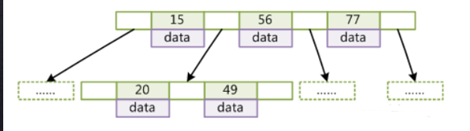
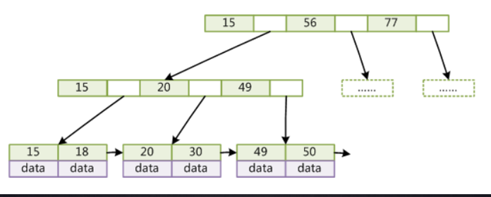
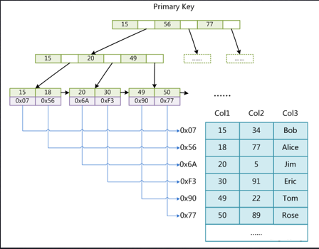
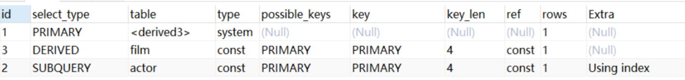
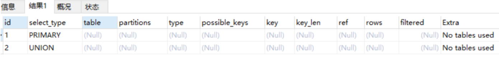
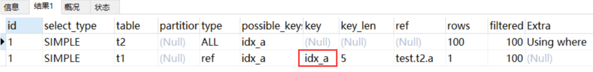
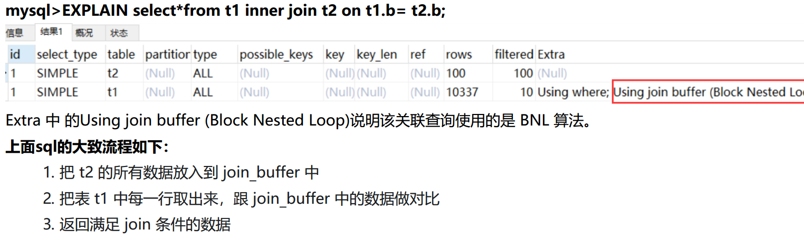
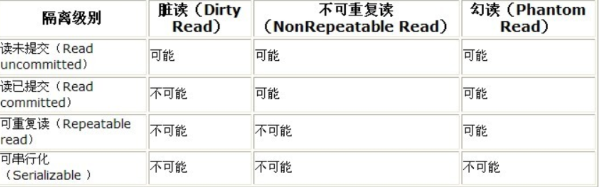
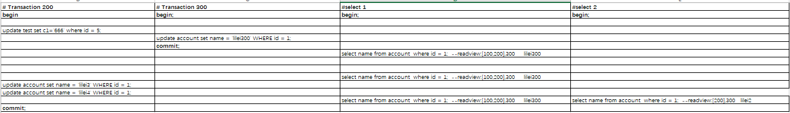
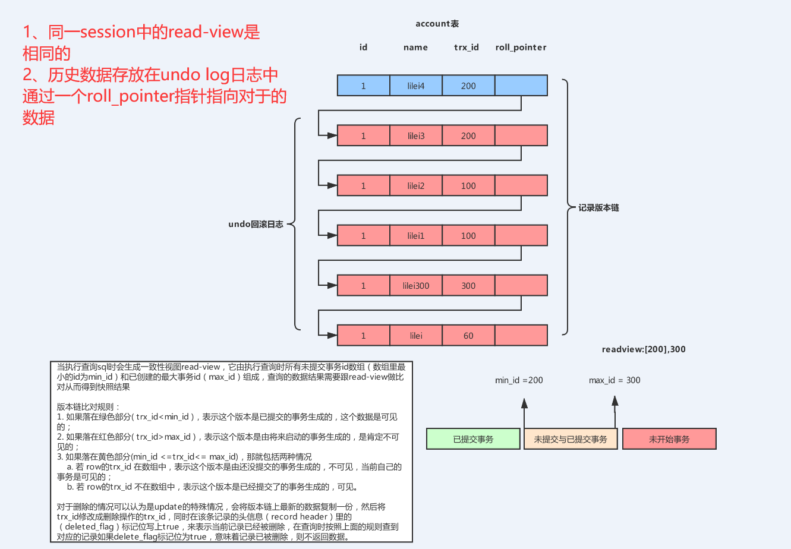

## Mysql
- [Mysql](#mysql)
  - [B-Tree](#b-tree)
  - [B+树](#b树)
  - [MyISAM存储引擎](#myisam存储引擎)
  - [InnoDB存储引擎](#innodb存储引擎)
  - [Explain工具](#explain工具)
  - [Explain中的列](#explain中的列)
    - [一、id列](#一id列)
    - [二、select_type列](#二select_type列)
    - [三、table列](#三table列)
    - [四、type列](#四type列)
    - [五、possible_keys列](#五possible_keys列)
    - [六、key列](#六key列)
    - [七、key_len列](#七key_len列)
    - [八、ref列](#八ref列)
    - [九、rows列](#九rows列)
    - [十、Extra列](#十extra列)
  - [索引失效](#索引失效)
  - [Trace工具](#trace工具)
  - [order by 排序](#order-by-排序)
  - [Limit优化](#limit优化)
  - [JOIN查询优化](#join查询优化)
    - [mysql的表关联常见有两种算法](#mysql的表关联常见有两种算法)
    - [被驱动表的关联字段没索引为什么要选择使用 BNL 算法而不使用 Nested-Loop Join 呢？](#被驱动表的关联字段没索引为什么要选择使用-bnl-算法而不使用-nested-loop-join-呢)
    - [join优化](#join优化)
  - [in和exsits优化](#in和exsits优化)
  - [count() 优化](#count-优化)
  - [Mysql 锁分类](#mysql-锁分类)
  - [MyISAM和innoDB的最大两个不同点](#myisam和innodb的最大两个不同点)
  - [事务](#事务)
  - [事务的隔离](#事务的隔离)
  - [可重复读的实现原理](#可重复读的实现原理)
  - [串行化](#串行化)
  - [幻读](#幻读)
  - [锁定特定行与死锁](#锁定特定行与死锁)
    - [锁定特定行](#锁定特定行)
    - [死锁](#死锁)
### B-Tree
B树的特性：
- 叶子节点具有相同的深度，叶子节点的指针为空。
- 不存在重复元素。
- 节点中的元素从左到有依次递增。
  

### B+树
B+树的特性
- 非叶子节点不存data，只存储索引。
- 叶子节点存储所有索引和data，这样可以存放更多的索引。一般Mysql一次磁盘IO读取16kb的数据，假如是InnoDB存储引擎，我们在数据库的主键一般是整型，占用8个字节，索引指针在数据库中占用6个字节，因此一个整体索引占用14B，在第一层就会有1170个数据，如果默认一个条数据为1B的话，一个节点可以存放16个数据，因此3层B+树可以存放21902400条数据。
- 叶子节点通过双向链表连接，提高区间的访问能力。
  

### MyISAM存储引擎
在MyISAM存储引擎中一张表被存储为三个文件，一个表结构文件，一个数据文件，一个索引文件。它的数据和索引文件是分离的。
  
在它以B+树创建的索引是非聚集的，B+树的叶子节点存储的是数据的内存地址。
  

### InnoDB存储引擎
InnoDB存储引擎它的数据和索引是存放在一个文件中的。表文件本身就是一个以B+树组织的索引文件。在它以B+树创建的索引是聚集的，索引的叶子节点包含完整的数据记录。

  

为什么InnoDB表必须有主键，一般主键推荐使用整型自增？
  1. 因为是整型自增的话，插入的数据元素就可以直接插入到索引的后续位置，主键的顺序按照数据记录的插入顺序排列，自动有序。当一页写满，就会自动开辟一个新的页。
  2. 如果是非整型自增，此时MySQL不得不为了将新记录插到合适位置而移动数据，甚至目标页面可能已经被回写到磁盘上而从缓存中清掉，此时又要从磁盘上读回来，这增加了很多开销，同时频繁的移动、分页操作造成了大量的碎片。
  3. 如果设置了主键，那么InnoDB会选择主键作为聚集索引、如果没有显式定义主键，则InnoDB会选择第一个不包含有NULL值的唯一索引作为主键索引、如果也没有这样的唯一索引，则InnoDB会选择内置6字节长的ROWID作为隐含的聚集索引(ROWID随着行记录的写入而主键递增)。

为什么非主键索引（辅助索引）结构的叶子节点存储的是主键值？
   1. 减少了出现行移动或者数据页分裂时二级索引的维护工作（当数据需要更新的时候，二级索引不需要修改，只需要修改聚簇索引，一个表只能有一个聚簇索引，其他的都是二级索引，这样只需要修改聚簇索引就可以了，不需要重新构建二级索引）。
   2. 节省了存储空间。

### Explain工具
Explain可以模拟优化器来执行sql，分析查询语句或者结构的性能瓶颈，在执行查询时mysql会设置一个标记，执行器会返回sql的执行计划，不会真正的执行查询，但是如果from中包含子查询的话，子查询会执行，并把结果放在临时表中。Explain有以下两个变种：
- Explain extended：会在执行计划的基础上，提供一些查询优化的信息，紧随其后增加一个“show warnings”命令可以查询到优化后的sql信息。
- Explain partitions：如果查询的是分区表，此命令会显示将要访问的分区。

### Explain中的列
有如下SQL:
```
1 示例表
2 DROP TABLE IF EXISTS `actor`;
3 CREATE TABLE `actor` (
4 `id` int(11) NOT NULL,
5 `name` varchar(45) DEFAULT NULL,
6 `update_time` datetime DEFAULT NULL,
7 PRIMARY KEY (`id`)
8 ) ENGINE=InnoDB DEFAULT CHARSET=utf8;
9 1
0 INSERT INTO `actor` (`id`, `name`, `update_time`) VALUES (1,'a','2017‐12‐2
2 15:27:18'), (2,'b','2017‐12‐22 15:27:18'), (3,'c','2017‐12‐22 15:27:18');
11
12 DROP TABLE IF EXISTS `film`;
13 CREATE TABLE `film` (
14 `id` int(11) NOT NULL AUTO_INCREMENT,
15 `name` varchar(10) DEFAULT NULL,
16 PRIMARY KEY (`id`),
17 KEY `idx_name` (`name`)
18 ) ENGINE=InnoDB DEFAULT CHARSET=utf8;
19
20 INSERT INTO `film` (`id`, `name`) VALUES (3,'film0'),(1,'film1'),(2,'film
2');
21
22 DROP TABLE IF EXISTS `film_actor`;
23 CREATE TABLE `film_actor` (
24 `id` int(11) NOT NULL,
25 `film_id` int(11) NOT NULL,
26 `actor_id` int(11) NOT NULL,
27 `remark` varchar(255) DEFAULT NULL,
28 PRIMARY KEY (`id`),
29 KEY `idx_film_actor_id` (`film_id`,`actor_id`)30 ) ENGINE=InnoDB DEFAULT CHARSET=utf8;
31
32 INSERT INTO `film_actor` (`id`, `film_id`, `actor_id`) VALUES (1,1,1),
(2,1,2),(3,2,1);

```
#### 一、id列
id的编号是select的序列号，有几个select就有几个id，id越大优先级越高越先执行，id相同依次从上到下执行，id为null则最后执行。

#### 二、select_type列
1. simple：简单查询，查询不包含子查询和union。如(select * from film where id = 2)。
2. primary：复杂查询的最外层查询。
3. subquery：包含在select中的子查询，不在from子句中，在外层from的前面。
4. derived：包含在from子查询中的select。mysql会把子查询的查询结果放在一个临时表里面。临时表也称为派生表（derived的英文含义）。
（关闭mysql5.7的对衍生表合并的新特性，```set session optimizer_switch='derived_merge=off'```执行以下查询语句```explain select (select 1 from actor where id = 1) from (select * from film where id = 1) der;```）
  

5. union:在union中第二个select。如sql:````explain select 1 union all select 1;````
  


#### 三、table列
table列表示执行select访问的哪张表。当from查询有子查询的时候table列是````<deriver N> ````N表示当前查询依赖```id=N```的查询。当有union时，```<union 1,2>```,1和2表参与union的select行的id。

#### 四、type列
表示关联类型或者访问类型，即mysql决定要如何进行查找。从最优到最差依次是```null > system > const > eq_ref > ref > rang > index > all``` 一般的sql查询要优化到rang基别，最好是到ref。
- null：在查询的时候不用访问表或者索引。
```select 1 from film where 1```
- consta, system：单表中最多有一个匹配行，查询起来非常快，一般根据主键和唯一索引查询，system是const的特列，表中只有一行数据。
- eq_ref：使用主键或唯一索引来进行扫描，对于每个索引键表中只有一条记录与之匹配。
- ref：使用普通索引或者普通索引的前缀进行扫描。
- rang：扫描部分索引，索引的范围查询，常见于```between，<，>```等查询。
- index：查询全部索引树。
- all：全表扫描。

#### 五、possible_keys列
表示查询可能使用到的所有，假如为此列有值，而key列为空时，表示表的数据不多，mysql任务使用所有对查询的帮助不大，因此选择了全表扫描，如果此列为空，需要优化sql，查看where条件是否可以创造个索引。

#### 六、key列
表示实际查询中使用的那个索引，如果没有索引则为空，如果想强制使用或者忽略```possible_keys```列中的索引，可以在查询的时候加上```force index、ignore index```。

#### 七、key_len列
表示使用索引字段的长度，通过这个值可以算出具体使用了索引中的哪些字段。
key_len计算规则如下：
- 字符串
    - char(n)：n字节长度
    - varchar(n)：2字节存储字符串长度，如果是utf-8，则长度 3n + 2
- 数值类型
    - tinyint：1字节
    - smallint：2字节
    - int：4字节
    - bigint：8字节
- 时间类型
    - date：3字节
    - timestamp：4字节
    - datetime：8字节
  
如果字段允许为 NULL，需要1字节记录是否为 NULL，索引最大长度是768字节，当字符串过长时，mysql会做一个类似左前缀索引的处理，将前半部分的字符提取出来做索引。

#### 八、ref列
表示哪个字段或常数与key一起被使用。

#### 九、rows列
表示要遍历多少数据才能找到，估算的找到所需记录需要读取的行数，是个估算值，并不准确。

#### 十、Extra列
- using index：使用覆盖索引，不用查询表数据，只用索引就可以完成查询。
- using where：查询的列未被索引覆盖。
- using index condition：查询的列不完全被索引覆盖，where条件是一个前导列的范围。
- using temporary：需要创建一张临时表来处理查询，一般需要优化。
- using filesort：将用外部排序而不是索引排序，数据较小在内存排序，否则在磁盘完成排序，一般需要优化。
- Select tables optimized away：使用某些聚合函数（比如 max、min）来访问存在索引的某个字段时。

### 索引失效
- 最左前缀法则：带头大哥不能死，中间兄弟不能掉。如果不遵循词法则会导致索引失效。
- 在索引上做计算、函数、自动或手动类型转换会导致索引失效。
- 使用 ```!=、=、<、>```无法使用索引。
- is null、is not null也无法使用索引。
- like查询使用通配符（```$,%```）开头会使索引失效。
- 字符串不加单引号会使索引失效。
- 尽量少使用```in、or```，用它查询时不一定会走索引，mysql内部会根据表大小、索引比例等多个因素来评估是否使用索引。

尽量使用覆盖索引，减少```select *``` 的使用。


### Trace工具
trace工具的开启，与使用。
```
1 mysql> set session optimizer_trace="enabled=on",end_markers_in_json=on; ‐‐开启trace
2 mysql> select * from employees where name > 'a' order by position; --要查询的sql
3 mysql> SELECT * FROM information_schema.OPTIMIZER_TRACE;
查看trace字段：
6 {
7 "steps": [
8 {
9 "join_preparation": { ‐‐第一阶段：SQL准备阶段
10 "select#": 1,
11 "steps": [
12 {
13 "expanded_query": "/* select#1 */ select `employees`.`id` AS `id`,`employees`.`name` AS `name`,`empl
oyees`.`age` AS `age`,`employees`.`position` AS `position`,`employees`.`hire_time` AS `hire_time` from
`employees` where (`employees`.`name` > 'a') order by `employees`.`position`"
14 }
15 ] /* steps */
16 } /* join_preparation */17 },
18 {
19 "join_optimization": { ‐‐第二阶段：SQL优化阶段
20 "select#": 1,
21 "steps": [
22 {
23 "condition_processing": { ‐‐条件处理
24 "condition": "WHERE",
25 "original_condition": "(`employees`.`name` > 'a')",
26 "steps": [
27 {
28 "transformation": "equality_propagation",
29 "resulting_condition": "(`employees`.`name` > 'a')"
30 },
31 {
32 "transformation": "constant_propagation",
33 "resulting_condition": "(`employees`.`name` > 'a')"
34 },
35 {
36 "transformation": "trivial_condition_removal",
37 "resulting_condition": "(`employees`.`name` > 'a')"
38 }
39 ] /* steps */
40 } /* condition_processing */
41 },
42 {
43 "substitute_generated_columns": {
44 } /* substitute_generated_columns */
45 },
46 {
47 "table_dependencies": [ ‐‐表依赖详情
48 {
49 "table": "`employees`",
50 "row_may_be_null": false,
51 "map_bit": 0,
52 "depends_on_map_bits": [
53 ] /* depends_on_map_bits */
54 }
55 ] /* table_dependencies */
56 },
57 {
58 "ref_optimizer_key_uses": [
59 ] /* ref_optimizer_key_uses */
60 },
61 {
62 "rows_estimation": [ ‐‐预估表的访问成本
63 {
64 "table": "`employees`",
65 "range_analysis": {
66 "table_scan": { ‐‐全表扫描情况
67 "rows": 10123, ‐‐扫描行数
68 "cost": 2054.7 ‐‐查询成本
69 } /* table_scan */,70 "potential_range_indexes": [ ‐‐查询可能使用的索引
71 {
72 "index": "PRIMARY", ‐‐主键索引
73 "usable": false,
74 "cause": "not_applicable"
75 },
76 {
77 "index": "idx_name_age_position", ‐‐辅助索引
78 "usable": true,
79 "key_parts": [
80 "name",
81 "age",
82 "position",
83 "id"
84 ] /* key_parts */
85 }
86 ] /* potential_range_indexes */,
87 "setup_range_conditions": [
88 ] /* setup_range_conditions */,
89 "group_index_range": {
90 "chosen": false,
91 "cause": "not_group_by_or_distinct"
92 } /* group_index_range */,
93 "analyzing_range_alternatives": { ‐‐分析各个索引使用成本
94 "range_scan_alternatives": [
95 {
96 "index": "idx_name_age_position",
97 "ranges": [
98 "a < name" ‐‐索引使用范围
99 ] /* ranges */,
100 "index_dives_for_eq_ranges": true,
101 "rowid_ordered": false, ‐‐使用该索引获取的记录是否按照主键排序
102 "using_mrr": false,
103 "index_only": false, ‐‐是否使用覆盖索引
104 "rows": 5061, ‐‐索引扫描行数
105 "cost": 6074.2, ‐‐索引使用成本
106 "chosen": false, ‐‐是否选择该索引
107 "cause": "cost"
108 }
109 ] /* range_scan_alternatives */,
110 "analyzing_roworder_intersect": {
111 "usable": false,
112 "cause": "too_few_roworder_scans"
113 } /* analyzing_roworder_intersect */
114 } /* analyzing_range_alternatives */
115 } /* range_analysis */
116 }
117 ] /* rows_estimation */
118 },
119 {
120 "considered_execution_plans": [
121 {122 "plan_prefix": [
123 ] /* plan_prefix */,
124 "table": "`employees`",
125 "best_access_path": { ‐‐最优访问路径
126 "considered_access_paths": [ ‐‐最终选择的访问路径
127 {
128 "rows_to_scan": 10123,
129 "access_type": "scan", ‐‐访问类型：为scan，全表扫描
130 "resulting_rows": 10123,
131 "cost": 2052.6,
132 "chosen": true, ‐‐确定选择
133 "use_tmp_table": true
134 }
135 ] /* considered_access_paths */
136 } /* best_access_path */,
137 "condition_filtering_pct": 100,
138 "rows_for_plan": 10123,
139 "cost_for_plan": 2052.6,
140 "sort_cost": 10123,
141 "new_cost_for_plan": 12176,
142 "chosen": true
143 }
144 ] /* considered_execution_plans */
145 },
146 {
147 "attaching_conditions_to_tables": {
148 "original_condition": "(`employees`.`name` > 'a')",
149 "attached_conditions_computation": [
150 ] /* attached_conditions_computation */,
151 "attached_conditions_summary": [
152 {
153 "table": "`employees`",
154 "attached": "(`employees`.`name` > 'a')"
155 }
156 ] /* attached_conditions_summary */
157 } /* attaching_conditions_to_tables */
158 },
159 {
160 "clause_processing": {
161 "clause": "ORDER BY",
162 "original_clause": "`employees`.`position`",
163 "items": [
164 {
165 "item": "`employees`.`position`"
166 }
167 ] /* items */,
168 "resulting_clause_is_simple": true,
169 "resulting_clause": "`employees`.`position`"
170 } /* clause_processing */
171 },
172 {
173 "reconsidering_access_paths_for_index_ordering": {
174 "clause": "ORDER BY",175 "steps": [
176 ] /* steps */,
177 "index_order_summary": {
178 "table": "`employees`",
179 "index_provides_order": false,
180 "order_direction": "undefined",
181 "index": "unknown",
182 "plan_changed": false
183 } /* index_order_summary */
184 } /* reconsidering_access_paths_for_index_ordering */
185 },
186 {
187 "refine_plan": [
188 {
189 "table": "`employees`"
190 }
191 ] /* refine_plan */
192 }
193 ] /* steps */
194 } /* join_optimization */
195 },
196 {
197 "join_execution": { ‐‐第三阶段：SQL执行阶段
198 "select#": 1,
199 "steps": [
200 ] /* steps */
201 } /* join_execution */
202 }
203 ] /* steps */
204 }
205
206 结论：全表扫描的成本低于索引扫描，所以mysql最终选择全表扫描
207
208 mysql> select * from employees where name > 'zzz' order by position;
209 mysql> SELECT * FROM information_schema.OPTIMIZER_TRACE;
210
211 查看trace字段可知索引扫描的成本低于全表扫描，所以mysql最终选择索引扫描
212
213 mysql> set session optimizer_trace="enabled=off"; ‐‐关闭trace
```

### order by 排序
- Mysql支持两种排序，filesort和index，using index表示使用Mysql的索引就能完成排序，效率更好，filesort需要进行磁盘io效率低。
- order by满足下面情况会使用using index 
  - sql语句使用索引最前列
  - where 和 order by字句条件满足索引最前列。
- 尽量使用索引完成排序，遵循最左前缀法则。
- 能用覆盖索引，就用覆盖索引。
- group by和order by 类似，先排序后分组，遵循最左前缀法则，如果group by 不需要排序可以加上 order by null。
- where的性能改与having，能写在where中就不要写在having中。

using filesort文件排序
MySQL 通过比较系统变量 max_length_for_sort_data(默认1024字节) 的大小和需要查询的字段总大小来
判断使用哪种排序模式。
1. 如果 max_length_for_sort_data 比查询字段的总长度大，那么使用 单路排序模式；
2. 如果 max_length_for_sort_data 比查询字段的总长度小，那么使用 双路排序模式。

如果 MySQL 排序内存有条件可以配置比较大，可以适当增大 max_length_for_sort_data 的值，让优化器优先选择全字段排序(单路排序)，把需要的字段放到 sort_buffer 中，这样排序后就会直接从内存里返回查询结果了。所以，MySQL通过 max_length_for_sort_data 这个参数来控制排序，在不同场景使用不同的排序模式，从而提升排序效率。注意，如果全部使用sort_buffer内存排序一般情况下效率会高于磁盘文件排序，但不能因为这个就随便增大sort_buffer(默认1M)，mysql很多参数设置都是做过优化的，不要轻易调整。

单路排序：一次性取出满足条件的所有字段，然后再内存sort buff中进行排序，用trace工具可以看到sort_mode信息里面显示``` < sort_key, additional_fields >或者< sort_key, packed_additional_fields >```。

双路排序（回表排序）：首先去除排序的字段和对应的行id,然后再sort buff中进行排序，排完序后再次回表取出其他字段，用trace工具可以看到sort_mode信息里显示```< sort_key, rowid >```。

### Limit优化
```mysql> select * from employees limit 10000,10;```

从表 employees 中取出从 10001 行开始的 10 行记录。看似只查询了 10 条记录，实际这条 SQL 是先读取 10010条记录，然后抛弃前 10000 条记录，然后读到后面 10 条想要的数据。因此要查询一张大表比较靠后的数据，执行效率是非常低的。

- 根据自增且连续的主键排序的分页查询，需要满足以下两个条件：
  - 主键自增且连续(不能删除数据)
  - 结果是按照主键排序的
  
  
  ```mysql> EXPLAIN select * from employees where id > 90000 limit 5;```

- 根据非主键字段排序的分页查询
  ```
  mysql> select * from employees e inner join (select id from employees order by name limit 90000,5) ed on e.id = ed.id;
  ```

### JOIN查询优化
#### mysql的表关联常见有两种算法
- 嵌套循环连接 Nested-Loop Join 算法
  
  ```EXPLAIN select*from t1 inner join t2 on t1.a= t2.a;```
    

  一次一行循环地从第一张表（称为驱动表）中读取行，在这行数据中取到关联字段，根据关联字段在另一张表（被驱动。
  从执行计划中可以看到这些信息：
  - 驱动表是 t2，被驱动表是 t1。先执行的就是驱动表(执行计划结果的id如果一样则按从上到下顺序执行sql)；优化器一般会优先选择小表做驱动表。所以使用 inner join 时，排在前面的表并不一定就是驱动表。
  - 使用了 NLJ算法。一般 join 语句中，如果执行计划 Extra 中未出现 Using join buffer 则表示使用的 join 算法是 NLJ表）里取出满足条件的行，然后取出两张表的结果合集。
- 基于块的嵌套循环连接 Block Nested-Loop Join 算法  
如果被驱动表的关联字段没有索引，使用NLJ算法的性能会比较第，mysql会选择BNLJ算法。BNLJ算法：把驱动表的数据读入到 join_buffer 中，然后扫描被驱动表，把被驱动表每一行取出来跟join_buffer 中的数据做对比。
 
整个过程对表 t1 和 t2 都做了一次全表扫描，因此扫描的总行数为10000(表 t1 的数据总量) + 100(表 t2 的数据总量) =10100。并且 join_buffer 里的数据是无序的，因此对表 t1 中的每一行，都要做 100 次判断，所以内存中的判断次数是100 * 10000= 100 万次。 
#### 被驱动表的关联字段没索引为什么要选择使用 BNL 算法而不使用 Nested-Loop Join 呢？
如果上面第二条sql使用 Nested-Loop Join，那么扫描行数为 100 * 10000 = 100万次，这个是磁盘扫描。很显然，用BNL磁盘扫描次数少很多，相比于磁盘扫描，BNL的内存计算会快得多。因此MySQL对于被驱动表的关联字段没索引的关联查询，一般都会使用 BNL 算法。如果有索引一般选择 NLJ 算法，有索引的情况下 NLJ 算法比 BNL算法性能更高。

#### join优化
- 关联字段加索引，让mysql做join操作时尽量选择NLJ算法
- 小标驱动大表，写多表连接sql时如果明确知道哪张表是小表可以用straight_join写法固定连接驱动方式，省去mysql优化器自己判断的时间。
  
straight_join解释：straight_join功能同join类似，但能让左边的表来驱动右边的表，能改表优化器对于联表查询的执行顺序。straight_join只适用于inner join，并不适用于left join，right join。（因为left join，right join已经代表指定了表的执行顺序）尽可能让优化器去判断，因为大部分情况下mysql优化器是比人要聪明的。使用straight_join一定要慎重，因为部分情况下人为指定的执行顺序并不一定会比优化引擎要靠谱。

### in和exsits优化
原则：小标驱动大表。
- ```in``` 优化原则
  
  ``` select * from 大表 where id in (select id from 小表);```

- ```exsits``` 优化原则

  ``` select * from 小表 where id exsits (select id from 大表 where 大表.id = 小表.id);```

### count() 优化
```
mysql> EXPLAIN select count(1) from employees;
mysql> EXPLAIN select count(id) from employees;mysql> EXPLAIN select count(name) from employees;
mysql> EXPLAIN select count(*) from employees;
```  
四个sql的执行计划一样，说明这四个sql执行效率应该差不多，区别在于根据某个字段count不会统计字段为null值的数据行。

查询mysql自己维护的总行数
- 对于myisam存储引擎的表做不带where条件的count查询性能是很高的，因为myisam存储引擎的表的总行数会被mysql存储在磁盘上，查询不需要计算。对于innodb存储引擎的表mysql不会存储表的总记录行数，查询count需要实时计算。
- ```show table status``` 如果只需要知道表总行数的估计值可以用如下sql查询，性能很高。
- 将总数维护到Redis里，但很难保证事务。
- 增加计数表，同时要保证在同一个事务里面。

### Mysql 锁分类
- 从性能上分为乐观锁（用版本对比来实现）和悲观锁。
- 从对数据库的操作上分为读锁和写锁，两者都属于悲观锁。
  - 读锁（共享锁）：针对同一份数据，多个读可以同时进行而不会相互影响。
  - 写锁（排它锁）：当前写操作没有完成前，它会阻断其他写锁和读锁。

- 从操作粒度上分，分为表锁和行锁。
  - 表锁：锁整张表，速度快，开销小，锁的粒度大，发生冲突的概率高，并行度低。
    1. 手动加表锁
    ```lock table 表名称 read(write),表名称2 read(write);```
         - 表加读锁，当前session和其他session都可以读取该表，当前session更新或插入锁定的表都会报错，其他session插入或更新表数据会等待。
         - 表加写锁：当前session可以对表进行增删改查，其他session进行任何操作都被阻塞，需等待。

    1. 查看表加的锁  ``` show open tables ```
    2. 删除表锁 ``` unlock tables ```
   
  - 行锁：锁某一行数据，速度慢，开销大，会出现死锁，锁粒度小，发生冲突的概率低，并行度高。
    1. InnoDB的行锁是针对索引加的锁，不是针对记录加的锁。并且该索引不能失效，否则都会从行锁升级为表锁；无索引（针对where条件）行锁会升级为表锁。
    2. 通过检查InnoDB_row_lock状态变量来分析系统上的行锁的争夺情况```show status  like'innodb_row_lock%';``` 对各个状态量的说明如下：
        - Innodb_row_lock_current_waits: 当前正在等待锁定的数量
        - Innodb_row_lock_time: 从系统启动到现在锁定总时间长度
        - Innodb_row_lock_time_avg: 每次等待所花平均时间
        - Innodb_row_lock_time_max：从系统启动到现在等待最长的一次所花时间
       - Innodb_row_lock_waits:系统启动后到现在总共等待的次数

    对于这5个状态变量，比较重要的主要是：Innodb_row_lock_time_avg （等待平均时长）Innodb_row_lock_waits （等待总次数）Innodb_row_lock_time（等待总时长）尤其是当等待次数很高，而且每次等待时长也不小的时候，我们就需要分析系统中为什么会有如此多的等待，然后根据分析结果着手制定优化计划。

MyISAM在执行查询select语句前都会自动给涉及的所有表加表锁，在执行增删改之前，会自动给涉及的表加写锁。

### MyISAM和innoDB的最大两个不同点
1. innoDB支持事务。
2. innoDB支持行级锁。

### 事务
行锁支持事务（A：原子性 C：一致性 I：隔离性 D：持久性），行锁是默认开启的；但同时也会存在并发事务的问题。

- 更新丢失：两个事务同时更新一条数据，最后的更新覆盖了其他事务所做的更新。
- 脏读：事务A读取到了另一个事务B还未提交的数据，如果事务B回滚，则事务A读取的数据无效，不符合一致性。
- 不可重复读：事务A读取到事务B已提交的修改数据，不符合隔离性。
- 幻读：事务A读取到了事务B新增的数据，不符合隔离性。

### 事务的隔离
查看当前事务的隔离级:``` show variables like 'tx_isolation'; ```
设置事务的隔离级别：``` set tx_isolation =  'REPEATEABLE-READ'; ```
 

### 可重复读的实现原理
可重复读依赖于MVCC(multi-version concurrency control)机制，基于下图原理实现：
  
  


### 串行化
mysql中事务隔离级别为serializable时会锁表，因此不会出现幻读的情况，这种隔离级别并发性极低，开发中很少会用到。

### 幻读
Mysql默认级别是repeatable-read，会出现幻读，使用间隙锁在某些情况下可以解决幻读问题。要避免幻读可以用间隙锁在Session_1下面执行 ```update account set name = 'zhuge' where id > 10 and id <=20;```，则其他Session没法在这个范围所包含的
间隙里插入或修改任何数据。

### 锁定特定行与死锁
#### 锁定特定行
锁定某一行还可以用```lock in share mode(共享锁)``` 和```for update(排
它锁)```，例如：```select * from test_innodb_lock where a = 2 for update;```这样其他session只能读这行数据，修改则会被阻塞，直到锁定行的session提交。
#### 死锁
```set tx_isolation='repeatable-read';```
- Session_1执行：```select * from account where id=1 for update;```
- Session_2执行：```select * from account where id=2 for update;```
- Session_1执行：```select * from account where id=2 for update;```
- Session_2执行：```select * from account where id=1 for update;```

查看近期死锁日志信息：```show engine innodb status\G;```
大多数情况mysql可以自动检测死锁并回滚产生死锁的那个事务，但是有些情况
mysql没法自动检测死锁。


