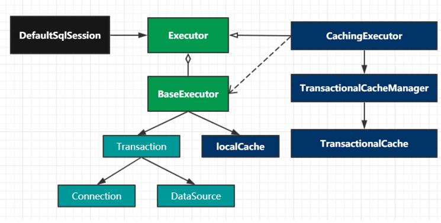

- [Mybatis简介](#mybatis简介)
- [Mybatis核心对象和生命周期](#mybatis核心对象和生命周期)
- [Configuration配置](#configuration配置)
  - [propertis](#propertis)
  - [environments](#environments)
  - [settings](#settings)
  - [typeAlias](#typealias)
  - [mappers映射器](#mappers映射器)
- [Mapper中的statement](#mapper中的statement)
  - [Mapper中包含的元素](#mapper中包含的元素)
  - [Select](#select)
  - [insert/update/delete](#insertupdatedelete)
- [一级缓存](#一级缓存)
  - [一级缓存的使用条件](#一级缓存的使用条件)
- [二级缓存](#二级缓存)
  - [二级缓存的使用条件](#二级缓存的使用条件)
  - [二级缓存的清除条件](#二级缓存的清除条件)
- [流程解析](#流程解析)
  - [配置文件解析Configuration](#配置文件解析configuration)
  - [会话创建](#会话创建)
  - [方法执行StatementHandler](#方法执行statementhandler)
- [插件的四大扩展点](#插件的四大扩展点)
- [事务与SqlSession集成原理](#事务与sqlsession集成原理)

### Mybatis简介
Mybatis是一款优秀的持久层框架，支持定制化SQL，存储过程和高级映射。Mybatis几乎避免了所有的JDBC代码和手动设置参数和获取结果集。

### Mybatis核心对象和生命周期
```xml
<?xml version="1.0" encoding="UTF-8" ?>
<!DOCTYPE mapper
        PUBLIC "-//mybatis.org//DTD Mapper 3.0//EN"
        "http://mybatis.org/dtd/mybatis-3-mapper.dtd">
<mapper namespace="com.tuling.mybatis.dao.UserMapper">
    <select id="selectUser" resultType="com.wyd.mybatis.dao.User">
    select * from User where id = #{id}
  </select>
</mapper>

mybatis-config.xml
<?xml version="1.0" encoding="UTF-8" ?>
<!DOCTYPE configuration
        PUBLIC "-//mybatis.org//DTD Config 3.0//EN"
        "http://mybatis.org/dtd/mybatis-3-config.dtd">
<configuration>
    <environments default="development">
        <environment id="development">
            <transactionManager type="JDBC"/>
            <dataSource type="POOLED">
                <property name="driver" value="com.mysql.jdbc.Driver"/>
                <property name="url" value="jdbc:mysql://192.168.0.147/wyd"/>
                <property name="username" value="root"/>
                <property name="password" value="root"/>
            </dataSource>
        </environment>
    </environments>
    <mappers>
        <mapper class="com.wyd.mybatis.dao.UserMapper"></mapper>
    </mappers>
</configuration>

```

```java
示例：
String resource = "mybatis-config.xml";
InputStream inputStream = Resources.getResourceAsStream(resource);
SqlSessionFactory sqlSessionFactory = new SqlSessionFactoryBuilder().build(inputStream);
SqlSession session = sqlSessionFactory.openSession();
User result = session.selectOne("com.wyd.mybatis.dao.UserMapper.selectUser", 1);
System.out.println(result.toString());

```

1. SqlSessionFactoryBuilder：用于创建会话工厂，基于config.xml中的envireoment、props构建会话工程，构建完成此对象就可销毁。

2. SqlSessionFactory：会话工厂，用于创建会话，作用于整个运用的运行期间，一般不需要创建多个会话工厂。

3. SqlSession：作用于单词会话，如web的一次请求，不能作用于某个对象，也不能在线程之间共享。是线程不安全的。

### Configuration配置

#### propertis
属性元素可以通过resource或者url加载外部properties文件中的属性，也可以直接设置property属性。然后在xml中就可以通过```${属性名}```进行引用替换。

```xml
<properties resource="app.properties" url="">
        <property name="jdbc.driver" value="com.oracle.jdbc.Driver"/>
</properties>
```

#### environments 
一个项目经常需要在例如开发坏境、测试环境、预演环境、生产环境中等不同环境中进行部署，每个环境所对应的参数是不一样的，myBatis 中可以通过 environment 来设置不同环境的属性。

```xml
<environments default="${default.environment}">
    <environment id="test">
        <!--type=JDBC|MANAGED-->
        <transactionManager type="JDBC"></transactionManager>
        <!-- type=UNPOOLED|POOLED|JNDI-->
        <dataSource type="UNPOOLED">
            <property name="driver" value="${jdbc.driver}"/>
        </dataSource>
    </environment>
    <environment id="dev">
        <transactionManager type="JDBC"/>
        <dataSource type="POOLED">
            <property name="driver" value="${jdbc.driver}"/>
        </dataSource>
    </environment>
</environments>
```

可以通过```SqlSessionFactoryBuilder.build( environment) ```来指定初始化那套环境。

#### settings
设置Mybatis全局参数，约定MyBatis的全局行为。

```xml
<settings>
<!-- 开启二级缓存-->
  <setting name="cacheEnabled" value="true"/>
  <!-- 开启驼峰命名适配-->
  <setting name="mapUnderscoreToCamelCase" value="true"/>
<settings>
```

#### typeAlias 
在myBatis 中经常会用到 java 中类型，如sql 块中中 parameterType  参数引用中 javaType 结果集映射的javaType ,都要使用java 全路径名，可以通过下面配置进行设置。

```xml
<typeAliases>
    <typeAlias type="com.wyd.mybatis.dao.Account" alias="account"/>
    <package name="com.wyd.mybatis.dao"  />
</typeAliases>
```

#### mappers映射器
```xml
<mappers>
  <mapper resource="org/mybatis/builder/AuthorMapper.xml"/>
  <mapper  url="http://www.xxx.com/xml/BlogMapper.xml"/>
  <mapper class="org.mybatis.builder.BlogMapper"/>
 <package name="org.mybatis.builder"/>
</mappers>
```

加载方式：
- resource 基于classPath 加载xml文件
- url:基于资源定位加载xml 文件
- class:基于接口加载
- package ：扫描包下所有class 然后进行加载
约定规则：
- mapper 中的 namespace必须与对应的接口名称对应。
- 通过 class 或package 中加载时 .xml 文件必须与接口在同一级目录。

### Mapper中的statement

#### Mapper中包含的元素
- cache：对给定命名空间的缓存配置。
- resultMap：结果集映射。
- sql：可被其他语句引用的可重用语句块。
- insert：插入语句
- update：更新语句
- delete：删除语句
- select：查询语句


#### Select
```xml
<select
  id="selectById"        <!--语句块的唯一标识 与接口中方法名称对-->
  parameterType="User"   <!--参数java类型-->
  resultType="hashmap"   <!--返回结果java类型-->
  resultMap="userResultMap" <!--返回结果映射-->
  flushCache="false"      <!--true 每次调用都会刷新 一二级缓存-->
  useCache="true"         <!--true 是否保存至二级缓存当中去-->
  timeout="10"
  statementType= PREPARED">
```

#### insert/update/delete

```xml
<insert
  id="addUser"   <!-- 语句块的唯一标识 与接口中方法名称对应 -->
  parameterType="User"   <!--参数java类型-->
  flushCache="true"  <!--true 每次调用都会刷新 一二级缓存-->
  statementType="PREPARED" <执行类型>
  keyProperty=""      <!--主键对应的java 属性，多个用 逗号分割-->
  keyColumn=""        <!--主键列，多个用 逗号分割-->
  useGeneratedKeys=""  <!--插入成功后将 将值回设至 原参数->
  timeout="20">
```

### 一级缓存
在同一次查询会话中如果出现相同的语句及参数，就会从缓存中取出不在走数据库查询，1级缓存只能作用于查询会话中，也叫会话缓存。

#### 一级缓存的使用条件
1.	必须是相同的SQL和参数
2.	必须是相同的会话
3.	必须是相同的namespace 即同一个mapper
4.	必须是相同的statement 即同一个mapper 接口中的同一个方法
5.	查询语句中间没有执行session.clearCache() 方法
6.	查询语句中间没有执行 insert update delete 方法（无论变动记录是否与 缓存数据有无关系）

### 二级缓存
业务系统中存在很多的静态数据如，字典表、菜单表、权限表等，这些数据的特性是不会轻易修改但又是查询的热点数据。一级缓存针对的是同一个会话当中相同SQL，并不适合这情热点数据的缓存场景。为了解决这个问题引入了二级缓存，它脱离于会话之外。

```java
@CacheNamespace()
public interface LabelMapper {
    @Select("select * from t_label where id =#{id}")
    Label getById(Integer id);
}

属性说明：
@CacheNamespace(
        implementation = PerpetualCache.class, //  缓存实现 Cache接口 实现类
        eviction = LruCache.class,// 缓存算法
        flushInterval = 60000, // 刷新间隔时间 毫秒
        size = 1024,   // 最大缓存引用对象
        readWrite = true, // 是否可写
        blocking = false  // 是否阻塞
)
```
#### 二级缓存的使用条件
1.	当会话提交或关闭之后才会填充二级缓存
2.	必须是在同一个命名空间之下
3.	必须是相同的statement 即同一个mapper 接口中的同一个方法
4.	必须是相同的SQL语句和参数
5.	如果readWrite=true ，实体对像必须实现Serializable 接口

#### 二级缓存的清除条件
1.	xml中配置的update 不能清空 @CacheNamespace 中的缓存数据
2.	只有修改会话提交之后 才会执行清空操作
3.	任何一种增删改操作 都会清空整个namespace 中的缓存

### 流程解析
  


#### 配置文件解析Configuration
  

#### 会话创建
  

#### 方法执行StatementHandler
  

### 插件的四大扩展点
1. Executor
2. StatementHandler
3. ParameterHandler
4. ResultSetHandler

### 事务与SqlSession集成原理
其原理前面讲查询流程时有所涉及。每次执行SQL操作前都会通过 getSqlSession 来获取会话。其主要逻辑是 如果当前线程存在事物，并且存在相关会话，就从ThreadLocal中取出 。如果没就从创建一个 SqlSession 并存储到ThreadLocal 当中，共下次查询使用。

