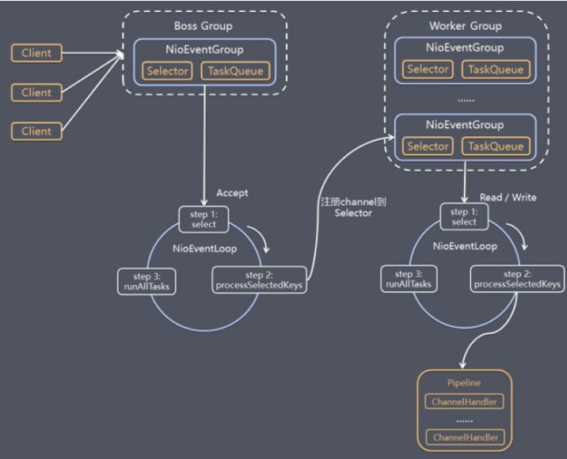
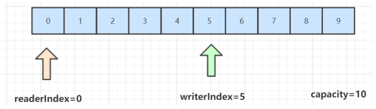
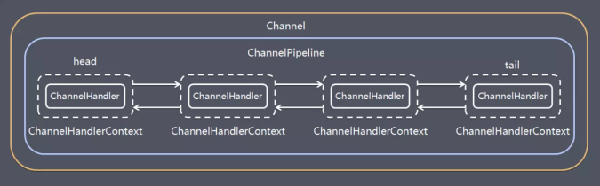
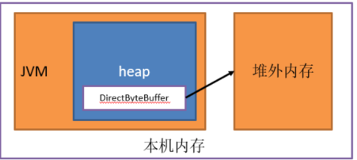
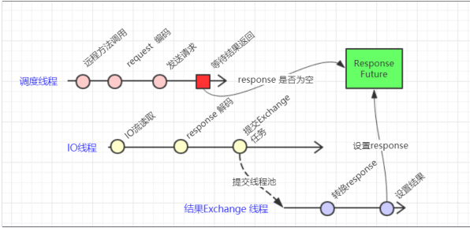
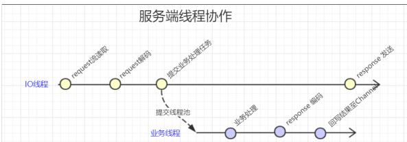

- [Netty是什么](#netty是什么)
- [Netty的线程模型](#netty的线程模型)
- [Netty的模块组件](#netty的模块组件)
- [ByteBuff](#bytebuff)
- [Netty编解码](#netty编解码)
- [Netty的拆包粘包](#netty的拆包粘包)
  - [为什么会出现这种现象](#为什么会出现这种现象)
  - [解决方案](#解决方案)
- [Netty的心跳检测机制](#netty的心跳检测机制)
- [Netty零拷贝](#netty零拷贝)
  - [直接内存](#直接内存)
  - [直接内存的优缺点](#直接内存的优缺点)
- [Netty高并发性能架构核心设计](#netty高并发性能架构核心设计)
  - [串行化无锁设计](#串行化无锁设计)
  - [ByteBuf内存池设计](#bytebuf内存池设计)
  - [并发优化](#并发优化)
- [WebScoket](#webscoket)
  - [简介](#简介)
  - [特点](#特点)
- [Netty在Dubbo中的应用](#netty在dubbo中的应用)
  - [Dubbo长链接实现](#dubbo长链接实现)
  - [Dubbo的传输线程](#dubbo的传输线程)
    - [客户端](#客户端)
    - [服务端](#服务端)

### Netty是什么
Netty是对JDK自带NIO的一个封装，拥有高性能、高吞吐量、低延迟、低消耗、并且减少了不必要的内存复制等优点。

### Netty的线程模型
  

- Netty抽象出两个线程池组BoossGroup和WorkerGroup，前者专门负责接收每个客户端的连接请求，后者专门负责客户端的网络读写。两者的类型都是NioEventLoopGroup，包含很多事件循环贤臣NioEventGroup。
- 每个NioEventGroup都有一个selector和一个TaskQueue，前者用于监听注册在上面的socketChannel的网络通信。
- Boss线程组中的NioEventGroup线程内部执行三个步骤：
  - 处理accept事件，与client端建立连接，生成NioSocketChannel
  - 将NioSocketChannel注册到work线程组中的某个NioEventGroup的selector上
  - 处理任务队列任务，即runAllTasks

- Worker线程组中的每个NioEventGroup的执行步骤如下：
  - 轮询注册在之计selector上的所有NioSocketChannel上的read、writer事件
  - 处理i/o事件，即对应的read、write事件，在对于的NioSocketChannel处理业务，处理时会使用 pipeline (管道)，管道中维护了很多 handler 处理器用来处理 channel 中的数据
  - runAllTasks处理队列任务TaskQueue，一些耗时的业务处理一般可以放入TaskQueue中慢慢处理，这样不影响数据在 pipeline 中的流动处理

### Netty的模块组件
1. Bootstrap、ServerBootstrap
    Bootstrap 意思是引导，一个 Netty 应用通常由一个 Bootstrap 开始，主要作用是配置整个 Netty 程序，串联各个组件，Netty 中 Bootstrap 类是客户端程序的启动引导类，ServerBootstrap 是服务端启动引导类。

2. Future、ChannelFuture
    在 Netty 中所有的 IO 操作都是异步的，不能立刻得知消息是否被正确处理。但是可以过一会等它执行完成或者直接注册一个监听，具体的实现就是通过 Future 和ChannelFutures，他们可以注册一个监听，当操作执行成功或失败时监听会自动触发注册的监听事件。

3. Channel
    Netty 网络通信的组件，能够用于执行网络 I/O 操作。

4. Selector
   Netty 基于 Selector 对象实现 I/O 多路复用，通过 Selector 一个线程可以监听多个连接的 Channel事件。当向一个 Selector 中注册 Channel 后，Selector 内部的机制就可以自动不断地查询(Select) 这些注册的 Channel 是否有已就绪的 I/O 事件（例如可读，可写，网络连接完成等），这样程序就可以很简单地使用一个线程高效地管理多个 Channel 。

5. NioEventLoop
    NioEventLoop 中维护了一个线程和任务队列，支持异步提交执行任务，线程启动时会调用NioEventLoop 的 run 方法，执行 I/O 任务和非 I/O 任务：I/O 任务，即 selectionKey 中 ready 的事件，如 accept、connect、read、write 等，由processSelectedKeys 方法触发。非 IO 任务，添加到 taskQueue 中的任务，如 register0、bind0 等任务，由 runAllTasks 方法触发

6. NioEventLoopGroup    
    NioEventLoopGroup，主要管理 eventLoop 的生命周期，可以理解为一个线程池，内部维护了一组线程，每个线程(NioEventLoop)负责处理多个 Channel 上的事件，而一个 Channel 只对应于一个线程。

7. ChannelHandler
   ChannelHandler 是一个接口，处理 I/O 事件或拦截 I/O 操作，并将其转发到其 ChannelPipeline(业务处理链)中的下一个处理程序

8. ChannelHandlerContext
    保存 Channel 相关的所有上下文信息，同时关联一个 ChannelHandler 对象。

9. ChannelPipline
    保存 ChannelHandler 的 List，用于处理或拦截 Channel 的入站事件和出站操作。ChannelPipeline 实现了一种高级形式的拦截过滤器模式，使用户可以完全控制事件的处理方式，以及 Channel 中各个的 ChannelHandler 如何相互交互。在 Netty 中每个 Channel 都有且仅有一个 ChannelPipeline 与之对应。一个 Channel 包含了一个 ChannelPipeline，而 ChannelPipeline 中又维护了一个由ChannelHandlerContext 组成的双向链表，并且每个 ChannelHandlerContext 中又关联着一个ChannelHandler。对客户端而言，read事件(入站事件)和write事件(出站事件)在一个双向链表中，入站事件会从链表 head 往后传递到最后一个入站的 handler，出站事件会从链表 tail 往前传递到最前一个出站的 handler，两种类型的handler 互不干扰。


### ByteBuff
ByteBuffr是一串字节数组组成的，使用堆外内存，每个字节用来存放信息，里面有两个索引，读索引和写索引，分别在字节数组中进行移动来定位需要读或写的信息位置，当从字节数组中读取数据时，读索引readIndex将会根据读取字节数递增，当写数据时writerIndex将根据写入的字节数递增，需要注意的是极限的情况是 readerIndex 刚好读到了 writerIndex 写入的地方。如果readerIndex 超过了 writerIndex 的时候，Netty会抛出 IndexOutOf-BoundsException异常。

  

### Netty编解码
1. ChannelHandler
    ChannelHandler充当了处理入站和出站数据的应用程序逻辑容器。例如，实现ChannelInboundHandler接口（或ChannelInboundHandlerAdapter），你就可以接收入站事件和数据，这些数据随后会被你的应用程序的业务逻辑处理。当你要给连接的客户端发送响应时，也可以从ChannelInboundHandler冲刷数据。你的业务逻辑通常写在一个或者多个ChannelInboundHandlerChannelOutboundHandler原理一样，只不过它是用来处理出站数据的。

2. ChannelPipline
    channelPipeline提供了ChannelHandler链的容器。以客户端应用程序为例，如果事件的运动方向是从客户端到服务端的，那么我们称这些事件为出站的，即客户端发送给服务端的数据会通过pipeline中的一系列ChannelOutboundHandler(ChannelOutboundHandler调用是从tail到head方向逐个调用每个handler的逻辑)，并被这些Handler处理，反之则称为入站的，入站只调用pipeline里的ChannelInboundHandler逻辑(ChannelInboundHandler调用是从head到tail方向逐个调用每个handler的逻辑)。
      


3. 编码器解码器
    当你通过Netty发送或者接受一个消息的时候，就将会发生一次数据转换。入站消息会被解码：从字节转换为另一种格式（比如java对象）；如果是出站消息，它会被编码成字节。Netty提供了一系列实用的编码解码器，他们都实现了ChannelInboundHadnler或者ChannelOutcoundHandler接口。在这些类中channelRead方法已经被重写了。以入站为例，对于每个从入站Channel读取的消息，这个方法会被调用。随后，它将调用由已知解码器所提供的decode()方法进行解码，并将已经解码的字节转发给ChannelPipeline中的下一个ChannelInboundHandler。Netty提供了很多编解码器，比如编解码字符串的StringEncoder和StringDecoder，编解码对象的ObjectEncoder和ObjectDecoder等。

### Netty的拆包粘包
#### 为什么会出现这种现象
TCP 是面向连接的， 面向流的， 提供高可靠性服务。 收发两端（客户端和服务器端） 都要有成对的 socket，因此， 发送端为了将多个发给接收端的包， 更有效的发给对方， 使用了优化方法（Nagle 算法），将多次间隔较小且数据量小的数据， 合并成一个大的数据块，然后进行封包。 这样做虽然提高了效率， 是接收端就难于分辨出完整的数据包了， 因为面向流的通信是无消息保护边的。

#### 解决方案
- 格式化数据：每条数据有固定的格式（开始符、结束符），这种方法简单易行，但选择开始符和结束符的时候一定要注意每条数据的内部一定不能出现开始符或结束符。
- 发送长度：发送每条数据的时候，将数据的长度一并发送，比如可以选择每条数据的前4位是数据的长度，应用层处理时可以根据长度来判断每条数据的开始和结束。

### Netty的心跳检测机制
心跳就是在TCP长连接中，客户端和服务端之间定期的发送一种特殊的数据包，通知对方自己还在线，确保TCP连接的有效性，在Netty中实现心跳机制的关键是IdleStateHandler。
```java
public IdleStateHandler(int readerIdleTimeSeconds, int writerIdleTimeSeconds, int allIdleTimeSeconds) {
 this((long)readerIdleTimeSeconds, (long)writerIdleTimeSeconds, (long)allIdleTimeSeconds, TimeUnit.SECONDS);
}
```
这三个参数默认的时间单位是秒。
- readerIdleTimeSeconds: 读超时. 即当在指定的时间间隔内没有从 Channel 读取到数据时, 会触发一个 READER_IDLE 的IdleStateEvent 事件。
- writerIdleTimeSeconds: 写超时. 即当在指定的时间间隔内没有数据写入到 Channel 时, 会触发一个 WRITER_IDLE 的IdleStateEvent 事件。
- allIdleTimeSeconds: 读/写超时. 即当在指定的时间间隔内没有读或写操作时, 会触发一个 ALL_IDLE 的 IdleStateEvent 事件。

### Netty零拷贝
Nety的接收和发送ByteBuffer采用DIRECT BUFFERS，使用堆外直接内存进行Socket读写，不需要进行字节缓冲区的二次拷贝。如果使用传统的JVM堆内存（HEAP BUFFERS）进行Socket读写，JVM会将堆内存Buffer拷贝一份到直接内存中，然后才能写入Socket中。JVM堆内存的数据是不能直接写入Socket中的。相比于堆外直接内存，消息在发送过程中多了一次缓冲区的内存拷贝。

#### 直接内存
直接内存（Direct Memory）并不是虚拟机运行时数据区的一部分，也不是Java虚拟机规范中定义的内存区域，某些情况下这部分内存也会被频繁地使用，而且也可能导致OutOfMemoryError异常出现。Java里用DirectByteBuffer可以分配一块直接内存(堆外内存)，元空间对应的内存也叫作直接内存，它们对应的都是机器的物理内存。

  

直接内存申请较慢，但访问效率高。在java虚拟机实现上，本地IO会直接操作直接内存（直接内存=>系统调用=>硬盘/网卡），而非直接内存则需要二次拷贝（堆内存=>直接内存=>系统调用=>硬盘/网卡）。

#### 直接内存的优缺点
1. 优点
   - 不占用堆内存空间，减少了发生GC的可能
   - java虚拟机实现上，本地IO会直接操作直接内存（直接内存=>系统调用=>硬盘/网卡），而非直接内存则需要二次拷贝（堆内存=>直接内存=>系统调用=>硬盘/网卡）
2. 缺点
   - 初始分配较慢
   - 没有JVM直接帮助管理内存，容易发生内存溢出。为了避免一直没有FULL GC，最终导致直接内存把物理内存被耗完。我们可以指定直接内存的最大值，通过-XX：MaxDirectMemorySize来指定，当达到阈值的时候，调用system.gc来进行一次FULL GC，间接把那些没有被使用的直接内存回收掉。

### Netty高并发性能架构核心设计
1. 主从Reactor线程模型
2. NIO多路复用非阻塞
3. 无锁串行化设计思想
4. 支持高性能序列化协议
5. 零拷贝(直接内存的使用)
6. ByteBuf内存池设计
7. 灵活的TCP参数配置能力
8. 并发优化

#### 串行化无锁设计
在大多数场景下，并行多线程处理可以提升系统的并发性能。但是，如果对于共享资源的并发访问处理不当，会带来严重的锁竞争，这最终会导致性能的下降。为了尽可能的避免锁竞争带来的性能损耗，可以通过串行化设计，即消息的处理尽可能在同一个线程内完成，期间不进行线程切换，这样就避免了多线程竞争和同步锁。
为了尽可能提升性能，Netty采用了串行无锁化设计，在IO线程内部进行串行操作，避免多线程竞争导致的性能下降。表面上看，串行化设计似乎CPU利用率不高，并发程度不够。但是，通过调整NIO线程池的线程参数，可以同时启动多个串行化的线程并行运行，这种局部无锁化的串行线程设计相比一个队列-多个工作线程模型性能更优。

Netty的NioEventLoop读取到消息之后，直接调用ChannelPipeline的fireChannelRead(Object msg)，只要用户不主动切换线程，一直会由NioEventLoop调用到用户的Handler，期间不进行线程切换，这种串行化处理方式避免了多线程操作导致的锁的竞争，从性能角度看是最优的。

#### ByteBuf内存池设计
随着JVM虚拟机和JIT即时编译技术的发展，对象的分配和回收是个非常轻量级的工作。但是对于缓冲区Buffer(相当于一个内存块)，情况却稍有不同，特别是对于堆外直接内存的分配和回收，是一件耗时的操作。为了尽量重用缓冲区，Netty提供了基于ByteBuf内存池的缓冲区重用机制。需要的时候直接从池子里获取ByteBuf使用即可，使用完毕之后就重新放回到池子里去。通过RECYCLER的get方法循环使用ByteBuf对象，如果是非内存池实现，则直接创建一个新的ByteBuf对象。

#### 并发优化
- volatile的大量、正确使用;
- CAS和原子类的广泛使用；
- 线程安全容器的使用；
- 通过读写锁提升并发性能。

### WebScoket

#### 简介
webSocket 是html5 开始提供的⼀种浏览器与服务器间进⾏全双⼯⼆进制通信协议，其基于TCP双向全双⼯作进⾏消息传递，同⼀时刻即可以发⼜可以接收消息，相⽐Http的半双⼯协议性能有很大的提升。

#### 特点
- 单一TCP长连接，采用全双工通信模式
- 对代理，防火墙透明
- 无头部信息，消息更简洁
- 通过ping/pong来保活
- 服务端可以主动推送消息给客户端，不需要客户端进行轮询调用


### Netty在Dubbo中的应用

#### Dubbo长链接实现
1. 初始连接：引⽤服务增加提供者==>获取连接===》是否获取共享连接==>创建连接客户端==》开启⼼跳检测状态检查定时任务===》开启连接状态检测，```com.alibaba.dubbo.rpc.protocol.dubbo.DubboProtocol#getClients```
2. 心跳发送：在创建⼀个连接客户端同时也会创建⼀个⼼跳客户端，客户端默认基于60秒发送⼀次⼼跳来保持连接的存活，可通过 heartbeat 设置。```com.alibaba.dubbo.remoting.exchange.support.header.HeaderExchangeClient#startHeatbeatTimer```
3. 断线重连：每创建⼀个客户端连接都会启动⼀个定时任务每两秒中检测⼀次当前连接状态，如果断线则自动重连。```com.alibaba.dubbo.remoting.transport.AbstractClient#initConnectStatusCheckCommand```
4. 连接销毁：基于注册中⼼通知，服务端断开后销毁```com.alibaba.dubbo.remoting.transport.AbstractClient#close()```

#### Dubbo的传输线程
1. 客户端调度线程：用于发起远程方法调用的线程
2. 客户端结果Exchange线程：当远程方法返回Response后，该线程填充到指定的ResponseFuture，并唤醒等到的调度线程。
3. 客户端IO线程：由传输框架实现，用于Request消息流发送，Reponse消息流读取与解码等操作。
4. 服务端IO线程：由传输框架实现，用Request消息流读取与解码，以及Response消息的发送。
5. 业务执行线程：服务端具体执行业务方法线程。

##### 客户端
  

1. 调度线程
   1. 调用远程方法
   2. 对Request进行协议编码
   3. 发送Request到IO线程
   4. 等待结果返回

2. IO线程
   1. 读取Response流
   2. Response解码
   3. 把结果提交到Exchange线程

3. Exchange线程
   1. 转换Response，填写其至ResponseFuture
   2. 唤醒调度线程，通知其获取并处理结果

##### 服务端
  

1. IO线程
   1. Request读取
   2. Request解码
   3. 交给业务处理线程

2. 业务线程
   1. 业务处理、
   2. Response编码
   3. 把结果回写至Channel对于的IO线程。

