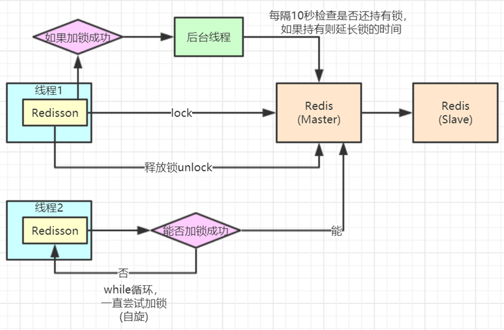

- [Redis的核心原理](#redis的核心原理)
	- [Redis单线程为什么还能这么快](#redis单线程为什么还能这么快)
	- [Redis单线程为什么能处理这么多的并发](#redis单线程为什么能处理这么多的并发)
- [Redis的数据结构及常用操作](#redis的数据结构及常用操作)
	- [String](#string)
	- [Hash](#hash)
	- [List](#list)
	- [Set](#set)
	- [ZSET](#zset)
- [Redis持久化](#redis持久化)
	- [RDB快照](#rdb快照)
	- [AOF](#aof)
	- [AOF 重写](#aof-重写)
	- [RDB和AOF的对别](#rdb和aof的对别)
	- [混合持久化](#混合持久化)
- [Redis的主从架构](#redis的主从架构)
	- [全量复制](#全量复制)
	- [部分复制](#部分复制)
- [Redis管道](#redis管道)
- [Redis Lua脚本](#redis-lua脚本)
- [Redis的哨兵架构](#redis的哨兵架构)
	- [哨兵架构的缺点](#哨兵架构的缺点)
	- [哨兵leader选举](#哨兵leader选举)
	- [故障转移master选举](#故障转移master选举)
- [Redis高可用集群架构](#redis高可用集群架构)
- [Redis集群原理](#redis集群原理)
	- [槽位](#槽位)
	- [槽位定位算法](#槽位定位算法)
- [槽位重定位](#槽位重定位)
	- [Redis集群节点间的通信机制](#redis集群节点间的通信机制)
- [网络抖动](#网络抖动)
- [Redis集群的选举原理](#redis集群的选举原理)
- [集群是否完整才能对外提供服务](#集群是否完整才能对外提供服务)
- [为什么集群至少需要三个，并推荐为奇数个](#为什么集群至少需要三个并推荐为奇数个)
- [Redis分布式锁](#redis分布式锁)
- [缓存穿透](#缓存穿透)
- [缓存击穿](#缓存击穿)
- [缓存雪崩](#缓存雪崩)
- [Redis连接参数设置](#redis连接参数设置)
- [Redis过期键清除策略](#redis过期键清除策略)
	- [内存淘汰策略](#内存淘汰策略)
- [Redis相比memcached有哪些优势](#redis相比memcached有哪些优势)

### Redis的核心原理
#### Redis单线程为什么还能这么快
因为数据都保存在内存中，运算都是内存级别的，使用的是单线程，避免了线程间上下文切换带来的性能损耗。
#### Redis单线程为什么能处理这么多的并发
Redis采用的是IO多路复用，利用epoll来实现IO多路复用，将连接信息和事件信息放到队列中，依次放到文件事件分派器，事件分派器将事件分派给事件处理器。Nginx也是采用IO多路复用原理来解决C10K问题。

### Redis的数据结构及常用操作
  

#### String

```
字符串常用操作
SET  key  value 			//存入字符串键值对
MSET  key  value [key value ...] 	//批量存储字符串键值对
SETNX  key  value 		//存入一个不存在的字符串键值对
GET  key 			//获取一个字符串键值
MGET  key  [key ...]	 	//批量获取字符串键值
DEL  key  [key ...] 		//删除一个键
EXPIRE  key  seconds 		//设置一个键的过期时间(秒)

原子加减
INCR  key 			//将key中储存的数字值加1
DECR  key 			//将key中储存的数字值减1
INCRBY  key  increment 		//将key所储存的值加上increment
DECRBY  key  decrement 	//将key所储存的值减去decrement

```

#### Hash
```
Hash常用操作
HSET  key  field  value 			//存储一个哈希表key的键值
HSETNX  key  field  value 		//存储一个不存在的哈希表key的键值
HMSET  key  field  value [field value ...] 	//在一个哈希表key中存储多个键值对
HGET  key  field 				//获取哈希表key对应的field键值
HMGET  key  field  [field ...] 		//批量获取哈希表key中多个field键值
HDEL  key  field  [field ...] 		//删除哈希表key中的field键值
HLEN  key				//返回哈希表key中field的数量
HGETALL  key				//返回哈希表key中所有的键值

HINCRBY  key  field  increment 		//为哈希表key中field键的值加上增量increment
```

#### List
```
List常用操作
LPUSH  key  value [value ...] 		//将一个或多个值value插入到key列表的表头(最左边)
RPUSH  key  value [value ...]	 	//将一个或多个值value插入到key列表的表尾(最右边)
LPOP  key			//移除并返回key列表的头元素
RPOP  key			//移除并返回key列表的尾元素
LRANGE  key  start  stop		//返回列表key中指定区间内的元素，区间以偏移量start和stop指定

BLPOP  key  [key ...]  timeout	//从key列表表头弹出一个元素，若列表中没有元素，阻塞等待					timeout秒,如果timeout=0,一直阻塞等待
BRPOP  key  [key ...]  timeout 	//从key列表表尾弹出一个元素，若列表中没有元素，阻塞等待					timeout秒,如果timeout=0,一直阻塞等待
```

#### Set
```
Set常用操作
SADD  key  member  [member ...]			//往集合key中存入元素，元素存在则忽略，
							若key不存在则新建
SREM  key  member  [member ...]			//从集合key中删除元素
SMEMBERS  key					//获取集合key中所有元素
SCARD  key					//获取集合key的元素个数
SISMEMBER  key  member			//判断member元素是否存在于集合key中
SRANDMEMBER  key  [count]			//从集合key中选出count个元素，元素不从key中删除
SPOP  key  [count]				//从集合key中选出count个元素，元素从key中删除

Set运算操作
SINTER  key  [key ...] 				//交集运算
SINTERSTORE  destination  key  [key ..]		//将交集结果存入新集合destination中
SUNION  key  [key ..] 				//并集运算
SUNIONSTORE  destination  key  [key ...]		//将并集结果存入新集合destination中
SDIFF  key  [key ...] 				//差集运算
SDIFFSTORE  destination  key  [key ...]		//将差集结果存入新集合destination中
```

#### ZSET
```
ZSet常用操作
ZADD key score member [[score member]…]	//往有序集合key中加入带分值元素
ZREM key member [member …]		//从有序集合key中删除元素
ZSCORE key member 			//返回有序集合key中元素member的分值
ZINCRBY key increment member		//为有序集合key中元素member的分值加上increment 
ZCARD key				//返回有序集合key中元素个数
ZRANGE key start stop [WITHSCORES]	//正序获取有序集合key从start下标到stop下标的元素
ZREVRANGE key start stop [WITHSCORES]	//倒序获取有序集合key从start下标到stop下标的元素

Zset集合操作
ZUNIONSTORE destkey numkeys key [key ...] 	//并集计算
ZINTERSTORE destkey numkeys key [key …]	//交集计算
```

### Redis持久化
#### RDB快照
在默认情况下，redis将内存数据库的快照保存在名为dump.rdb的二进制文件中。你可以自动设置保存的频率，例如：```save 60 1000```表示60秒内有1000个键被改动，则触发一次快照保存。

还可以手动执行命令生成快照文件，```save和bgsave```,都可以生成快照文件，并覆盖原来的rdb快照文件，save是同步命令，执行bgsave时redis通过fork命令会生成一个子进程，来专门生成快照文件，redis默认采用bgsave这种方式。两者的比较如下：
  


#### AOF
Rdb快照存在一个问题，假如redis服务出现宕机，这时已经执行但是还没有保存到rdb文件中的命令将被丢失，因此redis新增加了一种持久化方案，aof，将每次修改的命令都追加到磁盘文件appendonly.aof文件中，当出现问题时，直接执行aof文件中的命令，来重建数据集。可以控制隔多久执行一次，默认且推荐的方式是每隔1秒 fsync一次。
- appendfsync always : 每次执行命令都追加到aof文件中，不会数据丢失，最保险，但也最慢。
- appendfsync everysec：每秒fsync一次，可能会丢失1s内的数据，但是足够快。
- appendfsync no：从不fsync，将数据交给操作系统来处理，更快，但是很不安全。

#### AOF 重写
aof文件中会存在很多没有用的指令，因此aof会定期根据内存的最新数据生成aof文件。例如下面的命令：
```
1 127.0.0.1:6379> incr readcount
2 (integer) 1
3 127.0.0.1:6379> incr readcount
4 (integer) 2
5 127.0.0.1:6379> incr readcount
6 (integer) 3
7 127.0.0.1:6379> incr readcount
8 (integer) 4
9 127.0.0.1:6379> incr readcount
10 (integer) 5
```
aof重写后变成
```
1 *3
2 $3
3 SET
4 $2
5 readcount
6 $1
7 5
```
可以通过参数配置来控制aof重写的频率：
```
# auto-aof-rewrite-min-size 64mb //aof文件至少要达到64M才会自动重写，文件太小恢复速度本
来就很快，重写的意义不大
# auto-aof-rewrite-percentage 100 //aof文件自上一次重写后文件大小增长了100%则再次触发重
写
```
也可通过执行命令```bgrewriteaof```重写aof文件，在aof重写时会fork出一个子进程，不会阻塞正常客户端的请求。

#### RDB和AOF的对别

如果同时存在rdb和aof持久化文件，如果从安全性出发，优先选用aof文件，最大限度的保证数据的准确性。

#### 混合持久化
RDB和AOF持久化方式都存在一些问题，RDB方式容易丢失数据，AOF方式由于文件太大，导致在恢复数据的时候会很慢，因此在Redis 4.0之后增加了一种混合持久化，通过以下方式进行开启：
```
# aof-use-rdb-preamble yes
```
开启redis混合持久化之后，在aof重写时，不再单纯的将aof的命令进行转化压缩，而是生成这一刻之前的rdb快照，并将增量的aof命令整合在一起，生成一个文件，然后原子覆盖旧的appendonly.aof文件，完成新旧文件的替换，在redis宕机之后重启时，先根据rdb快照进行还原，然后执行aof增量命令来进行恢复，重启效率得到了很大的提升。文件结构如下：
  

### Redis的主从架构
  

#### 全量复制
在redis 2.8之前，如果你给master节点配置一个slave节点，首先从节点会发送一个sync命令给主节点，告诉主节点我要同步数据，这时主节点会执行bgsave命令生成rdb快照文件，持久化期间执行的命令会存放在缓存中，当持久化完毕后，主节点会把rdb文件发送给从节点，从节点把接收到的文件持久化生成rdb，然后再加载到内存，之后master把缓存中的命令发送给slave节点，然后从节点执行增量命令。
  

如果在同一时间点，多个slave都要进行主从复制，主节点之后生成一份rdb文件，然后把这份持久化数据分送给各个slave。

一般当从节点和主节点断开之后都要进行全量复制，但是从2.8版本开始，主节点和从节点断开之后重连支持部分复制。

#### 部分复制
当从节点和主节点断开之后，主节点会在内存中维护一份增量的缓存队列，存放最近一段执行的命令，主从节点都维护了主节点的进程id和当前复制的偏移量offeset，当从节点断开重连时，首先判断进程id是否发生变化，变化说明主节点已经发生变化，则需进行全量复制，如果没有发生变化，判断从节点的偏移量是否在主节点的缓存队列中，如果不在也需要进行全量复制，如果在，则同步偏移量后面的数据。支持部分复制的命令是```psync```。
  


### Redis管道
管道是指Redis客户端可以一次性发送多条数据，而不用等到服务端响应，待所有数据都发送完成之后，再一次性读取服务端的响应。这样极大的降低了网络传输的开销，多条命令的开销相当于执行一条命令的开销。redis在处理完命令之后先把结果缓存起来，当所有的命令执行完成之后，再返回给客户端。也就意味着缓存的越多占用的内存越大，因此在管道中一次性不能执行太多的命令。管道并不具有事务的性质，也就是如果前面的命令执行失败，并不会影响后面的命令执行。示例如下：
```
1 Pipeline pl = jedis.pipelined();
2 for (int i = 0; i < 10; i++) {
3 pl.incr("pipelineKey");
4 pl.set("zhuge" + i, "zhuge");
5 }
6 List<Object> results = pl.syncAndReturnAll();
7 System.out.println(results);
```

### Redis Lua脚本
Redis支持通过lua脚本来执命令，有以下优点：
- 减少网络开销，类似管道。
- 原子操作：执行具有原子性，要么都成功，要不都失败，前面的命令失败，则后面的命令也不会执行。
- 代替Redis的事务：redis自带的事务很鸡肋，报错不支持回滚，而lua支持回滚，几乎实现了常规的事务功能。

因为Redis是单线程的，因此不要在lua脚本中执死循环好耗时运算，不然会阻塞其他命令。在Lua脚本中，可以通过redis.call()函数来执行Redis命令，如下：
```
1 2
jedis.set("product_stock_10016", "15"); //初始化商品10016的库存
3 String script = " local count = redis.call('get', KEYS[1]) " +
4 " local a = tonumber(count) " +
5 " local b = tonumber(ARGV[1]) " +6 " if a >= b then " +
7 " redis.call('set', KEYS[1], count‐b) " +
8 " return 1 " +
9 " end " +
10 " return 0 ";
11 Object obj = jedis.eval(script, Arrays.asList("product_stock_10016"), Arrays.asList("1
0"));
12 System.out.println(obj);
```

### Redis的哨兵架构
sentinel哨兵是特殊的redis服务，不提供读写服务，主要用来监控redis实例节点。哨兵架构下client端第一次从哨兵找出redis的主节点，后续就直接访问redis的主节点，不会每次都通过sentinel代理访问redis的主节点，当redis的主节点发生变化，哨兵会第一时间感知到，并且将新的redis主节点通知给client端(这里面redis的client端一般都实现了订阅功能，订阅sentinel发布的节点变动消息)。
  

#### 哨兵架构的缺点
通过哨兵来监控redis主从，当master节点宕机，需要进行主从切换，这个时候会出现访问瞬断的问题，而且哨兵架构只有一个节点对位提供服务（读写分离）没有办法支持很高的并发；并且主节点的内存不能设置很大，如果较大就会存在数据恢复较慢和主从数据同步效率低下的问题。

#### 哨兵leader选举
哨兵每隔1s通过ping命令判断主从架构中的机器是否正常，如果超过```down-after-miliseconds```配置的值就会被该哨兵标记为主观下线（SDOWN）,如果某一个哨兵标记主服务器主管下线，将会通知其他哨兵，让其他哨兵判断主服务是否下线。如果有过半的哨兵认为主服务挂掉了，则把主改为客户下线，这个时候哨兵需要选出一个leader来进行主从切换，每个哨兵都要机会被选为leader，选举先到先得，同时每个哨兵每次选举都会自增配置纪元（选举周期），每个纪元只会选择一个哨兵为leader，如果超过一半的哨兵选择某一个哨兵，则这个哨兵就成为了leader，该leader就复制进行故障转移，从存活的slave中选出新的leader。

#### 故障转移master选举
哨兵leader会将已下线的主服务的从服务器维护到一个列表中，按照规则进行挑选；
- 删除已下线或处于断线状态的slave
- 删除5s内没有恢复过哨兵leader的slave
- 删除与下线master断开连接超过```down-after-milliseconds * 10```毫秒的Slave
- 哨兵leader将根据优先级从剩余的slave中选择，如果具有相同的优先级，那么根据复制偏移量进行选择，选出偏移量最大的，如果偏移量相同，那么根据运行id最小的原则选出新的Master。

### Redis高可用集群架构
Redis集群是通过多个主从服务节点组成的服务器集群，具有复制、高可用和分片的特点，不需要哨兵也可以进行主从切换，而且可以进行水平扩展，最多可以扩展上万个主从集群，官方推荐最多1000个。Redis集群模式的性能和高可用性均高于哨兵模式，并且配置简单。
  

### Redis集群原理
#### 槽位
Redis把所有的数据分为16384个槽位，每个主从集群负责其中一部分槽位，槽位信息存储在每一个集群节点中，当客户端连接Redis集群时，会把槽位信息同步到客户端本地缓存起来，当一个key要访问redis集群时，直接通过本地缓存的槽位信息定位目标节点。

#### 槽位定位算法
Redis通过crc16算法来对key进行Hash运算，得到一个hash值，然后再mod16384得到对应的槽位，根据槽位所在的节点，进行访问。

```HASH_SLOT = CRE16(Key) mod 16384```

### 槽位重定位
客户端和服务端可能存在槽位信息不一致的情况，这时就需要槽位重定位来帮助客户端更正缓存的槽位信息。当redis节点收到不属于自己槽位的请求时，会返回客户端正确的槽位信息，客户端收到服务端的返回信息后更正本地缓存的槽位映射表，后续key根据新的槽位映射表进行访问，并重定向到正确的节点进行操作。
  

#### Redis集群节点间的通信机制
Redis节点间通信采用gossip协议，维护集群元数据有两种方式一种是集中式一种是gossip。

1、集中式

所有的元数据信息都维护到一个地方，时效性非常好，有任何变动所有的节点都可以马上感知到，但是所有元数据的更新压力全部集中在一个地方，可能导致数据存储压力。

2、gossip协议

原理是彼此不断通信交换信息，一段时间后所有的节点都会知道集群的完整信息，类似于留言传播。集群中的每个节点都会单独开辟一个TCP通道，用于接点之前的彼此通信，通信端口是在基础端口上加10000。
- meeet：当有新节点加入时，某个节点会发送meet节点给新加入的节点，让新节点加入集群，然后新节点就会开始于其他节点进行通信。
- ping：每个节点都会频繁的给其他节点发送ping，包含自己的元数据以及其他部分节点数。ping很频繁，而且要携带元数据，很可能会加重网络负载，每个节点每秒会发送10次ping，每次选5个很久没有通信的其他节点，如果一个节点通信延迟达到了```cluster_node_timeout/2```,那么会立即发送ping，防止因长时间没有交换数据，导致元数据不一致，，每次ping除了带上自己的元数据外，还要带上1、0/其他节点的信息，至少包含3个其他节点，最多包含总结点-2个其他节点，进行数据交换。
- pong：对ping和meet消息的响应，包含自己的节点元数据和其他节点的信息，也可以用于信息的广播和更新。
- fail：某一个节点fail之后，就发送fail给其他节点，通知其他节点，指定的节点宕机了。

### 网络抖动
在现实机房中，网络经常出现一些小问题，网络抖动就是非常常见的一种现象，瞬间断连，很快又恢复正常，为了解决这个问题，redis通过参数```cluster_node_timeout```来进行控制，超过这个时间失联，则认为节点出现故障，需要进行主从切换，如果没有这样的控制，需要经常进行主从切换，数据的重新复制。


### Redis集群的选举原理
当slave发现自己的master节点变成fail状态，将尝试进行failover，期待自己成为新的master，由于存在一主多从的情况，会出现多个slave竞争，过程入下：
- 当slave发现主节点fail
- 将自己记录的集群currentEpoch加1，广播FAILOVER_AUTH_REQUEST信息。
- 其他节点收到信息后，只有master节点进行响应，一个epoch纪元之后回复一次，发生FAILOVER_AUTH_ACK。
- slave收集master返回的FAILOVER_AUTH_ACK，如果收到过半的ack，则当前slave变成master节点。
- 广播pong消息通知集群其他节点。

slave并不是一发现master是fail状态就立马发起选举的，有一定的延迟，等待FAIL确保在集群中进行传播，如果立马发起，其他master可能尚未意识到fail状态，可能会拒绝投票。延时时间入下：

```DELAY = 500MS + random(0~500ms) + slave_rank * 1000ms```

slave_rank表示从主节点复制的总量rank，rank越小数据越新，保证持有最新slave的节点最先发起投票选举。

### 集群是否完整才能对外提供服务
如果配置了参数```cluster_requir_full_coverage```为no时，表示一个master下线并且没有slave进行主从切换时，仍可以对外提供服务，如果为yes则不能对外提供服务。

### 为什么集群至少需要三个，并推荐为奇数个
因为master主从切换时至少需要过半的节点同意餐呢个选举成功，如果只有2个，一个挂掉了，达不到选举新得master的条件。

奇数节点可以在满足选举的基础上节省一个节点，三个节点和四个节点相比，如果都挂了一个节点都能选举新得master，如果挂了两个master都没法选举，所以奇数节点可以节省机器。

### Redis分布式锁
  


### 缓存穿透
缓存穿透是指查询一个根本不存在的数据， 缓存层和存储层都不会命中， 通常出于容错的考虑， 如果从存储层查不到数据则不写入缓存层。缓存穿透将导致不存在的数据每次请求都要到存储层去查询， 失去了缓存保护后端存储的意义。造成缓存穿透的基本原因有两个：
- 自身业务代码或者数据出现问题。
- 一些恶意攻击、 爬虫等造成大量空命中。

解决方案：
- 缓存空对象
- 布隆过滤器，布隆过滤器就是一个大型的位数组和几个不一样的无偏 hash 函数。所谓无偏就是能够把元素的 hash 值算得比较均匀。某个值存在时，这个值可能不存在；当它说不存在时，那就肯定不存在。缓存空间占用很少。

### 缓存击穿
对于设置了过期时间的key，缓存在某个时间点过期的时候，加好这个时间点对这个key的大量并发请求过来，这些请求发现缓存过期会从db进行加载数据并设置到缓存，这时候大并发请求会瞬间把db压垮。

解决方法：
- 设置互斥锁
- 永不过期

### 缓存雪崩
设置缓存采用相同的过期时间，导致缓存在某一个时刻同时失效，造成db瞬间压力过大，与缓存击穿的区别是雪崩是很多key同一时刻失效，击穿是一个key的缓存失效。

解决方法
- 将缓存过期时间设置成一段时间内的不同时间。


### Redis连接参数设置
  

- maxTotal：最大连接数，早期的版本叫maxActive，通常来讲maxTotal可以比理论值大一些。假设一次命令时间（borrow|return resource + Jedis执行命令(含网络) ）的平均耗时约为1ms，一个连接的QPS大约是1000，业务期望的QPS是50000那么理论上需要的资源池大小是50000 / 1000 = 50个。但这个值不是越大越好，一方面连接太多占用客户端和服务端资源，另一方面对于Redis这种高QPS的服务器，一个大命令的阻塞即使设置再大资源池仍然会无济于事。
- maxIdle和minIdle，maxIdle实际上才是业务需要的最大连接数，maxTotal是为了给出余量，所以maxIdle不要设置过小，否则会有new Jedis(新连接)开销。连接池的最佳性能是maxTotal = maxIdle，这样就避免连接池伸缩带来的性能干扰。但是如果并发量不大或者maxTotal设置过高，会导致不必要的连接资源浪费。一般推荐maxIdle可以设置为按上面的业务期望QPS计算出来的理论连接数，maxTotal可以再放大一倍。minIdle（最小空闲连接数），与其说是最小空闲连接数，不如说是"至少需要保持的空闲连接数"，在使用连接的过程中，如果连接数超过了minIdle，那么继续建立连接，如果超过了maxIdle，当超过的连接执行完业务后会慢慢被移出连接池释放掉。如果系统启动完马上就会有很多的请求过来，那么可以给redis连接池做预热，比如快速的创建一些redis连接，执行简单命令，类似ping()，快速的将连接池里的空闲连接提升到minIdle的数量。

### Redis过期键清除策略
- 被动删除：当读/写一个过期的key时，会触发惰性删除策略，直接删除掉这个过期的key。
- 主动删除：惰性删除策略无法保证，无效的key及时的被删除掉，所以redis会定期主动的淘汰一批过期的key。
- 当redis的内存超过最大限制```maxMemory```，会触发主动删除策略，如果是主从模式，只有master节点才会执行被动和主动两种删除策略，然后同步给从节点。如果不设置内存，当超过内存限制时，内存数据会开始频繁的和磁盘进行io，大幅降低redis的性能。因此需要设置最大内存淘汰策略

#### 内存淘汰策略
- allkeys-lru：根据lru算法，不管有没有超时属性，直到腾出足够的空间。
- allkeys-random：对所有key进行随机的删除，直到腾出足够的空间。
- volatile-lru：根据lru算法，在有超时属性的key中进行删除，保证不会删除没有过期的数据。
- volatile-random：随机删除过期的key，直到腾出足够的空间。
- volatile-ttl：删除将要过期的key，如果没有执行noeviction策略。
- noeviction：不执行任何写操作，写操作返回错误信息```OOM command not allowed when user memory```,只响应读请求。


### Redis相比memcached有哪些优势
- memecached只能存储简单的字符串，redis支持多种类型。
- redis的速度比memcached快
- redis可以持久化其数据。


