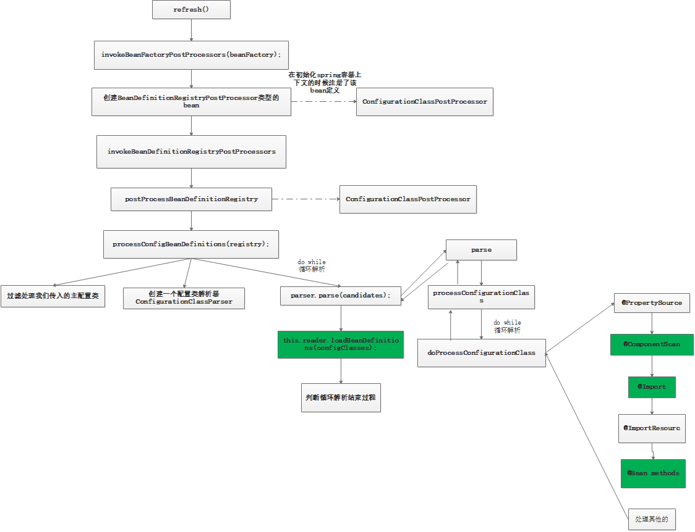

- [BeanFactory和ApplicationContext的区别](#beanfactory和applicationcontext的区别)
- [IOC的核心思想](#ioc的核心思想)
- [Spring IOC的使用方式](#spring-ioc的使用方式)
  - [XML配置方式](#xml配置方式)
  - [配置类配置方式](#配置类配置方式)
  - [Bean的作用域](#bean的作用域)
  - [Bean的懒汉式加载](#bean的懒汉式加载)
  - [@Condition进行条件判断](#condition进行条件判断)
- [往Spring容器中添加组件的方式](#往spring容器中添加组件的方式)
- [Bean的生命周期](#bean的生命周期)
- [Bean的初始化方法和销毁方法](#bean的初始化方法和销毁方法)
- [Bean的后置处理器](#bean的后置处理器)
- [@Value组件赋值](#value组件赋值)
- [自动装配](#自动装配)
- [@Profile](#profile)
- [Spring的事件机制](#spring的事件机制)
- [BeanDefinitionRegisteryPostProcess的处理流程](#beandefinitionregisterypostprocess的处理流程)
- [BeanFactoryPostProcess](#beanfactorypostprocess)
- [容器创建准备的前期工作](#容器创建准备的前期工作)
- [getBean的流程](#getbean的流程)
- [循环依赖的问题](#循环依赖的问题)
  - [什么是循环依赖](#什么是循环依赖)
  - [循环依赖注入对象的两种方式](#循环依赖注入对象的两种方式)
  - [构造器方式注入Spring的处理过程](#构造器方式注入spring的处理过程)
  - [setter方式循环依赖](#setter方式循环依赖)
  - [三级缓存](#三级缓存)
  - [A、B 类 setter 循环依赖的创建过程](#ab-类-setter-循环依赖的创建过程)
  - [setter类型循环依赖，prototype多实例方式](#setter类型循环依赖prototype多实例方式)
- [Spring AOP](#spring-aop)
  - [什么是Spring AOP](#什么是spring-aop)
  - [什么是代理模式](#什么是代理模式)
  - [AOP有哪些可用的实现](#aop有哪些可用的实现)
  - [在Spring AOP中关注点和横切关注点有什么不同？](#在spring-aop中关注点和横切关注点有什么不同)
  - [Spring中有哪些通知类型(advice)？](#spring中有哪些通知类型advice)

### BeanFactory和ApplicationContext的区别
使用BeanFactory的Bean是延时加载的，使用ApplicationContext的Bean是非延时加载的。

### IOC的核心思想
IOC最核心的地方在于，资源不是有使用双方管理的，而是有不使用资源的第三方管理，使用这种方式可以带来很多好处：
- 资源集中管理，实现资源的可配置和易管理
- 降低了资源双方的依赖程度，降低了耦合度。

### Spring IOC的使用方式
    
#### XML配置方式
```xml
<?xml version="1.0" encoding="UTF-8"?>
<beans xmlns="http://www.springframework.org/schema/beans"
xmlns:xsi="http://www.w3.org/2001/XMLSchema-instance"
xsi:schemaLocation="http://www.springframework.org/schema/beans http://www.springframework.org/schema/beans/sp
//定义一个Bean的信息
<bean id="car" class="com.wyd.compent.Car"></bean>
</beans>
```

```java
public static void main( String[] args )
{
    ClassPathXmlApplicationContext ctx = new ClassPathXmlApplicationContext("beans.xml");
    System.out.println(ctx.getBean("car"));
}

```

#### 配置类配置方式
```java
@Configuration
public class MainConfig {
    //通过@Bean的形式是使用的话， bean的默认名称是方法名，若@Bean(value="bean的名称")那么bean的名称是指定的
    @Bean
    public Person person(){
        return new Person();
    }   
}
```

```java
public static void main( String[] args )
{
    AnnotationConfigApplicationContext ctx = new AnnotationConfigApplicationContext(MainConfig.class);
    System.out.println(ctx.getBean("person"));
}
```

#### Bean的作用域
在不指定@Scope的情况下，所有的bean都是单实例的bean,而且是饿汉加载，容器启动实例就创建好了。
```java
@Bean
public Person person() {
    return new Person();
}
```

指定@Scope为 prototype 表示为多实例的，而且还是懒汉模式加载，IOC容器启动的时候，并不会创建对象，而是在第一次使用的时候才会创建。

```java
@Bean
@Scope(value = "prototype")
public Person person() {
    return new Person();
}
```

Spring指定的作用域方法取值
- Sington：单实例的（默认）
- prototype：多实例的
- request：同一次请求
- session：同一个会话


#### Bean的懒汉式加载
在容器启动的时候，不创建对象，在第一次使用的时候才会创建该对象。
```java
@Bean
@Lazy
public Person person() {
    return new Person();
}
```

#### @Condition进行条件判断
当某一个对象的创建需要依赖另外一个对象时
```java
public class TulingCondition implements Condition {
/****
@param context
* @param metadata
* @return
*/
    @Override
    public boolean matches(ConditionContext context, AnnotatedTypeMetadata metadata) {
    //判断容器中是否有tulingAspect的组件
        if(context.getBeanFactory().containsBean("wydAspect")){
            return true;
        }
        return false;
    }
}


public class MainConfig {
    @Bean
    public TulingAspect wydAspect() {
        return new WydAspect();
    } 
    //当切 容器中有tulingAspect的组件，那么tulingLog才会被实例化.
    @Bean
    @Conditional(value = WydCondition.class)
    public TulingLog wydLog() {
        return new WydLog();
    }
}

```

### 往Spring容器中添加组件的方式
1. 通过@CompentScan + @Controller/@Service/@Respository/@Compent。针对我们自己写的组件可以通过该方式加载到容器中。
2. 通过@Bean注解方式，适用于导入的第三方组件类。
3. 通过@Import注解来导入，导入某个类或者实现ImportSelector或者ImportBeanDefinitionRegister接口来导入。可以通过这种方式导入组件id的全限定名。

    ```java
    @Configuration
    @Import(value = {Person.class, Car.class})
        public class MainConfig {
    }
    ```


    ```java
    public class WydImportSelector implements ImportSelector {
        //可以获取导入类的注解信息
        @Override
        public String[] selectImports(AnnotationMetadata importingClassMetadata) {
            return new String[]{"com.tuling.testimport.compent.Dog"};
        }
    } 

    @Configuration@Import(value = {Person.class, Car.class, WydImportSelector.class})
    public class MainConfig {

    }
    ```

    ```java
    public class WydBeanDefinitionRegister implements ImportBeanDefinitionRegistrar {
        @Override
        public void registerBeanDefinitions(AnnotationMetadata importingClassMetadata, BeanDefinitionRegistry registry) {
        //创建一个bean定义对象
            RootBeanDefinition rootBeanDefinition = new RootBeanDefinition(Cat.class);
            //把bean定义对象导入到容器中
            registry.registerBeanDefinition("cat",rootBeanDefinition);
        }
    } 

    @Configuration
    @Import(value = {Person.class, Car.class, WydImportSelector.class, WydBeanDefinitionRegister.class})
    public class MainConfig {

    }
    ```

4. 通过实现FacotryBean来实现接口注册

    ```java

    public class CarFactoryBean implements FactoryBean<Car> {
        //返回bean的对象
        @Override
        public Car getObject() throws Exception {
            return new Car();
        } 
        //返回bean的类型
        @Override
        public Class<?> getObjectType() {
            return Car.class;
        } 
        
        //是否为单利
        @Override
        public boolean isSingleton() {
            return true;
        }
    }

    ```

### Bean的生命周期
Bean的创建 -> Bean的初始化 -> 销毁方法。由容器管理Bean的生命周期，可以通过指定Bean的初始化方法和Bean的销毁方法。针对单实例Bean容器启动的时候就会创建，在容器销毁的时候，也会调用我们定义的Bean的销毁方法。针对多实例Bean的话，容器启动的时候，Bean是不会被常见的，而是再Bean获取的时候被创建，Bean的销毁不会受IOC容器管理。

```java
@Configuration
public class MainConfig {
    //指定了bean的生命周期的初始化方法和销毁方法.
    @Bean(initMethod = "init",destroyMethod = "destroy")
    public Car car() {
        return new Car();
    }
}
```
### Bean的初始化方法和销毁方法
- 通过 InitializingBean和DisposableBean 的二个接口实现bean的初始化以及销毁方法
    ```java
    @Component
    public class Person implements InitializingBean,DisposableBean {
        public Person() {
            System.out.println("Person的构造方法");
        } 
        @Override
        public void destroy() throws Exception {
            System.out.println("DisposableBean的destroy()方法 ");
        } 
        @Override
        public void afterPropertiesSet() throws Exception {
            System.out.println("InitializingBean的 afterPropertiesSet方法");
        }
    }
    ```

- 通过JSR250规范 提供的注解@PostConstruct 和@ProDestory标注的方法

    ```java
    @Component
    public class Book {
        public Book() {
            System.out.println("book 的构造方法");
        } 
        @PostConstruct
        public void init() {
            System.out.println("book 的PostConstruct标志的方法");
        } 
        @PreDestroy
        public void destory() {
            System.out.println("book 的PreDestory标注的方法");
        }
    }
    ```

### Bean的后置处理器
通过Spring的BeanPostProcess的Bean的后置处理器拦截所有Bean的创建过程postProcessBeforeInitialization在init初始化方法之前调用，postProcessAfterInitialization在init初始化方法之后调用。

```java
@Component
public class WydBeanPostProcessor implements BeanPostProcessor {
    @Override
    public Object postProcessBeforeInitialization(Object bean, String beanName) throws BeansException {
        System.out.println("WydBeanPostProcessor...postProcessBeforeInitialization:"+beanName);
        return bean;
    } 
    @Override
    public Object postProcessAfterInitialization(Object bean, String beanName) throws BeansException {
        System.out.println("WydBeanPostProcessor...postProcessAfterInitialization:"+beanName);
        return bean;
    }
}

```

### @Value组件赋值
```java
public class Person {
    //通过普通的方式
    @Value("小张")
    private String firstName;
    //spel方式来赋值
    @Value("#{28-8}")
    private Integer age;
    //通过读取外部配置文件的值
    @Value("${person.lastName}")
    private String lastName;
} 

@Configuration
@PropertySource(value = {"classpath:person.properties"}) //指定外部文件的位置
public class MainConfig {
    @Bean
    public Person person() {
        return new Person();
    }
}
```

### 自动装配
1. @AutoWired

   - 自动装配首先时按照类型进行装配，若在IOC容器中发现了多个相同类型的组件，那么就按照 属性名称来进行装配。比如，我容器中有二个WydDao类型的组件 一个叫wydDao 一个叫wydDao2那么我们通过@AutoWired 来修饰的属性名称时wydDao，那么拿就加载容器的wydDao组件，若属性名称wydDao2 那么他就加载的时wydDao2组件

        ```java
        //一个Dao
        @Repository
        public class WydgDao {

        } 

        @Service
        public class WydService {
            @Autowired
            private WydDao wydDao;
        ｝
        ```
    - 假设我们需要指定特定的组件来进行装配，我们可以通过使用@Qualifier("wydDao")来指定装配的组件或者在配置类上的@Bean加上@Primary注解
        ```java
        @Autowired
        @Qualifier("wydDao")
        private WydDao wydDao2;
        ```

    - 假设我们容器中即没有tulingDao 和tulingDao2,那么在装配的时候就会抛出异常No qualifying bean of type 'com.tuling.testautowired.WydDao' available若我们想不抛异常 ，我们需要指定 required为false的时候可以了

        ```java
        @Autowired(required = false)
        @Qualifier("wydDao")
        private WydDao wydDao2;
        ```

    - @Autowired 可以标注在方法上
        ```JAVA
        //标注在set方法上
        @Autowired
        public void setWydLog(WydLog wydLog) {
            this.wydLog = wydLog;
        }

        //标注在构造方法上
        @Autowired
        public WydAspect(WydLog wydLog) {
            this.wydLog = wydLog;
        }

        ```

 

2. Resource
功能和@AutoWired差不多，但是不支持@Primary和@Qualifier

3. @InJect
需要导入依赖的jar包javax.inject，支持@primary，但是不支持require=false功能


### @Profile
使用此注解来根据不同的环境来激活相应的配置类

@Profile标识在类上，那么只有当前环境匹配，整个配置类才会生效

@Profile标识在Bean上 ，那么只有当前环境的Bean才会被激活

有标志为@Profile的bean 不管在什么环境都可以被激活


```java
@Configuration
@PropertySource(value = {"classpath:ds.properties"})
public class MainConfig implements EmbeddedValueResolverAware {
    @Value("${ds.username}")
    private String userName;
    @Value("${ds.password}")
    private String password;
    private String jdbcUrl;
    private String classDriver;

    @Override
    public void setEmbeddedValueResolver(StringValueResolver resolver) {
        this.jdbcUrl = resolver.resolveStringValue("${ds.jdbcUrl}");
        this.classDriver = resolver.resolveStringValue("${ds.classDriver}");
    } 
    //标识为测试环境才会被装配
    @Bean
    @Profile(value = "test")
    public DataSource testDs() {
        return buliderDataSource(new DruidDataSource());
    } 
    //标识开发环境才会被激活
    @Bean
    @Profile(value = "dev")
    public DataSource devDs() {
        return buliderDataSource(new DruidDataSource());
    } 
    //标识生产环境才会被激活
    @Bean
    @Profile(value = "prod")
    public DataSource prodDs() {
        return buliderDataSource(new DruidDataSource());
    } 
    
    private DataSource buliderDataSource(DruidDataSource dataSource) {
        dataSource.setUsername(userName);
        dataSource.setPassword(password);
        dataSource.setDriverClassName(classDriver);
        dataSource.setUrl(jdbcUrl);
        return dataSource;
    }
}


```

切换激活环境的方法
- 通过运行时jvm参数来切换 -Dspring.profiles.active=test|dev|prod
- 通过代码的方式来激活
```java 
public static void main(String[] args) {
    AnnotationConfigApplicationContext ctx = new AnnotationConfigApplicationContext();
    ctx.getEnvironment().setActiveProfiles("test","dev");
    ctx.register(MainConfig.class);
    ctx.refresh();
}
```


### Spring的事件机制

```java
@Component
public class WydApplicationListener implements ApplicationListener {
    //接受到消息，回调该方法
    @Override
    public void onApplicationEvent(ApplicationEvent event) {
        System.out.println("WydApplicationListener 接受到了一个事件"+event);
    }
}

    public static void main(String[] args) {
        AnnotationConfigApplicationContext ctx = new AnnotationConfigApplicationContext(MainConfig.class);
        //手动发布一个事件
        ctx.publishEvent(new ApplicationEvent("我手动发布了一个事件") {
            @Override
            public Object getSource() {
                return super.getSource();
            }
        });
        
        //容器关闭也发布事件
        ctx.close();
    }

测试结果:
WydApplicationListener 接受到了一个事件org.springframework.context.event.ContextRefreshedEvent[source=org.springframework.context.annotation.AnnotationConfigApplicationContext@37bba400: startup date [Mon May 27 21:42:51 CST 2019]; root of context hierarchy]
WydApplicationListener 接受到了一个事件com.Wyd.testapplicationlistener.MainClass$1[source=我手动发布了一个事件]
WydApplicationListener 接受到了一个事件org.springframework.context.event.ContextClosedEvent[source=org.springframework.context.annotation.AnnotationConfigApplicationContext@37bba400: startup date [Mon May 27 21:42:51 CST 2019]; root of context hierarchy]

```

初始化事件多播器

```java
protected void initApplicationEventMulticaster() {
		ConfigurableListableBeanFactory beanFactory = getBeanFactory();
		/判断IOC容器中包含applicationEventMulticaster 事件多播器的Bean的name
		if (beanFactory.containsLocalBean(APPLICATION_EVENT_MULTICASTER_BEAN_NAME)) {
		    /创建一个applicationEventMulticaster的bean放在IOC 容器中,bean的name 为applicationEventMulticaster
			this.applicationEventMulticaster =beanFactory.getBean(APPLICATION_EVENT_MULTICASTER_BEAN_NAME, ApplicationEventMulticaster.class);
			if (logger.isDebugEnabled()) {
				logger.debug("Using ApplicationEventMulticaster [" + this.applicationEventMulticaster + "]");
			}
		}
		/容器中不包含一个beanName 为applicationEventMulticaster的多播器组件
		else {
		    //创建一个SimpleApplicationEventMulticaster 多播器
			this.applicationEventMulticaster = new SimpleApplicationEventMulticaster(beanFactory);
			//注册到容器中
			beanFactory.registerSingleton(APPLICATION_EVENT_MULTICASTER_BEAN_NAME, this.applicationEventMulticaster);
			if (logger.isDebugEnabled()) {
				logger.debug("Unable to locate ApplicationEventMulticaster with name '" +
						APPLICATION_EVENT_MULTICASTER_BEAN_NAME +
						"': using default [" + this.applicationEventMulticaster + "]");
			}
		}
	}​

```

容器中的监听器注册到多播器上

```java
protected void registerListeners() {
		//去容器中把applicationListener 捞取出来注册到多播器上去（系统的）
		for (ApplicationListener<?> listener : getApplicationListeners()) {
			getApplicationEventMulticaster().addApplicationListener(listener);
		}

        //我们自己实现了ApplicationListener 的组件
		String[] listenerBeanNames = getBeanNamesForType(ApplicationListener.class, true, false);
		for (String listenerBeanName : listenerBeanNames) {
			getApplicationEventMulticaster().addApplicationListenerBean(listenerBeanName);
		}

	    //在这里之前，我们早期想发布的事件 由于没有多播器没有发布，在这里我们总算有了自己的多播器，可以在这里发布早期堆积的事件了.
		Set<ApplicationEvent> earlyEventsToProcess = this.earlyApplicationEvents;
		this.earlyApplicationEvents = null;
		if (earlyEventsToProcess != null) {
			for (ApplicationEvent earlyEvent : earlyEventsToProcess) {
				getApplicationEventMulticaster().multicastEvent(earlyEvent);
			}
		}
	}
	
	--------------------------------------------------------------------如何发布事件------------------------------------------------------
	public void multicastEvent(final ApplicationEvent event, ResolvableType eventType) {
		ResolvableType type = (eventType != null ? eventType : resolveDefaultEventType(event));
		//获取到所有的监听器
		for (final ApplicationListener<?> listener : getApplicationListeners(event, type)) {
		    //看spring 容器中是否支持线程池 异步发送事件
			Executor executor = getTaskExecutor();
			if (executor != null) {
				executor.execute(new Runnable() {
					@Override
					public void run() {
					    
						invokeListener(listener, event);
					}
				});
			}
			else {  //同步发送事件
				invokeListener(listener, event);
			}
		}
	}	
	
	
	private void doInvokeListener(ApplicationListener listener, ApplicationEvent event) {
		try {
		    //调用对于listener的onApplicationEvent事件
			listener.onApplicationEvent(event);
		}
		catch (ClassCastException ex) {
			String msg = ex.getMessage();
			if (msg == null || matchesClassCastMessage(msg, event.getClass())) {
				// Possibly a lambda-defined listener which we could not resolve the generic event type for
				// -> let's suppress the exception and just log a debug message.
				Log logger = LogFactory.getLog(getClass());
				if (logger.isDebugEnabled()) {
					logger.debug("Non-matching event type for listener: " + listener, ex);
				}
			}
			else {
				throw ex;
			}
		}
	}

```

### BeanDefinitionRegisteryPostProcess的处理流程
执行时机在所有的bean定义信息都将要被加载到容器中，Bean实例还没有被初始化。

```java
@Component
public class WydBeanDefinationRegisterPostProcessor implements BeanDefinitionRegistryPostProcessor {
    @Override
    public void postProcessBeanDefinitionRegistry(BeanDefinitionRegistry registry) throws BeansException {
        System.out.println("TulingBeanDefinationRegisterPostProcessor的postProcessBeanDefinitionRegistry方法");
        System.out.println("bean定义的数据量:"+registry.getBeanDefinitionCount());
        RootBeanDefinition rootBeanDefinition = new RootBeanDefinition(TulingLog.class);
        registry.registerBeanDefinition("wydLog",rootBeanDefinition);
    }

    @Override
    public void postProcessBeanFactory(ConfigurableListableBeanFactory beanFactory) throws BeansException {
        System.out.println("WydBeanDefinationRegisterPostProcessor的postProcessBeanFactory方法");
        System.out.println(beanFactory.getBeanDefinitionCount());
    }
}

```

###  BeanFactoryPostProcess
执行时间:所有的Bean定义信息已经加载到容器中，但是Bean实例还没有被初始化。

```java
@Component
public class WydBeanFactoryPostProcessor implements BeanFactoryPostProcessor {
    @Override
    public void postProcessBeanFactory(ConfigurableListableBeanFactory beanFactory) throws BeansException {
        System.out.println("IOC 容器调用了WydBeanFactoryPostProcessor的postProcessBeanFactory方法");
        for(String name:beanFactory.getBeanDefinitionNames()) {
            if("wydLog".equals(name)) {
                BeanDefinition beanDefinition = beanFactory.getBeanDefinition(name);
                beanDefinition.setLazyInit(true);
            }

        }
    }
}
```

执行流程

  


  


### 容器创建准备的前期工作
- org.springframework.context.annotation.AnnotationConfigApplicationContext#AnnotationConfigApplicationContext
- org.springframework.context.support.GenericApplicationContext#GenericApplicationContext() 调用父类的构造方法
- org.springframework.context.annotation.AnnotationConfigApplicationContext#AnnotationConfigApplicationContext() 自己的构造方法
    - org.springframework.context.annotation.AnnotatedBeanDefinitionReader#AnnotatedBeanDefinitionReader 为bean定义读取器赋值
        - org.springframework.context.annotation.AnnotatedBeanDefinitionReader#getOrCreateEnvironment 创建环境

    - org.springframework.context.annotation.ConditionEvaluator   创建一个条件计算器对象
        - this.registry = registry;  初始条件计算器的bean定义注册器
        - this.beanFactory = deduceBeanFactory(registry);  初始化bean工厂
        - this.environment = (environment != null ? environment : deduceEnvironment(registry)); 为环境对象赋值
        - this.resourceLoader = (resourceLoader != null ? resourceLoader : deduceResourceLoader(registry)); 为资源加载器赋值

    - AnnotationConfigUtils.registerAnnotationConfigProcessors(this.registry);为容器中注册系统的bean定义信息

-  this.scanner = new ClassPathBeanDefinitionScanner(this); 创建类路径下的bean定义扫描器
    - org.springframework.context.annotation.ClassPathScanningCandidateComponentProvider#registerDefaultFilters注册包扫描默认的规则 
    - org.springframework.context.annotation.ClassPathScanningCandidateComponentProvider#setEnvironment 设置环境
    - org.springframework.context.annotation.ClassPathScanningCandidateComponentProvider#setResourceLoader 设置资源加载器

- org.springframework.context.annotation.AnnotatedBeanDefinitionReader#register 使用生成的bean定义读取器注册配置类

### getBean的流程

  

### 循环依赖的问题

#### 什么是循环依赖
A 依赖于 B，B 依赖于 A，比如以下代码：

```java
public class A {
    private B b;
}
 
public class B {
    private A a;
}

```

#### 循环依赖注入对象的两种方式

1. 构造器方式注入

    ```
    public class A {
        private B b;
    
        public A(B b) {
            this.b = b;
        }
    }
    
    public class B {
        private A a;
    
        public B(A a) {
            this.a = a;
        }
    }

    ```

2. setter方式注入
    ```java
    public class A {
        private B b;
    
        public B getB() {
            return b;
        }
    
        public void setB(B b) {
            this.b = b;
        }
    }
    
    public class B {
        private A a;
    
        public A getA() {
            return a;
        }
    
        public void setA(A a) {
            this.a = a;
        }
    }

    ```

#### 构造器方式注入Spring的处理过程
 spring在创建bean之前，会将当前正在创建的bean名称放在一个列表中，这个列表叫做singletonCurrentlyCreation，用来记录正在创建中的bean名称列表，创建完成之后，会将其从singletonCurrentlyCreation列表中移除，并且将创建好的bean放到另外一个单例列表中，这个列表叫做singletonObjects。

 ```java
代码位于org.springframework.beans.factory.support.DefaultSingletonBeanRegistry类中
 
//用来存放正在创建中的bean名称列表
private final Set<String> singletonsCurrentlyInCreation =
   Collections.newSetFromMap(new ConcurrentHashMap<>(16));
 
//用来存放已经创建好的单例bean，key为bean名称，value为bean的实例
private final Map<String, Object> singletonObjects = new ConcurrentHashMap<>(256);

 ```  

 bean的创建过程

 ```java
@Compontent
public class A {
    private B b;
 
    public A(B b) {
        this.b = b;
    }
}
 
@Compontent
public class B {
    private A a;
 
    public B(A a) {
        this.a = a;
    }
}

 ```

 过程如下：
 - 从singletonObjects查看是否有a，此时没有
 - 装备创建a
 - 判断a是否在singletoCurrentlyInCreation列表中，此时明显不在，则将a假如singletonCurrentlyInCreation中。
 - 调用a的构造器A(B b)来创建a
 - spring发现A的构造器要用到b
 - spring在容器中查找b，从singletonObjects查看是否有b，此时没有
 - 判断b是否存在singletonsCurrentlyIncreation列表，此时也不在，则将b假如到singletonCurrentlyInCreation。
 - 调用b的构造器B(A a)来创建b
 - spring向容器中查找a
 - 从singletonObjects中查找a，此时没有
 - 从singletonsCurrentlyInCreation列表中查找，此时a已经在这个列表中了，说明a已经在创建中了，程序又来创建a，此时会发生死循环，spring会抛出异常，终止bean的创建操作。

因此循环依赖如果通过构造器方式，bean是无法创建成功的，这个前提是bean都是单例的。Spring是通过singletonsCurrentlyInCreation这个列表来发现循环依赖的，这个列表会记录创建中的bean，当发现bean已经在这个列表中存在了，说明出现了循环依赖，并且这个循环依赖无法走下去，就会进入死循环，spring会抛出异常进行终止。


singletonsCurrentlyInCreation是一个set类型，如果add方法返回false，说明已经存在了，就会抛出循环依赖异常。

```java
org.springframework.beans.factory.support.DefaultSingletonBeanRegistry#beforeSingletonCreation
 
private final Set<String> singletonsCurrentlyInCreation =
  Collections.newSetFromMap(new ConcurrentHashMap<>(16));
 
protected void beforeSingletonCreation(String beanName) {
    //bean名称已经存在创建列表中，则抛出循环依赖异常
    if (!this.inCreationCheckExclusions.contains(beanName) && !this.singletonsCurrentlyInCreation.add(beanName)) {
        //抛出循环依赖异常
        throw new BeanCurrentlyInCreationException(beanName);
    }
}
 
//循环依赖异常
public BeanCurrentlyInCreationException(String beanName) {
    super(beanName,
          "Requested bean is currently in creation: Is there an unresolvable circular reference?");
}

```

#### setter方式循环依赖
```java
public class A {
    private B b;
 
    public B getB() {
        return b;
    }
 
    public void setB(B b) {
        this.b = b;
    }
}
 
public class B {
    private A a;
 
    public A getA() {
        return a;
    }
 
    public void setA(A a) {
        this.a = a;
    }
}


A a = new A();
B b = new B();
a.setB(b);
b.setA(a);

```

#### 三级缓存
spring中使用了3个map作为三级缓存，每一个对应一个map

  

1. doGetBean
    这个方法首先会调用getSingleton获取bean，如果获取到，则直接防护，否则执行创建bean的流程。
      

2. getSingleton(beanName, true)
    这个方法或调用getSingleton(beanName, true)获取bean，注意第二个参数true表示可以获取早期的bean，这个参数设置为true会尝试从三级缓存singletonFactories中获取bean，然后将三级缓存中获取到的bean方法二级缓存中，并从三级缓存中删除。
    ```java
    public Object getSingleton(String beanName) {
        return getSingleton(beanName, true);
    }
    
    protected Object getSingleton(String beanName, boolean allowEarlyReference) {
        //从第1级缓存中获取bean
        Object singletonObject = this.singletonObjects.get(beanName);
        //第1级中没有,且当前beanName在创建列表中
        if (singletonObject == null && isSingletonCurrentlyInCreation(beanName)) {
            synchronized (this.singletonObjects) {
                //从第2级缓存汇总获取bean
                singletonObject = this.earlySingletonObjects.get(beanName);
                //第2级缓存中没有 && allowEarlyReference为true，也就是说2级缓存中没有找到bean且beanName在当前创建列表中的时候，才会继续想下走。
                if (singletonObject == null && allowEarlyReference) {
                    //从第3级缓存中获取bean
                    ObjectFactory<?> singletonFactory = this.singletonFactories.get(beanName);
                    //第3级中有获取到了
                    if (singletonFactory != null) {
                        //3级缓存汇总放的是ObjectFactory，所以会调用其getObject方法获取bean
                        singletonObject = singletonFactory.getObject();
                        //将3级缓存中的bean丢到第2级中
                        this.earlySingletonObjects.put(beanName, singletonObject);
                        //将bean从三级缓存中干掉
                        this.singletonFactories.remove(beanName);
                    }
                }
            }
        }
        return singletonObject;
    }
    ```

3. getSingleton(String beanName, ObjectFactory<?> singletonFactory)
    从getSingleton(beanName, true)中没有获取到bean，所以会继续走bean的创建过程，走到如下代码：
      

    进入getSingleton(String beanName, ObjectFactory<?> singletonFactory)，源码如下，只留了重要的部分
    ```java
    public Object getSingleton(String beanName, ObjectFactory<?> singletonFactory) {
        //从第1级缓存中获取bean，如果可以获取到，则自己返回
        Object singletonObject = this.singletonObjects.get(beanName);
        if (singletonObject == null) {
            //将beanName加入当前创建列表中
            beforeSingletonCreation(beanName);
            //①：创建单例bean
            singletonObject = singletonFactory.getObject();
            //将beanName从当前创建列表中移除
            afterSingletonCreation(beanName);
            //将创建好的单例bean放到1级缓存中,并将其从2、3级缓存中移除
            addSingleton(beanName, singletonObject);
        }
        return singletonObject;
    }

    ````

    会调用singletonFactory.getObject()创建单例 bean，我们回头看看singletonFactory这个变量的内容，如下图，可以看出主要就是调用createBean这个方法
      

4. doCreateBean

    ```java
    protected Object doCreateBean(final String beanName, final RootBeanDefinition mbd, final @Nullable Object[] args)
            throws BeanCreationException {
    
        // ①：创建bean实例，通过反射实例化bean，相当于new X()创建bean的实例
        BeanWrapper instanceWrapper = createBeanInstance(beanName, mbd, args);
    
        // bean = 获取刚刚new出来的bean
        Object bean = instanceWrapper.getWrappedInstance();
    
        // ②：是否需要将早期的bean暴露出去，所谓早期的bean相当于这个bean就是通过new的方式创建了这个对象，但是这个对象还没有填充属性，所以是个半成品
        // 是否需要将早期的bean暴露出去，判断规则（bean是单例 && 是否允许循环依赖 && bean是否在正在创建的列表中）
        boolean earlySingletonExposure = (mbd.isSingleton() && this.allowCircularReferences &&
                isSingletonCurrentlyInCreation(beanName));
    
        if (earlySingletonExposure) {
            //③：调用addSingletonFactory方法，这个方法内部会将其丢到第3级缓存中，getEarlyBeanReference的源码大家可以看一下，内部会调用一些方法获取早期的bean对象，比如可以在这个里面通过aop生成代理对象
            addSingletonFactory(beanName, () -> getEarlyBeanReference(beanName, mbd, bean));
        }
    
        // 这个变量用来存储最终返回的bean
        Object exposedObject = bean;
        //填充属性，这里面会调用setter方法或者通过反射将依赖的bean注入进去
        populateBean(beanName, mbd, instanceWrapper);
        //④：初始化bean，内部会调用BeanPostProcessor的一些方法，对bean进行处理，这里可以对bean进行包装，比如生成代理
        exposedObject = initializeBean(beanName, exposedObject, mbd);
    
    
        //早期的bean是否被暴露出去了
        if (earlySingletonExposure) {
            /**
             *⑤：getSingleton(beanName, false)，注意第二个参数是false，这个为false的时候，
             * 只会从第1和第2级中获取bean，此时第1级中肯定是没有的（只有bean创建完毕之后才会放入1级缓存）
             */
            Object earlySingletonReference = getSingleton(beanName, false);
            /**
             * ⑥：如果earlySingletonReference不为空，说明第2级缓存有这个bean，二级缓存中有这个bean，说明了什么？
             * 大家回头再去看看上面的分析，看一下什么时候bean会被放入2级缓存?
             * （若 bean存在三级缓存中 && beanName在当前创建列表的时候，此时其他地方调用了getSingleton(beanName, false)方法，那么bean会从三级缓存移到二级缓存）
             */
            if (earlySingletonReference != null) {
                //⑥：exposedObject==bean，说明bean创建好了之后，后期没有被修改
                if (exposedObject == bean) {
                    //earlySingletonReference是从二级缓存中获取的，二级缓存中的bean来源于三级缓存，三级缓存中可能对bean进行了包装，比如生成了代理对象
                    //那么这个地方就需要将 earlySingletonReference 作为最终的bean
                    exposedObject = earlySingletonReference;
                } else if (!this.allowRawInjectionDespiteWrapping && hasDependentBean(beanName)) {
                    //回头看看上面的代码，刚开始exposedObject=bean，
                    // 此时能走到这里，说明exposedObject和bean不一样了，他们不一样了说明了什么？
                    // 说明initializeBean内部对bean进行了修改
                    // allowRawInjectionDespiteWrapping（默认是false）：是否允许早期暴露出去的bean(earlySingletonReference)和最终的bean不一致
                    // hasDependentBean(beanName)：表示有其他bean以利于beanName
                    // getDependentBeans(beanName)：获取有哪些bean依赖beanName
                    String[] dependentBeans = getDependentBeans(beanName);
                    Set<String> actualDependentBeans = new LinkedHashSet<>(dependentBeans.length);
                    for (String dependentBean : dependentBeans) {
                        //判断dependentBean是否已经被标记为创建了，就是判断dependentBean是否已经被创建了
                        if (!removeSingletonIfCreatedForTypeCheckOnly(dependentBean)) {
                            actualDependentBeans.add(dependentBean);
                        }
                    }
                    /**
                     *
                     * 能走到这里，说明早期的bean被别人使用了，而后面程序又将exposedObject做了修改
                     * 也就是说早期创建的bean是A，这个A已经被有些地方使用了，但是A通过initializeBean之后可能变成了B，比如B是A的一个代理对象
                     * 这个时候就坑了，别人已经用到的A和最终容器中创建完成的A不是同一个A对象了，那么使用过程中就可能存在问题了
                     * 比如后期对A做了增强（Aop），而早期别人用到的A并没有被增强
                     */
                    if (!actualDependentBeans.isEmpty()) {
                        //弹出异常（早期给别人的bean和最终容器创建的bean不一致了，弹出异常）
                        throw new BeanCurrentlyInCreationException(beanName,"异常内容见源码。。。。。");
                    }
                }
            }
        }
    
        return exposedObject;
    }

    ```

什么时候放入三级缓存
    
    早期创建的bean被放入三级缓存

什么时候放入二级缓存
    
    当 beanX 还在创建的过程中，此时被加入当前 beanName 创建列表了，但是这个时候 bean 并没有被创建完毕（bean 被丢到一级缓存才算创建完毕），此时 bean 还是个半成品，这个时候其他 bean 需要用到 beanX，此时会从三级缓存中获取到 beanX，beanX 会从三级缓存中丢到 2 级缓存中。

什么时候会被放入一级缓存

    bean 实例化完毕，初始化完毕，属性注入完毕，bean 完全组装完毕之后，才会被丢到 1 级缓存。

populateBean 方法是干什么的？   

    填充属性的，比如注入依赖的对象。


    

#### A、B 类 setter 循环依赖的创建过程

1. getSingleton("a", true) 获取 a：会依次从 3 个级别的缓存中找 a，此时 3 个级别的缓存中都没有 a
2. 将 a 丢到正在创建的 beanName 列表中（Set singletonsCurrentlyInCreation）
3. 例化 a：A a = new A();这个时候 a 对象是早期的 a，属于半成品
4. 将早期的 a 丢到三级缓存中（Map > singletonFactories）
5. 调用 populateBean 方法，注入依赖的对象，发现 setB 需要注入 b
6. 调用 getSingleton("b", true) 获取 b：会依次从 3 个级别的缓存中找 a，此时 3 个级别的缓存中都没有 b
7. 将 b 丢到正在创建的 beanName 列表中
8. 例化 b：B b = new B();这个时候 b 对象是早期的 b，属于半成品
9. 将早期的 b 丢到三级缓存中（Map > singletonFactories）
10. 调用 populateBean 方法，注入依赖的对象，发现 setA 需要注入 a
11. 调用 getSingleton("a", true) 获取 a：此时 a 会从第 3 级缓存中被移到第 2 级缓存，然后将其返回给 b 使用，此时 a 是个半成品（属性还未填充完毕）
12. b 通过 setA 将 11 中获取的 a 注入到 b 中
13. b 被创建完毕，此时 b 会从第 3 级缓存中被移除，然后被丢到 1 级缓存
14. b 返回给 a，然后 b 被通过 A 类中的 setB 注入给 a
15. a 的 populateBean 执行完毕，即：完成属性填充，到此时 a 已经注入到 b 中了
16. 调用a= initializeBean("a", a, mbd)对 a 进行处理，这个内部可能对 a 进行改变，有可能导致 a 和原始的 a 不是同一个对象了
17. 调用getSingleton("a", false)获取 a，注意这个时候第二个参数是 false，这个参数为 false 的时候，只会从前 2 级缓存中尝试获取 a，而 a 在步骤 11 中已经被丢到了第 2 级缓存中，所以此时这个可以获取到 a，这个 a 已经被注入给 b 了


从上面的过程中我们可以得到一个非常非常重要的结论：

    当某个 bean 进入到 2 级缓存的时候，说明这个 bean 的早期对象被其他 bean 注入了，也就是说，这个 bean 还是半成品，还未完全创建好的时候，已经被别人拿去使用了，所以必须要有 3 级缓存，2 级缓存中存放的是早期的被别人使用的对象，如果没有 2 级缓存，是无法判断这个对象在创建的过程中，是否被别人拿去使用了。

    三级缓存是为了解决一个非常重要的问题：早期被别人拿去使用的 bean 和最终成型的 bean 是否是一个 bean，如果不是同一个，则会产生异常，所以以后面试的时候被问到为什么需要用到 3 级缓存的时候，你只需要这么回答就可以了：三级缓存是为了判断循环依赖的时候，早期暴露出去已经被别人使用的 bean 和最终的 bean 是否是同一个 bean，如果不是同一个则弹出异常，如果早期的对象没有被其他 bean 使用，而后期被修改了，不会产生异常，如果没有三级缓存，是无法判断是否有循环依赖，且早期的 bean 被循环依赖中的 bean 使用了。
    
    spring 容器默认是不允许早期暴露给别人的 bean 和最终的 bean 不一致的，但是这个配置可以修改，而修改之后存在很大的分享，所以不要去改，通过下面这个变量控制


#### setter类型循环依赖，prototype多实例方式
scope="prototype" 意思是 每次请求都会创建一个实例对象。两者的区别是：有状态的bean都使用Prototype作用域，无状态的一般都使用singleton单例作用域。对于“prototype”作用域Bean，Spring容器无法完成依赖注入，因为“prototype”作用域的Bean，Spring容器不进行缓存，因此无法提前暴露一个创建中的Bean。 

### Spring AOP
#### 什么是Spring AOP
AOP是面向切面编程的，例如歌星都有好多助理，歌星最重要的一件事就是唱歌，其他事可以不用关注，比如唱歌前可能需要和其他人谈合作，还要布置场地，唱歌后还要收钱等待，统统交给助理去做，也许哪一天，这个歌星去做慈善了，唱歌不收钱了，那就可以把收钱的这个助理辞退掉。这就是AOP，每个人各司其职，灵活组合，达到一种可以配置，可以插拔的程序结构，AOP的实现原理就是代理模式。在程序中也是这样，通过代理，可以详细控制访问某个或者某类对象的方法，在调用这个方法之前做前置处理，在调用这个方法后做后置处理。

#### 什么是代理模式
代理模式的核心作用就是通过代理，控制对象的访问，它的一个设计思路是：定义一个抽象角色，让代理角色和真是角色去分别实现它。

真是角色：实现抽象角色，定义真实角色索要实现的业务逻辑，供代理角色调用。它只关注真正的业务逻辑，比如歌星唱歌。

代理角色：实现抽象角色，是真是角色的代理，通过真实角色的业务逻辑方法来实现抽象方法，并在前后可以附加自己的操作，比如洽谈合同，布置场地，收钱等。

这就是代理模式的设计思路。代理分为静态代理和动态代理。静态代理就是我们自己创建一个代理类，而动态代理是程序自动帮我生成一个代理，我们就不用管了。

Spring AOP是基于代理实现的，默认为标准的 JDK 动态代理。这使得任何接口（或者接口的集合）可以被代理。

Spring AOP 也使用 CGLIB 代理。如果业务对象没有实现任何接口那么默认使用CGLIB。

#### AOP有哪些可用的实现
基于Java实现的AOP有：
- AspectJ
- Spring AOP
- JBoss AOP

#### 在Spring AOP中关注点和横切关注点有什么不同？
关注点:我们在应用的模块中实现以解决特定业务问题的方法。比如库存管理、航运管理、用户管理等。

横切关注点:贯穿整个应用程序的关注点。像事务管理、权限、日志、安全等。


#### Spring中有哪些通知类型(advice)？
- Before(前置通知): 连接点之前执行，除非抛异常，否则没有能力中断执行流（@Before 注解）
- After(后置通知): 无论连接点是通过什么方式退出的(正常返回或者抛出异常)都会在结束后执行这些Advice（@After 注解）
- After Retuning(返回通知): 在连接点正常结束之后(没有抛出异常正常返回)执行的Advice（@AfterReturning 注解）
- After Throwing(异常通知): 如果方法通过抛出异常来退出的话，这个Advice就会被执行（@AfterThrowing 注解）
- Around(环绕通知): 围绕连接点执行的Advice，就你一个方法调用（相对于合并前置后置）（ @Around 注解）

  


