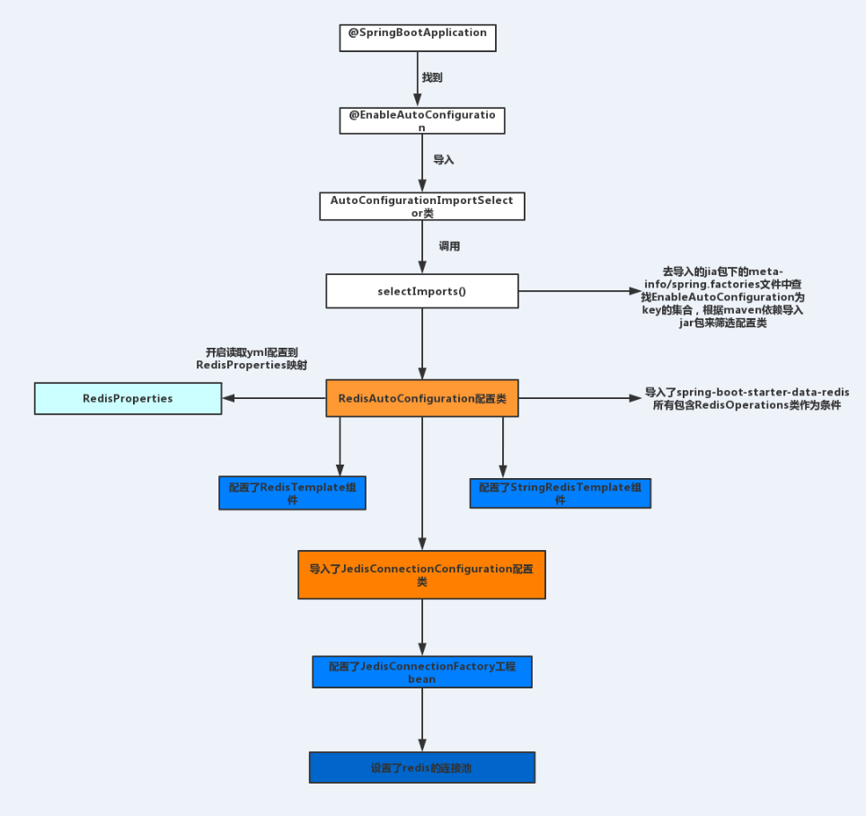

- [微服务](#微服务)
- [微服务架构](#微服务架构)
- [微服务的优缺点](#微服务的优缺点)
  - [优点](#优点)
  - [缺点](#缺点)
- [SpringBoot的热加载](#springboot的热加载)
### 微服务
通常而言把一个单一的应用程序划分为一组小的服务，每个小的服务都会运行在自己的进程中，服务之间通过轻量级的通信机制（http的rest api）进行通信，那么一个个的小服务就是微服务。

### 微服务架构
微服务架构是一种架构模式（用于服务管理微服务的），它把一组小的服务互相协调、互相配合，并且完成功能。每个服务运行在其独立的进程中，服务与服务间采用轻量级的通信机制互相协作（通常是基于HTTP 协议的RESTfulAPI ）。每个服务都围绕着具体业务进行构建，并且能够被独立的部署到生产环境、类生产环境等。另外，应当尽量避免统一的、集中式的服务管理机制，对具体的一个服务而言，应根据业务上下文，选择合适的语言、工具对其进行构建。

### 微服务的优缺点
#### 优点
- 优点每个服务足够内聚，足够小，代码容易理解这样能聚焦一个指定的业务功能或业务需求(职责单一)
- 开发简单、开发效率提高，一个服务可能就是专一的只干一件事,微服务能够被小团队单独开发，这个小团队是 2 到 5 人的开发人员组成。
- 微服务能使用不同的语言开发。
- 易于和第三方集成，微服务允许容易且灵活的方式集成自动部署，通过持续集成工具，如Jenkins,Hudson,bamboo。
- 微服务只是业务逻辑的代码，不会和 HTML,CSS或其他界面组件混合。
- 每个微服务都有自己的存储能力，可以有自己的数据库。也可以有统一数据库。

#### 缺点
- 开发人员要处理分布式系统的复杂性(分布式事物)
- 多服务运维难度，随着服务的增加，运维的压力也在增大
- 系统部署依赖
- 服务间通信成本
- 数据一致性

### SpringBoot的热加载
 

主要是扫描spring-boot-autoconfigure\2.0.8.RELEASE\spring-boot-autoconfigure-2.0.8.RELEASE.jar!\META-INF\spring.factories 中EnableAutoConfiguration对应的全类名。以上 就是 AutoConfigurationImportSelector为我们容器中注册了那些组件，然后根据maven依赖导入的据条件装配来指定哪些组件起作用 哪些组件不起作用。
