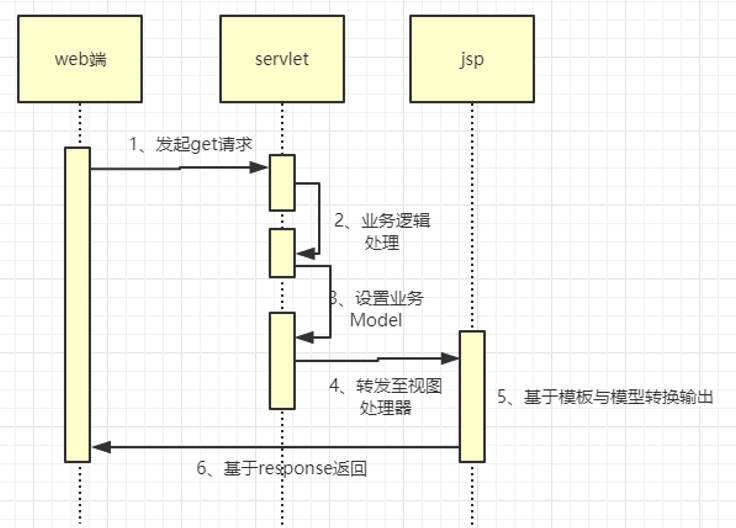
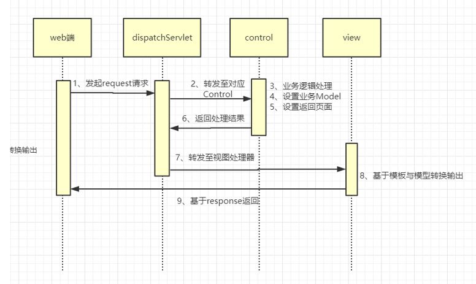
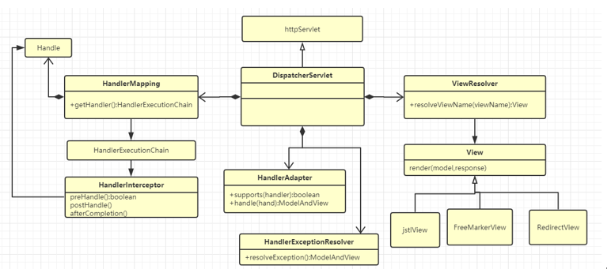
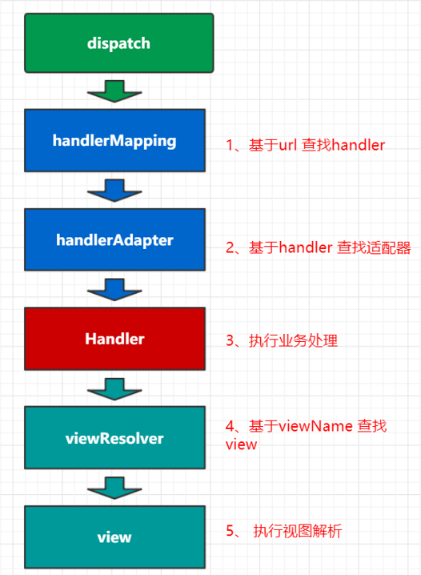
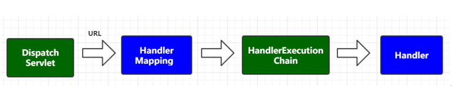
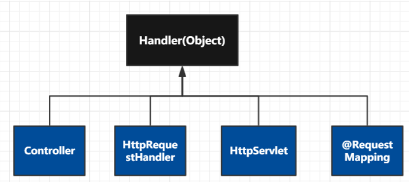
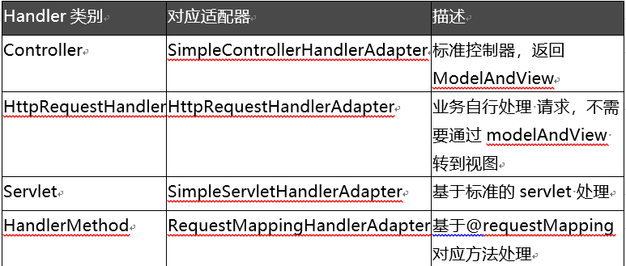

- [Servlet与jsp的执行过程](#servlet与jsp的执行过程)
- [Spring MVC的功能特性](#spring-mvc的功能特性)
- [Spring MVC的请求处理流程](#spring-mvc的请求处理流程)
- [Spring MVC的核心功能](#spring-mvc的核心功能)
  - [Spring MVC中的关键组件](#spring-mvc中的关键组件)
  - [执行流程](#执行流程)
  - [HandlerMapping](#handlermapping)
  - [Handler的类型](#handler的类型)
  - [HandlerAdapter](#handleradapter)
  - [ViewResolver与View详解](#viewresolver与view详解)
  - [HandlerInterceptor 拦截器](#handlerinterceptor-拦截器)

### Servlet与jsp的执行过程
  

1. web端请求servlet
2. servlet处理请求
3. 设置业务model
4. forward jsp servlet
5. jsp servlet解析封装html返回

### Spring MVC的功能特性
spring mvc本质上还是使用servlet处理，并在其基础上进行了封装，简化了开发流程，提高了易用性，并使程序的逻辑结构变得更加清晰。
- 基于注解的url映射
- 表单参数映射
- 缓存处理
- 全局统一异常处理
- 拦截器的实现
- 下载处理

### Spring MVC的请求处理流程
  

- DispatchServlet是怎么找到Controller的
- 找到Controller之后是怎么执行业务方法的

### Spring MVC的核心功能
#### Spring MVC中的关键组件
1. HandlerMapping：url与控制器的映射
2. HandlerAdapter：控制器的执行适配器
3. ViewResolver：视图仓库
4. View：具体视图解析
5. HandlerExceptionResolver：异常捕捉器
6. HandlerInterceptor：拦截器
   
  

#### 执行流程


#### HandlerMapping 
其为mvc 中url路径与Control对像的映射，DispatcherServlet 就是基于此组件来寻找对应的Control，如果找不到就会报 No mapping found for HTTP request with URI的异常。

HandlerMapping  作用是通过url找到对应的Handler ，但其HandlerMapping.getHandler()方法并不会直接返回Handler 对像，而是返回 HandlerExecutionChain 对像在通过  HandlerExecutionChain.getHandler() 返回最终的handler

  

HandlerMapping的常用实现类
- SimpleUrlHandlerMapping：基于手动配置url与Controller进行映射。
- BeanNameUrlHandlerMapping：基于IOC名称与```/```开头的bean进行映射。
- RequestMappingHandlerMapping：基于@RequestMapping注解配置对应的映射。

#### Handler的类型
  

- Controller接口
- HttpRequestHandler接口
- HttpServlet接口
- @RequestMapping方法注解
  
可以看出 Handler 没有统一的接口，当dispatchServlet获取当对应的Handler之后如何调用呢？调用其哪个方法？这里有两种解决办法，一是用instanceof 判断Handler 类型然后调用相关方法 。二是通过引入适配器实现，每个适配器实现对指定Handler的调用。spring 采用后者。

#### HandlerAdapter
这里spring mvc 采用适配器模式来适配调用指定Handler，根据Handler的不同种类采用不同的Adapter,其Handler与 HandlerAdapter 对应关系如下:
  

#### ViewResolver与View详解
找到对应的Adapter之后就会基于适配器调用业务处理，处理完之后业务方会返回一个ModelAndView，去查找对应的视图进行处理，在```org.springframework.web.servlet.DispatcherServlet#resolveViewName() ```中遍历ViewResolvers列表中查找，如果没有找到就会报一个Could not resolve view with name 异常。

#### HandlerInterceptor 拦截器
HandlerInterceptor   用于对请求拦截，与原生Filter区别在于 Filter只能在业务执行前拦截，而HandlerInterceptor 可以在业务处理前、中、后进行处理。

其实现机制是基于 HandlerExecutionChain 分别在 doDispatch 方法中执行以下方法：
- preHandle ：业务处理前执行
- postHandle：业务处理后（异常则不执行）
- afterCompletion：视图处理后

具体逻辑源码参见：```org.springframework.web.servlet.DispatcherServlet#doDispatch``` 方法。

