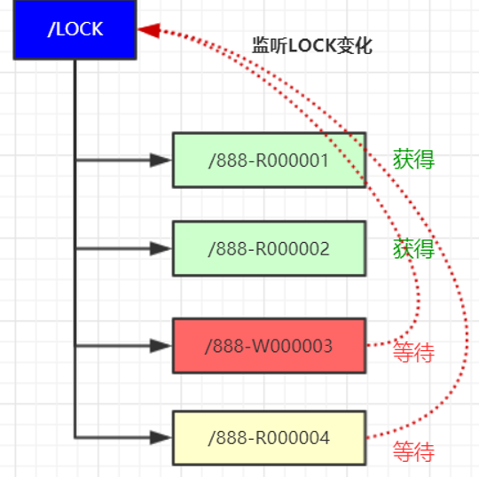

- [ZooKeeper是什么？](#zookeeper是什么)
- [ZooKeeper的节点类型](#zookeeper的节点类型)
- [ZooKeeper的集群角色说明](#zookeeper的集群角色说明)
- [ZooKeeper的Server的工作状态](#zookeeper的server的工作状态)
- [ZooKeeper的同步流程](#zookeeper的同步流程)
- [节点的监听](#节点的监听)
- [ZooKeeper提供了什么？](#zookeeper提供了什么)
  - [文件系统](#文件系统)
  - [通知机制](#通知机制)
- [ZoooKeeper的典型应用场景](#zoookeeper的典型应用场景)
  - [集群管理](#集群管理)
  - [分布式注册中心](#分布式注册中心)
  - [分布式Job](#分布式job)
  - [分布式锁](#分布式锁)
- [ZooKeeper的启动流程](#zookeeper的启动流程)
- [ZooKeeper的工作原理](#zookeeper的工作原理)
- [Leader选举](#leader选举)
  - [启动时的leader选举](#启动时的leader选举)
  - [运行过程中的Leader选举](#运行过程中的leader选举)
- [数据同步机制](#数据同步机制)
  - [客户端写入请求](#客户端写入请求)
  - [服务节点初始化同步](#服务节点初始化同步)
- [ZooKeeper的事务日志和快照日志](#zookeeper的事务日志和快照日志)
- [机器中为什么会有Leader](#机器中为什么会有leader)
- [ZooKeeper负载均衡和Nginx负载均衡的区别](#zookeeper负载均衡和nginx负载均衡的区别)

### ZooKeeper是什么？
它是一个分布式的，开源的应用程序协调服务，基于它公开的API，可以实现同步、节点状态、配置、服务注册等功能。znode是它的基本单元，叫做节点，节点下面可以包含子节点，最后以树的方式呈现。

### ZooKeeper的节点类型
  
- PERSISTENT（持久节点）:持久化保存的节点，也是默认创建的 ```create /test```
- PERSISTENT_SEQUENTIAL(持久序号节点):创建时zookeeper 会在路径上加上序号作为后缀，。非常适合用于分布式锁、分布式选举等场景。创建时添加 -s 参数即可。```create -s /test```返回创建的实际路径```Created /test0000000001```
- EPHEMERAL（临时节点）：临时节点会在客户端会话断开后自动删除。适用于心跳，服务发现等场景。创建时添加参数-e 即可。创建临时节点， 断开会话 在连接将会自动删除```create -e /temp```
- EPHEMERAL_SEQUENTIAL（临时序号节点）:与持久序号节点类似，不同之处在于EPHEMERAL_SEQUENTIAL是临时的会在会话断开后删除。创建时添加 -e -s ```create -e -s /temp/seq```

### ZooKeeper的集群角色说明
  
随着集群规模的变大，集群处理写入的性能反而下降。而且ZooKeeper 集群无法做到跨域部署。

其中最主要的问题在于，当 ZooKeeper 集群的规模变大，集群中 Follow 服务器数量逐渐增多的时候，ZooKeeper 处理创建数据节点等事务性请求操作的性能就会逐渐下降。这是因为 ZooKeeper 集群在处理事务性请求操作时，要在ZooKeeper 集群中对该事务性的请求发起投票，只有超过半数的 Follow 服务器投票一致，才会执行该条写入操作。

正因如此，随着集群中 Follow 服务器的数量越来越多，一次写入等相关操作的投票也就变得越来越复杂，并且 Follow 服务器之间彼此的网络通信也变得越来越耗时，导致随着 Follow 服务器数量的逐步增加，事务性的处理性能反而变得越来越低。

为了解决这一问题， ZooKeeper 集群中创建了一种新的服务器角色，即Observer——观察者角色服务器。Observer 可以处理 ZooKeeper 集群中的非事务性请求，并且不参与 Leader 节点等投票相关的操作。这样既保证了 ZooKeeper 集群性能的扩展性，又避免了因为过多的服务器参与投票相关的操作而影响ZooKeeper 集群处理事务性会话请求的能力。

在实际部署的时候，因为 Observer 不参与 Leader 节点等操作，并不会像 Follow 服务器那样频繁的与 Leader 服务器进行通信。因此，可以将 Observer 服务器部署在不同的网络区间中，这样也不会影响整个 ZooKeeper 集群的性能，也就是所谓的跨域部署。

### ZooKeeper的Server的工作状态
有三种工作状态
- LOOKING:当前Server不知道leader是谁，正在搜索。
- LEADING:当前Server就是选来的leader。
- FOLLOWING:leader已经选出，当前server与之同步。

### ZooKeeper的同步流程
选完leaderz之后就进入了同步过程
- leader等待sercver的连接
- follower连接leader,将zxid发送给leader
- leader根据follower的zxid确定同步点
- 完成同步后通知follower改为uptodata状态
- follower受到uptodata消息后，可以接收client的请求进行服务
  


### 节点的监听
客户添加 -w 参数可实时监听节点与子节点的变化，并且实时收到通知。非常适用保障分布式情况下的数据一至性。其使用方式如下：
  

### ZooKeeper提供了什么？
#### 文件系统
zk提供了一种多层级的命名空间，与文件系统不同的是，所有节点都可以设置关联数据，而文件系统目录文件不能设置关联数据。zk为了保证低延迟在内存中保存了这颗树，这种特性促使zk不能存放大量的数据，每个节点存放数据的上限为1M。

#### 通知机制
client可以对znode创建watcher事件，当znode发生变化时，client端将会收到通知，然后可以根据znode的变化进行相应的业务处理。


### ZoooKeeper的典型应用场景
#### 集群管理
需求：
1. 主动查询线上节点
2. 服务离线通知
3. 监控资源使用情况，如果资源超过阈值则进行告警。


设计：

节点结构
```
manger // 根节点
	server00001 :<json> //服务节点 1
	server00002 :<json>//服务节点 2
	server........n :<json>//服务节点 n
服务状态信息:
	cpu
	memory
	disk

```

数据生成与上报
- 创建临时节点
- 定时变更节点的状态信息

被动通知
- 监听节点下子节点的变化情况，如CPU等硬件资源达到阈值则进行告警。

主动查询
- 实时查询zk获取集群节点的状态信息。

#### 分布式注册中心
如果服务很多就需要一个中间服务帮助客户端进行服务发现。需要实现以下功能：
- 服务注册：上线
- 服务注销：下线、
- 服务订阅：动态实时的接收服务变更的消息
- 可靠：注册中心需要是一个集群，数据冗余存储，避免单点故障引起的数据丢失。
- 容错：当某一个提供者出现宕机时，注册中心能动态感知并及时的通知客户端服务的提供者的状态。

#### 分布式Job
需求：
- 多个服务只能有一个可以运行Job任务
- 运行Job的任务出现故障的时，可以切换到其他服务，Job可以继续运行。

设计
1. 服务启动
   - 在某个持久节点A先创建子节点，值为slave。
   - 判断是否存在master节点
   - 如果不存，则将自己设为为master,运行Job任务

2. master下线
   - 获取节点A下的所有子节点
   - 判断是否存在Master
   - 不存在则将最小的序号节点设置为master,执行Job任务。

#### 分布式锁
- 共享锁：也称作只读锁，当一方获得共享锁之后，其它方也可以获得共享锁。但其只允许读取。在共享锁全部释放之前，其它方不能获得写锁。
- 排它锁：也称作读写锁，获得排它锁后，可以进行数据的读写。在其释放之前，其它方不能获得任何锁。

1. 读锁的获取
- 基于资源ID创建临时序号读锁节点 
   /lock/888.R0000000002 Read 
- 获取 /lock 下所有子节点，判断其最小的节点是否为读锁，如果是则获锁成功
- 最小节点不是读锁，则阻塞等待。添加lock/ 子节点变更监听。
- 当节点变更监听触发，执行第2步
  

2. 写锁的获取
- 基于资源ID创建临时序号写锁节点 
   /lock/888.R0000000002 Write 
- 获取 /lock 下所有子节点，判断其最小的节点是否为自己，如果是则获锁成功
- 最小节点不是自己，则阻塞等待。添加lock/ 子节点变更监听。
- 当节点变更监听触发，执行第2步

3. 锁的释放
读取完毕后，手动删除临时节点，如果获锁期间宕机，则会在会话失效后自动删除。

4. 羊群效应
   
    在等待锁获得期间，所有等待节点都在监听 Lock节点，一但lock 节点变更所有等待节点都会被触发，然后在同时反查Lock 子节点。如果等待队列过大会使用Zookeeper承受非常大的流量压力。
      

    为了改善这种情况，可以采用监听链表的方式，每个等待对列只监听前一个节点，如果前一个节点释放锁的时候，才会被触发通知。这样就形成了一个监听链表。如果是读锁则监听前一个节点的数据变化，由等待变为活跃。
      

### ZooKeeper的启动流程
  

### ZooKeeper的工作原理
zk的核心是原子广播，这个机制保证了各个Server之前的同步，实现这个机制的协议是zab协议，zab有两种模式：
- 恢复模式（选主）：当服务器或者master崩溃后，就进入恢复模式，选完master且大部分完成和master的状态同步之后恢复模式就结束了。需要保证已被处理的消息不能丢失，被丢失的消息不能再次出现。
- 广播模式（同步）：类似于一个二阶段提交，但是又有所不同，并非所有follower节点都返回ack才进行一致性事物完成，而是只需要半数以上即可。客户端轮询zokeeper集群中各个节点，当轮询到一台是follower，如果是读的请求，follower会返回请求结果，如果是增加修改删除操作，follower会像leader生成事物请求，针对客户端的事物请求，leader会为其生成对应的事物Proposal，然后发送给集群中所有follower服务器，然后分别在收集各自的选票，最后进行事物提交，ZAB协议的二阶段提交过程中移除了了中断提交过程，对zookeeper集群来说，超过半数反馈ack就代表事物成功，这种方式无法完成所有节点事物一致问题，所以ZAB协议采用了崩溃恢复模式来解决数据不一致的问题。另外整个消息广播协议是基于具有FIFO特性的TCP协议进行通讯的，因此能够很容易的保证消息广播过程中的消息接收与发送的顺序性。

### Leader选举
leader选举分为两个过程：
- 启动时的leader选举
- leader崩溃时的选举

#### 启动时的leader选举
每个节点启动的时候状态都是 LOOKING，处于观望状态，接下来就开始进行选主流程。

进行 Leader 选举，至少需要两台机器（具体原因前面已经讲过了），我们选取 2 台机器组成的服务器集群为例。在集群初始化阶段，当有一台服务器 Server1 启动时，它本身是无法进行和完成 Leader 选举，当第二台服务器 Server2 启动时，这个时候两台机器可以相互通信，每台机器都试图找到 Leader，于是进入 Leader 选举过程。选举过程如下：

- 每个 Server 发出一个投票。由于是初始情况，Server1和 Server2 都会将自己作为 Leader 服务器来进行投票，每次投票会包含所推举的服务器的 myid 和 ZXID、epoch，使用(myid, ZXID,epoch)来表示，此时 Server1的投票为(1, 0)，Server2 的投票为(2, 0)，然后各自将这个投票发给集群中其他机器。

- 接受来自各个服务器的投票。集群的每个服务器收到投票后，首先判断该投票的有效性，如检查是否是本轮投票（epoch）、是否来自LOOKING状态的服务器。

- 处理投票。针对每一个投票，服务器都需要将别人的投票和自己的投票进行 PK，PK 规则如下

   - 优先检查 ZXID。ZXID 比较大的服务器优先作为Leader。如果 leader 选举算法能够保证新选举出来的 Leader 服务器拥有集群中所有机器最高编号（ZXID 最大）的事务Proposal，那么就可以保证这个新选举出来的 Leader 一定具有已经提交的提案。因为所有提案被 COMMIT 之前必须有超过半数的 follower ACK，即必须有超过半数节点的服务器的事务日志上有该提案的 proposal，因此，只要有合法数量的节点正常工作，就必然有一个节点保存了所有被 COMMIT 消息的 proposal 状态

  - 如果 ZXID 相同，那么就比较 myid。myid 较大的服务器作为 Leader 服务器。

   对于 Server1 而言，它的投票是(1, 0)，接收 Server2的投票为(2, 0)，首先会比较两者的 ZXID，均为 0，再比较 myid，此时 Server2 的 myid 最大，于是更新自己的投票为(2, 0)，然后重新投票，对于 Server2 而言，它不需要更新自己的投票，只是再次向集群中所有机器发出上一次投票信息即可。

- 统计投票。每次投票后，服务器都会统计投票信息，判断是否已经有过半机器接受到相同的投票信息，对于 Server1、Server2 而言，都统计出集群中已经有两台机器接受了(2, 0)的投票信息，此时便认为已经选出了 Leader。

- 改变服务器状态。一旦确定了 Leader，每个服务器就会更新自己的状态，如果是 Follower，那么就变更为FOLLOWING，如果是 Leader，就变更为 LEADING。

#### 运行过程中的Leader选举
当集群中的 leader 服务器出现宕机或者不可用的情况时，那么整个集群将无法对外提供服务，而是进入新一轮的Leader 选举，服务器运行期间的 Leader 选举和启动时期的 Leader 选举基本过程是一致的。

- 变更状态。Leader 挂后，余下的非 Observer 服务器都会将自己的服务器状态变更为 LOOKING，然后开始进入 Leader 选举过程。

- 每个 Server 会发出一个投票。在运行期间，每个服务器上的 ZXID 可能不同，此时假定 Server1 的 ZXID 为123，Server3的ZXID为122；在第一轮投票中，Server1和 Server3 都会投自己，产生投票(1, 123)，(3, 122)，然后各自将投票发送给集群中所有机器。接收来自各个服务器的投票。与启动时过程相同。

- 处理投票。与启动时过程相同，此时，Server1 将会成为 Leader。

- 统计投票。与启动时过程相同。

- 改变服务器的状态。与启动时过程相同。


### 数据同步机制
同步时涉及两个流程，一个是正常的客户端数据提交，另一个是集群某个节点宕机在恢复后的数据同步。
#### 客户端写入请求
   写入请求的大至流程是，收leader接收客户端写请求，并同步给各个子节点。但实际情况要复杂的多，比如client 它并不知道哪个节点是leader 有可能写的请求会发给follower ，由follower在转发给leader进行同步处理。

    


- client向zk中的server发送写请求，如果该server不是leader，则会将该写请求转发给leader server，leader将请求事务以proposal形式分发给follower
- 当follower收到收到leader的proposal时，根据接收的先后顺序处理proposal；
- 当Leader收到follower针对某个proposal过半的ack后，则发起事务提交，重新发起一个commit的proposal
- Follower收到commit的proposal后，记录事务提交，并把数据更新到内存数据库；
- 当写成功后，反馈给client。
 #### 服务节点初始化同步
 在集群运行过程当中如果有一个follower节点宕机，由于宕机节点没过半，集群仍然能正常服务。当leader 收到新的客户端请求，此时无法同步给宕机的节点。造成数据不一至。为了解决这个问题，当节点启动时，第一件事情就是找当前的Leader，比对数据是否一至。不一至则开始同步,同步完成之后在进行对外提供服务。如何比对Leader的数据版本呢，这里通过ZXID事务ID来确认。比Leader小就需要同步。


ZXID是一个长度64位的数字，其中低32位是按照数字递增，任何数据的变更都会导致,低32位的数字简单加1。高32位是leader周期编号，每当选举出一个新的leader时，新的leader就从本地事务日志中取出ZXID,然后解析出高32位的周期编号，进行加1，再将低32位的全部设置为0。这样就保证了每次新选举的leader后，保证了ZXID的唯一性而且是保证递增的。 


### ZooKeeper的事务日志和快照日志
ZK中所有的数据都是存储在内存中，即zkDataBase中。但同时所有对ZK数据的变更都会记录到事务日志中，并且当写入到一定的次数就会进行一次快照的生成。已保证数据的备份。其后缀就是ZXID（唯一事物ID）。
- 事务日志：每次增删改，的记录日志都会保存在文件当中
- 快照日志：存储了在指定时间节点下的所有的数据
zk数据的存储是通过DataTree 对象进行，其用了一个map 来进行存储。
  

#### Zookeeper恢复数据流程

1. ZK会持久化磁盘两种文件：log和snapshot
2. log只负责记录每一个写请求
3. snapshot负责对当前整个内存数据进行快照
4. 恢复数据的时候，会先读取最新的snapshot文件，然后再通过快照最大的zxid去搜索符合条件的log文件，再通过逐条读取写请求来恢复剩余的数据。


### 机器中为什么会有Leader
在分布式环境中，有些业务逻辑只需要集群中的某一台机器进行执行，其他机器可以共享这个执行结果，这样可以大大减少重复计算，提高性能，于是就需要进行leader计算。

### ZooKeeper负载均衡和Nginx负载均衡的区别
zk的负载均衡可以调控，ng只能调控权重，其他需要调控的都需要写插件，但是ng的吞吐量比zk大很多，根据应用场景决定。

###  ZK与CP
zk遵循的是CP原则，即保证一致性和网络分区容错性，但不保证可用性。体现在哪里呢？

当Leader宕机后，zk集群会发起新一轮投票选举，投票选举期间所有的Follower主机都处于LOOKING状态，对外不提供服务。但Leader的选举一般在200ms内完成，最长不超过60s，整个选举期间，zk集群是不对外提供服务的，不接受客户端的读写请求的，即zk集群处于瘫痪状态。所以它不满足可用性。

### zk可能存在脑裂问题
zk脑裂问题指的是：在多机房部署中，若出现网络连接问题，形成多个分区，则可能出现脑裂问题，如果出现脑裂问题，可能会导致数据不一致。

  

当A机房、B机房、C机房之间的网络都正常连接的时候，3个机房的zk主机形成了一个zk集群，A机房有一台zk主机被选举为Leader，B、C机房的zk主机全部是Follower；

当A机房与B机房，A机房与C机房网络突然中断，导致B、C机房的Follower不能与A机房的Leader通信，此时B、C机房的Follower就会认为Leader已经挂了，B、C机房机会进入重新Leader选举，最终会在B or C机房中选举一台zk主机为Leader；

当B、C机房中的某台zk主机被选举为Leader时，此时A、B、C三个机房同时存在了2个Leader，这就是zk脑裂问题，如果A、B、C三个机房的zk同时提供对外服务，可能就会导致数据不一致问题。

   


