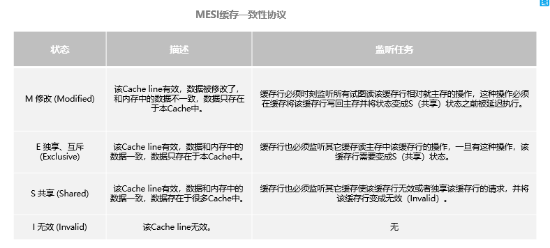

- [AQS](#aqs)
	- [AQS框架是怎么回事？](#aqs框架是怎么回事)
	- [Synchronized的原理是什么？](#synchronized的原理是什么)
	- [Synchronized的可重入性。](#synchronized的可重入性)
	- [Synchronized的非公平性。](#synchronized的非公平性)
	- [Synchronized的悲观性。](#synchronized的悲观性)
	- [乐观锁的优缺点。](#乐观锁的优缺点)
	- [JVM对Java原生锁做的优化。](#jvm对java原生锁做的优化)
	- [锁消除与锁粗化。](#锁消除与锁粗化)
	- [Synchronized与ReentrantLock的异同。](#synchronized与reentrantlock的异同)
	- [ReentrantLock是如何实现重入的？](#reentrantlock是如何实现重入的)
	- [ReadWriteLock和StampedLock的区别。](#readwritelock和stampedlock的区别)
	- [JUC中让线程彼此同步的同步器。](#juc中让线程彼此同步的同步器)
	- [线程池是怎么实现的？](#线程池是怎么实现的)
	- [创建线程池的核心参数。](#创建线程池的核心参数)
	- [如何提交线程。](#如何提交线程)
	- [Java内存模型（JMM模型）。](#java内存模型jmm模型)
	- [volatile如何保证线程间的可见性？](#volatile如何保证线程间的可见性)
	- [volatile与Synchronized的区别？](#volatile与synchronized的区别)
	- [Synchronized与ThreadLocal的区别？](#synchronized与threadlocal的区别)
	- [ThreadLocal使用是需要注意些什么？](#threadlocal使用是需要注意些什么)

## AQS
### AQS框架是怎么回事？   
AQS(AbastractQueuedSynchronized)是一个用来构建锁与同步器的框架，各种锁包含（ReentrantLock、ReadWriteLock），以及其他如Semaphore、CountDownLatch，都是基于AQS来构建的。

 - AQS内部定义了一个volatile int state 变量，表示同步状态。
	 - state：0 说明没有任何线程占用共享资源，线程可以获取锁，并将state置为1。
	 - state：1 说明线程正在占用共享资源，其他线程必须假如同步队列进行等待。

 - AQS通过内部类Node构建一个双向链表结构的同步队列，来完成线程获取锁的排队工作；当线程获取锁失败后，就被添加到队列的末尾。
	 - Node类是对要访问共享资源的线程的封装，包含了线程本身，以及线程的状态waitStatus，有五种取值（表示是否被阻塞，是否等待唤醒，是否已经被取消等），每个Node节点关联其prev节点和next节点，方便共享资源被释放后快速地唤醒下一个等待的线程，是一个先进先出FIFO的过程。
	 - Node类有两个常量，SHARED和EXCLUSIVE，分别表示共享模式和独占模式。
		 1. 共享模式：一个锁允许多条线程同时操作（信号量Semaphore就是基于AQS的共享模式实现的）。
		 2. 同一时刻只允许一个线程对共享资源进行操作，其他线程需要进行排队等待（如ReentratLock）。

 - AQS通过ConditionObject构建条件等待队里，当Condition调用wait()方法后，线程假如条件队列；当Condition调用signal()方法后，线程将从条件队列移动到同步队列进行锁竞争。

### Synchronized的原理是什么？

- Synchronized是JVM是同步互斥的一种方式，被Synchronzied修饰的代码块在被编译前后被编译器生成了monitorenter和monitorexit两个字节指令，依赖于底层操作系统的Mutex lock（互斥锁）实现，它是一个重量级锁，性能较低，JVM在1.5版本后对Synchronized做出重大优化，图锁粗化、锁消除、偏向锁、自旋锁等技术减少锁操作开销，内置锁的性能基本与ReentractLock持平。
- 在虚拟机执行到monitorenter指令时，首先要尝试获取对象的锁，如果这个对象没有被锁定，或者当前线程已经拥有了这个对象锁，则把锁的计数器+1，当执行到monitorexit指令时，将锁的计数器-1；当计数器的值为0时，锁就被释放了。如果获取对象锁失败了，则需要阻塞等待，直到对象锁被另一个线程释放。Java中Synchronized通过在对象头（Mark Word）设置标记，达到获取锁和释放锁的目的。

- 对象的内存布局
  - 对象头：比如hash码，对象所属的年代、对象锁、锁状态标志、数组长度等。
  - 实例数据：即创建对象时，对象的成员变量方法等。
  - 对齐填充：对象的大小必须是8的整数倍。

- Mark Word被设计成一个非固定的数据结构以便在极小的空间内存储尽量多的数据，会根据对象的状态服用自己的存储空间，也就是说Mark Word会随着程序的运行发生变化。

### Synchronized的可重入性。
可重入性是锁的一个基本要求，为了避免自己锁死自己的情况。假如方法一获得了锁，在方法一里面调用方法二，方法二同样需要获取锁，假如Synchronized不支持重入，那么方法二就要等待方法一释放锁之后才能执行方法二的代码，从而就造成了死锁。因此在执行monitorenter指令时，如果当前线程已经拥有了共享资源的锁，直接锁计数器+1即可，本质上通过这种方式实现的锁的可重入性。

### Synchronized的非公平性。
非公平主要表现在获取锁的行为上，并不是按照申请锁的先后顺序来获取锁，当一个共享资源被释放后，任何一个等待获取锁的线程均有机会竞争到锁，这么做是为了提高执行性能，但是缺点是可能产生线程饥饿的现象。

### Synchronized的悲观性。
- Synchronized是一个悲观锁，不管是否产生竞争，任何数据操作都需要加锁。
- 乐观锁：先进行操作，如果没有产生竞争，则操作成功了，如果有临界资源被其他线程使用，则采取补偿措施，这种操作不需要线程关系，因此被称为非阻塞同步。
- CAS(Compare And Swap)比较并转换是乐观锁的核心算法，涉及三个操作数；内存值、预期值、新值。当前仅当预期值与内存值相当的时候才将内存值修改为新值。如果不一样则涉及本次操作，证明其他线程对此内存值有过操作，反之则没有。
- CAS操作具有原子性，基于处理器提供的CMPXCHG指令实现，基本思路是循环进行CAS操作直到成功为止。

### 乐观锁的优缺点。
- 优点：
	- 避免了悲观锁独占的现象，同时也提高了并发性能。
- 缺点：
	- 只能保证一个共享变量的操作，不能保证多个。
	- 长时间自旋可能导致CPU较大开销。
	- CAS操作可能会出现ABA问题，即一个线程修改了内存值之后又修改为原值，可以利用版本号来解决此问题。

### JVM对Java原生锁做的优化。
- 在Java 6之前，Synchronized完全依赖于底层操作系统的互斥锁来实现线程获取和释放锁，但是这种方式需要Java层面的线程与操作系统的原生线程进行映射，线程的阻塞和唤醒需要操作系统的协助，需要从用户态切换到内核态来执行；经常性的切换需要很大的代价，很耗处理器的时间，因此Java 6对它进行了优化。
- 偏向锁、轻量级锁、重量级锁；这三中锁对Synchronized进行了有优化，检测到不同的竞争状态会切换到不同的锁，这就是锁的膨胀、升级过程。
	- 当没有竞争出现时，默认是偏向锁，JVM利用CAS操作在对象头的Mark Word部分设置线程ID，表示当前锁偏向于此线程，也即获取锁之后再申请锁无需做任何同步操作，节省了关锁申请的操作，提高了性能。
	- 如果此时有另一个线程也需要获取被偏向过的对象，此时就要撤销偏向锁，升级为轻量级锁，
	- 轻量级锁使用CAS操作Mark Word来试图获取锁，如果重试成功，就使用普通的轻量级锁，否则进一步升级为重量级锁。

	  

### 锁消除与锁粗化。
- 锁消除：是指虚拟机即使编译器在运行时，对一些代码上要求同步，但是不可能存在临界资源存在竞争，因此进行锁消除，主要根据逃逸分析；如StringBuffer的append操作。
- 锁粗化：如果一系列的连续操作都是对统一对象反复的加锁和解锁，甚至加锁在循环体内，会造成不必要的性能损耗，锁粗化就是加大锁的作用域。

### Synchronized与ReentrantLock的异同。
- ReentrantLock是Lock的实现类，从功能角度比Synchronized的同步操作更细。
- ReentrantLock支持等待可中断，对持有锁但长时间不释放的时候，等待线程可以放弃等待。
- ReentrantLock带超时的获取锁尝试，在指定的时间获取锁，如果超时仍无法获取则返回。
- ReentrantLock可以判断是否有线程在排队等待获取锁。
- ReentrantLock可以实现公平锁。
- Synchronized无需显示获取与释放，由JVM进行管理；ReentrantLock需基于Lock()与unLock()进行获取与释放。
- 在竞争不激烈的情况下，Synchronized的性能优于ReentrantLock，但是在竞争激烈的情况下ReentrantLock的性能优于Synchronized。

### ReentrantLock是如何实现重入的？
ReentrantLock内部自定义同步器Sync，在加锁的通过CAS算法，将线程放到一个同步链表中，每次获取锁的时候判断维护的线程ID与当前线程的ID是否一致，一致则可重入。

### ReadWriteLock和StampedLock的区别。
- ReadWriteLock是为了弥补Synchronized的独占性；在实际的应用场景中存在读大于写的情况，因此ReadWriteLock支持共享读，独占写。但是读锁与写锁是互斥的；读锁被占用的情况下，写线程则被阻塞，从而保证的不会读取到有争议的数据。但是读写锁的性能并不好，如果使用不当会存在线程饥饿的现象。
- StampedLock提供了乐观读模式，使用tryOptimisticRead()方法获取一个非排他锁并且不会进入阻塞状态。

### JUC中让线程彼此同步的同步器。
- CountDownLatch:倒计数，允许一个线程或多个线程等待某些操作完成之后再执行，例如一名裁判需要等所有选手（其他线程）跑完次才能进行颁奖（主线程）。
- CyclicBarrier:循环栅栏，多个线程相互等待至某个状态后一起执行。CyclicBarrier可以被重复使用。例如，一帮同学去饭店吃饭，只有等最后一个同学到了才能开始吃。
- Semaphore:信号量，控制访问共享资源的个数，通过acquire()获取，通过release()释放。例如，厕所只有5个坑位，但是有10个人需要上厕所，则其他人只能等待。

### 线程池是怎么实现的？
- 线程池中的线程，被抽象为一个静态内部类Worker，基于AQS实现，存放在线程池的HashSet workers成员变量中。
- 线程池中的任务被存放在workQueue(BlockingQueue workQueue)中。
- 实现的基本思想是：从workQueue中不断取出需要执行的任务，放到Workers中进行处理。

### 创建线程池的核心参数。
- corePoolSize:线程池中的核心线程数，当提交一个任务时，线程池创建一个新线程执行任务，直到当前线程数等于corePoolSize；如果当前线程数为corePoolSize，继续提交的任务被保存到
阻塞队列中，等待被执行；如果执行了线程池的prestartAllCoreThreads()方法，线程池会
提前创建并启动所有核心线程。
- maximumPoolSize：线程池中允许的最大线程数。如果当前阻塞队列满了，且继续提交任务，则创建新的线程执行任务，前提是当前线程数小于maximumPoolSize。
- keepAliveTime：线程池维护线程所允许的空闲时间。当线程池中的线程数量大于corePoolSize的时
候，如果这时没有新的任务提交，核心线程外的线程不会立即销毁，而是会等待，直到等待的时间超过了keepAliveTime。
- unit：keepAliveTime的单位。
- workQueue：用来保存等待被执行的任务的阻塞队列，且任务必须实现Runable接口，在JDK中提供
了如下阻塞队列：
	1. ArrayBlockingQueue：基于数组结构的有界阻塞队列，按FIFO排序任务；
	2. LinkedBlockingQuene：基于链表结构的阻塞队列，按FIFO排序任务，吞吐量通常要高于ArrayBlockingQuene；
	3. SynchronousQuene：一个不存储元素的阻塞队列(缓冲区为1)，每个插入操作必须等到另一个线程调用移除操作，否则插入操作一直处于阻塞状态，吞吐量通常要高于LinkedBlockingQuene；
	4. priorityBlockingQuene：具有优先级的无界阻塞队列。
- threadFactory：它是ThreadFactory类型的变量，用来创建新线程。默认使用Executors.defaultThreadFactory() 来创建线程。使用默认的ThreadFactory来创建线程时，会使新创建的线程具有相同的NORM_PRIORITY优先级并且是非守护线程，同时也设置了线程的名称。
- handler：线程池的饱和策略，当阻塞队列满了，且没有空闲的工作线程，如果继续提交任务，必
须采取一种策略处理该任务，线程池提供了4种策略：
	1. AbortPolicy：直接抛出异常，默认策略；
	2. CallerRunsPolicy：用调用者所在的线程来执行任务；
	3. DiscardOldestPolicy：丢弃阻塞队列中靠最前的任务，并执行当前任务；
	4. DiscardPolicy：直接丢弃任务；
	5. 上面的4种策略都是ThreadPoolExecutor的内部类。当然也可以根据应用场景实现RejectedExecutionHandler接口，自定义饱和策略，如记录日志或持久化存储不能处理的任务。

### 如何提交线程。
- execute():ExecutorService.execute接收一个Runable实例，用来执行一个任务。
- submit(): ExecutorService.submit()方法返回的是Future对象。可以用iSDone()来查询Future是否已经完成，当任务完成时，它具有一个结果，可以调用get()来获取结果。也可以不用isDone()来进行检查直接调用get()，这种情况下get()将被阻塞，直到结果准备就绪。

### Java内存模型（JMM模型）。
Java内存模型是程序中各个变量的访问规则，即变量存储到内存及从内存读取变量的一些底层细节。所有的变量都存储在主内存，每条线程有自己的工作内存，存放从主内存的拷贝，线程对变量的所有操作（读取，赋值）都是在自己的工作内存中进行的，不能直接操作主内存的变量。不同线程的工作内存是相互隔离的，线程间变量的传递需要通过主内存。Java内存模型定义了8中内存间的操作。

- lock：把变量标识为线程独占。
- unlock：把一个处于锁状态的变量释放出来，释放之后才能被其他线程锁定。
- read：把一个变量从主内存输出到工作内存，以便load。
- load：把read操作从主内存得到的变量值放入到工作内存的变量副本中。
- use：作用于工作内存的变量，把工作内存中的一个变量值传递给执行引擎。
- assgin：作用于工作内存的变量，它把一个从执行引擎接收到的值赋给工作内存的变量。
- store：把工作内存的变量值传送到主内存，以便write。
- write：把store操作从工作内存得到的变量值，写入到主内存变量中。

### volatile如何保证线程间的可见性？
当一个变量被volatile修饰之后，具备两种特性：
- 基于mesi(缓存一致性协议)保证对所有线程的可见性。当一个线程修改了这个变量值，新值对于其他线程立即可见。
- 禁止指令重排序优化。基于内存屏障实现，内存屏障的禁止屏障前后的指令执行重排序优化。
- volatile的操作并不能保证原子性。

### volatile与Synchronized的区别？
Synchronized既能保证原子性，也能保证可见性，volatile只能保证线程间的可见性。

### Synchronized与ThreadLocal的区别？
两者都拥有多线程的并发访问，防止对临界资源的访问产生冲突；Synchronized基于锁实现统一时刻只能有一个线程对变量或代码块进行访问，是一种以时间换空间的方式；ThreadLocal是为每个线程提供了一个变量副本，每个线程同一时刻访问的并不是相同对象，根除了对变量的共享，是一种以空间换时间的方式。

### ThreadLocal使用是需要注意些什么？
需要注意remove操作，ThreadLocal是基于ThreadLocalMap实现的，它的key是一个弱引用，通常弱引用都会和引用队列配合清理机制使用，但是ThreadLocal并没有这么做，这意味着废弃项目的回收需要依赖于显示处罚，否则需要等待线程结束再回收相应的ThreadLocalMap，这是很多OOM的来源，因此需要自己负责remove，并不要和线程池配合使用，因为worker通常是不会退出的。