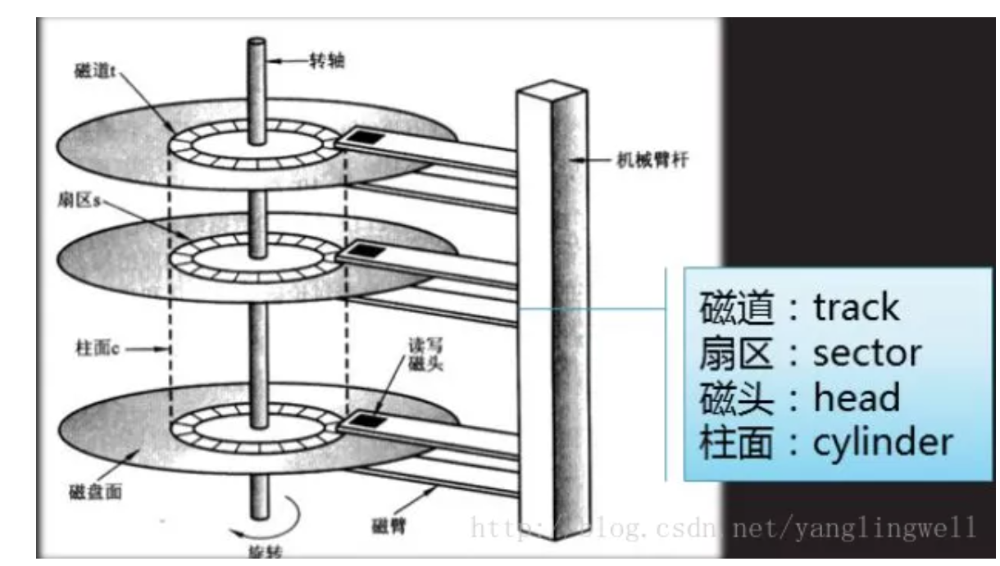

- [操作系统简介](#操作系统简介)
  - [什么是操作系统](#什么是操作系统)
  - [什么是用户态和内核态](#什么是用户态和内核态)
- [进程与线程](#进程与线程)
  - [进程与线程的区别](#进程与线程的区别)
  - [线程与协成](#线程与协成)
  - [协程的注意事项](#协程的注意事项)
  - [进程的五种状态](#进程的五种状态)
  - [进程的调度算法](#进程的调度算法)
  - [进程的通信方式](#进程的通信方式)
  - [线程的七种状态](#线程的七种状态)
  - [线程间的同步方式](#线程间的同步方式)
- [死锁](#死锁)
  - [死锁的四个必要条件](#死锁的四个必要条件)
  - [处理死锁的基本策略](#处理死锁的基本策略)
  - [活锁](#活锁)
- [内存的管理](#内存的管理)
  - [内存连续分配算法](#内存连续分配算法)
  - [虚拟内存](#虚拟内存)
  - [页面置换算法](#页面置换算法)
  - [颠簸/抖动](#颠簸抖动)
- [文件系统](#文件系统)
  - [磁盘的物理结构](#磁盘的物理结构)
  - [磁盘的调度算法](#磁盘的调度算法)
- [IO](#io)
  - [Unix 常见的IO模型](#unix-常见的io模型)
  - [select、poll 和 epoll 之间的区别](#selectpoll-和-epoll-之间的区别)
  
### 操作系统简介

#### 什么是操作系统
操作系统本质上是一个运行在计算机上面的软件，管理着计算机硬件和软件资源，为计算机硬件和软件提供一个中间层，使应用软件和硬件层分离，屏蔽了硬件的复杂性，从而使我们的关注点放在软件应用上。操作系统的主要功能有：
- 进程管理：进程管理的主要任务就是任务调度，以及进程的创建、销毁、同步、通信、阻塞、唤醒、死锁处理等功能。
- 内存管理：内存的分配与回收、地址的映射、虚拟内存以及页面置换。
- 文件管理：有效的管理文件的存储空间，合理的组织和管理文件系统，为文件的访问和文件的保护提供更有效的方法和手段。
- 设备管理：根据确定设备分配原则对设备进行分配，使设备与主机能够并行工作，为用户提供良好的设备使用界面。

#### 什么是用户态和内核态
用户态和内核态是操作系统的两种运行状态：

- 内核态：内核态运行的程序可以访问计算机的任何数据和资源，不受任何限制，包含外围设备，包含网卡，硬盘等。处于内核态的cpu可以从一个程序切换到另外一个程序，并且占用cpu不会出现抢占的情况。
- 用户态：用户态运行的程序只能受限的访问内存，只能直接读取用户程序的数据，不能访问外围设备，运行在用户态的cpu不允许独占，也就是说cpu可以被其他程序获取。

将操作系统的运行分为用户态和内核态，主要是为了对访问能力进行限制，防止随意的进行一些比较危险的操作导致系统崩溃。比如设置时钟，内存清理，这些都需要在内核态才能完成。

### 进程与线程

#### 进程与线程的区别

- 一个程序至少有一个进程，一个进程至少有一个线程，线程依赖于进程存在，线程是一个进程中代码的不同执行路线。
- 进程是对运行时程序的封装，是操作系统进行资源调度和分配的最小单位，实现了操作系统层面的并发；线程是程序执行的最小单位，是cpu调度和分配的最小单位，实现程序内部的并发。
- 资源和内存空间，进程是资源分配的基本单位，线程不拥有资源；进程之间拥有相互独立的内存单位，但是同一进程下的各个线程之间可以共享进程的内存空间以及一些进程级的资源（如打开文件和信号等），进程内的线程对其他进程不可见。
- 系统开销：创建或者销毁进程时，系统需要为之分配或者回收资源，如内存空间、io设备等；而线程只需要少量的堆栈指针以及程序计数器就可以了，开销远小于创建或撤销进程时的开销。在进行进程切换时，设计当前执行进程cpu环境的保存以及新调度进程cpu环境的设置，而线程切换只需要保存和设置少量的寄存器内容，开销较小。
- 通信：线程间通信可以通过直接读写同一进程中的数据来实现，而进程通信需要借助IPC。

#### 线程与协成

操作系统在线程等待io的时候，会阻塞当前线程，切换到其他线程，这样在当前线程等待io的过程中，其他线程可以继续执行，当系统线程较少的时候没什么问题，但是当线程数量非常大的时候，却产生了以下问题：

- 过多的线程会占用非常多的内存空间。
- 过得线程切换会占用大量的系统时间。

协程刚好可以解决上述两个问题，协成运行在线程之上，当一个协程执行完成之后，可以主动让出，让另外一个协程运行在当前线程之上。协程并没有增加线程的数量，只是在线程的基础上通过分时多路复用的方式运行多个协程。协程的切换在用户态就可以完成，切换的代价比线程从用户态切换到内核态的代价小很多。

#### 协程的注意事项

实际上操作系统并不知道协程的存在，它只知道线程，因此在协程调用阻塞io的操作时，操作系统会让线程进入阻塞状态，当前的协程和其他绑定在该线程之上的协程都会陷入阻塞状态而得不到调度，这往往是不能接受的。

因此在协程中不能调度导致线程阻塞的操作，也就是说，协程只有和一步io结合起来，才能发挥最大威力。一般有两种处理方式：

- 在线程调用阻塞io的时候，重新启动一个线程去执行这个操作，等待执行完成后，协程再去读取这个结果，这其实和多线程没有太大区别。
- 对系统的io进行封装，改成一步调用的方式，这需要大量的工作，最好寄希望于编程语言原生支持。

协程对计算密集型的任务也没有太大的好处，计算密集型的任务本身不需要大量的线程切换，因此协程的作用也十分有限，反而还增加了协程切换的开销。

#### 进程的五种状态

- 创建状态：进程刚被创建，尚未进入就绪队列。创建需要完成两个步骤：即为为新进程分配所需要的资源和空间；设置进程为就绪态，并等待调度执行。
- 就绪状态：进程已经获取了除cpu以外的所需要的一切资源，一旦得到cpu资源就可以开始运行。
- 运行状态：进程正在处理器上面运行。
- 阻塞状态：进程因为等待某一个事件而暂停运行，比如等待某些资源或者等待io操作完成，即使此时cpu是空闲的，该进程也是不能运行的，也在阻塞状态。
- 终止状态：进程达到正常结束或因其他原因被终止，下一步将被撤销。终止一个进程需要两个步骤，先等待操作系统或者相关的进行善后处理；然后回收占用的资源并被操作系统删除。

  

只有就绪态和运行态可以相互转换，其它的都是单向转换。就绪状态的进程通过调度算法从而获得 CPU 时间，转为运行状态；而运行状态的进程，在分配给它的 CPU 时间片用完之后就会转为就绪状态，等待下一次调度。

阻塞状态是缺少需要的资源从而由运行状态转换而来，但是该资源不包括 CPU 时间，缺少 CPU 时间会从运行态转换为就绪态。

#### 进程的调度算法

- 先来先服务：按照请求的顺序进行调度，使用队列实现。有利于长作业，但不利于短作业，因为短作业必须一直等待前面的长作业执行完毕才能执行，而长作业又需要执行很长时间，造成了短作业等待时间过长。
- 最短作业优先：按照估计运行时间最短的顺序进行调度。有利于短作业，但长作业有可能饿死，处于一直等待短作业执行完毕的状态，因为可能一直有短作业到来，那么长作业永远得不到调度。
- 最短剩余时间优先：按估计剩余时间最短的顺序进行调度。
- 时间片轮转：将所有就绪进程按 FCFS 的原则排成一个队列，每次调度时，把 CPU 时间分配给队首进程，该进程可以执行一个时间片。当时间片用完时，调度程序便停止该进程的执行，并将它送往就绪队列的末尾，同时继续把 CPU 时间分配给队首的进程。时间片轮转算法的效率和时间片的大小有很大关系：因为进程切换都要保存进程的信息并且载入新进程的信息，如果时间片太小，会导致进程切换得太频繁，在进程切换上就会花过多时间。而如果时间片过长，那么实时性就不能得到保证。
- 优先级调度：为每个进程分配一个优先级，按优先级进行调度。为了防止低优先级的进程永远等不到调度，可以随着时间的推移增加等待进程的优先级。
- 多级反馈队列调度算法：可以将这种调度算法看成是时间片轮转调度算法和优先级调度算法的结合。它设置了多个队列，每个队列时间片大小都不同，进程在第一个队列没执行完，就会被移到下一个队列。

#### 进程的通信方式

- 匿名管道pipe：用于具有亲缘关系的进程间的通信。只存在于内存文件中。
- 有名管道named pipe：用于具有无亲缘关系的进程间的通信，可以实现本机任意两个进程间的通信。存在于磁盘介质或者文件系统。
- 信号signal：用于通知和接受进程某个事件已经发生。
- 消息队列Message Queuing：消息队里是消息的链表，具有特定的格式，存放在内存中并由消息队列标识符标识。消息队列克服了信号传递信息量少，管道只能承载无格式字节流以及缓存区大小受限的等缺点。管道和消息队列的原则都是先进先出的原则，但是消息队列可以实现消息的随机查询，消息不一定按照先进先出的顺序读取，比FIFO更有优势。存放在内核中，只有在内核重启，即操作系统重启或者显示地删除一个消息队列时，该消息才会真正的被删除。
- 信号量semophore：信号量是一个计数器，可以用来控制多个进程对共享资源的访问。意图在于进程间同步。这种通信方式主要用于解决与同步相关的问题并避免竞争条件。
- 共享内存：多个进程可以访问同一块内存空间，不同进程可以及时看到对方进程中对共享内存中数据的更新。这种方式需要依靠某种同步操作，如互斥锁和信号量等。它是针对其他进程间通信方式运行效率低而专门设计的。
- 套接字 socket：与其他通信机制不同的是，socket 可用于不同机器间的进程通信。套接字是支持 TCP/IP 的网络通信的基本操作单元，可以看做是不同主机之间的进程进行双向通信的端点。

#### 线程的七种状态

在 JVM 中，可以将线程划分为以下几种状态：创建(new)、就绪(runnable/start)、运行(running)、阻塞(blocked)、等待(waiting)、时间等待(time waiting) 和 消亡(dead/terminated)。在某一时刻，一个线程只能处于一种状态。

  

#### 线程间的同步方式

- 临界区：在任意时刻只允许一个线程对共享资源进行访问，如果有多个线程试图访问公共资源，那么在有一个线程进入后，其他试图访问公共资源的线程将被挂起，并一直等到进入临界区的线程离开，临界区在被释放后，其他线程才可以抢占。
- 互斥量：采用互斥对象机制。只有拥有互斥对象的线程才有访问公共资源的权限，因为互斥对象只有一个，所以能保证公共资源不会同时被多个线程访问。当前拥有互斥对象的线程处理完任务后必须将线程交出，以便其他线程访问该资源。互斥对象和临界区对象非常相似，但是互斥量允许在进程间使用，而临界区只限制于同一进程的各个线程之间使用，但是更节省资源，更有效率。
- 信号量：信号量其实就是一个计数器，限制了同一时刻访问同一资源的最大线程数。如果这个计数达到了零，则所有对这个Semaphore类对象所控制的资源的访问尝试都被放入到一个队列中等待，直到超时或计数值不为零为止。
- 事件 Event，wait/notify：事件机制，允许一个线程在处理完一个任务后，主动唤醒另一个线程执行任务，通过通知操作的方式来保持线程的同步。

### 死锁

在两个或以上并发进程中，如果每个进程持有某种资源并且都等待别的进程释放它们保持着的资源，在未改变这种状态之前都不能向前推进，称这一组进程产生了死锁，也就是多个进程无限期的阻塞、相互等待的一种状态。

#### 死锁的四个必要条件

- 互斥条件：一个资源每次只能被一个进程使用。此时若有其他进程请求该资源，则请求进程只能等待。
- 请求与保持条件：进程已经获得了至少一个资源，但是又提出新的资源请求，而该资源已经被其他进程占有，此时请求进程被阻塞，但对自己已获得的资源保持不放。即当一个进程等待其他进程是，继续占有已经分配的资源。
- 不可剥夺条件：进程所获得的资源在未使用完毕之前，不能被其他进程强行夺走，只能由获得该资源的进程释放。
- 循环等待条件：若干进程间形成首尾相接的循环等待资源的关系。

#### 处理死锁的基本策略

常用的处理死锁的方法有：死锁预防、死锁避免、死锁检测、死锁解除、鸵鸟策略。

- 死锁的预防：基本思想就是确保死锁发生的四个必要条件中至少有一个不成立。
- 死锁避免：死锁预防通过约束资源请求，防止4个必要条件中至少一个的发生，可以通过直接或间接预防方法，但是都会导致低效的资源使用和低效的进程执行。而死锁避免则允许前三个必要条件，但是通过动态地检测资源分配状态，以确保循环等待条件不成立，从而确保系统处于安全状态。所谓安全状态是指：如果系统能按某个顺序为每个进程分配资源（不超过其最大值），那么系统状态是安全的，换句话说就是，如果存在一个安全序列，那么系统处于安全状态。银行家算法是经典的死锁避免的算法。
- 死锁预防策略是非常保守的，他们通过限制访问资源和在进程上强加约束来解决死锁的问题。死锁检测则是完全相反，它不限制资源访问或约束进程行为，只要有可能，被请求的资源就被授权给进程。但是操作系统会周期性地执行一个算法检测前面的循环等待的条件。死锁检测算法是通过资源分配图来检测是否存在环来实现，从一个节点出发进行深度优先搜索，对访问过的节点进行标记，如果访问了已经标记的节点，就表示有存在环，也就是检测到死锁的发生。
- 死锁解除：常用方法就是终止进程和资源抢占，回滚。所谓进程终止就是简单地终止一个或多个进程以打破循环等待，包括两种方式：终止所有死锁进程和一次只终止一个进程直到取消死锁循环为止；所谓资源抢占就是从一个或者多个死锁进程那里抢占一个或多个资源。、
- 鸵鸟策略：把头埋在沙子里，假装根本没发生问题。因为解决死锁问题的代价很高，因此鸵鸟策略这种不采取任何措施的方案会获得更高的性能。当发生死锁时不会对用户造成多大影响，或发生死锁的概率很低，可以采用鸵鸟策略。大多数操作系统，包括 Unix，Linux 和 Windows，处理死锁问题的办法仅仅是忽略它。

#### 活锁
某些情况下，当进程意识到它不能获取所需要的下一个锁时，就会尝试礼貌的释放已经获得的锁，然后等待非常短的时间再次尝试获取。可以想像一下这个场景：当两个人在狭路相逢的时候，都想给对方让路，相同的步调会导致双方都无法前进。

现在假想有一对并行的进程用到了两个资源。它们分别尝试获取另一个锁失败后，两个进程都会释放自己持有的锁，再次进行尝试，这个过程会一直进行重复。很明显，这个过程中没有进程阻塞，但是进程仍然不会向下执行，这种状况我们称之为活锁。

### 内存的管理

#### 内存连续分配算法

为了能将用户程序装入内存，必须为它分配一定大小的内存空间。连续分配算法是最早出现的分配方式，该分配方式为用户程序在内存中分配一个连续的内存空间。连续分配方式可以分为四类：单一连续分配、固定分区分配、动态分区分配 和 动态可重定位分区分配。

- 单一连续分配：内存在此方式下分为系统区和用户区，系统区仅提供给操作系统使用，通常在低地址部分；用户区是为用户提供的、除系统区之外的内存空间。这种方式无需进行内存保护。
- 固定分区分配：将用户内存空间划分为若干个固定大小的区域（分区大小可以相等也可以不等），每个分区只装入一道作业。 当有空闲分区时，便可以再从外存的后备作业队列中，选择适当大小的作业装入该分区，如此循环。这种分区方式存在两个问题：一是程序可能太大而放不进任何一个分区中，这时用户不得不使用覆盖技术来使用内存空间；二是主存利用率低，当程序小于固定分区大小时，也占用了一个完整的内存分区空间，存在称为内部碎片。
- 动态分区分配：该分区方法不预先划分内存划，而是在进程装入内存时，根据进程的大小动态地建立分区，并使分区的大小正好适合进程的需要，因此分区的大小和数目是可变的。在进程装入主存时，如果内存中有多个足够大的空闲块，操作系统必须确定分配哪个内存块给进程使用，这就是动态分区的分配策略，常见的分配策略有：
  - 首次适应算法：从空闲分区链首开始查找，直至找到一个能满足其大小需求的空闲分区为止。然后再按照作业的大小，从该分区中划出一块内存分配给请求者。
  - 循环首次适应算法：在为进程分配内存空间时，不再每次从链首开始查找，而是从上次找到的空闲分区开始查找，直至找到一个能满足需求的空闲分区，并从中划出一块来分给作业。
  - 最佳适应算法：把既能满足需求，又是最小的空闲分区分配给作业。
  - 最差适应算法：按分区大小递减的顺序形成空闲区链，分配时直接从空闲区链的第一个空闲分区中分配，如果第一个空闲分区不能满足，那么再没有空闲分区能满足需要。在大空闲区中放入程式后，剩下的空闲区常常也非常大，于是还能装下一个较大的新程式。

#### 虚拟内存

连续分配方式会形成许多“碎片”，虽然可以通过“紧凑”方法将碎片拼接成可用的大块空间，但开销很大，如果允许将一个进程分散地装入到许多不相邻的分区中，便可以充分利用内存，而无须再进行“紧凑”。基于这一思想而产生了离散分配方式：分页存储管理、分段存储管理、段页式存储管理。而实现这种离散式分配的基础就是虚拟内存。

虚拟内存是为了让物理内存扩充成更大的逻辑内存，让程序获得更多的可用内存。实现的前提是应用程序在运行之前没有必要将页面或段全部装入内存，仅需将那些当前运行所需的少数页面或段先装入内存，其余部分暂留在磁盘上。

虚拟内存的基本思想是：每个程序拥有自己的地址空间，这个空间被分为大小相等的多个块，称为页，每个页都是一段连续的地址。这些页被映射到物理内存，但并不是所有的页都必须在内存中才能运行程序。当程序引用到一部分在物理内存中的地址空间时，由硬件立刻进行必要的映射；当程序引用到一部分不在物理内存中的地址空间时，由操作系统负责将缺失的部分装入物理内存并重新执行失败的命令。

这样，对于进程而言，逻辑上似乎有很大的内存空间，实际上其中一部分对应物理内存上的一块(称为帧，通常页和帧大小相等)，还有一些没加载在内存中的对应在硬盘上。

  

虚拟内存的好处在于：

- 在内存中更多的进程，提高系统并发度。由于对任何特定的进程都仅仅装入它的某些块，因此就有足够的空间来放置更多的进程。
- 进程可以比物理内存的全部空间还大。

#### 页面置换算法

在进程运行的过程中，如果所要访问的页面不在内存，则需把他们调入内存，但是如果内存已无空闲空间时，系统必须从内存中调出一页程序或者数据送到磁盘的对换区中。这时，把选择换出页面的算法称为页面置换算法。

- 最佳页面替换算法（OPT）：被换出的页面将是最长时间内不再被访问的，通常可以保证获得最低的缺页率。是一种理论上的算法，因为无法知道一个页面多长时间不再被访问。
- 最近最少使用（LRU）：淘汰最近一段时间内最久未被使用的页面。 
- 最近未使用（NRU）：每个页面都有两个状态位：R 与 M，当页面被访问时设置页面的 R=1，当页面被修改时设置 M=1。其中 R 位会定时被清零。可以将页面分成以下四类：R=0，M=0，R=0，M=1，R=1，M=0，R=1，M=1当发生缺页中断时，NRU 算法随机地从类编号最小的非空类中挑选一个页面将它换出。NRU 优先换出已经被修改的脏页面（R=0，M=1），而不是被频繁使用的干净页面（R=1，M=0）。
- 先进先出（FIFO）：淘汰在内存中驻留时间最长的页。 
- 第二机会算法（SCR）：FIFO 算法可能会把经常使用的页面置换出去，为了避免这一问题，对该算法做一个简单的修改：当页面被访问 (读或写) 时设置该页面的 R 位为 1。需要替换的时候，检查最老页面的 R 位。如果 R 位是 0，那么这个页面既老又没有被使用，可以立刻置换掉；如果是 1，就将 R 位清 0，并把该页面放到链表的尾端，修改它的装入时间使它就像刚装入的一样，然后继续从链表的头部开始搜索。
- 时钟页面替换算法（Clock）：第二次机会算法需要在链表中移动页面，降低了效率。时钟算法与SCR算法思路一致。只是用循环队列来构造页面队列，队列指针指向可能被淘汰的页面。如果队列指针指向的页的“引用位”为1，则将其置为0，同时队列指针指向下一个页。

#### 颠簸/抖动
颠簸本质上是指频繁的页调度行为，具体来讲，进程发生缺页中断，这时，必须置换某一页。然而，其他所有的页都在使用，它置换一个页，但又立刻再次需要这个页。因此，会不断产生缺页中断，导致整个系统的效率急剧下降，这种现象称为颠簸（抖动）。内存颠簸的解决策略包括：

  - 如果是因为页面替换策略失误，可以修改替换算法来解决这个问题；
  - 如果是因为运行的程序太多，造成程序无法同时将所有频繁访问的页面调入内存，则要降低多道程序的数量；

否则，还剩下两个办法：终止该进程或增加物理内存容量

### 文件系统

#### 磁盘的物理结构

  

- 磁盘面（Platter）：一个磁盘有多个盘面；
- 磁道（Track）：盘面上的圆形带状区域，一个盘面可以有多个磁道；
- 扇区（Track Sector）：磁道上的一个弧段，一个磁道可以有多个扇区，它是最小的物理储存单位，目前主要有 512 bytes 与 4 K 两种大小；
- 磁头（Head）：与盘面非常接近，能够将盘面上的磁场转换为电信号（读），或者将电信号转换为盘面的磁场（写）；
- 机械臂杆（Actuator arm）：用于在磁道之间移动磁头；
- 转轴（Spindle）：使整个盘面转动。

在磁盘上定位某个物理记录需要知道其柱面号、磁头号以及扇区号。定位物理记录时，磁头到达指定扇区的时间称为查找时间， 选择磁头号并旋转至指定扇区的时间称为 搜索延迟。

#### 磁盘的调度算法

- 先来先服务（FCFS）：按照磁盘请求的顺序进行调度。优点是公平和简单，缺点也很明显，因为未对寻道做任何优化，使平均寻道时间可能较长。
- 最短寻道时间优先（SSTF）：优先调度与当前磁头所在磁道距离最近的磁道。虽然平均寻道时间比较低，但是不够公平。如果新到达的磁道请求总是比一个在等待的磁道请求近，那么在等待的磁道请求会一直等待下去，也就是出现饥饿现象。具体来说，两端的磁道请求更容易出现饥饿现象。
- 电梯算法（SCAN）：电梯算法和电梯的运行过程类似，总是按一个方向来进行磁盘调度，直到该方向上没有未完成的磁盘请求，然后改变方向。因为考虑了移动方向，因此所有的磁盘请求都会被满足，解决了 SSTF 的饥饿问题。

### IO

#### Unix 常见的IO模型

对于一次IO访问（以read举例），数据会先被拷贝到操作系统内核的缓冲区中，然后才会从操作系统内核的缓冲区拷贝到应用程序的地址空间。所以说，当一个read操作发生时，它会经历两个阶段：

- 等待数据准备就绪 (Waiting for the data to be ready)
- 将数据从内核拷贝到进程中 (Copying the data from the kernel to the process)
  
正式因为这两个阶段，linux系统产生了下面五种网络模式的方案：

- 阻塞式IO模型(blocking IO model)
- 非阻塞式IO模型(noblocking IO model)
- IO复用式IO模型(IO multiplexing model)
- 信号驱动式IO模型(signal-driven IO model)
- 异步IO式IO模型(asynchronous IO model)

其中，IO多路复用模型指的是：使用单个进程同时处理多个网络连接IO，他的原理就是select、poll、epoll 不断轮询所负责的所有 socket，当某个socket有数据到达了，就通知用户进程。该模型的优势并不是对于单个连接能处理得更快，而是在于能处理更多的连接。

#### select、poll 和 epoll 之间的区别
- select：时间复杂度 O(n)
    select 仅仅知道有 I/O 事件发生，但并不知道是哪几个流，所以只能无差别轮询所有流，找出能读出数据或者写入数据的流，并对其进行操作。所以 select 具有 O(n) 的无差别轮询复杂度，同时处理的流越多，无差别轮询时间就越长。
- poll：时间复杂度 O(n)
    poll 本质上和 select 没有区别，它将用户传入的数组拷贝到内核空间，然后查询每个 fd 对应的设备状态， 但是它没有最大连接数的限制，原因是它是基于链表来存储的。
- epoll：时间复杂度 O(1)
    epoll 可以理解为 event poll，不同于忙轮询和无差别轮询，epoll 会把哪个流发生了怎样的 I/O 事件通知我们。所以说 epoll 实际上是事件驱动（每个事件关联上 fd）的。

select，poll，epoll 都是 IO 多路复用的机制。I/O 多路复用就是通过一种机制监视多个描述符，一旦某个描述符就绪（一般是读就绪或者写就绪），就通知程序进行相应的读写操作。但 select，poll，epoll 本质上都是同步 I/O，因为他们都需要在读写事件就绪后自己负责进行读写，也就是说这个读写过程是阻塞的，而异步 I/O 则无需自己负责进行读写，异步 I/O 的实现会负责把数据从内核拷贝到用户空间。    