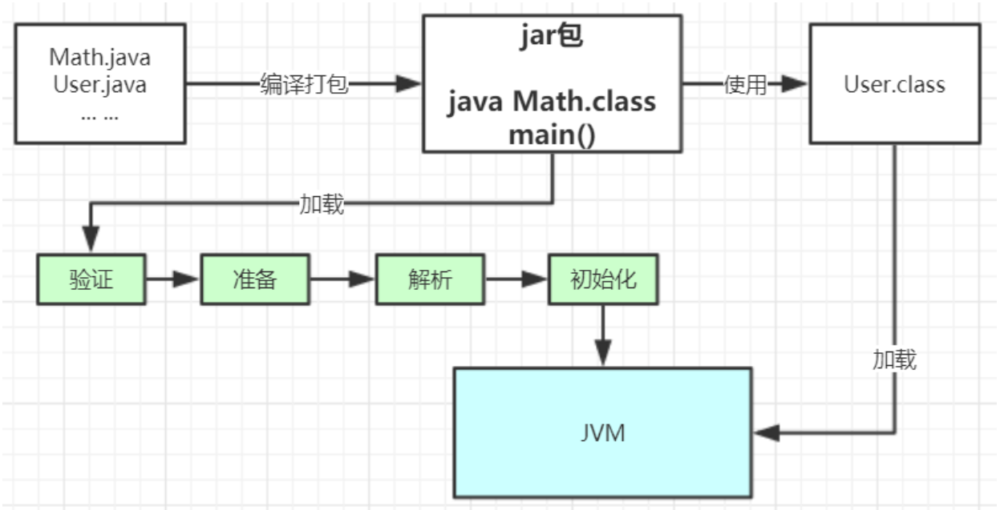
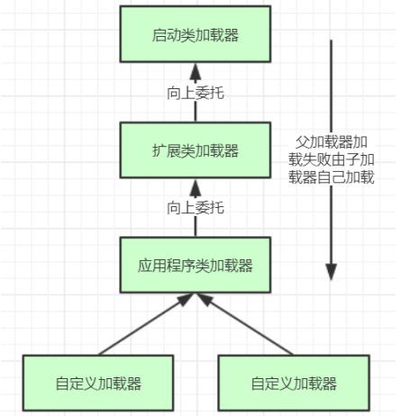
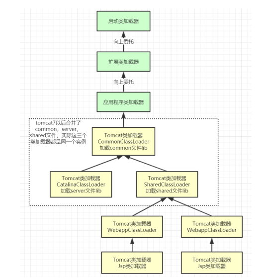

- [类加载](#类加载)
  - [类加载的过程。](#类加载的过程)
  - [类加载器。](#类加载器)
  - [自定义类加载器。](#自定义类加载器)
  - [双亲委派机制。](#双亲委派机制)
  - [双亲委派机制的原因。](#双亲委派机制的原因)
  - [Tomcat自定义加载器。](#tomcat自定义加载器)

## 类加载

### 类加载的过程。
- 对个Java文件通过编译打包成可运行的jar包，然后通过Java命令执行其中的一个启动类；首先通过类加载器把启动类加载到JVM，当使用到其他类的时候再逐步通过类加载器加载到JVM。注意：jar包的类不是一次性加载到JVM内存的，只有使用到的时候才会通过类加载器进行加载。
- 类从加载到使用一共分为以下几个步骤：
  - 加载：在硬盘上通过IO读取相应的字节码文件，注意只有使用的时候才会加载，例如启动类，New方式创建对象。
  - 验证：效验字节码文件的正确性。
  - 准备：给类的静态编码分配相应的内存，并赋默认值。
  - 解析：就是将符号引用（例如静态方法，main()方法）替换为指向数据所存内存的指针，即为静态链接，在类加载期间完成；动态链接是在程序运行期间完成的将符号引用替换为直接引用。
  - 初始化：对类的静态变量初始化为所指定的值，执行静态代码块。
  - 使用。
  - 卸载。
    

### 类加载器。
类加载的过程是通过类加载器实现的，类加载器主要有一下几种：
- 启动类加载器：主要加载JVM运行的位于JRE的lib目录下的核心类库，如：rt.jar，charsets.jar
- 扩展类加载器：主要加载JVM运行的位于JRE的lib目录下的ext扩展目录中的jar包。
- 应用程序类加载器：主要负责加载classpath路径下的类包，也就是加载我们项目中的那些类。
- 自定义类加载器：负责加载用户自定义路径下的类包。

### 自定义类加载器。
自定义类加载器需要继承java.lang.ClassLoader类，重写loadClass(String, boolean)，实现双亲委派机制。
- 首先，判断类是否已经加载，加载过就直接返回。
- 没有加载过，判断是否有父类加载器，有则有父类加载器加载。
- 如果父类加载器或者boostrap类加载器没有找到指定的类，则调用当前类加载器的findClass()方法实现加载，此方法默认抛出异常，故需要我们重新此方法。

### 双亲委派机制。
双亲委派机制，加载某个类时会先委托父加载器寻找目标类，找不到再委托上层父加载器加载，如果所有父加载器在自己的加载类路径下都找不到目标类，
则在自己的类加载路径中查找并载入目标类。简单说就是先找父加载器，父加载器无此类则由儿子加载器加载。

### 双亲委派机制的原因。
- 沙箱安全机制：自己写的java.lang.String.class类不会被加载，这样便可以防止核心API库被随意篡改。
- 避免类的重复加载：当父亲已经加载了该类时，就没有必要子ClassLoader
  再加载一次，保证被加载类的唯一性。

### Tomcat自定义加载器。

CommonClassLoader能加载的类都可以被CatalinaClassLoader和SharedClassLoader使用从而实现了公有类库的共用，而CatalinaClassLoader
和SharedClassLoader自己能加载的类则与对方相互隔离。WebAppClassLoader可以使用SharedClassLoader加载到的类，但各个WebAppClassLoader实例之间相互隔离。而JasperLoader的加载范围仅仅是这个JSP文件所编译出来的那一个.Class文件，它出现的目的就是为了被丢弃：当Web容器检测到JSP文件被修改时，会替换掉目前的JasperLoader的实例，并通过再建立一个新的Jsp类加载器来实现JSP文件的热加载功能双亲委派机制要求除了顶层的启动类加载器之外，其余的类加载器都应当由自己的父类加载器加载。很显然，tomcat 不是这样实现，tomcat 为了实现隔离性，没有遵守这个约定，
每个WebappClassLoader加载自己的目录下的class文件，不会传递给父类加载器，打破了双亲委派机制。

