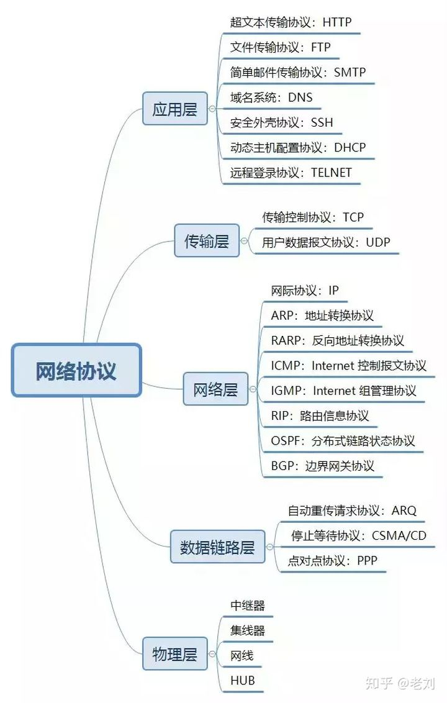
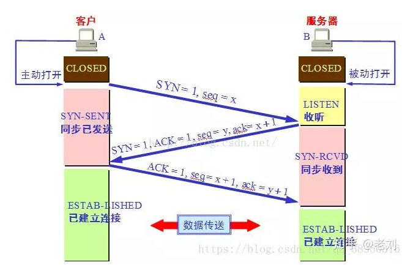
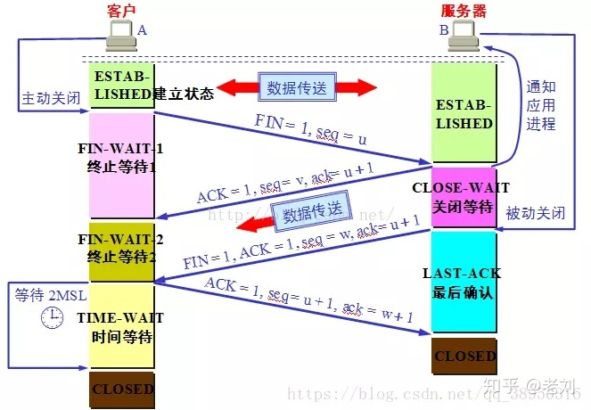
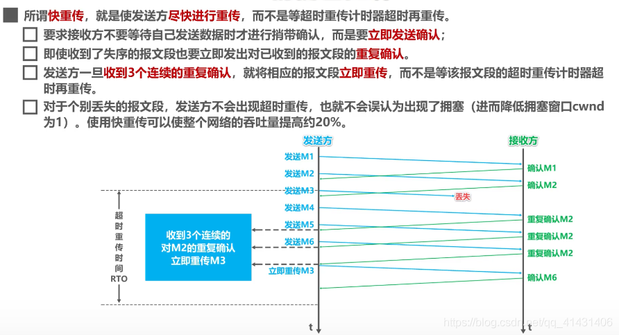
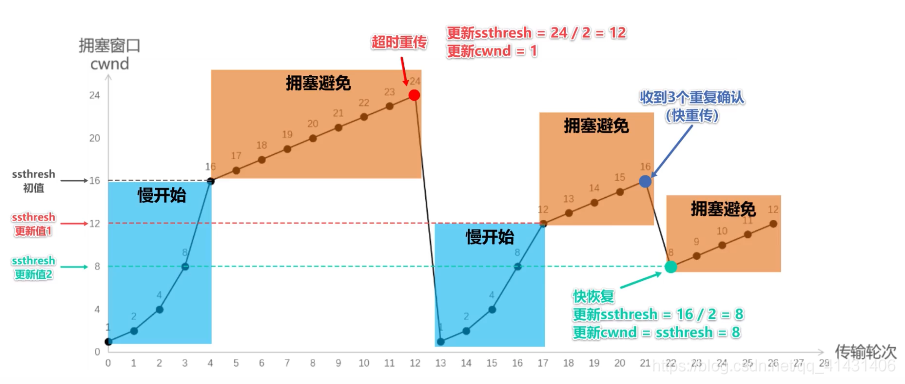
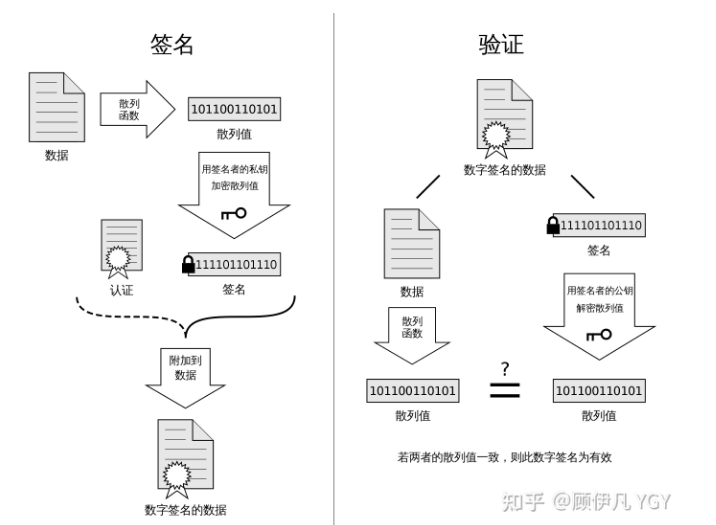

- [五层网络戏协议体系结构](#五层网络戏协议体系结构)
  - [应用层](#应用层)
  - [传输层](#传输层)
  - [网络层](#网络层)
  - [数据链路层](#数据链路层)
  - [物理层](#物理层)
- [ARP协议工作原理](#arp协议工作原理)
- [IP地址分类](#ip地址分类)
- [TCP协议的主要特点](#tcp协议的主要特点)
- [UDP的主要特点](#udp的主要特点)
- [TCP和UDP的区别](#tcp和udp的区别)
- [TCP和UDP常见的应用层协议](#tcp和udp常见的应用层协议)
  - [TCP](#tcp)
  - [UDP](#udp)
- [TCP三次握手](#tcp三次握手)
- [为什么不是两次握手](#为什么不是两次握手)
- [传了 SYN，为什么还要传 ACK](#传了-syn为什么还要传-ack)
- [TCP四次挥手](#tcp四次挥手)
- [为什么 TIME-WAIT 状态必须等待 2MSL 的时间呢？](#为什么-time-wait-状态必须等待-2msl-的时间呢)
- [为什么第二次跟第三次不能合并, 第二次和第三次之间的等待是什么?](#为什么第二次跟第三次不能合并-第二次和第三次之间的等待是什么)
- [保活计时器的作用？](#保活计时器的作用)
- [TCP的可靠传输](#tcp的可靠传输)
- [停止等待协议](#停止等待协议)
- [ARQ协议](#arq协议)
  - [自动重传ARQ协议](#自动重传arq协议)
- [连续ARQ协议](#连续arq协议)
- [滑动窗口](#滑动窗口)
- [流量控制](#流量控制)
- [拥塞控制](#拥塞控制)
- [粘包](#粘包)
- [TCP粘包产生情景](#tcp粘包产生情景)
  - [发送端](#发送端)
  - [接收端](#接收端)
- [解决粘包和拆包](#解决粘包和拆包)
- [HTTP状态码](#http状态码)
- [forward 和 redirect 的区别](#forward-和-redirect-的区别)
- [HTTP中的方法](#http中的方法)
- [POST和GET的区别](#post和get的区别)
- [一次HTTP请求的过程](#一次http请求的过程)
- [DNS的解析过程](#dns的解析过程)
- [HTPP短连接和长链接](#htpp短连接和长链接)
- [HTTP 1.0 和1.1 1.2的区别](#http-10-和11-12的区别)
  - [HTTP 1.1的主要变化](#http-11的主要变化)
  - [HTTP 1.2的主要变化](#http-12的主要变化)
- [HTTPS](#https)
  - [为什么需要加密](#为什么需要加密)
  - [对称加密](#对称加密)
    - [可行性](#可行性)
  - [非对称加密](#非对称加密)
    - [可行性](#可行性-1)
  - [改良的非对称加密](#改良的非对称加密)
  - [非对称加密+对称加密](#非对称加密对称加密)
  - [中间人攻击](#中间人攻击)
  - [如何证明浏览器收到的公钥一定是该网站的公钥？](#如何证明浏览器收到的公钥一定是该网站的公钥)
  - [数字证书](#数字证书)
  - [如何放防止数字证书被篡改？](#如何放防止数字证书被篡改)
  - [数字签名](#数字签名)
  - [中间人有可能篡改该证书吗？](#中间人有可能篡改该证书吗)
  - [中间人有可能把证书掉包吗？](#中间人有可能把证书掉包吗)
  - [为什么制作数字签名时需要hash一次？](#为什么制作数字签名时需要hash一次)
  - [怎么证明CA机构的公钥是可信的？](#怎么证明ca机构的公钥是可信的)
  - [每次进行HTTPS请求时都必须在SSL/TLS层进行握手传输密钥吗？](#每次进行https请求时都必须在ssltls层进行握手传输密钥吗)

### 五层网络戏协议体系结构

#### 应用层
应用层的任务是通过应用进程间交互来完成特定的网络应用，应用层协议是应用进程之间的通信和交互规则。对于不同的网络应用需要不同的应用层协议。如域名系统DNS，万维网HTTP协议，支持电子邮件的SMTP协议等。应用层交互的数据单元是报文。

#### 传输层
传输层的主要任务是负责向两台主机进程之间通信的通用数据传输服务。应用进程通过该服务传输应用报文，```通用的```的是指并不针对特定的某一特定的网络应用，而是多种用于都可以使用的同一运输服务。

由于一台主机有多个进程，因此传输层有复用和分用功能，复用就是多可应用层进程都可以同时使用传输层的服务；分用是指传输层把收到的信息分别交给上面的应用层中的不同进程。

#### 网络层
在计算机网络中国通信的两个不同主机进程之间可能会存在多个数据链路，也可能要经过很多的通信子网。网络层的任务就是选择合适的网间路由和交换节点，确保数据及时送达。在发送数据时，网络层把传输层产生的报文段或用户数据报封装成分组和包进行传送。在TCP/IP体系结构中，分组也叫作IP数据报，简称数据报。

#### 数据链路层
两台主机之间的数据传输，总是在一段一段的链路上传送的，这就需要使用专门的链路层的协议。在两个相邻节点之间传送数据时，数据链路层将网络层交下来的 IP 数据报组装成帧，在两个相邻节点间的链路上传送帧。每一帧包括数据和必要的控制信息（如：同步信息，地址信息，差错控制等）。

#### 物理层
在物理层上所传送的数据单位是比特。物理层（physical layer）的作用是实现相邻计算机节点之间比特流的透明传送，尽可能屏蔽掉具体传输介质和物理设备的差异。使其上面的数据链路层不必考虑网络的具体传输介质是什么。“透明传送比特流”表示经实际电路传送后的比特流没有发生变化，对传送的比特流来说，这个电路好像是看不见的。

  

### ARP协议工作原理
网络层的 ARP 协议完成了 IP 地址与物理地址的映射。首先，每台主机都会在自己的 ARP 缓冲区中建立一个 ARP 列表，以表示 IP 地址和 MAC 地址的对应关系。当源主机需要将一个数据包要发送到目的主机时，会首先检查自己 ARP 列表中是否存在该 IP 地址对应的 MAC 地址：如果有，就直接将数据包发送到这个 MAC 地址；如果没有，就向本地网段发起一个 ARP 请求的广播包，查询此目的主机对应的 MAC 地址。

此 ARP 请求数据包里包括源主机的 IP 地址、硬件地址、以及目的主机的 IP 地址。网络中所有的主机收到这个 ARP 请求后，会检查数据包中的目的 IP 是否和自己的 IP 地址一致。如果不相同就忽略此数据包；如果相同，该主机首先将发送端的 MAC 地址和 IP 地址添加到自己的 ARP 列表中，如果 ARP 表中已经存在该 IP 的信息，则将其覆盖，然后给源主机发送一个 ARP 响应数据包，告诉对方自己是它需要查找的 MAC 地址；源主机收到这个 ARP 响应数据包后，将得到的目的主机的 IP 地址和 MAC 地址添加到自己的 ARP 列表中，并利用此信息开始数据的传输。如果源主机一直没有收到 ARP 响应数据包，表示 ARP 查询失败。

### IP地址分类
IP 地址是指互联网协议地址，是 IP 协议提供的一种统一的地址格式，它为互联网上的每一个网络和每一台主机分配一个逻辑地址，以此来屏蔽物理地址的差异。IP 地址编址方案将 IP 地址空间划分为 A、B、C、D、E 五类，其中 A、B、C 是基本类，D、E 类作为多播和保留使用，为特殊地址。

每个 IP 地址包括两个标识码（ID），即网络 ID 和主机 ID。同一个物理网络上的所有主机都使用同一个网络 ID，网络上的一个主机（包括网络上工作站，服务器和路由器等）有一个主机 ID 与其对应。例如，盐城市信息网络中心的服务器的IP地址为210.73.140.2，对于该IP地址，我们可以把它分成网络标识和主机标识两部分，这样上述的IP地址就可以写成：网络标识：210.73.140.0，主机标识2，合起来写：210.73.140.2

A~E 类地址的特点如下：
- A 类地址：以 0 开头，第一个字节范围：0~127；
- B 类地址：以 10 开头，第一个字节范围：128~191；
- C 类地址：以 110 开头，第一个字节范围：192~223；
- D 类地址：以 1110 开头，第一个字节范围为 224~239；
- E 类地址：以 1111 开头，保留地址


### TCP协议的主要特点
1. 面向连接的，好像打电话一样，通话前需要先拨号建立连接，通话结束后要挂机释放连接；
2. 一对一的：每一条 TCP 连接只能有两个端点，每一条 TCP 连接只能是点对点的
3. 可靠的：通过 TCP 连接传送的数据，无差错、不丢失、不重复、并且按序到达；
4. 全双工的：TCP 允许通信双方的应用进程在任何时候都能发送数据。TCP 连接的两端都设有发送缓存和接收缓存，用来临时存放双方通信的数据；
5. 面向字节流的：TCP 把应用程序交下来的数据仅仅看成是一连串的无结构的字节流。

### UDP的主要特点
1. 无连接的；
2. 尽最大努力交付：即不保证可靠交付，因此主机不需要维持复杂的链接状态（这里面有许多参数）；
3. 面向报文的
4. UDP 没有拥塞控制，因此网络出现拥塞不会使源主机的发送速率降低（对实时应用很有用，如 直播，实时视频会议等）；
5. UDP 支持一对一、一对多、多对一和多对多的交互通信；
6. UDP 的首部开销小，只有 8 个字节，比 TCP 的 20 个字节的首部要短。

### TCP和UDP的区别
TCP 提供面向连接的服务。在传送数据之前必须先建立连接，数据传送结束后要释放连接。TCP 不提供广播或多播服务。由于 TCP 要提供可靠的，面向连接的运输服务（TCP 的可靠体现在 TCP 在传递数据之前，会有三次握手来建立连接，而且在数据传递时，有确认、窗口、重传、拥塞控制机制，在数据传完后，还会断开连接用来节约系统资源），这难以避免增加了许多开销，如确认，流量控制，计时器以及连接管理等。这不仅使协议数据单元的首部增大很多，还要占用许多处理机资源。

UDP 在传送数据之前不需要先建立连接，远地主机在收到 UDP 报文后，不需要给出任何确认。虽然 UDP 不提供可靠交付，但在某些情况下 UDP 确是一种最有效的工作方式（一般用于即时通信），比如：QQ 语音、 QQ 视频 、直播等等。

### TCP和UDP常见的应用层协议
#### TCP
- FTP：定义了文件传输协议，使用 21 端口。常说某某计算机开了 FTP 服务便是启动了文件传输服务。下载文件，上传主页，都要用到 FTP 服务。
- Telnet：它是一种用于远程登陆的端口，用户可以以自己的身份远程连接到计算机上，通过这种端口可以提供一种基于 DOS 模式下的通信服务。如以前的 BBS 是-纯字符界面的，支持 BBS 的服务器将 23 端口打开，对外提供服务。
- SMTP：定义了简单邮件传送协议，现在很多邮件服务器都用的是这个协议，用于发送邮件。如常见的免费邮件服务中用的就是这个邮件服务端口，所以在电子邮件设置-中常看到有这么 SMTP 端口设置这个栏，服务器开放的是 25 号端口。
- POP3：它是和 SMTP 对应，POP3 用于接收邮件。通常情况下，POP3 协议所用的是 110 端口。也是说，只要你有相应的使用 POP3 协议的程序（例如 Fo-xmail 或 Outlook），就可以不以 Web 方式登陆进邮箱界面，直接用邮件程序就可以收到邮件（如是163 邮箱就没有必要先进入网易网站，再进入自己的邮-箱来收信）。
- HTTP：从 Web 服务器传输超文本到本地浏览器的传送协议。

#### UDP
- DNS：用于域名解析服务，将域名地址转换为 IP 地址。DNS 用的是 53 号端口。
- SNMP：简单网络管理协议，使用 161 号端口，是用来管理网络设备的。由于网络设备很多，无连接的服务就体现出其优势。
- TFTP(Trival File Transfer Protocal)：简单文件传输协议，该协议在熟知端口 69 上使用 UDP 服务。

### TCP三次握手
  

最初客户端和服务端都处于 CLOSED(关闭) 状态。本例中 A（Client） 主动打开连接，B（Server） 被动打开连接。

一开始，B 的 TCP 服务器进程首先创建传输控制块TCB，准备接受客户端进程的连接请求。然后服务端进程就处于 LISTEN(监听) 状态，等待客户端的连接请求。如有，立即作出响应。

第一次握手：A 的 TCP 客户端进程也是首先创建传输控制块 TCB。然后，在打算建立 TCP 连接时，向 B 发出连接请求报文段，这时首部中的同步位 SYN=1，同时选择一个初始序号 seq = x。TCP 规定，SYN 报文段（即 SYN = 1 的报文段）不能携带数据，但要消耗掉一个序号。这时，TCP 客户进程进入 SYN-SENT（同步已发送）状态。

第二次握手：B 收到连接请求报文后，如果同意建立连接，则向 A 发送确认。在确认报文段中应把 SYN 位和 ACK 位都置 1，确认号是 ack = x + 1，同时也为自己选择一个初始序号 seq = y。请注意，这个报文段也不能携带数据，但同样要消耗掉一个序号。这时 TCP 服务端进程进入 SYN-RCVD（同步收到）状态。

第三次握手：TCP 客户进程收到 B 的确认后，还要向 B 给出确认。确认报文段的 ACK 置 1，确认号 ack = y + 1，而自己的序号 seq = x + 1。这时 ACK 报文段可以携带数据。但如果不携带数据则不消耗序号，这种情况下，下一个数据报文段的序号仍是 seq = x + 1。这时，TCP 连接已经建立，A 进入 ESTABLISHED（已建立连接）状态。

### 为什么不是两次握手
为了防止已经失效的连接请求报文段突然又传送到了 B，因而产生错误。比如下面这种情况：A 发出的第一个连接请求报文段并没有丢失，而是在网路结点长时间滞留了，以致于延误到连接释放以后的某个时间段才到达 B。本来这是一个早已失效的报文段。但是 B 收到此失效的链接请求报文段后，就误认为 A 又发出一次新的连接请求。于是就向 A 发出确认报文段，同意建立连接。

对于上面这种情况，如果不进行第三次握手，B 发出确认后就认为新的运输连接已经建立了，并一直等待 A 发来数据。B 的许多资源就这样白白浪费了。

如果采用了三次握手，由于 A 实际上并没有发出建立连接请求，所以不会理睬 B 的确认，也不会向 B 发送数据。B 由于收不到确认，就知道 A 并没有要求建立连接。

### 传了 SYN，为什么还要传 ACK
双方通信无误必须是两者互相发送信息都无误。传了 SYN，证明发送方到接收方的通道没有问题，但是接收方到发送方的通道还需要 ACK 信号来进行验证。

### TCP四次挥手
  
第一次挥手：A 的应用进程先向其 TCP 发出连接释放报文段，并停止再发送数据，主动关闭 TCP 连接。A 把连接释放报文段首部的终止控制位 FIN 置 1，其序号 seq = u（等于前面已传送过的数据的最后一个字节的序号加 1），这时 A 进入 FIN-WAIT-1（终止等待1）状态，等待 B 的确认。请注意：TCP 规定，FIN 报文段即使不携带数据，也将消耗掉一个序号。

第二次挥手：B 收到连接释放报文段后立即发出确认，确认号是 ack = u + 1，而这个报文段自己的序号是 v（等于 B 前面已经传送过的数据的最后一个字节的序号加1），然后 B 就进入 CLOSE-WAIT（关闭等待）状态。TCP 服务端进程这时应通知高层应用进程，因而从 A 到 B 这个方向的连接就释放了，这时的 TCP 连接处于半关闭（half-close）状态，即 A 已经没有数据要发送了，但 B 若发送数据，A 仍要接收。也就是说，从 B 到 A 这个方向的连接并未关闭，这个状态可能会持续一段时间。A 收到来自 B 的确认后，就进入 FIN-WAIT-2(终止等待2)状态，等待 B 发出的连接释放报文段。

第三次挥手：若 B 已经没有要向 A 发送的数据，其应用进程就通知 TCP 释放连接。这时 B 发出的连接释放报文段必须使 FIN = 1。假定 B 的序号为 w（在半关闭状态，B 可能又发送了一些数据）。B 还必须重复上次已发送过的确认号 ack = u + 1。这时 B 就进入 LAST-ACK(最后确认)状态，等待 A 的确认。

第四次挥手：A 在收到 B 的连接释放报文后，必须对此发出确认。在确认报文段中把 ACK 置 1，确认号 ack = w + 1，而自己的序号 seq = u + 1（前面发送的 FIN 报文段要消耗一个序号）。然后进入 TIME-WAIT(时间等待) 状态。请注意，现在 TCP 连接还没有释放掉。必须经过时间等待计时器设置的时间 2MSL（MSL：最长报文段寿命）后，A 才能进入到 CLOSED 状态，然后撤销传输控制块，结束这次 TCP 连接。当然如果 B 一收到 A 的确认就进入 CLOSED 状态，然后撤销传输控制块。所以在释放连接时，B 结束 TCP 连接的时间要早于 A。

### 为什么 TIME-WAIT 状态必须等待 2MSL 的时间呢？
1. 为了保证 A 发送的最后一个 ACK 报文段能够到达 B。这个 ACK 报文段有可能丢失，因而使处在 LAST-ACK 状态的 B 收不到对已发送的 FIN + ACK 报文段的确认。B 会超时重传这个 FIN+ACK 报文段，而 A 就能在 2MSL 时间内（超时 + 1MSL 传输）收到这个重传的 FIN+ACK 报文段。接着 A 重传一次确认，重新启动 2MSL 计时器。最后，A 和 B 都正常进入到 CLOSED 状态。如果 A 在 TIME-WAIT 状态不等待一段时间，而是在发送完 ACK 报文段后立即释放连接，那么就无法收到 B 重传的 FIN + ACK 报文段，因而也不会再发送一次确认报文段，这样，B 就无法按照正常步骤进入 CLOSED 状态。
2. 防止已失效的连接请求报文段出现在本连接中。A 在发送完最后一个 ACK 报文段后，再经过时间 2MSL，就可以使本连接持续的时间内所产生的所有报文段都从网络中消失。这样就可以使下一个连接中不会出现这种旧的连接请求报文段。

### 为什么第二次跟第三次不能合并, 第二次和第三次之间的等待是什么?
当服务器执行第二次挥手之后, 此时证明客户端不会再向服务端请求任何数据, 但是服务端可能还正在给客户端发送数据（可能是客户端上一次请求的资源还没有发送完毕），所以此时服务端会等待把之前未传输完的数据传输完毕之后再发送关闭请求。

### 保活计时器的作用？
除时间等待计时器外，TCP 还有一个保活计时器（keepalive timer）。设想这样的场景：客户已主动与服务器建立了 TCP 连接。但后来客户端的主机突然发生故障。显然，服务器以后就不能再收到客户端发来的数据。因此，应当有措施使服务器不要再白白等待下去。这就需要使用保活计时器了。

服务器每收到一次客户的数据，就重新设置保活计时器，时间的设置通常是两个小时。若两个小时都没有收到客户端的数据，服务端就发送一个探测报文段，以后则每隔 75 秒钟发送一次。若连续发送 10个 探测报文段后仍然无客户端的响应，服务端就认为客户端出了故障，接着就关闭这个连接。

### TCP的可靠传输
1. 数据包效验：目的是检测数在传输过程中有没有发生变化，若效验出错，则丢弃报文并不给响应，发送端在超时后重新发送数据。
2. 重排序：TCP将对失序的数据进行重新排序，排序之后才会上交给应用层。
3. 丢弃重复数据：对于重复数据，直接丢弃。
4. 应答机制：TCP会对收到的信息进行确认，确认并不是立即发送的，通常推迟几分之一秒。
5. 超时重发：当 TCP 发出一个段后，它启动一个定时器，等待目的端确认收到这个报文段。如果不能及时收到一个确认，将重发这个报文段。
6. 流量控制：TCP 连接的每一方都有固定大小的缓冲空间。TCP 的接收端只允许另一端发送接收端缓冲区所能接纳的数据，这可以防止较快主机致使较慢主机的缓冲区溢出，这就是流量控制。TCP 使用的流量控制协议是可变大小的滑动窗口协议。

### 停止等待协议
停止等待协议是为了实现可靠传输的，它的基本原理就是每发完一个分组就停止发送，等待对方确认。在收到确认后再发下一个分组；在停止等待协议中，若接收方收到重复分组，就丢弃该分组，但同时还要发送确认。

### ARQ协议
#### 自动重传ARQ协议
停止等待协议中超时重传是指只要超过一段时间仍然没有收到确认，就重传前面发送过的分组（认为刚才发送过的分组丢失了）。因此每发送完一个分组需要设置一个超时计时器，其重传时间应比数据在分组传输的平均往返时间更长一些。这种自动重传方式常称为自动重传请求 ARQ。

### 连续ARQ协议
连续 ARQ 协议可提高信道利用率。发送方维持一个发送窗口，凡位于发送窗口内的分组可以连续发送出去，而不需要等待对方确认。接收方一般采用累计确认，对按序到达的最后一个分组发送确认，表明到这个分组为止的所有分组都已经正确收到了。

### 滑动窗口
TCP 利用滑动窗口实现流量控制的机制。滑动窗口（Sliding window）是一种流量控制技术。早期的网络通信中，通信双方不会考虑网络的拥挤情况直接发送数据。由于大家不知道网络拥塞状况，同时发送数据，导致中间节点阻塞掉包，谁也发不了数据，所以就有了滑动窗口机制来解决此问题。

TCP 中采用滑动窗口来进行传输控制，滑动窗口的大小意味着接收方还有多大的缓冲区可以用于接收数据。发送方可以通过滑动窗口的大小来确定应该发送多少字节的数据。当滑动窗口为 0 时，发送方一般不能再发送数据报，但有两种情况除外，一种情况是可以发送紧急数据，例如，允许用户终止在远端机上的运行进程。另一种情况是发送方可以发送一个 1 字节的数据报来通知接收方重新声明它希望接收的下一字节及发送方的滑动窗口大小。

### 流量控制
TCP 利用滑动窗口实现流量控制。流量控制是为了控制发送方发送速率，保证接收方来得及接收。接收方发送的确认报文中的窗口字段可以用来控制发送方窗口大小，从而影响发送方的发送速率。将窗口字段设置为 0，则发送方不能发送数据。

### 拥塞控制
拥塞控制和流量控制不同，前者是一个全局性的过程，而后者指点对点通信量的控制。在某段时间，若对网络中某一资源的需求超过了该资源所能提供的可用部分，网络的性能就要变坏。这种情况就叫拥塞。

拥塞控制就是为了防止过多的数据注入到网络中，这样就可以使网络中的路由器或链路不致于过载。拥塞控制所要做的都有一个前提，就是网络能够承受现有的网络负荷。拥塞控制是一个全局性的过程，涉及到所有的主机，所有的路由器，以及与降低网络传输性能有关的所有因素。相反，流量控制往往是点对点通信量的控制，是个端到端的问题。流量控制所要做到的就是抑制发送端发送数据的速率，以便使接收端来得及接收。

为了进行拥塞控制，TCP 发送方要维持一个拥塞窗口(cwnd) 的状态变量。拥塞控制窗口的大小取决于网络的拥塞程度，并且动态变化。发送方让自己的发送窗口取为拥塞窗口和接收方的接受窗口中较小的一个。

TCP 的拥塞控制采用了四种算法，即：慢开始、拥塞避免、快重传和快恢复。在网络层也可以使路由器采用适当的分组丢弃策略（如：主动队列管理 AQM），以减少网络拥塞的发生。

1. 慢开始
    
    慢开始算法的思路是当主机开始发送数据时，如果立即把大量数据字节注入到网络，那么可能会引起网络阻塞，因为现在还不知道网络的符合情况。经验表明，较好的方法是先探测一下，即由小到大逐渐增大发送窗口，也就是由小到大逐渐增大拥塞窗口数值。cwnd 初始值为 1，每经过一个传播轮次，cwnd 加倍。
2. 拥塞避免

    拥塞避免算法的思路是让拥塞窗口 cwnd 缓慢增大，即每经过一个往返时间 RTT 就把发送方的 cwnd 加 1。

3. 快重传与快恢复    

    在 TCP/IP 中，快速重传和快恢复（fast retransmit and recovery，FRR）是一种拥塞控制算法，它能快速恢复丢失的数据包。

    没有 FRR，如果数据包丢失了，TCP 将会使用定时器来要求传输暂停。在暂停的这段时间内，没有新的或复制的数据包被发送。有了 FRR，如果接收机接收到一个不按顺序的数据段，它会立即给发送机发送一个重复确认。如果发送机接收到三个重复确认，它会假定确认件指出的数据段丢失了，并立即重传这些丢失的数据段。发送方发送1号数据报文段，接收方收到1号报文段后给发送方发回对1号报文段的确认，在1号报文段到达发送方之前，发送方还可以将发送窗口内的2号数据报文段发送出去，接收方收到2号报文段后给发送方发回对2号报文段的确认，在2号报文段到达发送方之前，发送方还可以将发送窗口内的3号数据报文段发送出去，假设该报文丢失，发送方便不会发送针对该报文的确认报文给发送方，发送方还可以将发送窗口内的4号数据报文段发送出去，接收方收到后，发现这不是按序到达的报文段，因此给发送方发送针对2号报文段的重复确认，表明我现在希望收到的是3号报文段，但是我没有收到3号报文段，而收到了未按序到达的报文段，发送方还可以将发送窗口中的5号报文段发送出去,接收方收到后，发现这不是按序到达的报文段，因此给发送方发送针对2号报文段的重复确认，表明我现在希望收到的是3号报文段，但是我没有收到3号报文段，而收到了未按序到达的报文段,，发送方还可以将发送窗口内的最后一个数据段即6号数据报文段发送出去，接收方收到后，发现这不是按序到达的报文段，因此给发送方发送针对2号报文段的重复确认，表明我现在希望收到的是3号报文段，但是我没有收到3号报文段，而收到了未按序到达的报文段，此时，发送方收到了累计3个连续的针对2号报文段的重复确认，立即重传3号报文段，接收方收到后，给发送方发回针对6号报文的确认，表明，序号到6为至的报文都收到了，这样就不会造成发送方对3号报文的超时重传，而是提早收到了重传。


    有了 FRR，就不会因为重传时要求的暂停被耽误。当有单独的数据包丢失时，快速重传和快恢复（FRR）能最有效地工作。当有多个数据信息包在某一段很短的时间内丢失时，它则不能很有效地工作。

      

      

### 粘包
1. TCP 是基于字节流的，虽然应用层和 TCP 传输层之间的数据交互是大小不等的数据块，但是 TCP 把这些数据块仅仅看成一连串无结构的字节流，没有边界；

2. 从 TCP 的帧结构也可以看出，在 TCP 的首部没有表示数据长度的字段。

基于上面两点，在使用 TCP 传输数据时，才有粘包或者拆包现象发生的可能。一个数据包中包含了发送端发送的两个数据包的信息，这种现象即为粘包。

接收端收到了两个数据包，但是这两个数据包要么是不完整的，要么就是多出来一块，这种情况即发生了拆包和粘包。拆包和粘包的问题导致接收端在处理的时候会非常困难，因为无法区分一个完整的数据包。

### TCP粘包产生情景

#### 发送端
采用 TCP 协议传输数据的客户端与服务器经常是保持一个长连接的状态（一次连接发一次数据不存在粘包），双方在连接不断开的情况下，可以一直传输数据。但当发送的数据包过小的时候，那么 TCP 协议默认的会启用 Nagle 算法，将这些较小的数据包进行合并发送（缓冲区数据发送是一个堆压的过程）；这个合并过程就是在发送缓冲区中进行的，也就是说数据发送出来它已经是粘包的状态了。

#### 接收端
接收方采用 TCP 协议接收数据时的过程是这样的：数据到接收方，从网络模型的下方传递至传输层，传输层的 TCP 协议处理是将其放置接收缓冲区，然后由应用层来主动获取（C 语言用 recv、read 等函数）；这时会出现一个问题，就是我们在程序中调用的读取数据函数不能及时的把缓冲区中的数据拿出来，而下一个数据又到来并有一部分放入的缓冲区末尾，等我们读取数据时就是一个粘包。（放数据的速度 > 应用层拿数据速度）

### 解决粘包和拆包
1. 特殊字符控制；

2. 在包头首都添加数据包的长度。

如果使用 netty 的话，就有专门的编码器和解码器解决拆包和粘包问题。

### HTTP状态码
- 1XX 信息
  1. 100 Continue ：表明到目前为止都很正常，客户端可以继续发送请求或者忽略这个响应。

- 2XX 成功
  1. 200 OK
  2. 204 No Content ：请求已经成功处理，但是返回的响应报文不包含实体的主体部分。一般在只需要从客户端往服务器发送信息，而不需要返回数据时使用。
  3. 206 Partial Content ：表示客户端进行了范围请求，响应报文包含由 Content-Range 指定范围的实体内容。

- 3XX 重定向
  1. 301 Moved Permanently ：永久性重定向；
  2. 302 Found ：临时性重定向；
  3. 303 See Other ：和 302 有着相同的功能，但是 303 明确要求客户端应该采用 GET 方法获取资源。
  4. 304 Not Modified ：如果请求报文首部包含一些条件，例如：If-Match，If-Modified-Since，If-None-Match，If-Range，If-Unmodified-Since，如果不满足条件，则服务器会返回 304 状态码。
  5. 307 Temporary Redirect ：临时重定向，与 302 的含义类似，但是 307 要求浏览器不会把重定向请求的 POST 方法改成 GET 方法。

- 4XX 客户端错误
  1. 400 Bad Request ：请求报文中存在语法错误。
  2. 401 Unauthorized ：该状态码表示发送的请求需要有认证信息（BASIC 认证、DIGEST 认证）。如果之前已进行过一次请求，则表示用户认证失败。
  3. 403 Forbidden ：请求被拒绝。
  4. 404 Not Found

- 5XX 服务器错误
  1. 500 Internal Server Error ：服务器正在执行请求时发生错误；
  2. 503 Service Unavailable ：服务器暂时处于超负载或正在进行停机维护，现在无法处理请求。

### forward 和 redirect 的区别
Forward 和 Redirect 代表了两种请求转发方式：直接转发和间接转发。

直接转发方式（Forward）：客户端和浏览器只发出一次请求，Servlet、HTML、JSP 或其它信息资源，由第二个信息资源响应该请求，在请求对象 request 中，保存的对象对于每个信息资源是共享的。

间接转发方式（Redirect）：实际是两次 HTTP 请求，服务器端在响应第一次请求的时候，让浏览器再向另外一个 URL 发出请求，从而达到转发的目的。

举个通俗的例子：　
直接转发就相当于：“A 找 B 借钱，B 说没有，B 去找 C 借，借到借不到都会把消息传递给 A”；

间接转发就相当于："A 找 B 借钱，B 说没有，让 A 去找 C 借"。

### HTTP中的方法
客户端发送的 请求报文 第一行为请求行，包含了方法字段。

1. GET：获取资源，当前网络中绝大部分使用的都是 GET；
2. HEAD：获取报文首部，和 GET 方法类似，但是不返回报文实体主体部分；
3. POST：传输实体主体
4. PUT：上传文件，由于自身不带验证机制，任何人都可以上传文件，因此存在安全性问题，一般不使用该方法。
5. PATCH：对资源进行部分修改。PUT 也可以用于修改资源，但是只能完全替代原始资源，PATCH 允许部分修改。
6. OPTIONS：查询指定的 URL 支持的方法；
7. CONNECT：要求在与代理服务器通信时建立隧道。使用 SSL（Secure Sockets Layer，安全套接层）和 TLS（Transport Layer Security，传输层安全）协议把通信内容加密后经网络隧道传输。
8. TRACE：追踪路径。服务器会将通信路径返回给客户端。发送请求时，在 Max-Forwards 首部字段中填入数值，每经过一个服务器就会减 1，当数值为 0 时就停止传输。通常不会使用 TRACE，并且它容易受到 XST 攻击（Cross-Site Tracing，跨站追踪）。

### POST和GET的区别
GET 和 POST 本质都是 HTTP 请求，只不过对它们的作用做了界定和适配，并且让他们适应各自的场景。

本质区别：GET 只是一次 HTTP请求，POST 先发请求头再发请求体，实际上是两次请求。

1. 从功能上讲，GET 一般用来从服务器上获取资源，POST 一般用来更新服务器上的资源；

2. 从 REST 服务角度上说，GET 是幂等的，即读取同一个资源，总是得到相同的数据，而 POST 不是幂等的，因为每次请求对资源的改变并不是相同的；进一步地，GET 不会改变服务器上的资源，而 POST 会对服务器资源进行改变；

3. 从请求参数形式上看，GET 请求的数据会附在 URL 之后，即将请求数据放置在 HTTP 报文的 请求头 中，以 ? 分割 URL 和传输数据，参数之间以 & 相连。特别地，如果数据是英文字母/数字，原样发送；否则，会将其编码为 application/x-www-form-urlencoded MIME 字符串(如果是空格，转换为+，如果是中文/其他字符，则直接把字符串用 BASE64 加密，得出如：%E4%BD%A0%E5%A5%BD，其中 ％XX 中的 XX 为该符号以 16 进制表示的 ASCII)；而 POST 请求会把提交的数据则放置在是 HTTP 请求报文的 请求体 中；

4. 就安全性而言，POST 的安全性要比 GET 的安全性高，因为 GET 请求提交的数据将明文出现在 URL 上，而且 POST 请求参数则被包装到请求体中，相对更安全；

5. 从请求的大小看，GET 请求的长度受限于浏览器或服务器对 URL 长度的限制，允许发送的数据量比较小，而 POST 请求则是没有大小限制的。

### 一次HTTP请求的过程
1. DNS 解析：浏览器查询 DNS，获取域名对应的 IP 地址：具体过程包括浏览器搜索自身的 DNS 缓存、搜索操作系统的 DNS 缓存、读取本地的 Host 文件和向本地 DNS 服务器进行查询等。对于向本地 DNS 服务器进行查询，如果要查询的域名包含在本地配置区域资源中，则返回解析结果给客户机，完成域名解析(此解析具有权威性)；如果要查询的域名不由本地 DNS 服务器区域解析，但该服务器已缓存了此网址映射关系，则调用这个 IP 地址映射，完成域名解析（此解析不具有权威性）。如果本地域名服务器并未缓存该网址映射关系，那么将根据其设置发起递归查询或者迭代查询；

2. TCP 连接：浏览器获得域名对应的 IP 地址以后，浏览器向服务器请求建立链接，发起三次握手；

3. 发送 HTTP 请求：TCP 连接建立起来后，浏览器向服务器发送 HTTP 请求；

4. 服务器处理请求并返回 HTTP 报文：服务器接收到这个请求，并根据路径参数映射到特定的请求处理器进行处理，并将处理结果及相应的视图返回给浏览器；

5. 浏览器解析渲染页面：浏览器解析并渲染视图，若遇到对 js 文件、css 文件及图片等静态资源的引用，则重复上述步骤并向服务器请求这些资源；浏览器根据其请求到的资源、数据渲染页面，最终向用户呈现一个完整的页面。

6. 连接结束。

### DNS的解析过程
1. 主机向本地域名服务器的查询一般都是采用递归查询。所谓递归查询就是：如果主机所询问的本地域名服务器不知道被查询的域名的 IP 地址，那么本地域名服务器就以 DNS 客户的身份，向根域名服务器继续发出查询请求报文(即替主机继续查询)，而不是让主机自己进行下一步查询。因此，递归查询返回的查询结果或者是所要查询的 IP 地址，或者是报错，表示无法查询到所需的 IP 地址。

2. 本地域名服务器向根域名服务器的查询的迭代查询。迭代查询的特点：当根域名服务器收到本地域名服务器发出的迭代查询请求报文时，要么给出所要查询的 IP 地址，要么告诉本地服务器：“你下一步应当向哪一个域名服务器进行查询”。然后让本地服务器进行后续的查询。根域名服务器通常是把自己知道的顶级域名服务器的 IP 地址告诉本地域名服务器，让本地域名服务器再向顶级域名服务器查询。顶级域名服务器在收到本地域名服务器的查询请求后，要么给出所要查询的 IP 地址，要么告诉本地服务器下一步应当向哪一个权限域名服务器进行查询。最后，本地域名服务器得到了所要解析的 IP 地址或报错，然后把这个结果返回给发起查询的主机。


### HTPP短连接和长链接
在 HTTP/1.0 中默认使用短连接。也就是说，客户端和服务器每进行一次 HTTP 操作，就建立一次连接，任务结束就中断连接。当客户端浏览器访问的某个 HTML 或其他类型的 Web 页中包含有其他的 Web 资源（如：JavaScript 文件、图像文件、CSS 文件等），每遇到这样一个 Web 资源，浏览器就会重新建立一个 HTTP 会话。

而从 HTTP/1.1 起，默认使用长连接，用以保持连接特性。使用长连接的 HTTP 协议，会在响应头加入这行代码```Connection:keep-alive```

在使用长连接的情况下，当一个网页打开完成后，客户端和服务器之间用于传输 HTTP 数据的 TCP 连接不会关闭，客户端再次访问这个服务器时，会继续使用这一条已经建立的连接。

Keep-Alive 不会永久保持连接，它有一个保持时间，可以在不同的服务器软件（如：Apache）中设定这个时间。实现长连接需要客户端和服务端都支持长连接。


### HTTP 1.0 和1.1 1.2的区别

#### HTTP 1.1的主要变化
1. HTTP1.0 经过多年发展，在 1.1 提出了改进。首先是提出了长连接，HTTP 可以在一次 TCP 连接中不断发送请求。
   
2. 然后 HTTP1.1 支持只发送 header 而不发送 body。原因是先用 header 判断能否成功，再发数据，节约带宽，事实上，post 请求默认就是这样做的。
   
3. HTTP1.1 的 host 字段。由于虚拟主机可以支持多个域名，所以一般将域名解析后得到 host。

#### HTTP 1.2的主要变化
1. HTTP2.0 支持多路复用，同一个连接可以并发处理多个请求，方法是把 HTTP数据包拆为多个帧，并发有序的发送，根据序号在另一端进行重组，而不需要一个个 HTTP请求顺序到达；

2. HTTP2.0 支持服务端推送，就是服务端在 HTTP 请求到达后，除了返回数据之外，还推送了额外的内容给客户端；

3. HTTP2.0 压缩了请求头，同时基本单位是二进制帧流，这样的数据占用空间更少；

4. HTTP2.0 适用于 HTTPS 场景，因为其在 HTTP和 TCP 中间加了一层 SSL 层。


### HTTPS

#### 为什么需要加密
因为Http中的传输内容是明文传输的，这些信息会经过代理服务器、路由信息，wifi等多个物理节点，如果信息在传输过程中被劫持，传输的内容就完全暴露了，劫持者可以更改传输的内容而不被发现，这就是中间人攻击。因此我们需要对信息进行加密。

#### 对称加密
就是利用一个密码对一段信息进行加密，也可以利用这个秘钥对加密后的信息进行解密，类似于我们生活中的钥匙。异或运算是一种对称加密。
##### 可行性
如果通信双方都拥有同一把秘钥，并且没有人知道，则两者的通信是安全的。但是这个相同的秘钥怎么让双方知道，同时又不被别人知道。由服务器生成一个秘钥传输给浏览器，但是传输过程秘钥可能会被劫持，这样通信的内容还是可能会暴露。

如果浏览器内部试先保存了服务器的秘钥，理论上对称加密是安全的，但是浏览器要保存所有服务器的秘钥显然是不现实的。

#### 非对称加密
就是由两把钥匙，一把公钥，一把私钥，公钥加密的东西私钥可以解密，私钥加密的东西公钥可以解密。

##### 可行性
利用非对称加密，服务器可以先把公钥发送给浏览器，浏览器通过公钥加密信息，然后再传输给服务器，服务器用私钥解密。

但是服务器传输公钥的过程并不一定是安全的，因为公钥是明文传输的，如果公钥被中间人劫持到离开，那么它就要可以利用公钥来解密服务器传送的信息。

#### 改良的非对称加密
服务器用于一对公钥A和私钥A'，浏览器拥有一对公钥B和私钥B'。
- 服务器把公钥A发送给浏览器
- 浏览器把公钥B发送给服务器
- 浏览器向服务器发送的信息，先经过A加密，然后再发送，到服务器后用私钥A'解密，由于只有服务器拥有A'私钥，所以是安全的
- 同样的，服务器向浏览器发送内容前先用公钥B进行加密，到浏览器后再用私钥B'解密，也可以保证数据的安全性。

但是现实中为什么没有采用这样的方案呢，因为非对称加密是非常耗时的，而对称加密是非常快的。

#### 非对称加密+对称加密
为了减少非对称加密的次数，采用非对称加密和对称加密的结合方式，非对称加密、解密只需要一次。
- 服务拥有一对非对称公钥A和私钥A'
- 浏览器向服务器发送请求时，服务器先将公钥A返回给浏览器
- 浏览器拥有对称加密X，浏览器利用公钥A加密后，把公钥B发送给服务器。
- 服务器收到后用私钥A'解密得到公钥X，是安全的。
- 这样后面就可以利用公钥X进行加密通信了。

但是这样还是会存在漏洞。

#### 中间人攻击
如果在浏览器和服务器中间存在一个中间人服务器，则浏览器和服务器之间的通信是不安全的。
- 某网站有用于非对称加密的公钥A、私钥A'。
- 浏览器向网站服务器请求，服务器把公钥A明文给传输浏览器。
- 中间人劫持到公钥A，保存下来，把数据包中的公钥A替换成自己伪造的公钥B（它当然也拥有公钥B对应的私钥B'）。
- 浏览器生成一个用于对称加密的密钥X，用公钥B（浏览器无法得知公钥被替换了）加密后传给服务器。
- 中间人劫持后用私钥B'解密得到密钥X，再用公钥A加密后传给服务器。
- 服务器拿到后用私钥A’解密得到密钥X。


这样在双方都不会发现异常的情况下，中间人通过一套“狸猫换太子”的操作，掉包了服务器传来的公钥，进而得到了密钥X。根本原因是浏览器无法确认收到的公钥是不是网站自己的，因为公钥本身是明文传输的，

#### 如何证明浏览器收到的公钥一定是该网站的公钥？
其实所有证明的源头都是一条或多条不证自明的“公理”（可以回想一下数学上公理），由它推导出一切。比如现实生活中，若想证明某身份证号一定是小明的，可以看他身份证，而身份证是由政府作证的，这里的“公理”就是“政府机构可信”，这也是社会正常运作的前提。

那能不能类似地有个机构充当互联网世界的“公理”呢？让它作为一切证明的源头，给网站颁发一个“身份证”？

它就是CA机构，它是如今互联网世界正常运作的前提，而CA机构颁发的“身份证”就是数字证书。

#### 数字证书
网站在使用HTTPS前，需要向CA机构申领一份数字证书，数字证书里含有证书持有者信息、公钥信息等。服务器把证书传输给浏览器，浏览器从证书里获取公钥就行了，证书就如身份证，证明“该公钥对应该网站”。而这里又有一个显而易见的问题，“证书本身的传输过程中，如何防止被篡改”？即如何证明证书本身的真实性？身份证运用了一些防伪技术，而数字证书怎么防伪呢？

#### 如何放防止数字证书被篡改？
我们把证书原本的内容生成一份“签名”，比对证书内容和签名是否一致就能判别是否被篡改。这就是数字证书的“防伪技术”，这里的“签名”就叫```数字签名```。

#### 数字签名
  

1. 数字签名的制作过程
   1. CA机构拥有非对称加密的私钥和公钥。
   2. CA机构对证书明文数据T进行hash。
   3. 对hash后的值用私钥加密，得到数字签名S。

    明文和数字共同组成数字证书，这样一份数字证书就可以颁发给网站了，浏览器拿到服务器传来的数字证书后，需要进行验证。

2. 浏览器验证过程
   1. 拿到证书，得到明文T，签名S。
   2. 用CA机构的公钥对S解密（由于是浏览器信任的机构，所以浏览器保有它的公钥。详情见下文），得到S'。
   3. 用证书里指明的hash算法对明文T进行hash得到T'。
   4. 显然通过以上步骤，T'应当等于S'，除非明文或签名被篡改。所以此时比较S'是否等于T'，等于则表明证书可信。


#### 中间人有可能篡改该证书吗？
假设中间人篡改了证书的原文，由于他没有CA机构的私钥，所以无法得到此时加密后签名，无法相应地篡改签名。浏览器收到该证书后会发现原文和签名解密后的值不一致，则说明证书已被篡改，证书不可信，从而终止向服务器传输信息，防止信息泄露给中间人。

#### 中间人有可能把证书掉包吗？
假设有另一个网站B也拿到了CA机构认证的证书，它想劫持网站A的信息。于是它成为中间人拦截到了A传给浏览器的证书，然后替换成自己的证书，传给浏览器，之后浏览器就会错误地拿到B的证书里的公钥了，这确实会导致上文“中间人攻击”那里提到的漏洞？

其实这并不会发生，因为证书里包含了网站A的信息，包括域名，浏览器把证书里的域名与自己请求的域名比对一下就知道有没有被掉包了。

#### 为什么制作数字签名时需要hash一次？
最显然的是性能问题，前面我们已经说了非对称加密效率较差，证书信息一般较长，比较耗时。而hash后得到的是固定长度的信息（比如用md5算法hash后可以得到固定的128位的值），这样加解密就快很多。

#### 怎么证明CA机构的公钥是可信的？
为了证明某公钥是可信的，即“该公钥是否对应该网站”，那CA机构的公钥是否也可以用数字证书来证明？没错，操作系统、浏览器本身会预装一些它们信任的根证书，如果其中会有CA机构的根证书，这样就可以拿到它对应的可信公钥了。

实际上证书之间的认证也可以不止一层，可以A信任B，B信任C，以此类推，我们把它叫做信任链或数字证书链。也就是一连串的数字证书，由根证书为起点，透过层层信任，使终端实体证书的持有者可以获得转授的信任，以证明身份。

另外，不知你们是否遇到过网站访问不了、提示需安装证书的情况？这里安装的就是根证书。说明浏览器不认给这个网站颁发证书的机构，那么你就得手动下载安装该机构的根证书（风险自己承担XD）。安装后，你就有了它的公钥，就可以用它验证服务器发来的证书是否可信了。

#### 每次进行HTTPS请求时都必须在SSL/TLS层进行握手传输密钥吗？
这也是我当时的困惑之一，显然每次请求都经历一次密钥传输过程非常耗时，那怎么达到只传输一次呢？

服务器会为每个浏览器（或客户端软件）维护一个session ID，在TLS握手阶段传给浏览器，浏览器生成好密钥传给服务器后，服务器会把该密钥存到相应的session ID下，之后浏览器每次请求都会携带session ID，服务器会根据session ID找到相应的密钥并进行解密加密操作，这样就不必要每次重新制作、传输密钥了！